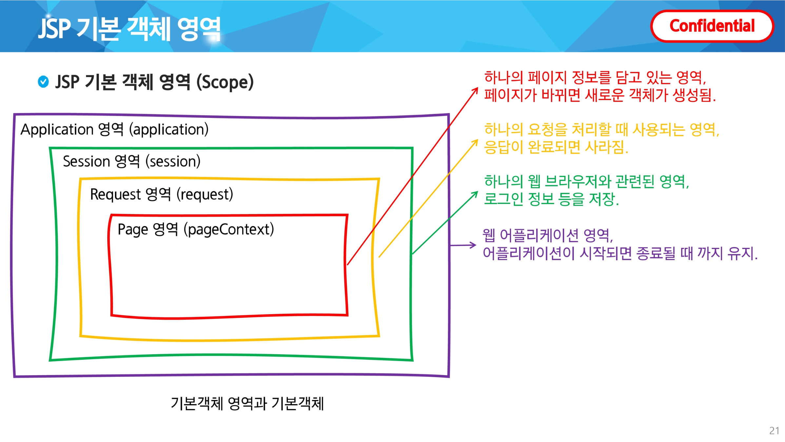

# 00. Android의 상태(State)와 캐싱(Cache): Web과의 개념 대응

# 🧠 앱에서의 캐싱(Cache)과 상태(State) 관리

### – Web(Vue) 개념으로 이해하는 Android 앱의 상태 유지 전략

---

## ❓ 문제 제기: 왜 캐싱과 상태 관리가 중요한가?

- 앱에서 같은 API를 계속 호출하면?

  - 네트워크 비용 증가

  - 화면 깜빡임

  - 사용자 경험 저하

- 화면은 단순히 “데이터”가 아니라
👉 **상태(State)** 에 의해 결정됨

> 💡 오늘의 핵심 질문

**“데이터를 어디에, 얼마나 오래 들고 있을 것인가?”**

---

## 1️⃣ 캐싱(Cache)이란 무엇인가?

### 📌 정의

- 캐싱(Cache)은 **이미 계산되거나 요청한 데이터를 저장해두고 재사용**하는 기법

- 동일한 요청에 대해 **중복 연산 / 중복 네트워크 호출을 방지**

### 📌 CS 관점에서의 목적

- Latency 감소 (응답 속도 향상)

- 네트워크 비용 절감

- 서버 부하 감소

> 💡 캐싱은 Web / Server / App을 관통하는 핵심 CS 개념

---

## * 캐싱의 본질: “어디에 저장할 것인가?”

### 📍 캐싱 위치에 따른 차이

| 캐싱 위치 | 특징 | 데이터 수명 |
| --- | --- | --- |
| UI 컴포넌트 | 화면이 살아있는 동안만 유지 | 매우 짧음 |
| 메모리 | 화면 전환에도 유지 | 중간 |
| 디스크(DB) | 앱 종료 후에도 유지 | 긺 |

> 💡 캐싱은 단순 저장이 아니라

👉 **데이터 수명(Lifetime)을 설계하는 문제**

---

## 1. 메모리 캐싱 (In-Memory Cache)

### 📌 개념

- 앱 실행 중 **메모리(RAM)에 데이터를 저장**

- 앱 종료 시 캐시 소멸

### 📌 구조 예시 (조건 기반 캐싱)

```plain text
Key   = (출발역, 도착역)
Value = 경로 검색 결과
```

➡️ CS적으로는

**Map<Key, Value> 기반 캐시 구조**

---

### ✅ 장단점

**장점**

- 매우 빠른 접근 속도

- 구현 단순

**단점**

- 앱 종료 시 데이터 소멸

- 메모리 사용량 증가

---

## 2. 로컬 캐싱 (Persistent Cache)

### 📌 개념

- 디스크(DB)에 데이터를 저장

- 앱 재실행 후에도 유지됨

### 📌 목적

- 자주 쓰는 데이터 재사용

- 네트워크 의존도 감소

- 오프라인 대응

---

## 2️⃣ 상태(State)란 무엇인가?

### 📌 정의

- State란 **현재 시스템이나 화면이 어떤 상황인지 나타내는 값**

- UI는 데이터 자체가 아니라
👉 **상태(State)에 의해 결정됨**

---

## * 상태를 분리해야 하는 이유

### ❌ 상태가 섞여 있을 때

- 로딩 중인지

- 이전 데이터인지

- 에러 상태인지
구분 불가

➡️ UI 분기 로직이 복잡해짐

---

### ✅ 상태 분리 예시

```plain text
RouteSearchState
- Loading
- Success(data)
- Error
```

➡️ CS 관점에서는

**Finite State Machine (FSM)** 구조

---

## * 시간 기반 상태 (Time-dependent State)

### 📌 개념

- 시간이 흐름에 따라 값이 변하는 상태

- fetchedAt(데이터 수신 시각) 기준으로 계산

### 📌 예시

- 대기시간 감소

- 혼잡도 최신 여부 판단

> 💡 단순 캐싱이 아니라

**“이 데이터가 아직 유효한가?”를 함께 관리**

---

## 3️⃣ Web은 이 문제를 어떻게 해결해왔을까?

### 🌐 Web의 기본 전제

- Request → Response

- 기본적으로 **Stateless**

➡️ 상태 유지를 위해 등장한 개념

**Cookie / Session / Scope**

---

## 1. 쿠키(Cookie) ↔ Android 대응

### 📌 Cookie

- 브라우저 로컬 저장

- 비교적 긴 수명

- 요청마다 자동 전송

### 📱 Android 대응

| 역할 | Web | Android |
| --- | --- | --- |
| 로컬 KV 저장 | Cookie / localStorage | DataStore (Preferences) |
| 인증 정보 전송 | Cookie 자동 전송 | Interceptor + Header |
| 보안 제어 | HttpOnly / SameSite | Keystore / Encrypted Storage |

> 💡 사용자 설정, 토큰 저장

---

## 2. 세션(Session) ↔ Android 대응

### 📌 Session

- 서버 메모리에 저장되는 사용자 상태

- 수명 제한적

### 📱 Android 대응

| 개념적 역할 | Web | Android |
| --- | --- | --- |
| 사용자 흐름 상태 | Server Session | **ViewModel** |
| 프로세스 메모리 | Server Memory | App Process Memory |
| 수명 관리 | 서버가 관리 | OS + Lifecycle |

> 💡 “현재 화면 흐름에서만 유효한 상태”

---

## 3. JSP Scope ↔ Android Scope 대응

### 📌 JSP Scope 복습



| Scope | 수명 |
| --- | --- |
| page | 페이지 단위 (페이지 변경 시 새 객체) |
| request | 요청 단위 (응답 끝나면 삭제) |
| session | 브라우저 단위 (ex. 로그인 정보) |
| application | 애플리케이션 시작~종료까지 |

---

### 📱 Android 대응

| Web Scope | Android |
| --- | --- |
| page | **Composable / Fragment / Activity UI State** |
| request | **이벤트 처리 로직 (onClick, use case 실행)** |
| session | **ViewModel (화면 수명 동안 상태 유지)** |
| application | **Application / Singleton / DI Scope** |

> 💡 **Scope = 데이터 생존 범위**

---

## 🤷‍♀️ Vue 경험자가 앱에서 헷갈리는 이유

### 🌐 Vue / SPA

- 컴포넌트 unmount → 상태 제거

- 새로고침 = 전체 상태 초기화

- 기본 상태 수명 = **컴포넌트 생명주기**

### 📱 Android

- 화면이 사라져도 상태(ViewModel)는 살아있을 수 있음

- **Scope를 명시적으로 선택해야 함**

➡️ “자동으로 사라지지 않는다”는 차이

---

## * 캐싱을 다시 정의하면

### 📌 캐싱 = Scope 선택 문제

| Scope / 저장 계층 | Web | Android |
| --- | --- | --- |
| UI / 메모리 | JS Memory / Component State | ViewModel |
| 앱 실행 | SPA Global State | Singleton / App Scope |
| 로컬(KV) | localStorage | **Preferences DataStore** |
| 영구(DB) | IndexedDB | Room |

---

## 📌 핵심 요약

- 캐싱(Cache)은 **중복 연산을 줄이기 위한 재사용 전략**

- 상태(State)는 UI를 결정하는 **1급 개념**

- 캐싱 위치에 따라 데이터 수명이 달라짐

- 상태 분리는 FSM 관점으로 이해 가능

- Web과 App은 같은 문제를 다른 이름으로 해결하고 있음
