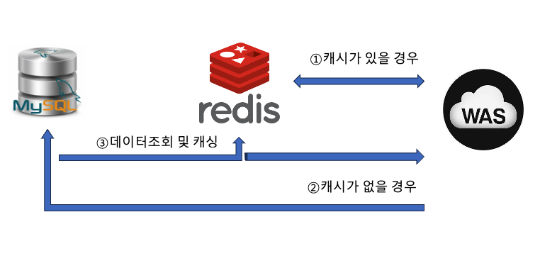

# Redis를 써보자

## 1. Redis의 개념

### ✔ Redis란?

- Redis는 **인메모리 기반 Key-Value 저장소** (NoSQL)

- 데이터를 **RAM에 저장** → 매우 빠른 속도 (ms → μs 수준)



### ✔ 특징

<details>
<summary>**Key-Value 구조 (String, List, Set, Hash 등 다양한 자료구조 지원)**</summary>

Redis는 기본적으로 **Key-Value 저장소**야.

즉, 어떤 값을 저장할 때 `key` 하나에 `value`를 연결해서 저장하는 구조야.

예를 들면:

  - `user:1:name -> "Kim"`

  - `login:token:abc123 -> "userId=5"`

  - `post:viewcount:10 -> 153`

이런 식으로 저장할 수 있어.

그런데 Redis가 단순한 문자열 저장소에 그치지 않는 이유는, value 자리에 단순 String만 넣는 게 아니라 **다양한 자료구조**를 지원하기 때문이야.

대표적으로:

  - **String**: 가장 기본. 토큰, 인증번호, 캐시 데이터 저장

  - **List**: 순서가 있는 데이터. 최근 조회 목록, 대기열

  - **Set**: 중복 없는 집합. 좋아요 누른 사용자 목록

  - **Hash**: 객체처럼 필드 단위 저장. 사용자 정보 저장

  - **Sorted Set(ZSet)**: 점수 기반 정렬. 랭킹 시스템

  - **Stream**: 이벤트 로그, 메시지 흐름 처리

즉, Redis는 단순히 “빠른 캐시”가 아니라

**자료구조를 메모리 위에서 빠르게 다룰 수 있는 서버**라고 이해하면 좋아.

예를 들어 랭킹 시스템을 만든다고 하면 일반 DB에서는 정렬, 업데이트, 조회를 계속 해야 해서 비용이 커질 수 있는데, Redis의 Sorted Set을 쓰면 점수 갱신과 순위 조회를 빠르게 처리할 수 있어.

그래서 Redis는 “데이터를 저장하는 곳”이면서 동시에

“자료구조 연산을 매우 빠르게 처리하는 도구”이기도 해.
</details>

<details>
<summary>**TTL(Time To Live) 지원 → 자동 만료**</summary>

Redis는 각 key에 대해 **유효 시간**을 둘 수 있어.

이걸 TTL이라고 해.

예를 들어:

  - 이메일 인증번호는 3분 뒤 만료

  - 비밀번호 재설정 토큰은 10분 뒤 만료

  - 로그인 세션은 30분 뒤 만료

  - 캐시 데이터는 5분 뒤 만료

이런 식으로 설정할 수 있어.

이 기능이 중요한 이유는 두 가지야.

### 첫 번째, 만료 처리를 직접 하지 않아도 됨

예를 들어 DB에 인증번호를 저장하면,

나중에 만료된 데이터를 지우는 로직을 따로 짜야 할 수 있어.

그런데 Redis는 저장할 때 TTL만 같이 주면

시간이 지나면 자동으로 없어져.

즉:

  - 저장은 간단하고

  - 만료 처리는 Redis가 대신 해줌

이게 굉장히 편리해.

### 두 번째, 메모리 관리에 유리함

Redis는 메모리 기반이라서 데이터를 무한정 쌓아두면 안 돼.

TTL을 걸어두면 필요 없는 데이터가 자동으로 정리되니까 메모리 낭비를 줄일 수 있어.

예를 들어 캐시 데이터를 TTL 없이 계속 쌓으면 언젠가 메모리가 가득 차고 문제가 생길 수 있어.

그래서 Redis를 사용할 때 TTL은 거의 필수적으로 고려해야 해.

정리하면, TTL은 단순한 “시간 설정”이 아니라

**만료 데이터 자동 정리 + 메모리 관리 + 보안성 향상**까지 연결되는 중요한 기능이야.
</details>

<details>
<summary>**싱글 스레드 기반 (하지만 매우 빠름)**</summary>

Redis는 전통적으로 **명령 처리 자체는 싱글 스레드 중심**으로 동작해.

즉, 한 번에 하나의 명령을 처리하는 방식이야.

처음 들으면 보통 이렇게 생각해:

> "싱글 스레드면 느린 거 아닌가?"

그런데 Redis는 실제로 매우 빠르다. 이유가 있어.

### 이유 1. 메모리 기반

Redis는 디스크가 아니라 **RAM**에서 데이터를 읽고 써.

디스크 접근보다 훨씬 빠르기 때문에 기본 속도 자체가 매우 높아.

### 이유 2. 구조가 단순함

Redis는 관계형 DB처럼 복잡한 조인, 디스크 페이지 관리, 쿼리 최적화 등을 하지 않아.

명령이 비교적 단순하고, 내부 구조도 빠른 연산에 맞춰 설계되어 있어.

### 이유 3. 락 경쟁이 적음

멀티스레드 환경에서는 여러 스레드가 같은 자원에 접근하면서 락, 동기화 비용이 발생해.

Redis는 단일 명령을 순차적으로 처리하니까 이런 복잡성이 줄어들어.

즉, Redis는 “싱글 스레드라서 무조건 느리다”가 아니라

**문제를 단순하게 설계해서 오히려 빠르게 만든 시스템**에 가까워.

물론 한계도 있어.

  - 아주 무거운 연산을 한 번에 수행하면 다른 요청이 잠깐 대기할 수 있음

  - CPU를 오래 잡아먹는 명령은 전체 응답성을 떨어뜨릴 수 있음

그래서 Redis에서는 보통:

  - 너무 큰 key를 다루지 않기

  - 한 번에 너무 많은 데이터를 가져오지 않기

  - 복잡한 연산을 Redis에 과도하게 몰아넣지 않기

이런 점을 주의해야 해.
</details>

<details>
<summary>**영속성 옵션 제공 (RDB, AOF)**</summary>

Redis는 메모리 기반이기 때문에 기본적으로는

“서버가 꺼지면 데이터가 날아가는 거 아닌가?”라는 걱정이 생겨.

이걸 보완하기 위해 Redis는 **영속성(persistence)** 기능을 제공해.

대표적으로 두 가지가 있어.

---

### (1) RDB (Redis DataBase)

RDB는 특정 시점의 Redis 데이터를 **스냅샷처럼 통째로 저장**하는 방식이야.

쉽게 말하면:

  - 일정 시간마다

  - 혹은 일정 횟수 이상 변경이 생기면

  - 현재 메모리 상태를 파일로 저장

장점:

  - 파일 크기가 비교적 작음

  - 복구가 빠름

  - 백업용으로 좋음

단점:

  - 마지막 저장 시점 이후의 데이터는 유실될 수 있음

예를 들어 5분마다 저장한다면,

장애가 나면 최근 5분 데이터는 사라질 수 있어.

즉, RDB는 **백업 중심**에 가까워.

---

### (2) AOF (Append Only File)

AOF는 Redis에 들어온 **쓰기 명령 자체를 로그처럼 기록**하는 방식이야.

예를 들어:

  - `SET user:1 Kim`

  - `INCR view:post:10`

  - `EXPIRE token:abc 300`

이런 명령들을 계속 파일에 남겨두고,

Redis가 재시작되면 그 명령들을 다시 실행해서 상태를 복원해.

장점:

  - 데이터 유실 가능성이 더 적음

  - 비교적 더 안전함

단점:

  - 파일 크기가 커질 수 있음

  - 복구 시간이 더 오래 걸릴 수 있음

즉, AOF는 **내구성 중심**이라고 볼 수 있어.

---

### RDB와 AOF를 어떻게 이해하면 좋나?

  - **RDB**: 사진 찍듯 저장

  - **AOF**: 작업 기록을 일지처럼 저장

실무에서는 둘 중 하나만 쓰기도 하고,

둘 다 같이 쓰기도 해.

다만 중요한 점은, Redis를 쓴다고 해서 무조건 영구 저장소처럼 믿으면 안 된다는 거야.

Redis는 본질적으로 빠른 메모리 저장소이고,

영속성은 그 위에 붙는 보조 기능이라고 이해하는 게 좋아.

그래서 보통은:

  - **진짜 원본 데이터는 DB에 저장**

  - **Redis는 캐시, 세션, 임시 상태 저장에 활용**

이 구조를 많이 사용해.
</details>

### ✔ 주로 사용하는 이유

- 캐싱 (DB 부하 감소)

- 세션 저장

- 실시간 데이터 처리 (랭킹, 조회수 등)

<details>
<summary>Pub/Sub, 메시지 브로커 </summary>

### 1. Pub/Sub란?

Pub/Sub는 **Publish / Subscribe**의 줄임말이야.

구조는 간단해.

  - 어떤 쪽이 메시지를 발행(Publish)하고

  - 그 채널을 구독(Subscribe)하고 있는 쪽이 메시지를 받는 구조야

예를 들면:

  - 채팅 서버가 `chat-room-1` 채널에 메시지를 발행

  - 그 채널을 구독하고 있는 사용자 연결 서버들이 메시지를 수신

즉, 직접 상대방 하나하나에게 보내는 게 아니라

**채널에 메시지를 던지면, 구독 중인 쪽이 받는 방식**이야.

---

### 2. Redis Pub/Sub가 왜 유용한가?

Redis는 원래 저장소이지만,

이 Pub/Sub 기능도 매우 가볍고 빠르게 제공해.

이게 유용한 대표적인 경우는 다음과 같아.

### (1) 실시간 알림

예를 들어 어떤 사용자의 상태가 바뀌었을 때:

  - 서버 A가 Redis 채널에 이벤트 발행

  - 서버 B, C가 그 채널을 구독 중이면 바로 반응 가능

즉, 여러 서버 인스턴스 간 실시간 이벤트 전달에 좋음.

### (2) 채팅 시스템

채팅 메시지가 올라오면 Redis 채널에 publish하고,

각 웹소켓 서버가 subscribe해서 해당 유저에게 전달할 수 있어.

### (3) 서버 간 이벤트 전파

MSA나 다중 인스턴스 환경에서

“어떤 서버에서 발생한 이벤트를 다른 서버들도 알아야 하는 상황”이 많아.

예를 들어:

  - 캐시 무효화

  - 특정 사용자 강제 로그아웃

  - 알림 전송

  - 실시간 상태 변경

이런 걸 Redis Pub/Sub로 빠르게 전파할 수 있어.

---

### 3. Redis를 메시지 브로커라고 부르는 이유

메시지 브로커는 쉽게 말해서

**서비스와 서비스 사이에서 메시지를 전달해주는 중간자**야.

Redis는 Pub/Sub 기능이 있기 때문에

간단한 수준에서는 메시지 브로커처럼 사용할 수 있어.

즉:

  - 발신자와 수신자를 직접 연결하지 않고

  - Redis가 중간에서 메시지를 흘려줌

이 구조 덕분에 시스템 간 결합도가 낮아져.

예를 들어 A 서버가 B 서버의 내부 구현을 몰라도

그냥 Redis 채널에 메시지만 publish하면,

B 서버는 그걸 subscribe해서 처리하면 돼.

그래서 구조가 더 유연해져.

---

### 4. 그런데 Redis Pub/Sub의 한계도 있다

Redis Pub/Sub는 편리하지만,

Kafka 같은 전문 메시지 브로커와는 다르게 **전달 보장 기능이 약해**.

대표적인 한계:

### (1) 구독자가 없으면 메시지가 사라짐

Redis Pub/Sub는 메시지를 저장해두지 않아.

그 순간 구독 중인 쪽만 받을 수 있어.

즉,

  - 발행했는데

  - 그때 구독자가 없거나

  - 서버가 잠깐 끊겨 있으면

메시지를 놓칠 수 있어.

### (2) 재처리 개념이 약함

Kafka처럼 메시지를 로그로 오래 보관하면서

나중에 다시 읽거나 offset 기반으로 관리하는 구조가 아니야.

### (3) 대규모 이벤트 스트림 처리에는 한계

이벤트가 엄청 많고, 장애 복구나 순서 보장이 중요하면

Redis Pub/Sub보다는 Kafka 같은 전문 브로커가 더 적합해.

---

### 5. 그래서 언제 Redis Pub/Sub를 쓰고, 언제 Kafka를 쓰나?

### Redis Pub/Sub가 잘 맞는 경우

  - 빠르고 간단한 실시간 알림

  - 채팅 이벤트 전달

  - 서버 간 가벼운 이벤트 전파

  - 유실되어도 큰 문제 없는 메시지

### Kafka 같은 브로커가 더 맞는 경우

  - 메시지 유실이 치명적일 때

  - 재처리가 필요할 때

  - 대량 이벤트를 안정적으로 처리해야 할 때

  - 소비 이력 추적이 중요할 때

즉, Redis Pub/Sub는

**빠르고 간단한 실시간 전달용**에 가깝고,

Kafka는

**신뢰성 높은 이벤트 처리용**에 더 가깝다고 보면 돼.
</details>

---

## 2. Redis 이용 시 코드 (Spring 기준)

### ✔ 의존성

```java
implementation 'org.springframework.boot:spring-boot-starter-data-redis'
```

---

### ✔ 기본 설정 (application.yml)

```yaml
spring:
  data:
    redis:
      host: localhost
      port: 6379
```

---

### ✔ RedisTemplate 설정

<details>
<summary>**RedisTemplate이 뭔데요?**</summary>

## RedisTemplate이란?

👉 **Spring에서 Redis를 쉽게 사용하기 위한 “추상화된 도구(Helper 클래스)”**

---

## 왜 필요한가?

Redis는 원래 이렇게 동작해:

  - key, value를 byte 단위로 저장

  - 직접 Redis 명령어 (`SET`, `GET`)를 호출해야 함

그런데 Spring에서는 이런 저수준 작업을 직접 하지 않도록

👉 **RedisTemplate이 중간에서 대신 처리해줌**

---

## 역할 (핵심 3가지)

### 1. Redis 명령을 Java 코드로 쉽게 사용하게 해줌

```java
redisTemplate.opsForValue().set("key","value");
redisTemplate.opsForValue().get("key");
```

→ 내부적으로는 `SET`, `GET` 명령 실행

---

### 2. 직렬화 / 역직렬화 처리

Redis는 byte 기반인데, 우리는 Java 객체를 쓰잖아?

👉 RedisTemplate이 중간에서 변환해줌

예:

  - Java 객체 → JSON → Redis 저장

  - Redis 데이터 → JSON → Java 객체

---

### 3. 자료구조별 API 제공

Redis는 다양한 자료구조가 있다고 했지?

RedisTemplate은 그걸 API로 나눠서 제공해:

```plain text
opsForValue()// String
opsForList()// List
opsForSet()// Set
opsForHash()// Hash
opsForZSet()// Sorted Set
```

---

## 한 줄 정의

👉 **RedisTemplate = “Redis를 Java스럽게 쓰게 해주는 인터페이스”**
</details>

```java
@Configuration
public class RedisConfig {

    @Bean
    public RedisTemplate<String, Object> redisTemplate(RedisConnectionFactory connectionFactory) {
        RedisTemplate<String, Object> template = new RedisTemplate<>();

        template.setConnectionFactory(connectionFactory);

        // key는 String
        template.setKeySerializer(new StringRedisSerializer());

        // value는 JSON
        template.setValueSerializer(new GenericJackson2JsonRedisSerializer());

        return template;
    }
}
```

---

### ✔ 사용 예시

```java
@Service
@RequiredArgsConstructor
public class RedisService {

    private final RedisTemplate<String, Object> redisTemplate;

    public void save(String key, Object value) {
        redisTemplate.opsForValue().set(key, value);
    }

    public Object get(String key) {
        return redisTemplate.opsForValue().get(key);
    }

    public void saveWithTTL(String key, Object value, long timeoutSeconds) {
        redisTemplate.opsForValue().set(key, value, timeoutSeconds, TimeUnit.SECONDS);
    }
}
```

---

## 3. Redis 이용 방법 비교 (핵심)

### ✔ 1. StringRedisTemplate

```java
private final StringRedisTemplate stringRedisTemplate;
```

### 특징

- Key, Value 모두 **String**

- 내부적으로 `StringRedisSerializer` 사용

- 직렬화 문제 없음 (단순함)

### 예시

```java
stringRedisTemplate.opsForValue().set("key", "value");
String value = stringRedisTemplate.opsForValue().get("key");
```

### 장점

- 안정적

- 직렬화 문제 없음

- 디버깅 쉬움

### 단점

- 객체 저장하려면 직접 JSON 변환 필요

---

### ✔ 2. RedisTemplate<String, Object>

```java
private final RedisTemplate<String, Object> redisTemplate;
```

### 특징

- 객체 저장 가능

- 내부적으로 Serializer 설정 필요

### 예시

```java
redisTemplate.opsForValue().set("user", userObject);
```

### 장점

- 객체 그대로 저장 가능

### 단점

- 직렬화 문제 발생 가능

- 클래스 변경 시 깨질 수 있음

---

### ✔ 3. ObjectMapper 활용

```java
ObjectMapper objectMapper = new ObjectMapper();

String json = objectMapper.writeValueAsString(object);
MyObject obj = objectMapper.readValue(json, MyObject.class);
```

### 사용 방식

- StringRedisTemplate + ObjectMapper 조합

### 장점

- 명확한 구조

- 디버깅 쉬움

- 버전 호환 안정적

### 단점

- 코드가 조금 번거로움

---

### ✔ 결론 (중요)

| 방식 | 추천도 | 이유 |
| --- | --- | --- |
| StringRedisTemplate + ObjectMapper | ⭐⭐⭐⭐⭐ | 안정적, 실무에서 많이 씀 |
| RedisTemplate | ⭐⭐ | 편하지만 위험 |
| 기본 직렬화 (JDK) | ❌ | 거의 안 씀 |

---

## 4. Redis 이용 시 주의할 점 

### ⚠️ 1. Serializer 불일치 문제

### 문제 상황

- 저장: RedisTemplate

- 조회: StringRedisTemplate

→ **데이터 깨짐 / 조회 불가**

### 원인

- 서로 다른 Serializer 사용

---

### ⚠️ 2. Object 구조 변경 문제

```java
class User {
    String name;
}
```

→ 나중에

```java
class User {
    String name;
    int age;
}
```

→ Redis에 있던 데이터 **deserialize 실패 가능**

---

### ⚠️ 3. 동일 키에 서로 다른 타입 저장

```java
redisTemplate.set("key", Object)
stringRedisTemplate.get("key")
```

→ 타입 mismatch 발생

---

### ⚠️ 4. TTL 관리 안 하면 메모리 터짐

- Redis는 메모리 기반

- TTL 없으면 계속 쌓임

```java
set(key, value, 10, TimeUnit.MINUTES)
```

---

### ⚠️ 5. 캐시 동기화 문제

- DB는 변경됐는데 Redis는 그대로

→ **데이터 불일치**

---

## 5. Synapse 프로젝트에서 실제 문제 요약

### 문제

- RedisTemplate / StringRedisTemplate 혼용

- Serializer 설정 불일치

### 결과

- 값 조회 안 됨

- JSON 깨짐

- 타입 캐스팅 오류

---

### 해결 방법

✔ 하나로 통일

- 추천: **StringRedisTemplate + ObjectMapper**

✔ 또는 RedisTemplate 사용 시

- Serializer 명확히 통일

```java
template.setValueSerializer(new GenericJackson2JsonRedisSerializer());
```

---

## 6. 실무에서 추천 전략 (핵심 요약)

1. **단순 데이터 → StringRedisTemplate**

1. **객체 저장 → JSON으로 변환 후 저장**

1. **TTL 항상 설정**

1. **Serializer 반드시 통일**

1. **캐시 무효화 전략 반드시 설계**

---

## 한 줄 정리

👉 Redis는 빠르지만

👉 **"직렬화 + 일관성 관리"를 잘못하면 바로 장애 난다**
