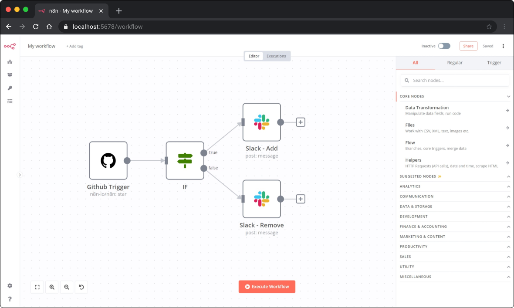
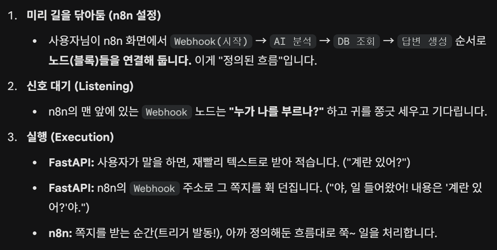

# n8n

# 🤖 내 프로젝트의 숨은 두뇌, n8n 입문기

# 1. n8n이란?

한마디로 정의하면 "**코딩 없이 만드는 나만의 자동화 비서**".

- **레고 블록 같은 툴:** 복잡한 코드를 짜는 대신, 화면에 아이콘(노드)을 끌어다 놓고 선으로 연결하여 프로그램 생성.

- **무료 & 무제한:** 유명한 'Zapier(재피어: 노코드 자동화 플랫폼)'와 비슷하지만, 내 컴퓨터나 서버에 설치하면 **무료**로 사용 가능.

- **연동성:** 구글 시트, 슬랙, 노션, ChatGPT, 그리고 우리가 만든 API까지 서로 연결 가능.

# 어떤식으로 자동화를 해주는가?

> **💡 핵심 컨셉**
왼쪽에서 데이터가 들어오면 → 선을 타고 오른쪽으로 흘러가면서 → 각 노드(박스)가 일을 처리



_(위 이미지는 n8n의 실제 작업 화면입니다. 노드들을 선으로 연결해 로직을 만듭니다.)_



# 🚀 n8n 사용 이유(3가지)

**: 유지보수와 시스템 효율**

### 1. 흐름이 한눈에 보이는 "시각적 로직" (Visibility)

- **문제:** Python 코드로 복잡한 AI 로직을 짜면, 나중에 "어디서 에러가 났지?" 하고 코드를 한 줄씩 뜯어봐야 합니다.

- **n8n의 장점:** 데이터가 흘러가는 과정이 **플로우차트**처럼 눈에 보입니다.

  - 만약 AI 응답이 실패하면, 해당 노드에 🔴 **빨간불**이 들어옵니다.

  - 직관적인 UI 덕분에 개발자가 아닌 팀원도 로직을 이해하고 수정할 수 있습니다.

### 2. 서버 재배포가 필요 없는 "초고속 수정" (Agility)

- **문제:** "AI 말투 좀 바꿔줘"라는 요청이 들어오면, 코드를 수정 → 깃(Git)에 올리고 → 서버를 껐다 켜야(Deploy) 함.

- **n8n의 장점:** 실행 중인 서버를 멈출 필요가 없습니다.

  - n8n 화면에서 **프롬프트**만 살짝 고치고 '저장' 누르면 **0.1초 만에 반영**.

  - 빈번하게 수정해야 하는 AI/LLM 프로젝트에 최적화된 방식.

### 3. 엣지 디바이스의 한계를 넘는 "두뇌 오프로딩" (Offloading)

- **문제:** 우리 하드웨어(Jetson Orin Nano)는 카메라 처리와 음성 인식만으로도 벅참. 무거운 로직까지 돌리면 시스템이 느려짐.

- **n8n의 장점:** 생각, 판단하는 무거운 작업은 별도의 서버(**여기서는 클라우드(n8n → AWS**))에 맡김.

  - **Jetson (몸통):** "말만 전달할게!" (단순 중계)

  - **n8n (두뇌):** "내가 분석하고 DB 찾아서 알려줄게!" (복잡한 연산)

  - 이렇게 역할을 나눈 덕분에 기기의 성능 저하 없이 똑똑한 기능을 구현.

---

### 🗣️ 한 줄 요약

> 모든 코드를 하드웨어(Jetson)에 쑤겨 넣는 대신, **자주 바뀌고 복잡한 AI 로직은 n8n으로 분리**했습니다. 덕분에 **서버 재배포 없이 실시간으로 기능을 개선**할 수 있는 유연한 환경을 구축.

[https://cyan91.tistory.com/entry/초보자를-위한-n8n-설치-완벽-가이드-AI-자동화-워크플로우-구축하기2025년](https://cyan91.tistory.com/entry/%EC%B4%88%EB%B3%B4%EC%9E%90%EB%A5%BC-%EC%9C%84%ED%95%9C-n8n-%EC%84%A4%EC%B9%98-%EC%99%84%EB%B2%BD-%EA%B0%80%EC%9D%B4%EB%93%9C-AI-%EC%9E%90%EB%8F%99%ED%99%94-%EC%9B%8C%ED%81%AC%ED%94%8C%EB%A1%9C%EC%9A%B0-%EA%B5%AC%EC%B6%95%ED%95%98%EA%B8%B02025%EB%85%84)

→ n8n 사용법 및 설명(도커 설치 등)

---

# Q. 그러면 노드 설정은 어떻게 하는데?

### 예시 1: AI 분석 노드 (OpenAI)

이 노드를 열면 코창(검은 화면)이 아니라, **설문지** 같은 게 나옵니다.

- **API Key (인증키):** `sk-proj-1234...` (내 열쇠 여기 있어)

- **Model (모델 선택):** [목록에서 선택] `GPT-4o`

- **Prompt (질문 내용):** "사용자가 입력한 텍스트를 분석해서 재고 질문인지 파악해줘."

👉 **결과:** 저장을 누르면, 이 노드는 내부적으로 복잡한 Python/JavaScript 코드를 돌려서 OpenAI 서버에 접속하고 답변을 받아옵니다.

### 📍 예시 2: DB 조회 노드 (PostgreSQL)

이것도 더블 클릭하면 **로그인 창** 같은 게 뜹니다.

- **Host (주소):** `192.168.0.5` (내 DB 여기 있어)

- **User/Password:** `admin` / `1234`

- **Query (명령어):** `SELECT * FROM medicine WHERE name = '타이레놀';`

👉 **결과:** 개발자가 직접 코드로 짜면 20줄 넘게 써야 하는 `DB 연결 -> 인증 -> 쿼리 전송 -> 결과 수신 -> 연결 종료` 과정을 이 노드 하나가 알아서 수행합니다.

---

### 3. 실제 작동 원리 요약

> "노드에 글자만 적는다고 되는 게 아니라..."

글자만 적는 게 아니라, 그 노드를 클릭해서 **"누구랑(IP/Key), 무엇을(Prompt/Query) 할지"** 구체적인 옵션을 선택해주는 과정이 필수.

### 4. 이렇게 이해하면 좋다

> 이 노드들은 껍데기가 아니라, 더블 클릭해보면 마치 **앱 설정 화면**처럼 생김.

여기서 **IP 주소, 비밀번호, AI에게 던질 질문** 같은 '설정값'만 입력하면 복잡한 통신 코드는 n8n이 알아서 내부적으로 처리. 이게 바로 **No-Code**의 핵심.

각 상자마다 "세팅"을 해주는 과정이 있다!

[https://www.gpters.org/nocode/post/getting-started-n8n-implementing-lEAItMp3FZcZXMz](https://www.gpters.org/nocode/post/getting-started-n8n-implementing-lEAItMp3FZcZXMz)

---

# 2. 실전 사례: 스마트 약품 냉장고 (Yakpumgo)

이번 프로젝트에서 **n8n은 클라우드(AWS)에 위치한 "핵심 두뇌(Core Logic)"** 역할을 담당했습니다.

하드웨어인 Jetson이 눈(카메라)과 귀(마이크)라면, n8n은 그 정보를 받아 **생각하고 판단하는 뇌**입니다.

### ⚙️ 시스템 흐름 (Architecture)

1. **듣기 (Jetson Orin Nano)**:

  - "이 약 재고 있어?"라고 물으면(음성), **FastAPI 서버(중계)**가 이를 받아 텍스트(STT)로 변환.

  - FastAPI는 '**중계(Relay) 서버**'로, 변환된 텍스트를 클라우드에 있는 n8n으로 전송.

1. **생각하기 (AWS Cloud - n8n)**:

  - AWS 서버에 설치된 n8n이 이 메시지를 받고,

  - **GPT-5.2**와 연동하여 질문의 의도를 파악,

  - **PostgreSQL DB**를 조회하여 실제 약품 재고를 확인한 뒤 답변을 생성.

1. **말하기 (TTS)**:

  - n8n이 만든 답변("현재 2개 남았습니다")이 다시 Jetson으로 돌아오면, 스피커를 통해 음성으로 안내.

> **💡 핵심 포인트**
우리 프로젝트에서는 복잡한 AI 로직을 기기에 직접 넣지 않고, **n8n을 통해 클라우드(AWS)에서 처리**함으로써 기기 부하를 줄이고 로직 수정도 훨씬 간편하게 만들었다.

---

## 3. 설치 환경: 왜 '미니 PC(N100)'인가?

처음에는 집에 있는 NAS에 설치하려고 시도했습니다. 하지만 문제가 있었습니다.

- **NAS의 한계:** 도커 설치는 되지만, AI 관련 기능(MCP 등)을 확장해서 쓰려고 하니 호환성 문제가 계속 발생했습니다.

- **해결책 - 로컬 미니 PC:** 결국 **N100 CPU가 탑재된 미니 PC**를 선택했습니다.

  - **가성비:** 서버용으로 딱 하나만 돌리기에 충분한 성능입니다.

  - **저전력:** 최대 13~14W 정도라 24시간 켜놔도 전기세 부담이 없습니다.

  - **호환성:** 리눅스나 윈도우를 깔고 도커를 돌리면, 제약 없이 모든 기능을 쓸 수 있습니다.

---

## 4. 초보자를 위한 n8n 설치 가이드 (Docker)

구글링을 해보면 복잡한 글이 많은데, 제가 직접 해보고 가장 확실한 방법만 정리했습니다. **미니 PC + Docker** 조합을 강력 추천합니다.

### Step 1. Docker(도커) 준비하기

도커는 프로그램을 '컨테이너'라는 박스에 담아 실행하는 도구입니다. 이게 있으면 설치가 10배는 쉬워집니다.

- **Windows/Mac:** [Docker Desktop](https://www.docker.com/products/docker-desktop/) 다운로드 후 설치

- **설치 확인 (터미널 입력):**

```bash
docker --version
```

### Step 2. 설치 파일(docker-compose) 만들기

복잡한 명령어 대신, 설정 파일 하나로 실행합니다.

1. 바탕화면에 `my_n8n` 폴더를 만듭니다.

1. 메모장을 열고 아래 내용을 붙여넣은 뒤 `docker-compose.yml` 이름으로 저장합니다.

```yaml
version: "3"
services:
  n8n:
    image: n8nio/n8n:latest
    ports:
      - "5678:5678"
    environment:
      - N8N_BASIC_AUTH_ACTIVE=true
      - N8N_BASIC_AUTH_USER=admin    # 아이디 (원하는대로 변경)
      - N8N_BASIC_AUTH_PASSWORD=password # 비밀번호 (원하는대로 변경)
    volumes:
      - ~/.n8n:/home/node/.n8n
```

### Step 3. 실행하기

터미널(명령 프롬프트)에서 해당 폴더로 이동한 뒤, 딱 한 줄만 입력하세요.

Bash

`docker-compose up -d`

_(처음엔 이미지를 다운로드하느라 시간이 좀 걸립니다)_

### Step 4. 접속하기

인터넷 창을 켜고 주소창에 입력하면 끝!
👉 `http://localhost:5678`

아까 설정한 아이디/비번을 넣으면 나만의 자동화 비서가 준비됩니다.
