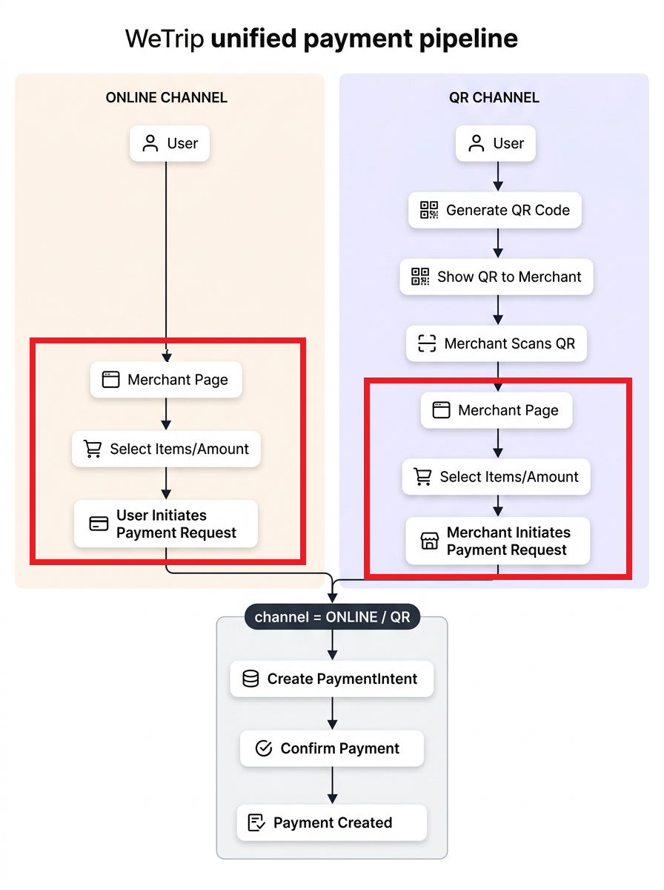

# 결제 구현

### 1. 실무적 결제 플로우

결제 요청 → 인증(생체 / 카드 인증 등) → 승인(Authorization) → 캡처(실 자금 이동) → 정산

특징

- 승인과 돈 이동이 분리 : 승인만 하고 실 출금은 추후 `capture` 시점에

- 취소/환불이 유연함 : capture 전 취소 가능

- 상점 중심 구조 : `merchant` → `PG사` → `은행` 흐름

⇒ 결제 승인과 실제 돈 이동을 분리한 안정성 중심 구조

---

### 2. 임의로 만든 결제 플로우

결제 요청(paymentIntent) → 생체 인증(WebAuthn) → Confirm(확정) 호출 후 실 자금 이동 → tx_transfer & Ledger 기록 

QR과 온라인 결제 플로우를 최대한 동일하게 가져가고자 함(하단 이미지 참고)

→ 핀테크로서 실 은행 API 사용 등이 불가해 PG사 연동 등이 불가능한 상황에서 결제 요청과 결제 확정 테이블을 분리, PG사를 거치는 과정을 생략함으로서 결제 플로우를 모사하고자 함

- `paymentIntent` : 결제 요청 관리 테이블

- `payment` : 결제 확정 테이블

- `tx_transfer` : 자금 이동 관리 테이블 (거래 건별 1개씩 생성됨, `fromAccount` → `toAccount`)

- `ledger_entry` : 회계원장 테이블(거래 건별 2개씩 생성됨, `direction` 으로 입/출금 구분, from계좌와 to계좌 각각 1건씩 총 2개 row가 생성됨)

| 구분 | 실무 PG | WeTrip |
| --- | --- | --- |
| 승인/출금 | 분리 | 동시에 |
| 구조 | 복잡 (다단계) | 단순 (1단계 확정) |
| 대상 | 일반 커머스 | 여행 공동지갑 |
| 취소 | 유연 | 제한적 |
| 핵심 가치 | 안정성 | UX + 속도 |

---

### 3. 공동 결제를 제어하기 위한 방법

비관전 락을 두 단계에 거쳐서 건다.

(비관적 락을 거는 이유 : 은행같은 경우 실 자금이동을 제어해야함으로, 보수적으로 비관적 락을 주로 채택해 사용함)

1. QR이 가맹점 포스기에 의해 스캔되는 시점

→ 다수의 사람이 하나의 공동지갑에 접근해 결제시도하는 것을 막기 위함

실제 QR은 그룹 내에서도 사용자 별로 관리되었으므로,

QR이 스캔되는 시점에 우선 해당 사용자의 QR에 비관적 락을 건다.

다음 사용자가 또 결제를 위해 QR을 생성하려는 경우, 그룹 내 SCANNED 상태의 QR이 있는지 확인 후

존재한다면 QR생성 자체를 막아버린다.

즉 “앞 단계 사람이 결제 완료할때까지 대기 & 재시도 하는 것이 아닌 결제를 바로 FAILED(409 CONFLICT error)처리” 함

1. 실제 결제가 이뤄지기 위해 계좌 잔액이 조회되는 시점

---

### 4. WebAuthn을 이용한 생체인증

WebAuthn은 브라우저가 제공하는 공개키 기반 인증 표준으로,

서버가 challenge를 내려주면 사용자 기기(휴대폰, 노트북, 보안키)가 개인키로 서명하고, 서버는 저장된 공개키로 검증. 비밀번호를 직접 주고받지 않는 구조라 피싱 저항성이 높고, 패스키와 생체인증은 WebAuthn 위에서 동작

실제 WebAuthn을 통해 주고 받는 정보는 생체정보가 아님
→ 얼굴/지문은 기기 내부에서 사용자 확인용으로, 서버는 최종적으로 **서명된 WebAuthn 결과만 검증**

⇒ 비밀번호보다 강한 피싱 저항성과 사용자 편의성을 동시에 확보하고자 채택함

[종류]

i. WebAuthn4J → 채택함

WebAuthn4J는 **Java 서버 측 검증 라이브러리**다. 특정 웹 프레임워크에 강하게 묶이지 않고, 등록(attestation)과 인증(assertion) 검증 자체에 초점을 둔다. 공식 문서도 범위를 “서버 측 검증”으로 좁혀 설명한다. 또한 다양한 attestation format을 지원한다.

ii . Spring Security Passkeys

Spring Security는 **6.4부터 passkey 지원**을 공식 제공하며, `spring-security-webauthn` 의존성을 통해 쓸 수 있다. 이 기능은 Spring Security 프로젝트가 관리하고, 내부적으로 WebAuthn4J를 사용한다. 즉, Spring에 자연스럽게 얹고 싶으면 이쪽이 더 “프레임워크 친화적”이다.

iii. Yubico java-webauthn-server

Yubico의 Java WebAuthn Server는 또 다른 대표적인 서버 라이브러리다. attestation 관련 확장 모듈도 있고, 필요하면 trust source를 직접 붙일 수도 있다. 다만 Spring Boot와의 결합감은 Spring Security 공식 지원보다는 덜하고, 직접 조립하는 느낌이 더 강하다.

| 항목 | WebAuthn4J | Spring Security Passkeys | Yubico java-webauthn-server |
| --- | --- | --- | --- |
| 성격 | 저수준 서버 검증 라이브러리 | Spring Security 공식 통합 | Java 서버 라이브러리 |
| Spring 친화성 | 중간 | 높음 | 중간 |
| 제어 자유도 | 높음 | 중간 | 높음 |
| 빠른 도입 | 중간 | 높음 | 중간 |
| 관리 주체 | WebAuthn4J 프로젝트 | Spring Security 프로젝트 | Yubico |
| 특징 | attestation/assertion 검증 중심 | 로그인/등록 흐름을 Spring식으로 통합 | attestation 확장성 강함 |

인증 플로우

1. 등록

  - 사용자가 “생체인증 등록” 버튼 클릭

  - 서버가 registration challenge 생성

  - 브라우저가 `navigator.credentials.create()` 호출

  - 기기에서 지문/얼굴/PIN으로 사용자 확인

  - 브라우저가 attestation 결과 반환

  - 서버가 검증 후 credentialId, publicKey, counter 등 저장

⇒ `attestation`은 “어떤 종류의 인증기인지 증명”하는 개념인데, 공식 문서들에서도 **대부분의 서비스는 굳이 강하게 요구하지 않아도 된다**고 봄. 기본적으로 attestation은 개인정보/추적성 이슈가 있어 신중히 쓰는 편

1. 로그인/결제 인증

  - 사용자가 인증 필요 액션 수행

  - 서버가 authentication challenge 생성

  - 브라우저가 `navigator.credentials.get()` 호출

  - 사용자가 기기에서 생체/PIN 확인

  - 브라우저가 assertion 반환

  - 서버가 challenge, origin, rpId, signature, signCount 등을 검증

⇒ 서버 입장에서는 결국 **등록 때 공개키 저장**, **인증 때 서명 검증**이 핵심
