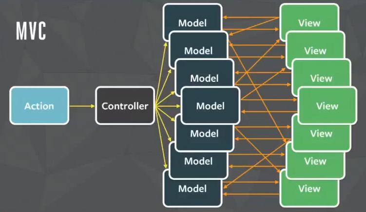
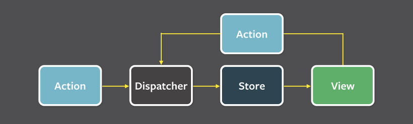

# 롱타임노씨_Tanstack Query_리액트 상태관리

## **INTRO  0 : 리액트(React) "상태 관리"란 무엇인가요?**

상태(state) : 컴포넌트 속 데이터

상태관리 : 시간이나 사용자의 상호작용에 따라 업데이트가 되고, 이렇게 변화하는 상태를 앱(웹)에서 서로 일관되게 공유 및 반응을 해주는 관리

🔹 **상태관리의 종류:**

- 지역적 상태 관리(local statement management) : 컴포넌트 내부의 데이터의 변화를 관리

- 전역 상태 관리(global statement management) : 외부 컴포넌트끼리의 상태 공유를 관리

---

### 0-1. state와 props란?

리액트에서 `props`와 `state`는 모두 컴포넌트 데이터(객체)이지만, 
**`props`****는 부모가 전달하는 읽기 전용(immutable) 데이터이고, 
****`state`****는 컴포넌트 내부에서 변경 가능한(mutable) 데이터**라는 점이 가장 큰 차이입니다.

`Props`는 컴포넌트 외부에서 주어지고, State는 내부에서 관리됩니다.


🔹 **Props vs State 차이점 요약**

| **특징** | **Props** | **State** |
| --- | --- | --- |
| **정의** | 부모 컴포넌트가 자식에게 전달 | 컴포넌트 내부에서 생성 및 관리 |
| **변경 가능성** | **읽기 전용 (Immutable)** | **변경 가능 (Mutable)** |
| **데이터 흐름** | 단방향 (부모 -> 자식) | 해당 컴포넌트 내부 |
| **주 목적** | 컴포넌트 재사용 및 데이터 전달 | 컴포넌트의 상태 변경 및 UI 동기화 |
| **외부 통제** | 불가능 (부모가 변경해야 함) | `가능 (useState 등 사용)` |

> Note 💡리액트는 단방향 흐름인 Flux 패턴을 바탕으로 하므로, 데이터 흐름은 단순하지만 일일이 `props`로 넘겨줘야하는 불편함이 있다.

  <details>
  <summary>MVC랑 FLUX패턴</summary>

# 🔹 1. MVC vs Flux vs Redux (핵심 구조 비교)

## 1️⃣ MVC (전통적인 구조)



```plain text
Model ↔ View
   ↑
Controller
```

### 특징

    - Model과 View가 **서로 직접 영향 (양방향)**

    - Controller가 중간에서 조작

### 문제

    - 데이터 흐름이 얽힘

    - 규모 커지면 유지보수 어려움

👉 그래서 프론트에서 점점 탈피

---

## 2️⃣ Flux (React에서 등장한 패턴)



👉 Flux

```plain text
Action → Dispatcher → Store → View → (Action)
```

### 특징

    - **단방향 데이터 흐름**

    - 중앙 Store 존재

### 핵심 개념

    - View는 Store를 직접 수정 ❌

    - 반드시 Action을 통해 변경

---

## 3️⃣ Redux (Flux를 단순화/표준화)

👉 Redux

```plain text
UI → dispatch(action) → reducer → store → UI
```

### 특징

    - 단일 Store

    - 순수 함수 reducer

    - 예측 가능한 상태 관리

---

## 🔥 세 개 구조 한 번에 비교

| 구분 | MVC | Flux | Redux |
| --- | --- | --- | --- |
| 데이터 흐름 | 양방향 | 단방향 | 단방향 |
| 상태 위치 | 분산 | 중앙(Store) | 단일 Store |
| 변경 방식 | 직접 변경 | Action | Action + Reducer |
| 복잡도 | 커질수록 증가 | 중간 | 구조는 명확하지만 보일러플레이트 많음 |

---

# 🔹 2. 왜 React는 Redux까지 갔냐?

👉 핵심 이유:

> “상태가 많아질수록 어디서 바뀌는지 추적이 안됨”

---

### 문제 상황

    - 컴포넌트 A → B → C props 전달

    - 여러 곳에서 state 변경

    - API 결과도 섞임

👉 “상태 지옥”

---

### 해결 방향

👉 “상태를 중앙에서 관리하자” → Redux

---

# 🔹 3. 그런데 Redux만으로 부족했던 이유

👉 여기서 중요한 전환이 나옵니다

---

## ❗ Redux의 한계

    - 서버 데이터까지 같이 관리함

    - 캐싱, 동기화 직접 구현해야 함

    - 비동기 처리 복잡 (thunk, saga)

---

👉 그래서 등장

## 👉 TanStack Query (React Query)

---

# 🔹 4. React Query 등장 이유 (핵심)

👉 핵심 한 줄:

> “서버 상태는 서버 상태답게 따로 관리하자”

---

## 상태를 두 개로 나눔

| 종류 | 설명 |
| --- | --- |
| Client State | UI 상태 (모달, input 등) |
| Server State | API 데이터 |

---

👉 이전 (Redux만 쓸 때)

```plain text
Redux = UI 상태 + 서버 데이터 둘 다 관리
```

👉 지금 (현대 구조)

```plain text
React (UI 상태)
React Query (서버 상태)
```

---

# 🔹 5. 실무 기준 “진짜 데이터 흐름 구조”

이게 제일 중요합니다 👇

---

## 🔥 전체 구조 (프론트 + 백엔드)

```plain text
[사용자]
   ↓
[React View]
   ↓ (이벤트)
[Client State (useState / Redux)]
   ↓
[React Query]
   ↓
[API 요청]
   ↓
[Node.js Controller]
   ↓
[Model / DB]
   ↓
[응답]
   ↓
[React Query 캐시 업데이트]
   ↓
[UI 자동 렌더링]
```

---

## 🔥 흐름을 한 줄로 정리

```plain text
UI → 이벤트 → 상태 변경 → 서버 요청 → 응답 → 캐시 → UI
```

---

# 🔹 6. 이 구조의 핵심 포인트 (진짜 중요)

## ✔️ 1. 상태 역할 분리

    - UI 상태 → React

    - 서버 데이터 → React Query

---

## ✔️ 2. 자동화된 흐름

React Query가 해주는 것:

    - 캐싱

    - refetch

    - loading 상태

    - 에러 처리

👉 Redux에서 직접 하던 걸 대신 해줌

---

## ✔️ 3. 렌더링 흐름 유지

👉 여전히 React는:

```plain text
state → UI
```

👉 단방향 유지

---

# 🔹 7. 핵심 답변

---

👉 MVC vs Flux vs Redux:

> “MVC는 양방향 데이터 흐름으로 인해 규모가 커질수록 복잡도가 증가하는 문제가 있었고, 이를 해결하기 위해 Flux와 Redux는 단방향 데이터 흐름과 중앙 상태 관리를 도입했습니다.”

---

👉 React Query 포함 구조:

> “최근에는 클라이언트 상태와 서버 상태를 분리하여 관리하는 것이 일반적이며, UI 상태는 React나 Redux로 관리하고, 서버 상태는 React Query를 통해 캐싱과 동기화를 자동화하는 구조를 사용합니다.”

---

# 🔹 최종 한 줄 정리

👉 **MVC → Flux → Redux → React Query 흐름은 “복잡한 상태를 더 잘 관리하기 위한 진화 과정”입니다.**
  </details>

⇒ 규모가 큰 애플리케이션에서는 번거롭고, 데이터 관리가 복잡해지는 결과를 초래함.

⇒ 복잡한 상태 관리가 필요할 경우, 트리 전체에 데이터를 제공할 수 있게 만들어 주는 라이브러리를 사용하는 것이 효율적

⇒ 아니라면 기본적 상태관리인 `state`, `props` 를 사용하거나 내부상태 관리 라이브러리인 `useContext`와 `useReducer `등을 사용하는 것을 고려

**🔹 state / props 업데이트 시 실제로 일어나는 일**

React 내부 흐름은 이렇게 동작합니다:

1. `setState` 또는 `props `변경 발생

1. 해당 컴포넌트 함수 다시 실행

1. Virtual DOM 생성 [(Virtual DOM이 무엇이냥)](https://velog.io/@dongjun187/React-Virtual-DOM-%EA%B8%B0%EC%B4%88-%EB%8F%99%EC%9E%91-%EC%9B%90%EB%A6%AC)

1. 이전 Virtual DOM과 비교 (diffing)

1. 변경된 부분만 실제 DOM에 반영

---

## 1. TanStack Query와 리액트 상태관리

리액트에서 상태관리를 이야기할 때는 먼저 **클라이언트 상태**와 **서버 상태**를 구분해야 합니다.

- **클라이언트 상태**: 모달 열림 여부, 탭 선택, input 값, 다크모드 등

- **서버 상태**: 사용자 정보, 게시글 목록, 댓글, 환율, 주문 내역 등 서버에서 받아오는 데이터

기존에는 `useState`, `useReducer`, `Context API`, `Redux`, `Zustand` 같은 도구로 상태를 관리했지만, 이 도구들은 주로 **클라이언트 상태 관리**에 더 적합합니다.

반면 실제 서비스에서는 서버에서 가져오는 데이터가 많고, 이 데이터는 단순 저장이 아니라 **비동기 처리, 캐싱, 재요청, 최신화**까지 필요합니다.

이 문제를 해결하기 위해 사용하는 도구가 **TanStack Query**입니다.

---

## 2. 기존 상태관리 도구와 역할

### `useState`

가장 기본적인 상태관리 방식입니다.

- 컴포넌트 내부의 간단한 상태 관리에 적합

- 예: 모달 열림/닫힘, 입력창 값, 토글 상태

### `Context API`

여러 컴포넌트가 공통 데이터를 공유할 때 사용합니다.

- props drilling을 줄이는 데 유용

- 예: 테마, 로그인 정보, 언어 설정

### `Redux `/ `Zustand`

전역 상태를 관리하는 도구입니다.

- 여러 컴포넌트가 함께 써야 하는 클라이언트 상태 관리에 적합

- 예: 전역 필터, UI 상태, 권한 상태

하지만 위 도구들만으로 서버 데이터를 관리하면 다음과 같은 불편함이 있습니다.

- 로딩 상태 직접 관리

- 에러 상태 직접 관리

- 같은 API를 여러 번 호출할 수 있음

- 캐싱 기능이 없음

- 수정 후 다시 조회하는 로직을 직접 작성해야 함

---

## 3. TanStack Query란?

TanStack Query는 **서버 상태 관리에 특화된 라이브러리**입니다.

예전에는 React Query라는 이름으로 더 많이 알려져 있었습니다.

주요 역할은 다음과 같습니다.

- 서버 데이터 조회를 쉽게 해줌

- 캐싱을 통해 불필요한 요청을 줄여줌

- 로딩, 에러, 성공 상태를 자동으로 관리해줌

- 데이터가 오래되었는지 판단하고 필요할 때 다시 요청해줌

- 등록, 수정, 삭제 후 관련 데이터를 다시 불러오게 해줌

즉, TanStack Query는

**“서버에서 가져온 데이터를 효율적으로 관리하는 도구”** 입니다.

---

## 4. 왜 사용하는가

TanStack Query를 사용하는 이유는 크게 4가지입니다.

### 1. 서버 상태 관리가 쉬워진다

`useEffect + useState`로 직접 작성하던 비동기 로직을 훨씬 간단하게 줄일 수 있습니다.

### 2. 캐싱이 가능하다

한 번 불러온 데이터를 저장해두고 재사용하기 때문에 성능과 사용자 경험이 좋아집니다.

### 3. 로딩과 에러 처리가 편하다

`isPending`, `isError`, `error`, `data` 같은 값을 바로 사용할 수 있습니다.

### 4. 데이터 최신화가 편하다

등록, 수정, 삭제 후 `invalidateQueries`로 관련 데이터를 다시 조회하게 만들 수 있습니다.

---

## 5. 핵심 개념

### Query

서버 데이터를 **조회**할 때 사용합니다.

```javascript
const query=useQuery({
  queryKey: ['posts'],
  queryFn:fetchPosts,
});
```

예:

- 게시글 목록 조회

- 사용자 정보 조회

- 환율 조회

### Mutation

서버 데이터를 **변경**할 때 사용합니다.

```javascript
const mutation=useMutation({
  mutationFn:createPost,
});
```

예:

- 게시글 등록

- 댓글 수정

- 게시글 삭제

- 좋아요 추가

### Query Key

각 데이터를 구분하는 고유한 이름입니다.

예시:

```plain text
['posts']
['post',1]
['user',userId]
```

TanStack Query는 이 key를 기준으로 캐시를 저장합니다.

### Cache

한 번 받아온 데이터를 임시 저장하는 공간입니다.

같은 요청이 다시 들어오면 불필요한 재호출을 줄여줍니다.

**캐시의 장점**

- 응답 속도 향상

- 불필요한 네트워크 요청 감소

- 사용자 경험 개선

- 동일 데이터 재사용 가능

### staleTime

데이터를 얼마 동안 **최신 데이터로 볼 것인지** 정하는 시간입니다.

```javascript
useQuery({
  queryKey: ['exchange-rate'],
  queryFn:fetchExchangeRate,
  staleTime:1000*60*5,
});
```

- 짧으면 자주 다시 요청

- 길면 캐시를 오래 재사용

### invalidateQueries

특정 query를 오래된 상태로 만들어 다시 조회하도록 하는 기능입니다.

보통 mutation 성공 후 사용합니다.

```javascript
queryClient.invalidateQueries({ queryKey: ['posts'] });
```

---

## 기본 사용 흐름

### 1. QueryClientProvider 설정

```javascript
import {QueryClient, QueryClientProvider }from'@tanstack/react-query';

const queryClient = new QueryClient();

function App() {
	return (
	<QueryClientProvider client={queryClient}>
		<RootRouter/>
	</QueryClientProvider>
  );
}
```

---

## 조회 예시: useQuery

```javascript
import {useQuery} from '@tanstack/react-query';
import axios from'axios';

const fetchPosts = async () => {
const response = await axios.get('/api/posts');
	return response.data;
};

function PostList() {
const { data, isPending, isError }=useQuery({
    queryKey: ['posts'],
    queryFn:fetchPosts,
  });

	if (isPending)return<div>로딩 중...</div>;
	if (isError)return<div>에러 발생</div>;

	return (
		<ul>
		      {data?.map((post: { id:number; title:string }) => (
		<likey={post.id}>{post.title}</li>
		      ))}
		</ul>
  );
}
```

### 설명

- `queryKey`: 이 데이터를 구분하는 이름

- `queryFn`: 실제 API 호출 함수

- `data`: 받아온 데이터

- `isPending`: 로딩 상태

- `isError`: 에러 상태

---

## 변경 예시: useMutation

```javascript
import {useMutation, useQueryClient }from'@tanstack/react-query';
import axios from'axios';

const createPost = async (payload: { title:string; content:string }) => {
const response = await axios.post('/api/posts',payload);
return response.data;
};

function CreatePost() {
const queryClient=useQueryClient();

const mutation=useMutation({
    mutationFn:createPost,
    onSuccess: () => {
			queryClient.invalidateQueries({ queryKey: ['posts'] });
    },
  });

return (
<button
onClick={() =>
mutation.mutate({ title:'제목', content:'내용' })}
>
      글 등록
</button>
  );
}
```

### 설명

- `mutationFn`: 등록, 수정, 삭제 같은 변경 작업 함수

- `onSuccess`: 성공했을 때 실행되는 로직

- `invalidateQueries`: 관련 목록을 다시 조회하여 최신 상태 반영

---

## 기존 방식과의 차이

### 기존 방식

```javascript
const [data, setData] = useState([]);
const [loading, setLoading] = useState(false);

useEffect(() => {
  const fetchData = async () => {
    setLoading(true);
    const res = await axios.get('/api/posts');
    setData(res.data);
    setLoading(false);
  };

  fetchData();
}, []);
```

### TanStack Query 방식

```javascript
const { data, isPending }=useQuery({
  queryKey: ['posts'],
  queryFn:fetchPosts,
});
```

### 차이점

기존 방식은 개발자가 직접 로딩, 에러, 재호출, 캐싱을 처리해야 합니다.

TanStack Query는 이런 반복 작업을 줄여주고 서버 상태 관리를 더 체계적으로 해줍니다.

---

## 언제 쓰면 좋은가

TanStack Query는 다음과 같은 경우 특히 유용합니다.

- API 호출이 많은 프로젝트

- 같은 데이터를 여러 페이지에서 사용하는 경우

- 게시판, 댓글, 알림, 환율, 주문처럼 서버 데이터가 많은 경우

- 등록/수정/삭제 후 재조회가 자주 필요한 경우

---

## 한계점

TanStack Query가 모든 상태를 대체하는 것은 아닙니다.

다음과 같은 상태는 여전히 다른 도구가 더 적합합니다.

- 모달 열림 여부

- input 값

- 탭 상태

- 사이드바 열림 여부

즉,

- **클라이언트 상태**: useState, Context, Redux, Zustand

- **서버 상태**: TanStack Query

이렇게 구분해서 생각하면 이해하기 쉽습니다.

---

## Redux와의 차이

### Redux

- 전역 클라이언트 상태 관리에 강함

- 앱 내부 상태를 체계적으로 저장

### TanStack Query

- 서버 상태 관리에 강함

- 조회, 캐싱, 재요청, 최신화에 특화

즉 둘은 경쟁 관계라기보다 **목적이 다른 도구**입니다.
