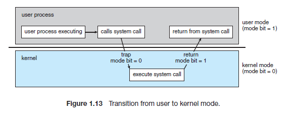

# 1-0 시스템 콜이 무엇인지 설명해 주세요.

# 1. 시스템 콜이란?

- 위키피디아 기준 정의

  - 시스템 콜은 운영 체제의 커널이 제공하는 서비스에 대해, 응용 프로그램의 요청에 따라 커널에 접근하기 위한 인터페이스이다.

  - 보통 C나 C++과 같은 고급 언어로 작성된 프로그램들은 직접 시스템 호출을 사용할 수 없기 때문에 고급 API를 통해 시스템 호출에 접근하게 하는 방법이다.

- 평범한 앱이 운영체제(OS)의 비밀 열람실에 들어가기 위해 사용하는 초인종(호출)

- 우리가 사용하는 일반적인 프로그램(카카오톡, 게임, 메모장 등)은 컴퓨터의 핵심 부품인 CPU, 메모리, 하드디스크를 마음대로 직접 건드릴 수 없다.

- 혹시 잘못 건드리면 컴퓨터 전체가 고장 날 수 있기 때문이다.

- 여기서  운영체제에게 "나 이것 좀 대신 해줘!"라고 요청하는 통로가 바로 시스템 콜이다.

- 프로그램과 운영체제(OS) 사이의 약속으로 운영체제가 제공하는 API라고 생각하면 편하다.

---

# 2. 왜 시스템 콜이 필요한가? (보안과 관리)

- 컴퓨터의 실행 모드는 크게 두 가지로 나눌 수 있다.

  - **사용자 모드 (User Mode)**

    - 우리가 쓰는 일반 앱들이 동작하는 영역.

    - 권한이 제한되어 있다.

  - **커널 모드 (Kernel Mode)**

    - 운영체제의 핵심(커널)이 동작하는 영역.

    - 모든 하드웨어를 제어할 수 있는 권한을 가진다.

- 운영체제(OS)가 중간에서 검문소 역할을 하며 안전하게 요청을 처리해 준다.

- 만약 시스템 콜이 없다면, 악성 프로그램이 마음대로 내 파일을 삭제하거나 개인정보를 빼가는 것을 막을 수 없다.

- 또한 초보자의 경우, 익숙하지 않은 문법 실수로 인하여 시스템이 망가지는 것을 방지할 수 있다.

---

# 3. 실생활 비유

- **나 (사용자 프로그램):** 손님

- **운영체제 (OS):** 주방장

- **하드웨어 (CPU/메모리/재료):** 주방 안의 식재료와 도구

- **시스템 콜:** 주문서 (또는 서빙 벨)

- 요리를 못하는 손님(사용자)이 주방에 마음대로 들어가서 식재료와 도구(하드웨어)를 가지고 직접 요리하는 것은 어렵다.

- 따라서 손님은 식탁에서 주문서(시스템 콜)를 작성해 전달하고, 주방장(OS)이 안전하게 요리를 해서 결과를 가져다준다.

---

# 4. 시스템 콜은 언제 일어나는가?

- **파일 작업:** 파일을 읽고, 쓰고, 저장하고, 삭제할 때 (`open`, `read`, `write`, `close`)

- **프로세스 관리:** 프로그램을 새로 실행하거나 종료할 때 (`fork`, `exec`, `exit`)

- **네트워크:** 인터넷에서 데이터를 주고받을 때 (`socket`, `connect`)

- **장치 관리:** 프린터로 문서를 출력하거나 화면에 그림을 그릴 때

---

# 5. 시스템 콜의 동작 과정 (5단계)

1. **요청:** 프로그램이 필요한 작업을 위해 시스템 콜 번호를 설정하고 요청을 보냅니다.

1. **중단:** 실행 중이던 프로그램이 잠시 멈추고 제어권이 운영체제로 넘어갑니다. (인터럽트 발생)

1. **확인:** 운영체제가 "이 프로그램이 이걸 할 권한이 있나?"를 확인합니다.

1. **실행:** 권한이 있다면 운영체제가 커널 모드에서 직접 작업을 수행합니다.

1. **복귀:** 작업이 끝나면 다시 사용자 모드로 돌아와 프로그램을 계속 실행합니다.

---

# 6. **시스템 콜 예시**

- 리눅스에서 `cp in.txt out.txt`를 입력한다고 하자.

- 이는  in.txt에 있는 파일 내용을 복사하여 out.txt 파일을 만드는 작업이다.

- 작업 순서

  1. cp를 실행시키면 먼저 in.txt 파일이 현재 디렉터리에서 접근가능한 파일인지 검사하기 위해 시스템콜 호출

  1. 만약 파일이 존재하지 않는 다면, 애러를 발생시켜야 하고, 프로그램을 종료하기 위해 시스템 콜 호출

  1. 만약 파일이 존재한다면, 복사한 파일을 저장하기 위해 'output.txt' 파일명이 있는지 검사 

  1. 그리고 이 때도 마찬가지로 이 파일 명이 존재하는지 존재하지 않는지 검사하기 위해 시스템 콜을 통해 확인

  1. 그리고 만약 파일 명이 이미 존재한다면, 덮어 씌워야 할지 아니면, 이어서 붙여야 하는지 User에게 물어볼 수 있다.

  1. 만약 저장하고자 하는 파일 이름이 겹치지 않다면, 파일을 저장해야 하는데 이 때도 시스템 콜을 이용

- 우리가 보기엔 `cp`가 단순히 파일을 복사하는 것 같지만, 사실 `cp`는 운영체제에게 끊임없이 허락을 구하는 심부름꾼과 같은 역할을 한다.
