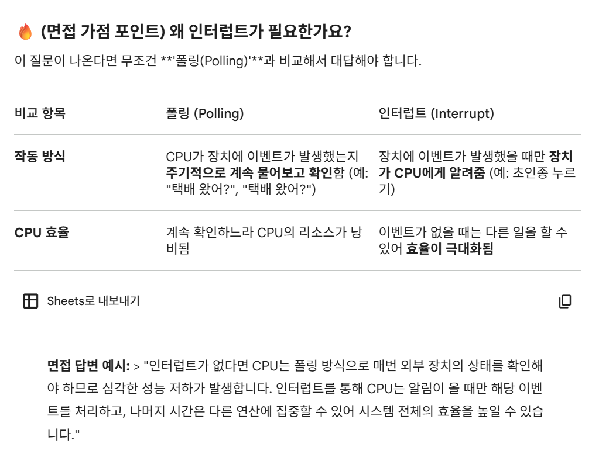

# 2-0. 인터럽트가 무엇인지 설명해 주세요.

# 인터럽트(Interrupt) 아주 쉽게 이해하기

## 0️⃣ 들어가기 전 알아야 할 용어

- **CPU (중앙처리장치):** 컴퓨터의 '뇌'이자 **'나(사람)'**. 한 번에 하나의 일밖에 못 함.

- **PC (Program Counter, 프로그램 카운터):** **'책갈피'** 역할. CPU가 "내가 다음에는 코드 몇 번째 줄을 읽어야 하지?"를 기억해 두는 특별한 메모장. (CPU 내부의 '레지스터' 중 하나 임시저장장치)

- **ISR (Interrupt Service Routine, 인터럽트 서비스 루틴):** 갑작스러운 일이 생겼을 때 어떻게 행동해야 하는지 적혀 있는 '행동 지침서(매뉴얼)'.

  - _"인터럽트를 처리한다" = "ISR을 실행하고 본래 작업으로 돌아온다."_

  - _예: 키보드가 눌렸을 때의 매뉴얼, 마우스가 움직였을 때의 매뉴얼이 각각 다르게 존재합니다._

- **인터럽트 벡터 테이블 (Interrupt Vector Table):** 수많은 지침서(ISR)들이 구체적으로 어디에 꽂혀 있는지 정리해 둔 **목차(Index)**.

---

## 1️⃣ 인터럽트(Interrupt)란?

### 💡 일상 속 비유로 이해하기

방에서 `책을 읽고 있는 상황`을 가정. (이것이 CPU가 프로그램을 실행하는 상황)

- 그러던 중 **택배 기사님이 초인종을 누릅니다. **⇒ (인터럽트 발생)

  - (**동기/소프트웨어**라면 **시스템 콜**, **비동기/하드웨어**라면 **키보드, 마우스 입력** 등)

1. 읽던 페이지에 **책갈피(PC)**를 꽂아둠.

1. 현관문으로 나가서 택배를 받는 **정해진 행동(ISR)**을 함.

1. 택배 정리가 끝나면 다시 방으로 돌아와 **스택(Stack)에 보관해두었던 책갈피(PC 값)를 다시 가져와서** 꽂아둔 곳부터 이어서 책을 읽음.

> **📌 정리하자면 인터럽트란:**
컴퓨터(CPU)가 어떤 일을 열심히 하고 있을 때, 마우스 클릭이나 키보드 입력 같은 [급하게 처리해야 할 이벤트가 발생하면, 하던 일을 잠시 멈추고 그 이벤트를 먼저 처리한 뒤 다시 원래 작업으로 돌아오게 만드는 '알림 신호']를 의미.

_(참고: 보통 "인터럽트"라고 부를 때는 __**주로 마우스/키보드 같은 외부의 '비동기 하드웨어 인터럽트'를 지칭.**__ 프로그램 내부에서 발생하는 '동기 소프트웨어 인터럽트'는 '예외(Exception)'나 '트랩(Trap)'이라는 용어로 더 자주 부름. 하지만 __**둘 다 처리 방식은 동일**__)_

---

## 2️⃣ 인터럽트(주로 비동기)는 어떻게 처리되나요?

### 1단계: 인터럽트 발생 (초인종이 울림)

- 마우스를 클릭하면, 해당 하드웨어가 CPU에게 인터럽트 신호 전송.

- CPU는 신호를 받으면, (예를 들어 '엑셀 수식 계산'을 하고 있었다면) 딱 **지금 계산하던 덧셈 한 줄의 명령어까지만 마저 끝냄.**

### 2단계: 현재 상태 저장 (책갈피 꽂기) ⭐ [핵심 포인트]

- 하던 일을 나중에 이어서 하려면, 지금까지 어디까지 했는지 기억해야 함.

- CPU는 다음에 실행할 코드 위치를 담은 **PC(책갈피) 값**과 현재 사용 중이던 레지스터 값들을 **메모리 스택(Stack) 영역에 임시로 저장**.

### 3단계: 인터럽트 원인 파악 및 목차 확인 (누가 왔는지, 목차 찾기)

- CPU는 "방금 온 신호가 마우스 클릭인가? 키보드 입력인가?"를 파악.

- 그리고 **인터럽트 벡터 테이블(목차)**을 확인. 이 테이블에는 "마우스 클릭이 들어오면 메모리 100번지에 있는 코드를 실행해라" 같은 구체적인 주소가 적혀 있음.

### 4단계: ISR 실행 (지침서대로 택배 받기)

- 목차에서 찾은 주소로 이동하여, 실제 그 일을 처리하는 코드인 ISR(인터럽트 서비스 루틴)을 실행.

- _예: "사용자가 누른 마우스 클릭 좌표를 화면에 반영하라"는 코드를 실행._

### 5단계: 상태 복구 (책갈피 다시 가져오기)

- 급한 일(ISR) 처리가 모두 끝남.

- 2단계에서 스택(Stack) 영역에 임시로 두었던 **PC(책갈피) 값과 CPU 상태 정보들을 다시 꺼내와 복구**.

### 6단계: 원래 작업 재개 (이어서 책 읽기)

- 복구된 PC 값을 보고, 인터럽트가 걸리기 직전에 하던 프로그램으로 돌아가 남은 코드를 마저 실행.

---

## 3️⃣ [심화] 소프트웨어 인터럽트(예외, Exception)의 4가지 종류

하드웨어가 밖에서 찌르는 것이 아니라, **CPU가 코드를 실행하다가 내부적으로 발생시키는 인터럽트(예외)**는 "에러를 해결한 뒤 복귀할 위치(PC)"에 따라 크게 4가지로 나뉩니다.

1. **폴트 (Fault)**

  - **특징:** 예외 상황을 해결한 뒤, 문제가 발생했던 바로 **그 명령어부터 '재실행(Retry)'**합니다.

  - **예시:** 페이지 폴트(Page Fault). 필요한 데이터가 메모리에 없어서 보조기억장치에서 가져온 뒤, 실패했던 명령어를 다시 실행합니다.

1. **트랩 (Trap)**

  - **특징:** 예외 상황을 처리한 뒤, 문제가 발생한 명령어의 **'다음' 명령어부터 이어서 실행**합니다. (의도적인 예외 발생 시 사용)

  - **예시:** 디버깅의 브레이크 포인트(Breakpoint).

1. **중단 (Abort)**

  - **특징:** 도저히 복구할 수 없는 **심각한 오류**가 발생 시. 복귀하지 않고 프로그램을 강제 종료합니다.

  - **예시:** 하드웨어 고장, 치명적인 메모리 접근 오류 등.

1. **시스템 콜 (System Call)**

  - **특징:** 일반 프로그램이 스스로 할 수 없는 위험한 권한(파일 입출력 등)이 필요할 때, **운영체제(OS)에게 "대신 처리해 주세요"라고 의도적으로 요청**하며 발생시키는 소프트웨어 인터럽트입니다.

---
