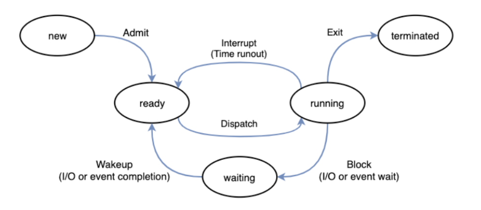
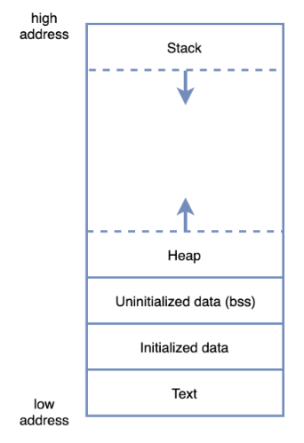
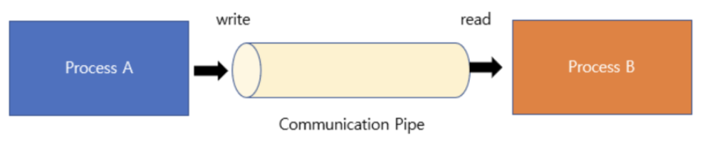
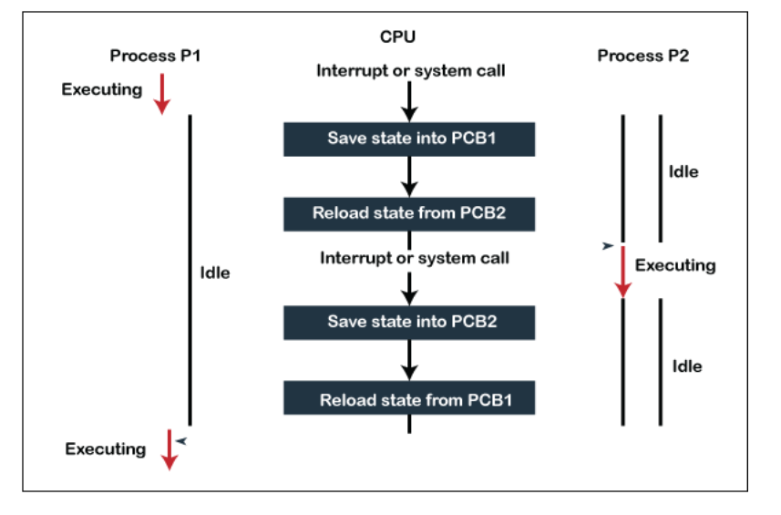

# 3-0. 프로세스가 무엇인가요?

## 1. 프로그램과 프로세스

### 1-1. 프로그램

- **프로그램**은 디스크에 저장된 **실행 파일** 또는 **명령어 집합**

- 아직 실행되지 않은 **정적인 상태**

### 1-2. 프로세스

- **프로세스(Process)**는 **실행 중인 프로그램**

- 운영체제로부터 **CPU, 메모리, 파일, I/O 장치** 같은 자원을 할당받아 동작

- 즉, 프로그램이 메모리에 올라가고 운영체제의 스케줄링 대상이 되면 프로세스가 된다.

### 1-3. 한 줄 차이

- 프로그램: 저장된 파일

- 프로세스: 실행 중인 프로그램 + 자원 + 실행 상태 정보

---

## 2. 프로세스의 상태



### 2-1. 생성(New)

- 프로세스 생성 단계, PCB(Process Control Block)가 만들어지고 운영체제로부터 실행 승인 받기 전 상태

### 2-2. 준비(Ready)

- CPU만 할당되면 바로 실행할 수 있는 상태로, 메모리에는 올라와 있지만 아직 CPU를 할당받지 못해 **`Ready Queue`**에서 대기

### 2-3. 실행(Running)

- CPU를 할당받아 실제 명령어를 수행

### 2-4. 대기(Waiting, Blocked)

- 실행 중이던 프로세스가 **I/O 요청**, **이벤트 대기** 등으로 인해 CPU를 반납하고 대기하는 상태

→ 예: 파일 읽기, 네트워크 응답 대기, 디스크 I/O 대기

### 2-5. 종료(Terminated)

- 프로세스 실행이 끝났거나 강제로 종료된 상태이

---

## 3. 프로세스 상태 전이

### 3-1. 생성 → 준비

- 프로세스가 생성되고 실행 준비가 완료되면 준비 상태로 이동

### 3-2. 준비 → 실행 : Dispatch(디스패치)

- 스케줄러가 프로세스를 선택해 CPU를 할당하면 실행 상태로 이동

### 3-3. 실행 → 준비 : Waiting

- 타임 슬라이스가 끝나거나 더 높은 `우선순위 프로세스`가 등장하면 CPU를 빼앗기고 준비 상태로 이동

### 3-4. 실행 → 대기 : Blocked(블록)

- `I/O 요청`이나 `특정 이벤트`를 기다려야 하면 대기 상태로 이동 

### 3-5. 대기 → 준비 : Wakeup(웨이크업)

- 기다리던 작업이 끝나면 다시 CPU를 받을 준비가 된 상태로 이동

### 3-6. 실행 → 종료 : T**erminated**(블록)

- 정상 종료 또는 비정상 종료가 발생하면 종료 상태로 이동

  <details>
  <summary>자발적 종료와 비자발적 종료</summary>

- 비자발적 종료

      - 부모 프로세스가 자식 프로세스를 강제 종료

      - 자원 한계 초과, kill() 명령어 실행 등이 원인

    - 자발적 종료

      - 프로그램이 정상적으로 실행을 마치고 자원을 반납
  </details>

---

## 4. fork()와 exec()

프로세스 생성과 관련해서 자주 나오는 개념

### 4-1. fork()

- **현재 프로세스를 복제하여 자식 프로세스를 생성**

- 부모와 자식은 **서로 다른 PID**를 가짐

- 주소 공간은 `논리적으로 복사`되며, 현대 OS에서는 보통 **`Copy-on-Write`** 방식으로 최적화

  <details>
  <summary>Copy-on-Write란?</summary>

Copy-on-Write는 `쓰기 전까지는 복사하지 않는다`는 메모리 최적화 기법으로,

`처음엔 공유하다가 수정하려고 하면 그때 복사` 하는 기법을 일컫는다.

(예시) : fork를 생각했을 때, 부모 프로세스 - (복사) → 자식 프로세스 생성 시

    - 메모리 통째로 복사해 비용이 너무 큼(시간/메모리 낭비)

따라서

    - fork() 직후 : 부모와 자식 프로세스가 **같은 메모리 페이지를 공유(실제 복사 X)**

→ 둘이 같은 데이터를 읽음

    - 쓰기(write) 발생 : 부모 or 자식이 데이터 수정 시도 시

→ OS가 페이지 복사 후, 수정하는 프로세스는 복사된 메모리 사용(나머지는 기존 유지)

    - 결과 : 읽기만 하면 계속 공유, 수정할 때만 복사 발생

```sql
fork() 직후

Parent ──┐
         ├── [같은 메모리 페이지]
Child  ──┘


Child가 write 수행

Parent ── [기존 메모리]
Child  ── [복사된 메모리]
```
  </details>

⇒ 즉, 한 프로세스가 해당 메모리에 쓰기를 시도할 때 페이지 폴트가 발생하고, 그 시점에 실제 복사

### 4-2. exec()      (=덮어씀)

- **현재 프로세스의 메모리 내용을 새로운 프로그램으로 교체**

- 새로운 PID를 만드는 것이 아니라, **기존 프로세스가 다른 프로그램으로 바뀌는 것**

### 4-3. 자주 나오는 흐름

- `fork()`로 자식 생성(프로세스 복제)

- 자식이 `exec()`로 새로운 프로그램 실행(현재 프로세스의 실행 이미지 교체)

---

## 5. 프로세스의 메모리 구조



### 5-1. 코드(Code, Text) 영역

- 실행할 기계어 코드가 저장되는 영역으로, 보통 읽기 전용임

- 프로그램 실행 중 바뀌지 않음

### 5-2. 데이터(Data) 영역

- **전역 변수**, **static 변수** 중 **초기화된 데이터** 저장

### 5-3. BSS 영역

- 전역 변수, static 변수 중 **초기화되지 않은 데이터** 저장

- 실행 파일 크기를 줄이고 메모리를 효율적으로 쓰기 위해 분리

→ 예시 : **배열 크기 이름 등의 정보만 저장, 실제 데이터가 필요할 때 메모리를 할당하는 방식으로 공간 절약**

### 5-4. 힙(Heap) 영역

- 실행 중 **동적 할당**되는 메모리 영역으로, `new` `malloc` 등으로 확보되는 영역

- 프로그래머가 직접 관리하거나, 언어의 GC가 관리

### 5-5. 스택(Stack) 영역

- 함수 호출 시 생성되는 **지역 변수, 매개변수, 반환 주소** 등이 저장

- 함수 호출/종료에 따라 자동으로 늘고 줄어듦

---

## 6. 프로세스 관점에서 메모리 구조를 이해하는 핵심

### 6-1. 왜 프로세스마다 메모리가 분리될까?

- 각 프로세스는 **독립된 실행 단위**이기 때문

- 다른 프로세스의 메모리를 직접 침범하지 못하게 해서 안정성과 보안을 보장

### 6-2. 장점

- 한 프로세스 오류가 다른 프로세스에 바로 전파되지 X(보호와 격리가 쉬움)

### 6-3. 단점

- 프로세스끼리 데이터를 주고받으려면 IPC 필요

  <details>
  <summary>IPC란?</summary>

프로세스는 서로 메모리를 직접 공유하지 않으므로, 통신하려면 IPC가 필요!!

    - 프로세스 간 데이터를 주고받는 방법(Inter-Process Communication)

    - 프로세스는 독립적인 주소 공간을 가지므로, 각 프로세스가 타 프로세스 메모리에 직접 접근할 수 X

[예외] `공유 메모리 방식` : 여러 프로세스가 같은 메모리 영역 공유 (↔ `메시지 전달 방식`)

    - 장점 : 커널을 통한 복사가 줄어 빠르며, 대용량 처리에 유리

    - 단점 : 동기화를 직접해야 하며, 잘못 설계 시 경쟁 상태 발생

[IPC 종류]

    - 공유 메모리 : 가장 빠른 IPC 방식 중 하나로, 여러 프로세스가 같은 메모리 블록을 공유

    - 파이프 : 프로세스 간 데이터를 흐르게 하는 통로로, 주로 부모자식간 단방향 통신에 사용(FIFO 방식으로 읽히는 임시 공간인 `파이프` 를 기반으로 데이터를 주고 받음. 읽기/쓰기전용)



    - 메시지 큐 : 메시지를 큐에 넣고 꺼내는 방식으로, 비동기 처리에 적합

    - 소켓 : 같은 컴퓨터 내 프로세스 간 통신뿐 아니라 네트워크를 통한 타 컴퓨터와 통신도 가능

    - 파일 : 단순하지만 실시간성과 효율성이 떨어짐
  </details>

- 메모리 복사 및 커널 개입 비용이 들 수 있음

---

## 7. PCB(Process Control Block)

### 7-1. 개념

- PCB는 **프로세스의 메타데이터를 저장하는 커널 자료구조로, **운영체제가 프로세스 관리를 위해 필요

⇒ 즉, **프로세스의 현재 상태를 저장하는 운영체제의 관리 카드**

---

## 8. 문맥 교환(Context Switch)

CPU를 사용하던 프로세스가 나가고, 다른 프로세스가 CPU를 이어받는 과정



### 8-2. 왜 발생하는가?

- 타임 슬라이스 종료

- I/O 요청

- 인터럽트 발생

- 우선순위 더 높은 프로세스 등장

### 8-3. 수행 과정

1. 현재 실행 중인 프로세스의 레지스터, PC 등 상태를 **`PCB`****에 저장**

1. 다음 실행할 프로세스의 PCB에서 상태를 **복원**

1. CPU가 새 프로세스를 실행

### 8-4. 비용

- 문맥 교환은 유용하지만 **`오버헤드`**가 있음

- 실제 작업을 하는 시간이 아니라, **저장/복원**에 CPU를 쓰기 때문

### 8-5. 포인트

- 문맥 교환 자체는 생산적인 작업이 X(너무 자주 발생하면 성능 저하)

---

## 9. 스레드란 무엇인가

프로세스를 중심으로 보면, 스레드는 **프로세스 내부의 실행 흐름 단위**

### 9-1. 정의

- 스레드(Thread)는 **프로세스 안에서 실제로 작업을 수행하는 흐름**

### 9-2. 관계

- 프로세스가 자원 소유의 단위라면 스레드는 CPU 실행의 단위에 가깝다.

### 9-3. 한 프로세스와 여러 스레드

- 하나의 프로세스는 하나 이상의 스레드를 가질 수 있다.

- 멀티스레드 프로세스에서는 여러 스레드가 같은 프로세스 자원을 공유한다.

---

## 10. 멀티 프로세스와 멀티 스레드

## 10-1. 멀티 프로세스

- 여러 개의 프로세스를 실행하는 방식

- 각 프로세스는 메모리가 독립적

### 장점

- 장애 격리가 뛰어남

- 하나가 죽어도 다른 프로세스에 영향 적음

### 단점

- 프로세스 생성/문맥 교환 비용이 큼

- IPC가 필요해 통신이 복잡

## 10-2. 멀티 스레드

- 하나의 프로세스 내부에 여러 스레드를 두는 방식

- 메모리를 공유하므로 협업 굿

### 장점

- 문맥 교환 비용이 상대적으로 적음

- 자원 공유가 쉬워 통신이 빠름

### 단점

- 공유 자원 접근으로 인해 동기화 문제 발생

- 한 스레드의 버그가 프로세스 전체에 영향

---

## 프로세스 중심 최종 정리

### 11-1. 프로세스란?

실행 중인 프로그램이며 운영체제로부터 자원을 할당받아 독립적으로 수행되는 단위

### 11-2. 왜 중요한가?

- 운영체제의 핵심 역할 중 하나가 **프로세스 관리**이기 때문

- CPU 스케줄링, 메모리 관리, 자원 보호, IPC 모두 프로세스와 연결

### 11-3. 핵심 키워드 묶음

- **프로세스**: 실행 단위, 자원 할당 대상

- **PCB**: 프로세스 상태 저장

- **문맥 교환**: CPU 실행 주체 변경

- **IPC**: 프로세스 간 통신

- **스레드**: 프로세스 내부 실행 흐름

- **TCB**: 스레드 상태 저장

- **멀티 스레드 이슈**: 공유 자원, 동기화, 경쟁 상태
