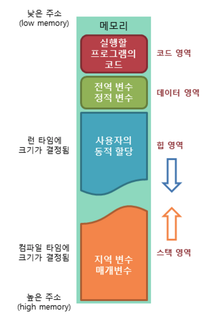

# 4-0. 프로세스 주소공간

# 프로세스 주소 공간 (Process Address Space)

---

## 1. 핵심 정의

프로세스 주소 공간이란,

운영체제가 각 프로세스에게 제공하는 **독립적인 가상 메모리 영역**이다.

- 프로세스는 이 공간을 **자신만의 메모리처럼 사용**

- 실제 물리 메모리는 여러 프로세스가 공유

- OS가 이를 **가상화하여 분리**해줌

---

## 2. 왜 필요한가 

### Q. 왜 굳이 “가상 주소 공간”이 필요한가?

### 1) 프로세스 간 격리 (Isolation)

- 한 프로세스가 다른 프로세스 메모리에 접근 불가

- 보안 + 안정성 확보

### 2) 메모리 추상화

- 실제 RAM 크기보다 큰 메모리를 사용하는 것처럼 보이게 함

- 연속된 주소 공간 제공

### 3) 효율적인 관리

- 필요할 때만 물리 메모리 할당

- 페이지 단위로 관리 가능

---

## 3. 주소 공간 구조 (Memory Layout)

프로세스 주소 공간은 일반적으로 다음과 같이 구성된다:



### 각 영역의 역할

### 1) Text (코드 영역)

- 프로그램을 실행시키는 실행 파일 내의 **명령어**들이 위치하는 공간이다.

- 컴파일 시에 결정된다.

- 프로그램의 코드는 수정되면 안되므로, **Read-Only** 로 지정되어있다.

- 같은 프로그램으로 실행된 여러 프로세스는 동일한 코드를 가진다.

  - 동일한 내용을 중복 할당하지 않고 특정 공간에 할당하여 메모리 사용량을 절약할 수 있다.

### 2) Data / BSS

- 전역 변수 / static 변수

- 전역 변수, 정적 변수를 참조한 코드는 컴파일 후 Data 영역의 주소값을 가리킨다.

- 한 프로세스 내 여러 스레드가 공통으로 Data 영역을 공유한다.

  - 중복된 내용을 여러 번 할당하지 않고 하나의 공간으로 구성하여 메모리 사용량을 절약할 수 있다.

- 실행 중에 변수가 수정될 수 있기에 **Read-Write** 로 지정되어있다.

- 프로그램 실행 시 생성되고, 프로그램 종료 시 소멸된다.

| 구분 | Data 영역 | BSS 영역 |
| --- | --- | --- |
| 초기값 | 있음 | 없음 |
| 예시 | `int a = 10;` | `int a;` |
| 파일 저장 | 값 포함 | 값 저장 안 함 |
| 초기화 | 파일에 포함됨 | 실행 시 0으로 초기화 |

### 3) Heap

- **동적 할당**(malloc(), new 등)을 위한 메모리 영역이다.

- **런타임**(동적 할당의 경우)에 **크기가 정해진다**.

- 메모리의 낮은 주소에서 높은 주소의 방향으로 할당된다.

- 주로 객체가 저장되고 Garbage Collector 에 의해 정리된다.

### 4) Stack

- 함수의 실행을 마치고 **복귀할 주소**, **데이터**(**지역 변수**, **매개 변수**, **반환값**)를 임시로 저장하는 공간이다.

- 각 함수는 LIFO 구조로 실행된다.

  - **컴파일 시** **크기가 결정**된다.

  - 재귀 함수가 여러 번 호출되거나 지역변수가 많아지면 Stack Overflow가 발생할 수 있다.

- 메모리의 높은 주소에서 낮은 주소의 방향으로 할당된다.

- 실행 중에 변수가 수정될 수 있기에 Read-Write 로 지정되어있다.

- 함수의 호출과 함께 할당되고, 함수 호출 완료 시 소멸된다.

### 5) Memory-mapped 영역

- 라이브러리, 파일 매핑

- mmap으로 생성

---

## 4. 가상 메모리 → 물리 메모리 변환

### 핵심 개념

프로세스는 **가상 주소**를 사용하지만, CPU는 실제로 **물리 주소**를 사용해야 한다.

이 변환을 담당하는 것이:

- **페이지 테이블**: 가상 주소와 물리 주소의 대응표

- **MMU**: 그 대응표를 이용해 실제 주소 변환을 수행하는 하드웨어

- **TLB**: 자주 쓰는 주소 변환 결과를 캐싱하는 초고속 메모리

---

### 변환 과정

```plain text
CPU가 가상 주소 생성
   ↓
MMU가 주소 변환 시도
   ↓
TLB에 있으면 바로 변환
   ↓
없으면 페이지 테이블 확인
   ↓
물리 주소 획득
   ↓
RAM 접근
```

---

### 구성 요소

<details>
<summary>MMU / Page Table / Translation Lookaside Buffer</summary>

# 1. MMU (Memory Management Unit)

## 정의

MMU는 **가상 주소를 물리 주소로 변환하는 하드웨어 장치**다.

CPU가 메모리에 접근할 때마다 MMU가 그 주소를 해석해서

“이 가상 주소가 실제 RAM의 어디를 뜻하는지” 계산한다.

---

## 왜 필요한가

프로세스는 자기만의 독립된 주소공간을 가진다.

예를 들어 프로세스 A와 B가 둘 다 `0x1000` 주소를 사용하더라도,

실제로는 서로 다른 물리 메모리를 가리켜야 한다.

이걸 가능하게 하려면:

  - 프로세스 입장에서는 같은 형태의 주소공간을 쓰게 하고

  - 실제 물리 메모리는 OS가 따로 관리해야 한다.

이 추상화를 실제로 실행해주는 하드웨어가 MMU다.

---

## MMU가 하는 일

MMU의 핵심 역할은 세 가지다.

### 1) 주소 변환

가상 주소 → 물리 주소

### 2) 보호 검사

이 페이지가 읽기 가능한지, 쓰기 가능한지, 실행 가능한지 확인

### 3) 예외 발생

잘못된 접근이면 page fault, protection fault 같은 예외 발생

---

## MMU 동작 예시

CPU가 가상 주소 `0x12345678`에 접근한다고 하자.

MMU는 이 주소를 보통 이렇게 나눈다.

  - 상위 비트: 가상 페이지 번호 (VPN)

  - 하위 비트: 페이지 내부 오프셋(offset)

예를 들어 페이지 크기가 4KB라면:

  - 4KB = 2¹² 이므로

  - 하위 12비트는 offset

  - 나머지는 VPN

즉,

```plain text
가상 주소 = [VPN | offset]
```

MMU는 VPN으로 페이지 테이블을 조회해서

해당 페이지가 어떤 물리 프레임(PFN)에 있는지 찾고,

거기에 offset을 붙여 최종 물리 주소를 만든다.

```plain text
물리 주소 = [PFN | offset]
```

---

## MMU가 없으면?

MMU가 없다면 프로그램은 물리 주소를 직접 다뤄야 한다.

그러면

  - 프로세스 간 메모리 격리가 어려워지고

  - relocation이 복잡해지고

  - 보호 기능도 약해진다.

즉, 현대 운영체제의 **가상 메모리 시스템 자체가 성립하기 어렵다**.

---

# 2. 페이지 테이블 (Page Table)

## 정의

페이지 테이블은 **가상 페이지 번호(VPN)를 물리 프레임 번호(PFN)로 매핑하는 표**다.

쉽게 말하면:

> “이 가상 페이지는 물리 메모리 어디에 있나?”를 적어둔 표

---

## 왜 페이지 단위로 관리하나

가상 주소공간 전체를 바이트 단위로 매핑하면 너무 비효율적이다.

그래서 운영체제는 메모리를 **고정 크기 블록**, 즉 **페이지(page)** 단위로 쪼개서 관리한다.

예:

  - 가상 메모리도 페이지 단위

  - 물리 메모리도 프레임(frame) 단위

보통

  - 가상 쪽: page

  - 물리 쪽: frame

이라고 구분해서 부른다.

---

## 페이지 테이블 엔트리 (PTE)

페이지 테이블의 각 항목을 **PTE(Page Table Entry)**라고 한다.

PTE에는 단순히 PFN만 있는 게 아니다. 보통 이런 정보가 함께 들어간다.

### 주요 필드

  - **PFN**: 어떤 물리 프레임인지

  - **Valid bit / Present bit**: 현재 유효한 매핑인지

  - **Protection bits**: 읽기/쓰기/실행 권한

  - **Dirty bit**: 이 페이지가 수정되었는지

  - **Accessed / Referenced bit**: 최근 접근된 적 있는지

  - **User/Supervisor bit**: 사용자 모드 접근 가능한지

---

## 주소 변환 과정에서 페이지 테이블의 역할

가상 주소가 들어오면 MMU는:

  1. VPN 추출

  1. 페이지 테이블에서 VPN에 대응하는 PTE 찾기

  1. PTE가 유효하면 PFN 획득

  1. offset 붙여 물리 주소 생성

---

## 예시

페이지 크기가 4KB라고 하자.

가상 주소:

```plain text
0x12345ABC
```

그러면 이 주소는:

  - 상위 비트: VPN

  - 하위 12비트: offset (`ABC` 부분)

으로 나뉜다.

페이지 테이블에서 이 VPN을 찾았더니 PFN이 `0x9F20`이라고 하자.

그러면 최종 물리 주소는:

```plain text
[0x9F20 | 0xABC]
```

가 된다.

---

## 각 프로세스마다 페이지 테이블이 따로 있나?

그렇다.

보통 **각 프로세스는 자기만의 페이지 테이블**을 가진다.

그래서

  - 프로세스 A의 가상 주소 `0x4000`

  - 프로세스 B의 가상 주소 `0x4000`

이 서로 다른 물리 주소로 매핑될 수 있다.

이게 바로 **프로세스 주소공간 격리의 핵심**이다.

---

## 페이지 테이블의 문제점

페이지 테이블은 꼭 필요하지만 비용이 있다.

### 1) 메모리 오버헤드

주소공간이 크면 페이지 테이블도 커진다.

예를 들어 32비트 주소공간, 4KB 페이지라면:

  - 페이지 수 = 2³² / 2¹² = 2²⁰ 개

  - 엔트리가 4바이트라면 약 4MB

프로세스마다 4MB짜리 페이지 테이블이 필요할 수도 있다.

### 2) 접근 속도 문제

메모리에 접근하려면 먼저 페이지 테이블도 봐야 하므로 느려질 수 있다.

이 문제를 줄이기 위해 나온 것이 **TLB**다.

---

## 다단계 페이지 테이블

현대 시스템은 페이지 테이블이 너무 커지는 걸 막기 위해

보통 **다단계 페이지 테이블**을 쓴다.

즉, 하나의 거대한 배열 대신:

  - page directory

  - page table

  - 또는 4-level / 5-level 구조

처럼 나눠서 쓴다.

장점은:

  - 실제로 사용되는 주소 구간에 대해서만 하위 테이블을 만들 수 있다는 점

즉, **희소한 주소공간**을 더 효율적으로 관리할 수 있다.

---

# 3. TLB (Translation Lookaside Buffer)

## 정의

TLB는 **가상 주소 → 물리 주소 변환 결과를 저장해 두는 초고속 캐시**다.

즉,

> 최근에 썼던 페이지 매핑을 MMU 옆에 작게 저장해두는 공간

---

## 왜 필요한가

페이지 테이블은 보통 메모리(RAM)에 있다.

그런데 메모리에 접근할 때마다 페이지 테이블까지 메모리에서 읽어야 하면 비효율적이다.

원래라면:

  1. 페이지 테이블 읽기

  1. 실제 데이터 읽기

최소 두 번의 메모리 접근이 필요할 수 있다.

그래서 자주 쓰는 변환 결과를 TLB에 저장해두고,

다음엔 페이지 테이블까지 안 가고 바로 꺼내 쓰게 한다.

---

## TLB 동작

### TLB hit

원하는 VPN이 TLB 안에 있다.

  - 즉시 PFN 얻음

  - 매우 빠름

### TLB miss

TLB에 없다.

  - 페이지 테이블 조회 필요

  - 조회 후 결과를 TLB에 적재

  - 그 다음부터는 빨라짐

---

## 흐름으로 보면

```plain text
CPU가 가상 주소 생성
   ↓
MMU가 TLB 조회
   ↓
있다 → 바로 물리 주소 생성
없다 → 페이지 테이블 조회
      ↓
   결과를 TLB에 저장
      ↓
   물리 주소 생성
```

---

## TLB는 왜 빠른가

TLB는 일반 RAM이 아니라 CPU 가까이에 있는 아주 작은 고속 캐시다.

보통 엔트리 수는 많지 않지만 자주 쓰는 매핑만 저장해서 성능을 크게 높인다.

프로그램은 보통 **지역성(locality)**이 있기 때문에 최근 사용한 페이지를 또 쓰는 경우가 많다.

그래서 TLB가 매우 효과적이다.

---

## TLB가 없으면 어떻게 되나

TLB가 없다면 메모리 접근마다 페이지 테이블을 매번 따라가야 한다.

특히 다단계 페이지 테이블이면 더 심각하다.

예를 들어 4단계 페이지 테이블이면, TLB miss 시:

  - 4단계 테이블 조회

  - 실제 데이터 조회

처럼 더 많은 접근이 필요할 수 있다.

그래서 TLB는 현대 CPU 성능에서 매우 중요하다.

---

## TLB flush

프로세스가 바뀌면 문제가 생긴다.

이전 프로세스의 TLB 엔트리는 새 프로세스에게는 잘못된 정보일 수 있다.

그래서 **context switch**가 일어나면 TLB를 비우거나(flush), ASID 같은 식별자를 사용해서 프로세스별로 구분한다.

---

# 4. 셋의 관계 정리

## 페이지 테이블

  - 기준 정보

  - “정답표”

## MMU

  - 실제 변환 수행자

  - 하드웨어 엔진

## TLB

  - 최근 정답 캐시

  - 속도 최적화 장치

---

# 5. 비유로 이해하기

도서관 비유로 설명해보자.

## 페이지 테이블

  - 전체 도서관의 서가 배치도

  - 책이 어디 있는지 적힌 공식 목록

## MMU

  - 사서

  - 네가 찾는 책 번호를 보고 실제 위치를 안내

## TLB

  - 사서가 최근 자주 찾는 책 위치를 메모해둔 포스트잇

  - 자주 찾는 책은 전체 배치도를 다시 안 보고 바로 안내 가능

---

# 6. 차이

## MMU와 페이지 테이블 차이

  - **MMU는 하드웨어**

  - **페이지 테이블은 데이터 구조**

MMU가 페이지 테이블을 참고해서 주소를 변환한다.

---

## TLB와 페이지 테이블 차이

  - 페이지 테이블: 전체 매핑 정보

  - TLB: 그중 일부를 저장한 캐시

TLB는 페이지 테이블을 대체하는 게 아니라 **가속**한다.

---

## TLB miss = page fault 인가?

아니다. 완전히 다르다.

### TLB miss

  - TLB에만 없다는 뜻

  - 페이지 테이블에는 있을 수 있음

  - 보통 그냥 조금 느려질 뿐

### page fault

  - 페이지 테이블상 해당 페이지가 없거나 유효하지 않음

  - 운영체제가 개입해야 함

  - 더 큰 비용 발생

이 차이는 매우 중요하다.

---

# 7. 세 개를 연결한 실제 예

가상 주소 `VA`에 CPU가 load 명령을 수행한다고 하자.

## 경우 1: TLB hit

  1. CPU가 VA 생성

  1. MMU가 TLB 조회

  1. VPN에 대응하는 PFN 발견

  1. 물리 주소 생성

  1. 메모리 접근

빠르다.

---

## 경우 2: TLB miss, 페이지는 있음

  1. CPU가 VA 생성

  1. MMU가 TLB 조회 → 없음

  1. 페이지 테이블 조회

  1. PTE 유효함

  1. PFN 획득

  1. TLB에 저장

  1. 물리 주소 생성

  1. 메모리 접근

조금 느리다.

---

## 경우 3: page fault

  1. CPU가 VA 생성

  1. MMU가 TLB 조회 → 없음

  1. 페이지 테이블 조회

  1. PTE invalid / not present

  1. 예외 발생

  1. OS가 개입하여 페이지 적재 또는 접근 거부

  1. 다시 실행

매우 느리거나, 잘못된 접근이면 프로그램이 죽는다.
</details>

---

# 5. 주소 변환 구조 (Address Translation Structure)

---

## 핵심 질문

> 가상 주소를 물리 주소로 매핑하는 “페이지 테이블”을 어떻게 구성할 것인가?

주소공간이 커질수록 페이지 테이블도 커지기 때문에

이를 효율적으로 관리하기 위한 여러 구조가 존재한다.

---

## 1) 단일 페이지 테이블 (Single-Level Page Table)

### 개념

가장 단순한 구조로, **하나의 배열로 모든 페이지 매핑을 관리**한다.

### 장점

- 구조가 매우 단순

- 구현이 쉽고 이해하기 쉬움

---

### 치명적인 단점

### 메모리 낭비

예를 들어:

- 32bit 주소 공간

- 페이지 크기 4KB

→ 약 100만 개의 엔트리 필요

👉 프로세스 하나당 수 MB의 페이지 테이블 발생

→ 대부분 사용하지 않는 주소도 포함됨

---

### 결론

> “단순하지만 비효율적이라 현대 OS에서는 거의 사용되지 않음”

---

## 2) 다단계 페이지 테이블 (Multi-Level Page Table)

### 개념

페이지 테이블을 **계층적으로 나누는 구조**

```plain text
VPN
 ↓
Page Directory
 ↓
Page Table
 ↓
PFN
```

---

### 왜 등장했는가

> “전체 주소공간을 다 만들 필요가 있나?”

→ 실제로는 일부만 사용됨

---

### 핵심 아이디어

- 필요한 부분만 페이지 테이블 생성

- 나머지는 아예 생성하지 않음

---

### 장점

### 메모리 효율

- 사용하지 않는 주소 영역은 테이블 생성 안 함

- 희소(sparse) 주소공간에 매우 효율적

---

### 단점

### 속도 저하 가능

- 한 번의 주소 변환에 여러 번 메모리 접근 필요

- (예: 2단계면 최대 2번)

→ 이를 해결하기 위해 **TLB 사용**

---

### 결론

> “현재 대부분의 OS가 사용하는 표준 구조”

---

## 3) 역방향 페이지 테이블 (Inverted Page Table)

### 개념

기존 방식과 반대로 생각한다.

- 기존: “가상 페이지 기준”

- 역방향: “물리 메모리 기준”

```plain text
물리 프레임 → (PID + VPN)
```

---

### 핵심 특징

- 엔트리 수 = 물리 메모리 크기

- 프로세스 수와 무관

---

### 장점

### 메모리 사용량 절감

- 페이지 테이블 크기가 **물리 메모리 크기에만 의존**

---

### 단점

### 검색이 어려움

- “이 가상 페이지가 어디 있지?”를 찾으려면

→ 전체 테이블을 뒤져야 함

→ 그래서 보통 **해시 구조** 사용

---

### 결론

> “메모리는 절약되지만 검색 비용이 커서 제한적으로 사용”

---

# 6. 메모리 보호 (Memory Protection)

---

## 핵심 질문

> “프로세스가 아무 메모리나 접근해도 될까?”

→ 절대 안 된다.

---

## 기본 개념

각 페이지에는 **접근 권한**이 있다.

- Read (읽기)

- Write (쓰기)

- Execute (실행)

---

## 동작 방식

MMU가 메모리 접근 시:

1. 페이지 테이블 확인

1. 권한 검사

1. 허용 → 접근

1. 불허 → 예외 발생

---

## 예외 발생

대표적으로:

- **Segmentation Fault**

발생 상황:

- 읽기 금지 영역 읽기

- 실행 금지 영역 실행

- 존재하지 않는 주소 접근

---

## 왜 중요한가

### 1) 보안

- 사용자 프로세스가 커널 메모리 접근 차단

### 2) 안정성

- 프로그램 버그가 시스템 전체에 영향 주지 않음

---

# 7. 프로세스 간 메모리 공유

---

## 핵심 질문

> “서로 다른 프로세스가 데이터를 공유하려면?”

---

## 기본 아이디어

> **같은 물리 메모리를 서로 다른 가상 주소에 매핑**

---

## 구조

```plain text
Process A: VA 0x1000 → PFN X
Process B: VA 0x5000 → PFN X
```

→ 서로 다른 주소지만 같은 메모리

---

## 대표 예시

### 1) 공유 라이브러리

- 여러 프로세스가 동일한 코드 사용

- 메모리 절약

---

### 2) mmap

- 파일을 메모리에 매핑

- 파일 I/O 없이 메모리처럼 사용

---

### 3) IPC (공유 메모리)

- 프로세스 간 빠른 데이터 교환

---

## 핵심 정리

> “가상 주소는 다르지만, 물리 메모리는 동일”

---

# 8. 메모리 할당 방식

---

## 핵심 질문

> “프로세스는 실행 중 메모리를 어떻게 얻는가?”

---

## 1) Heap 확장 (brk, sbrk)

### 개념

- Heap 영역의 끝을 늘리는 방식

```plain text
Heap ↑ 증가
```

---

### 특징

- 연속된 메모리 확보

- 오래된 방식

---

## 2) mmap 방식

### 개념

- 별도의 가상 주소 영역에 메모리 매핑

---

### 특징

- 큰 메모리 할당에 적합

- 파일과 연결 가능

- 현대 시스템에서 더 많이 사용

---

## 핵심 차이

| 방식 | 특징 |
| --- | --- |
| brk | Heap 확장 |
| mmap | 독립된 영역 생성 |

---

# 9. 프로세스 생성과 주소 공간 (fork)

---

## 핵심 질문

> “프로세스를 복제하면 메모리는 어떻게 되는가?”

---

## fork 동작

- 부모 프로세스 주소 공간 복사

---

## 문제

> “진짜 다 복사하면 너무 느리지 않나?”

---

## 해결: Copy-On-Write (COW)

---

## 핵심 아이디어

```plain text
fork 직후 → 공유
write 발생 → 복사
```

---

## 동작 과정

1. 부모/자식 동일 페이지 공유

1. 쓰기 금지 설정

1. 쓰기 발생

1. page fault 발생

1. 해당 페이지만 복사

---

## 장점

- 메모리 절약

- fork 속도 향상

---

## 핵심 정리

> “복사는 미루고, 필요할 때만 한다”

---

# 10. 메모리 단편화

---

## 핵심 질문

> “메모리는 항상 효율적으로 사용될까?”

→ 아니다. 단편화 발생

---

## 1) 내부 단편화

### 개념

    - 페이지 크기보다 적게 사용

```plain text
4KB 할당 → 3KB 사용 → 1KB 낭비
```

## 2) 외부 단편화

### 개념

    - 빈 공간은 있지만

    - 연속된 공간이 없음

---

## 해결 방법

### 1) 페이징

- 연속 공간 필요 없음

→ 외부 단편화 제거

---

### 2) 압축 (compaction)

- 메모리를 재배치해서 큰 공간 확보
