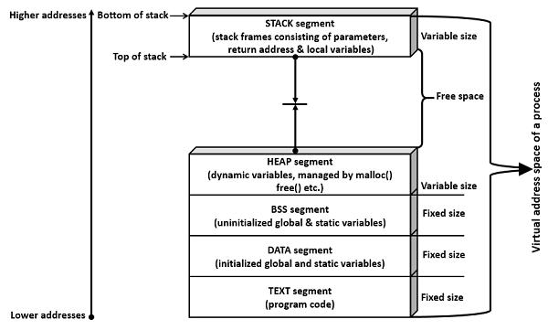
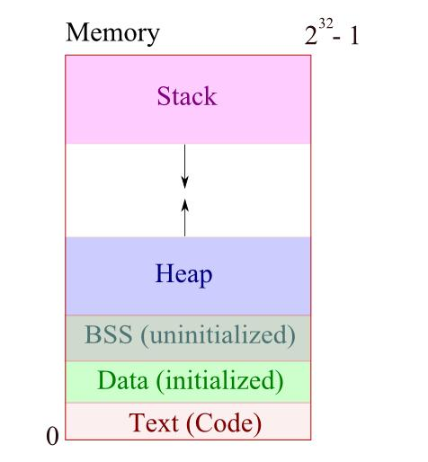
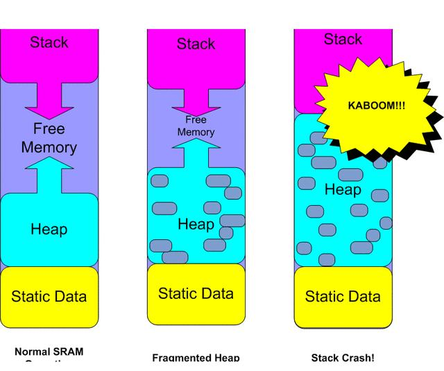
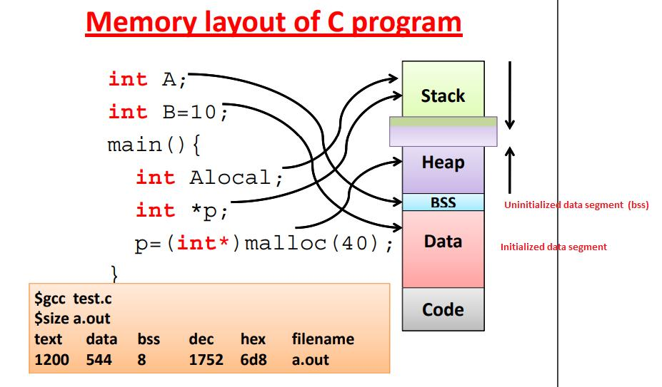

# 4-1. 초기화 하지 않은 변수들은 어디에 저장될까요?

# 1. 프로세스 주소 공간이 뭐냐?

프로그램 하나 실행하면, 걔 혼자 쓰는 **메모리 공간**이 생긴다.

이걸 **프로세스 주소 공간**이라고 한다.

핵심은 이거 하나야:

👉 **“메모리를 아무렇게나 쓰면 터지니까, 용도별로 나눠놓은 것”**

---

## 📌 전체 구조 그림









위에서 아래로 보면 보통 이렇게 나뉜다:

```plain text
[ Code 영역 (Text) ]   ← 프로그램 코드
[ Data 영역 ]         ← 초기화된 전역/정적 변수
[ BSS 영역 ]          ← 초기화 안된 전역/정적 변수
[ Heap ]              ↑ (위로 커짐)
        ...
[ Stack ]             ↓ (아래로 커짐)
```

---

## 각 영역 역할 (진짜 중요한 부분만)

### 1) Code (Text)

- 실행할 코드

- 읽기 전용 (수정 못함)

### 2) Data

- 초기값 있는 전역/정적 변수

```c
int a = 10;  // 여기 들어감
```

### 3) BSS

- 초기값 없는 전역/정적 변수

```c
int a;  // 여기 들어감
```

👉 이건 OS가 그냥 **0으로 초기화**해줌

---

### 4) Heap

- 개발자가 직접 쓰는 공간 (`new`, `malloc`)

- 크기 직접 조절 가능

👉 대신 관리 잘못하면 **메모리 누수** 터짐

---

### 5) Stack

- 함수 호출할 때 쓰는 공간

- 지역 변수, 함수 호출 정보 저장

👉 함수 끝나면 자동 정리됨

---

# 4-1. 초기화 안한 변수 어디 저장됨?

👉 무조건 BSS

왜 따로 만들었냐?

- 파일 크기 줄이려고

- 굳이 값 안 넣고 0으로만 채우면 되니까

**BSS 영역**

- 프로그램 실행 시 자동으로 0으로 초기화됨
