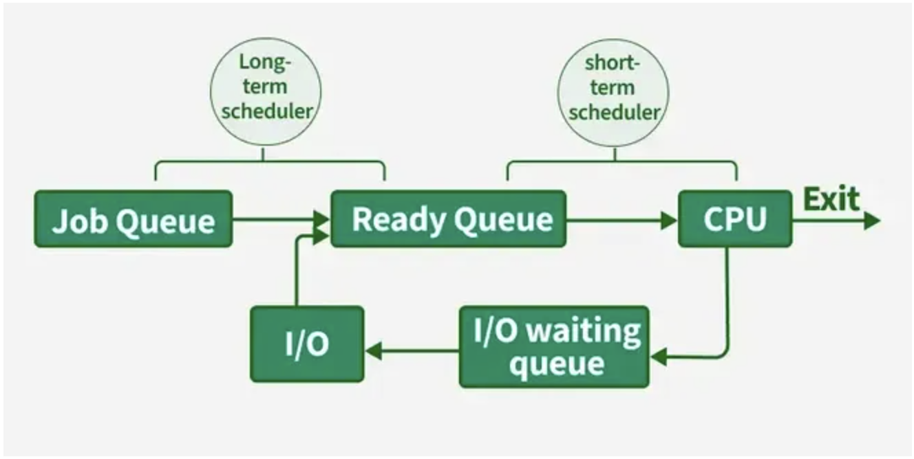
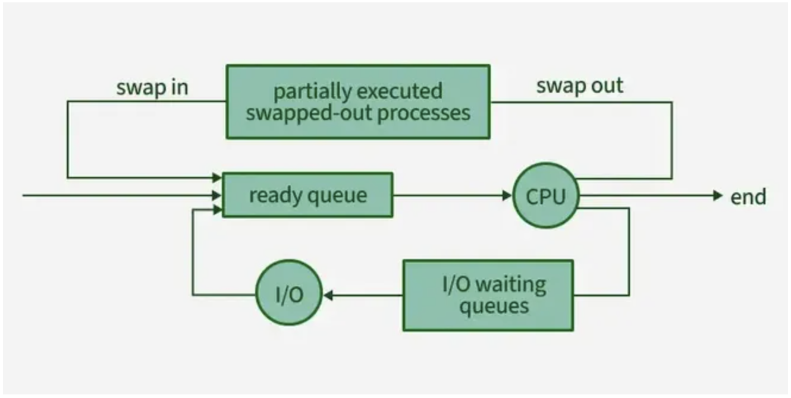
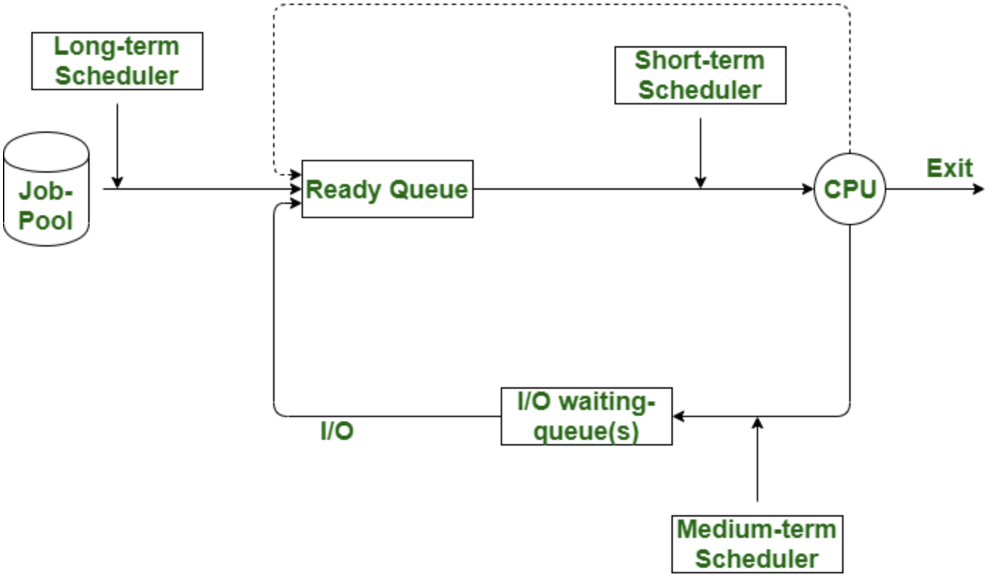

# 5-0. 단기, 중기, 장기 스케줄러에 대해 설명해 주세요.

> 한정적인 메모리를 여러 프로세스가 효율적으로 사용할 수 있도록 다음 실행 시간에 실행할 수 있는 프로세스 중에 하나를 선택하는 역할

⇒ 프로세스를 스케쥴링하기 위한 Queue가 존재한다.

### Queue의 종류

- 작업 큐(Job Queue) : 시스템 안의 모든 프로세스들로 구성

- 준비 큐(Ready Queue) : 메인 메모리에 존재하며, 준비 완료 상태에서 실행을 대기하는 프로세스들로 구성

- 장치 대기 큐(Device Queue) : 특정 입/출력장치를 대기하는 프로세스들의 리스트들로 구성

### Scheduler의 종류 

> 🌒 

### 단기 스케쥴러(CPU Scheduler) 

: CPU와 메모리 사이를 담당하는 스케쥴러

  - Ready Queue에 존재하는 프로세스 중 어떤 프로세스를 running 시킬지 결정

  - 프로세스에 CPU를 할당(scheduler dispatch)

  - 프로세스의 상태(ready → running → waiting → ready)

  - 자주 수행되므로 빨라야함

> 🌓 

### 중기 스케쥴러(Swapper) 

: 메모리에서 CPU를 점유하기 위해 경쟁하는 프로세스를 디스크로 보내는 스케쥴러

  - 프로세스에게서 memory를 dellocate

  - degree of Multiprogramming 제어

  - 현 시스템에서 메모리에 너무 많은 프로그램이 동시에 올라가는 것을 조절하는 스케쥴러

  - 프로세스의 상태(ready → suspended)

  - 차후 다시 프로세스를 메모리로 불러와서 중단되었던 지점에서 실행을 재개하는 스와핑 기능을 함

** swap out = suspended(stopped) : 외부적인 이유로 프로세스의 수행이 정지된 상태로 메모리에서 내려간 상태를 의미

> 🌔 

### 장기 스케쥴러(Job Scheduler) 

: 메모리와 디스크 사이를 담당하는 스케쥴러

  - 프로세스에 memory(및 각종 리소스)를 할당(admit)

  - degree of Multiprogramming(메모리에 여러 프로그램이 올라가는 것) 제어

  - 프로세스의 상태(new → ready(in memory)

  - 수십 초 내지 수 분 단위로 호출되기 때문에, 속도가 느릴수 있음 

