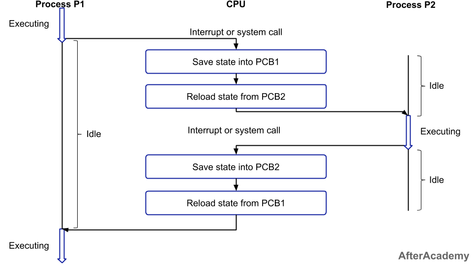
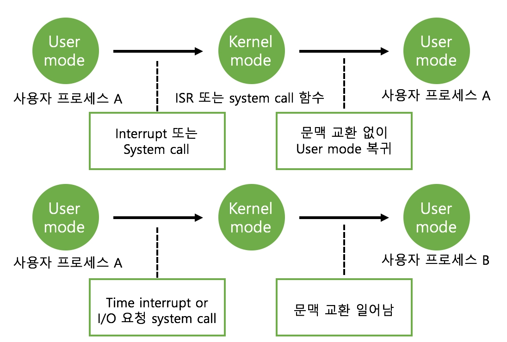

# 6-0. 컨텍스트 스위칭 시에는 어떤 일들이 일어나나요?

# 🔄 컨텍스트 스위칭 (Context Switching)

# 1️⃣ 컨텍스트 스위칭이란

### 📌 정의

컨텍스트 스위칭(Context Switching)은

여러 프로세스를 처리해야 하는 상황에서 **현재 진행중인 Task(프로세스, 스레드)의 상태를 PCB에 저장하고 다음에 진행할 Task의 상태값을 읽어 적용하는 과정**이다.

👉 즉, **CPU가 작업 대상을 바꾸는 과정**

# 2️⃣ 왜 필요한가

각 CPU 코어는 한 번에 하나의 프로세스만 실행할 수 있다.

하지만 실제로는 여러 프로세스가 동시에 실행되는 것처럼 보인다.

👉 이를 가능하게 하는 것이 **멀티태스킹(여러 프로세스를 번갈아 실행)**

---

### 📌 상황 예시

- 크롬 실행 중

- 음악 재생

- 코드 실행

➡️ 여러 작업이 동시에 수행되는 것처럼 보임

👉 실제로는 CPU가 빠르게 작업을 전환

# 3️⃣ 컨텍스트 스위칭 과정



## 1. 현재 프로세스 상태 저장

```plain text
실행 중인 프로세스 A
↓
CPU 레지스터 값 저장
↓
PCB(A)에 저장
```

---

## 2. 다음 프로세스 선택 (스케줄링)

운영체제가 실행할 프로세스를 선택

예

- 라운드 로빈

- 우선순위 스케줄링

---

## 3. 다음 프로세스 상태 복원

```plain text
프로세스 B 선택
↓
PCB(B)에서 상태 로드
↓
CPU 레지스터 복원
```

---

## 4. 프로세스 실행 재개

```plain text
프로세스 B 실행 시작
```

---

# 4️⃣ 컨텍스트 스위칭 발생 시점

**“현재 실행 중인 작업이 CPU를 더 이상 못 쓰게 될 때”** 발생한다

---

### 📌 1. 인터럽트 발생

- I/O 완료

- 타이머 인터럽트

---

### 📌 2. 시스템 콜

- 사용자 → 커널 전환

---

### 📌 3. 프로세스 상태 변화

- 실행 → 대기 (I/O 요청)

- 실행 → 종료

---

### 📌 4. 타임 슬라이스 종료

- CPU 할당 시간 초과

---

※ System Call이나 인터럽트가 발생한다고 반드시 context switching이 일어나는 것은 아니다.



# 5️⃣ 비용 (Overhead)

컨텍스트 스위칭은 필수적이지만 비용이 존재한다.

---

### ⚠️ 발생 비용

- **캐시 초기화**: 캐시 무효화 또는 캐시 적중률 감소

- **메모리 매핑 초기화**: 주소 공간 변경으로 인해 TLB(Translation Lookaside Buffer) flush 발생

- **커널의 지속 실행**: 컨텍스트 스위칭은 커널 모드에서 수행됨

---

👉 이 시간 동안 CPU는 실제 작업을 수행하지 않음

➡️ **성능 저하 요소**

---

# 6️⃣ 프로세스 vs 스레드 컨텍스트 스위칭

| 구분 | 프로세스 | 스레드 |
| --- | --- | --- |
| 메모리 | 완전히 분리 | 일부 공유 |
| 비용 | 큼 | 작음 |
| 속도 | 느림 | 빠름 |

---

👉 스레드 전환이 더 빠른 이유

- 주소 공간 공유

- PCB 대신 일부 정보만 교체

---

# 📌 핵심 정리

- 컨텍스트 스위칭은 **CPU 실행 대상을 바꾸는 과정**

- 현재 상태를 저장하고 다음 프로세스를 복원

- PCB를 통해 상태 관리

- 인터럽트, 타임 슬라이스 종료 등에서 발생

- 성능 오버헤드 존재 → 최소화 중요
