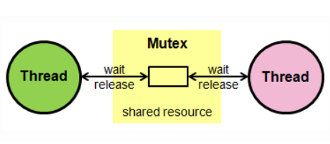
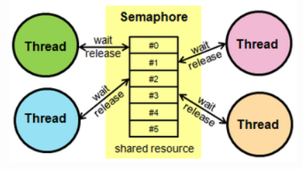

# 8-0. 뮤텍스와 세마포어의 차이점은 무엇인가요?

# 📌 Mutex vs Semaphore 정리

## 🔥 핵심 한 줄

> **뮤텍스는 ‘소유권 기반 1:1 동기화’, 세마포어는 ‘신호 기반 N:N 동기화’이다.**

---

## 1️⃣ 임계구역 (Critical Section)

> **공유 자원에 접근하는 코드 영역**

여러 프로세스/스레드가 동시에 실행되면서 동일한 자원에 접근할 경우

데이터 불일치(레이스 컨디션)가 발생할 수 있다.

이를 방지하기 위해 **임계구역에 대한 동기화**가 필요하며,

대표적인 방법이 **뮤텍스와 세마포어**이다.

---

## 2️⃣ 뮤텍스 (Mutex)

> **상호 배제(Mutual Exclusion)를 위한 Lock 기반 동기화 도구**


### ✔ 특징

- 한 번에 **오직 하나의 스레드만** 임계구역 접근 가능

- **소유권 존재** (Lock을 건 스레드만 Unlock 가능)

- 단순한 구조

### ✔ 동작 원리

- `Lock`
→ 임계구역 진입 (이미 사용 중이면 대기)

- `Unlock`
→ 임계구역 해제 (대기 중인 스레드 진입 가능)

### ✔ 핵심

👉 **“한 번에 하나만 실행”**

---

## 3️⃣ 세마포어 (Semaphore)

> **자원의 개수를 기반으로 접근을 제어하는 동기화 도구**


### ✔ 특징

- 동시에 **여러 스레드 접근 가능 (N개)**

- **소유권 없음** (다른 스레드가 해제 가능)

- 자원 개수 관리에 적합

### ✔ 구성

- 정수값 `S` (사용 가능한 자원 수)

### ✔ 연산

- `P (Wait)`
→ 자원 요청 (S 감소, 없으면 대기)

- `V (Signal)`
→ 자원 반환 (S 증가, 대기 스레드 깨움)

```javascript
S = 3 (좌석 3개)
손님1: P → S=2 (입장)
손님2: P → S=1 (입장)
손님3: P → S=0 (입장)
손님4: P → S=-1 (대기)
손님1 나감: V → S=0 (대기자 1명 입장)

👉 P = 자리 있으면 들어가고 없으면 대기
👉 V = 자리 비우고 대기자 1명 깨움
```

### ✔ 핵심

👉 **“정해진 개수만 접근 허용”**

---

## 4️⃣ 세마포어 종류

- **이진 세마포어**

  - 값: 0 또는 1

  - 뮤텍스와 유사하지만 **소유권 없음**

- **계수 세마포어**

  - 값: 0 이상의 정수

  - 여러 자원 관리 가능

---

## 5️⃣ Busy Waiting vs Block-WakeUp

### 🔹 Busy Waiting

> **조건을 계속 확인하며 대기하는 방식**

```plain text
while (S<=0);// 반복 체크
S--;
```

- CPU를 계속 사용 (비효율)

- 구현 단순

- 짧은 대기 상황에서 사용

---

### 🔹 Block - WakeUp

> **대기 시 스레드를 재우고, 가능해지면 깨우는 방식**

### ✔ 동작

- **Block**

  - 스레드를 wait queue에 넣고 sleep 상태로 전환 (CPU 반납)

- **WakeUp**

  - 자원이 해제되면 대기 스레드를 깨워 Ready 상태로 전환

```plain text
P(S) {
S--;
if (S<0)
// wait queue에 추가 (Block)
}

V(S) {
S++;
if (S<=0)
// 하나 깨움 (WakeUp)
}
```

### ✔ 특징

- CPU 사용 없음 (효율적)

- OS 스케줄러 필요

- 일반적인 동기화 방식

---

### ✔ 비교

| 구분 | Busy Waiting | Block-WakeUp |
| --- | --- | --- |
| 대기 방식 | 반복문 체크 | sleep 후 wake |
| CPU 사용 | O | X |
| 효율성 | 낮음 | 높음 |
| 사용 환경 | 짧은 대기 | 일반적인 경우 |

---

## 6️⃣ 뮤텍스 vs 세마포어

| 구분 | 뮤텍스 | 세마포어 |
| --- | --- | --- |
| 접근 가능 수 | 1개 | N개 |
| 소유권 | 있음 | 없음 |
| 목적 | 상호 배제 | 자원 개수 제어 |
| 해제 주체 | Lock한 스레드만 | 아무나 가능 |
| 사용 예 | 임계구역 보호 | 커넥션 풀, 버퍼 |

---

## 7️⃣ 관계

- 두 개는 **튜링 동치** → 서로 구현 가능

- **이진 세마포어 ≈ 뮤텍스 (유사하지만 소유권 차이 존재)**

---

## ⚠️ 주의사항

### 1. Deadlock (교착 상태)

- 잘못된 자원 획득 순서로 인해
서로 기다리며 무한 대기 상태 발생 가능

### 2. 데이터 무결성

- 동기화 도구는 **올바르게 사용해야만** 무결성 보장

- 잘못 사용하면 데이터 손상 또는 시스템 정지 발생

---

## 🔥 최종 한 줄 요약

- **뮤텍스 → “하나만 들어간다 (소유권 있음)”**

- **세마포어 → “N개까지 들어간다 (소유권 없음)”**

<details>
<summary>발표할때 볼 거 니까 보 지 마 새 연 ㅋ </summary>

## 임계구역

> **공유 변수 영역**
여러 프로세스 혹은 스레드가 작업을 수행하면서 공유된 자원을 건드리게 될 수 있는데, 이때 프로그램 코드 상에서 공유 자원에 접근하는 부분을 임계 구역이라고 합니다.

이렇게 임계 구역에 여러 프로세스 및 스레드가 함부로 접근할 수 없도록 관리를 잘 해줘야 하는데, 이를 위해 사용하는 방식에 대표적으로 세마포어와 뮤텍스가 있습니다.

## 뮤텍스



**뮤텍스(Mutex)는 상호 배제(Mutual Exclusion)의 약자로 락(Lock)이라고도 한다.**

여러 쓰레드를 실행하는 환경에서 자원에 대한 접근 제한을 위한 동기화 매커니즘

**상호 배제 동시성 제어 정책(Mutual Exclusion Concurrency Control Policy)를 시행하도록 설**

동시 프로그래밍에서 공유 불가능한 자원의 동시 사용을 피하기 위해 사용하는 알고리즘 중 하나

  - 임계구역을 가진 스레드들의 실행시간이 서로 겹치지 않고 각각 단독으로 실행(상호배제 Mutual Exclution)되도록 하는 기술

### 작동 원리

**뮤텍스는 Locking 메커니즘으로 오직 하나의 쓰레드만이 동일한 시점에 뮤텍스를 얻어 임계 영역에 들어올 수 있다 **그리고 해당 쓰레드만이 임계 영역에서 나갈 때 뮤텍스를 해제 (소유권 有)

⇒ Lock UnLick 연산만을 지원하면 됨

  - **Lock**: 현재의 임계 구역에 들어갈 권한을 얻어옴. 다른 프로세스/ 스레드가 임계 구역 수행 중이라면 종료할 때까지 대기 (entry section)

  - **Unlock**: 현재의 임계 구역을 모두 사용했음을 알림. 대기중인 다른 프로세스/그레드가 임계 구역에 진입할 수 있음 (exit section)

## **세마포어**



**세마포어(semaphore)**는 에츠허르 다익스트라(Edsger Wybe Dijkstra)가 제안한 **교착 상태(DeadLock)****에 대한 해법으로 두개의 원자적(Atomic) 함수로 제어되는 정수 변수로 멀티프로그래밍 환경에서 공유자원에 대한 접근 제어를 하는 방법**으로 사용되며, **1개의 공유되는 자원에 제한된 개수의 프로세스(Process), 또는 스레드(Thread)만 접근할 수 있도록** 한다.
이 때 세마포어의 카운트는 1 이상이며 카운트를 조절하여 진입 가능한 프로세스/스레드 수를 조절할 수 있다.

모든 교착 상태에 대한 해답을 제시해 줄 수 없지만 교착 상태 해법에 대한 고전적인 해법!

### 작동 원리

**세마포어의 작동 원리는 상호 배제 알고리즘(Mutual Exclusion Algorithm)에 기반**한다.

세마포어는 원자적으로 제어되는 정수 변수로 세마포어의 값이 0이면 자원에 접근할 수 없도록 블락(Block) 하고0 보다 크면 접근함 과 동시에 세마포어의 값을 1 감소 시킴

→ 종료하고 나갈 때는 세마포어의 값을 1 증가 시켜 다른 프로세스가 접근 가능하게 함

  - 이진형 세바포어 (binary semaphore): 0 또는 1을 가진다. 1개의 공유 자원을 상호배제하며 이를 이용해 계수 세마포어 구현할 수 있음 → 뮤텍스와 은 같지만 ‘소유권’때문에 동작의미가 다름

  - 계수형 세마포어(counting semaphore): 0과 양의 정수값을 가질 수 인음. 여러개의 공유 자원을 상호 배제할 수 있음

세마포어는 정수형 변수 S와 P(Wait), V(Signal) 연산으로 구성된 동기화 도구이다.

  - **S = 자원 개수**

  - **P = 감소 + 없으면 대기**

  - **V = 증가 + 하나 깨움**

S 값은 사용 가능한 자원의 개수를 의미하며,

P 연산은 자원을 획득하기 위해 감소시키고(없으면 대기),

V 연산은 자원을 반납하며 증가시키고 대기 중인 프로세스를 깨운다.

세마포어는 이진형(0 또는 1)과 계수형(0 이상의 정수)으로 나뉘며,

모든 연산은 원자적으로 수행되어야 한다.

```javascript
S = 3 (좌석 3개)
손님1: P → S=2 (입장)
손님2: P → S=1 (입장)
손님3: P → S=0 (입장)
손님4: P → S=-1 (대기)
손님1 나감: V → S=0 (대기자 1명 입장)

👉 P = 자리 있으면 들어가고 없으면 대기
👉 V = 자리 비우고 대기자 1명 깨움
```

### **Busy Waiting**

최초에 제시된 방안으로 아무것도 하지 않는 빈 반복문을 계속 돌다가 임계 구역에 진입할 수 있을 때 진입하는 방식

```javascript
P(S) {
	while S <= 0;	// 아무것도 하지 않음 (반복문)
    S--;
}

V(S) {
	S++;
}
```

공유 자원에 접근하기 위해 조건을 검사하다가, 이미 다른 스레드가 사용 중이면 **CPU를 계속 점유한 채 대기**하게 된다.

구현이 단순하지만  빈 반복문을 반복하기 때문에 계속적으로 Context Switching이 발생하며 이로 인하여 단일처리 다중프로세스 환경에서 처리 효율이 떨어짐

대기하는 동안에도 CPU를 지속적으로 사용하기 때문에 **비효율적**이다.

주로 대기 시간이 매우 짧은 경우나, 커널 내부에서 빠른 처리가 필요한 상황에서 사용된다.

### **Block-WakeUp**

Busy Waiting의 단점을 보완한 방식으로, 프로세스를 재워 큐(wait queue)에 넣어 공유 자원을 관리한다.

임계 구역에 진입할 수 없을 경우 스레드를 **대기 상태(Block) **로 전환시켜 CPU를 반납하고, 자원이 사용 가능해지면 **대기 중인 스레드를 깨워(WakeUp) **다시 실행시키는 방식이다.

Block(P)

  - 커널은 Block을 호출한 프로세스를 Suspend(지연)

  - 프로세스의 PCB(Process Control Block)를 Semaphore에 대한 wait queue에 넣음

Wakeup(V)

  - Block된 프로세스 P를 WakeUp 시킴

  - 이 프로세스의 PCB를 Ready queue로 옮김

```plain text
P(S) {
	S--;
    if (S < 0)
    	// 해당 프로세스를 wait queue에 추가(Block)
}

V(S) {
	S++;
    if (S <= 0)
    	// wait queue에서 프로세스를 제거(WakeUp)
}
```

| 구분 | Busy Waiting | Block-WakeUp |
| --- | --- | --- |
| 대기 방식 | 계속 반복문 체크 | 잠들었다가 깨어남 |
| CPU 사용 | 계속 사용 ❌ | 사용 안 함 ✔ |
| 효율성 | 낮음 | 높음 |
| 구현 | 간단 | OS 도움 필요 |

## 뮤텍스와 세마포어의 관계

뮤텍스와 세마 포어는 서로 튜링 동치, 뮤텍스로 세마포어를 세마포어로 뮤텍스를 구현할 수 있음

> 

**튜링 동치(Turing equivalence)**

만일 컴퓨터 P와 Q가 있을 때, P가 할 수 있는 일을 Q가 모두 흉내(simulate)낼 수 있고, Q가 할 수 있는 일을 모두 P가 흉내낼 수 있다면 두 컴퓨터는 튜링 동치이다.

카운트가 1인 특별한  세마포어를 뮤텍스라고 할 수 있음  하지만 소유권 ( **진정한 뮤텍스는 뮤텍스를 잠근 작업만이 잠금을 해제해야 한다는 점에서 보다 구체적인 사용 사례와 정의를 가지고 있다**는 점을 기억해야 함

## 차이점

### 동기화 대상의 갯수

  - 뮤텍스 : 동기화 대상이 하나뿐일 때 사용

  - 세마포어: 동기화 대상이 하나 이상일 때 사용

### 자원의 소유와 책임

  - 뮤텍스: 공유 자원의 소유가 가능하며 소유주가 이에 대한 책임을 진다.

  - 세마포어: 공유 자원을 소유할 수 없다. (다양한 상태가 존재하여 세마포어를 소유하지 않는 스레드가 Semaphore를 해제할 수 있어 공유 자원에 대한 소유가 불가능하다.)

| 항목 | 뮤텍스 | 세마포어 |
| --- | --- | --- |
| 접근 가능 개수 | 1개 | N개 |
| 소유권 | 있음 (lock 건 스레드만 unlock) | 없음 |
| 목적 | 상호 배제 | 자원 개수 제어 |
| 사용 예 | 임계 구역 보호 | 연결 풀, 버퍼 관리 |
| 구현 난이도 | 비교적 단순 | 상대적으로 복잡 |

**뮤텍스와 세마포어는 모두 완벽한 기법은 아니므로, 데이터 무결성을 보장할 수 없으며 모든 교착 상태를 해결하지는 못한다.**

## ⚠️ 주의해야 할 점: 데이터 무결성과 교착 상태

이 도구들이 **모든 문제를 해결해주지는 않습니다.**

  1. **Deadlock (교착 상태):** * 스레드 A가 뮤텍스 1을 잡고 2를 기다리는데, 스레드 B가 뮤텍스 2를 잡고 1을 기다리는 상황이 발생할 수 있습니다. 이는 알고리즘 설계의 문제입니다.

  1. **데이터 무결성 (Data Integrity):**

    - 세마포어 카운트를 잘못 설정하거나, `P()` 연산 후 `V()` 연산을 빼먹는 등의 실수가 발생하면 전체 시스템이 멈추거나 데이터가 깨질 수 있습니다.
</details>
