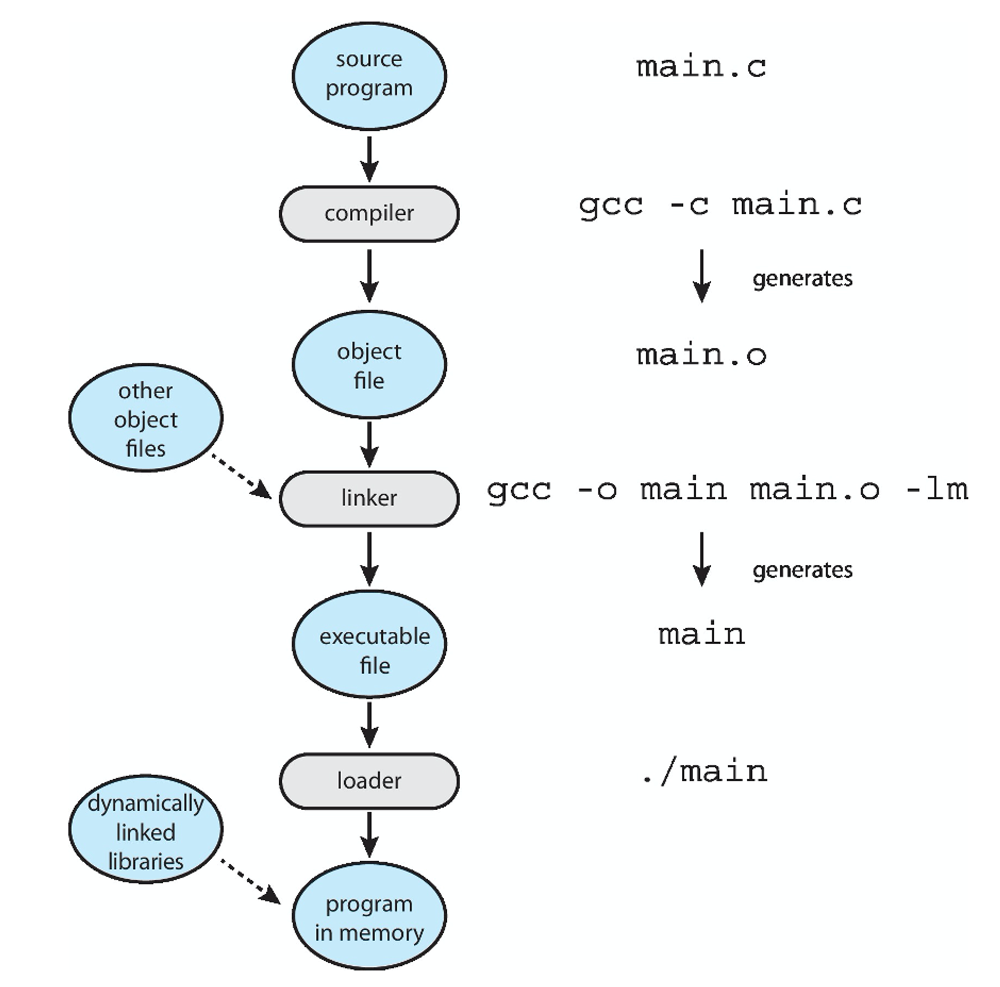

# **10-1.** 링커와, 로더의 차이에 대해 설명해 주세요.



## 링커(Linker)란?

링커는 여러 개의 오브젝트 파일(.obj, .o 등)을 하나의 실행 파일(.exe, .out 등)로 만들어주는 도구이다.

이 과정에서 함수와 변수의 참조를 실제 메모리 주소로 연결한다.

- 예: A 파일에서 B 함수를 호출했는데, B 함수가 다른 파일에 있다면
→ 링커가 해당 함수의 주소를 찾아 연결해준다.

## ✔ 역할 요약

- 오브젝트 파일들을 하나로 연결

- 심볼 결합 (함수, 변수 주소 할당)

- 실행 파일 생성

```plain text
정적 링킹(Static Linking):
모든 라이브러리 코드가 실행 파일에 포함된다.

장점:
프로그램이 독립적이다. 배포된 실행 파일에 모든 필요한 코드가 포함되어 있어, 다른 외부 파일에 의존하지 않는다.
특정 버전의 라이브러리를 사용할 수 있다. 업데이트로 인한 비호환성 문제가 발생하지 않는다.
단점:
실행 파일의 크기가 커진다.
메모리 사용량이 증가한다. 동일한 라이브러리가 여러 프로그램에서 각각 복사되기 때문에, 메모리가 비효율적으로 사용될 수 있다.
```

```plain text
동적 링킹(Dynamic Linking):
프로그램이 실행될 때 필요한 라이브러리를 메모리에 로드한다.

장점:
실행 파일의 크기가 작아진다.여러 프로그램이 동일한 라이브러리를 공유하여 메모리 사용이 효율적이다.라이브러리를 업데이트하면 프로그램도 자동으로 최신 버전을 사용하게 된다.
단점:
프로그램 실행 시 필요한 라이브러리가 시스템에 설치되어 있어야 한다.라이브러리 버전 문제로 인해 프로그램이 제대로 동작하지 않을 수 있다.
```

---

## 로더(Loader)란?

로더는 링커가 만든 실행 파일을 메모리에 올려 실행할 수 있도록 하는 역할을 한다.

즉, 실제 프로그램 실행을 준비하는 운영체제의 구성 요소이다.

- 예: 실행 파일이 디스크에 있으면
→ 로더가 이를 메모리에 적재하여 CPU가 실행할 수 있게 한다.

## ✔ 역할 요약

- 실행 파일을 메모리에 적재

- 시작 주소 지정

- 초기화 및 실행 환경 구성

- (필요 시) **동적 라이브러리 로딩**

```plain text
로더의 작동방식

파일 로드: 로더는 실행 파일을 디스크에서 읽어 메모리로 로드한다.
재배치: 링커가 삽입한 재배치 정보를 기반으로, 메모리 내에서 실행 가능한 상태로 코드와 데이터를 재배치한다.
초기화: 프로그램 실행을 위해 필요한 초기화 작업을 수행한다.
제어 전달: CPU에 제어를 넘겨 프로그램 실행을 시작한다.
```

```plain text
동적 라이브러리를 로드하는 과정

동적 링킹: 프로그램 실행 시점에서 필요한 동적 라이브러리를 로드하고, 해당 라이브러리의 심볼을 프로그램과 연결한다.
의존성 해결: 라이브러리가 의존하는 다른 라이브러리들도 함께 로드한다.
메모리 매핑: 로드된 라이브러리를 메모리에 매핑하고, 프로그램의 해당 부분이 올바르게 실행될 수 있도록 주소를 연결한다.
이 과정에서 로더는 시스템에 이미 로드된 라이브러리를 재사용하여 메모리 효율성을 높이거나, 특정 버전의 라이브러리를 사용하는 프로그램의 요구사항을 충족시킨다.
```

| 항목 | 링커 (Linker) | 로더 (Loader) |
| --- | --- | --- |
| 역할 | 실행 파일 생성 | 실행 파일을 메모리에 올려 실행 |
| 동작 위치 | 컴파일 후 | 실행 시점 |
| 결과물 | 실행 파일 | 메모리 적재 |
| 사용 주체 | 개발 도구 | 운영체제(OS) |
| 예시 | `gcc main.c -o main` | `./main` (실행 시 로더가 작동) |

<details>
<summary>영관 메타</summary>

- 링커는 ‘음식 재료를 다듬고 요리해서 도시락을 싸는 역할’, ‘레고를 부품 조립해서 완성품 만들기’

  - 로더는 ‘그 도시락을 꺼내서 전자레인지에 데우고 먹을 수 있게 준비하는 역할’, ‘완성품을 꺼내서 실제로 작동시키기’
</details>
