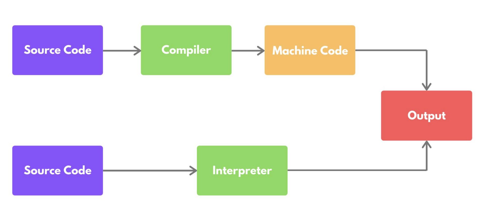
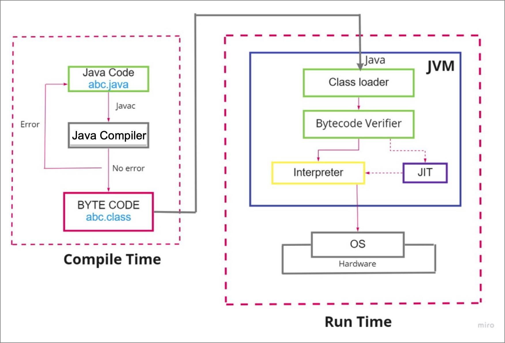

# **10-2.** 컴파일 언어와 인터프리터 언어의 차이에 대해 설명해 주세요.

## 컴파일 언어

> 전체 소스 코드를 **한 번에 기계어로 번역(컴파일)**한 뒤 실행

### ✔️ 실행 과정

1. 소스 코드 작성

1. 컴파일러가 전체 코드 분석

1. 실행 파일(기계어) 생성

1. 실행 파일 실행

### ✔️ 특징

- 실행 속도 **빠름**

- 실행 전에 **오류를 미리 확인 가능**

- 플랫폼(운영체제)에 따라 실행 파일이 다름

### ✔️ 대표 언어

- C

- C++

- Go

- Java _(컴파일 + 인터프리터 혼합)_

---

## 인터프리터 언어

> 코드를 **한 줄씩 해석하며 즉시 실행**

### ✔️ 실행 과정

1. 소스 코드 작성

1. 인터프리터가 한 줄씩 읽으며 실행

### ✔️ 특징

- 실행 속도는 상대적으로 **느림**

- 수정 후 **즉시 실행 가능 (개발 편리)**

- 별도의 실행 파일 생성 없음

### ✔️ 대표 언어

- Python

- JavaScript

- Ruby

| 구분 | 컴파일 언어 | 인터프리터 언어 |
| --- | --- | --- |
| 번역 시점 | 실행 전 전체 컴파일 | 실행 중 한 줄씩 |
| 실행 속도 | 빠름 | 상대적으로 느림 |
| 오류 발견 | 컴파일 단계에서 | 실행 중 발견 |
| 실행 파일 | 있음 | 없음 |
| 개발 속도 | 느림 | 빠름 |

---

추가 지식

### **[자바는 왜 자바 컴파일러를 사용할까?](https://hyeinisfree.tistory.com/26#%EC%9E%90%EB%B0%94%EB%8A%94%20%EC%99%9C%20%EC%9E%90%EB%B0%94%20%EC%BB%B4%ED%8C%8C%EC%9D%BC%EB%9F%AC%EB%A5%BC%20%EC%82%AC%EC%9A%A9%ED%95%A0%EA%B9%8C%3F-1-4)**

자바는 WORA를 구현하기 위해 물리적인 머신과 별개의 가상 머신(JVM)을 기반으로 동작하도록 설계되었다. 그래서 자바 바이트코드를 실행하고자 하는 모든 하드웨어에 JVM을 동작시킴으로써 자바 실행 코드를 변경하지 않고도 모든 종류의 하드웨어에서 동작되게 한 것이다. Java 소스코드, 즉 원시코드(.java)는 CPU가 인식을 하지 못하므로 기계어로 컴파일을 해줘야 한다. 하지만 Java는 이 JVM이라는 가상 머신을 거쳐서 OS에 도달하기 때문에 OS가 인식할 수 있는 기계어로 바로 컴파일되는 게 아니라 JVM이 인식할 수 있는 자바 바이트코드(.class)로 변환된다. 자바 컴파일러가 .java 파일을 .class 파일인 자바 바이트코드로 변환한다.

