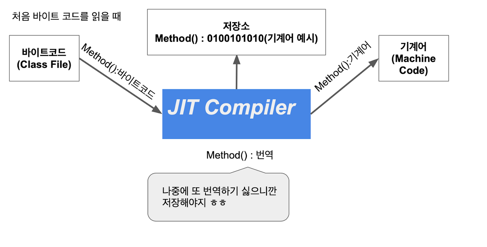
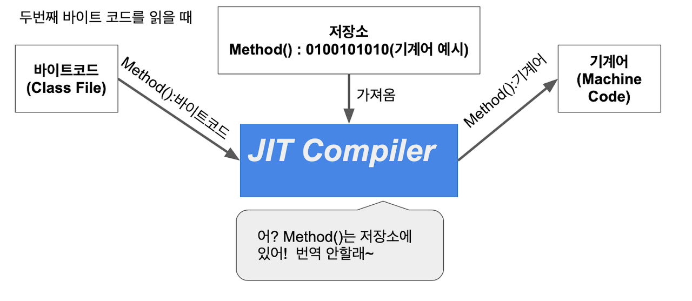

# **10-3.** JIT에 대해 설명해 주세요.

> **프로그램을 실행하기 전이 아닌, 실행 시점(Runtime)에 필요한 부분을 즉석으로 기계어 코드로 번역하여 성능을 최적화하는 기술**

⇒ **인터프리터 언어도 컴파일 할 수 있는 방법 : JIT 컴파일**

## Just-In-Time (JIT) 컴파일러

> 프로그램 실행 중에 자주 사용되는 코드를 기계어로 컴파일하여 성능을 개선

ex)

- Python의 PyPy

- JavaScript의 V8 엔진 

### ✅ 장점

- 한 번 컴파일하면 **실행 시 번역 과정 없음**

- → **실행 속도가 매우 빠름**

- 동일 프로그램을 여러 번 실행할 때 효율적

- 배포(CD, 실행파일 등)에 유리

---

### ❌ 단점

- 실행 전에 반드시 **컴파일 과정** 필요 → 시작 시간이 느림

- 코드 한 줄 수정해도 **다시 컴파일 필요**

- 개발 단계에서 반복 작업이 많아짐

- (단, Java는 바이트코드 + 부분 컴파일로 상대적으로 빠름)
