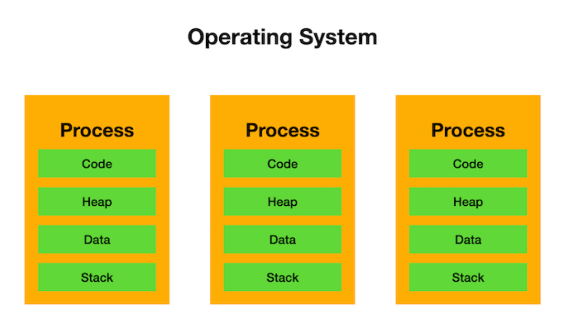
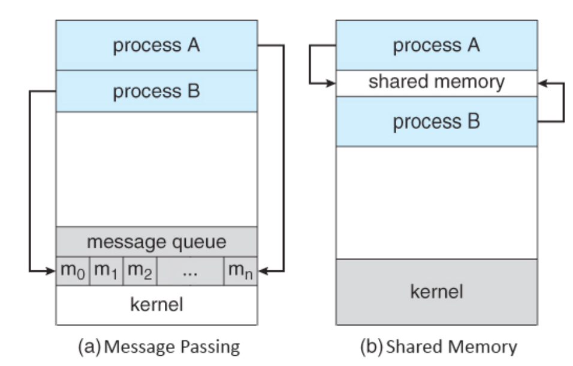
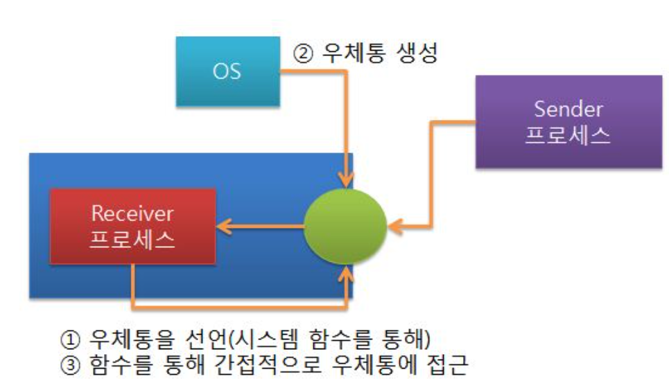
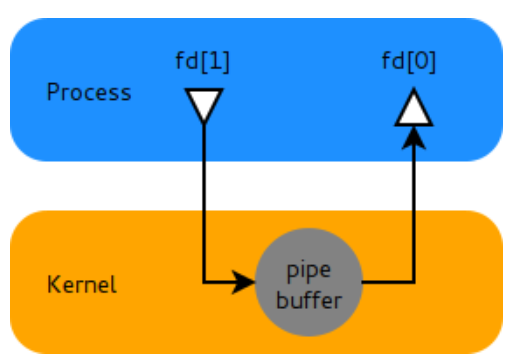

# 11-0. IPC(Inter-Process Communication)란 무엇인가?

1. 프로세스간 통신이란 ? 프로세스간 데이터 송·수신 → **메모리 공유**

## IPC란?

: 독립적으로 실행 중인 프로세스들 간에 데이터를 주고받을 수 있도록 운영체제(OS)가 제공하는 통신 기법

### 💡 왜 IPC가 필요할까? (프로세스의 격리성)

1. 운영체제에서 실행되는 각 프로세스는 자신만의 **독립적인 메모리 공간**을 할당받음. 

1. A 프로세스는 B 프로세스의 메모리에 절대 접근할 수 없음. 

1. 이는 치명적 오류나 악의적인 공격으로부터 시스템을 보호하기 위한 OS의 강력한 **격리(Isolation)** 정책.

- **문제 발생:** 거대한 프로그램은 여러 프로세스가 협업해야 돌아감. 사무실끼리 문서를 주고받아야만 일이 진행되는 것과 비슷.

- **해결책:** 이 철저한 보안을 유지하면서도 안전하게 문서를 주고받을 수 있도록, **건물 관리인(운영체제)이 특별히 만들어준 합법적인 통신 창구**가 바로 **IPC**.

---

## 2. IPC의 주요 종류와 특징

운영체제는 프로세스들이 상황에 맞게 통신할 수 있도록 여러 가지 IPC 방식을 제공.

구분 기준: **데이터를 어떻게 전달하는가**

### ① 공유 메모리 (Shared Memory)

- **개념:** 두 개 이상의 프로세스가 **특정 메모리 영역을 공유**하여, 그 공간을 통해 데이터를 읽고 쓰는 방식. (OS가 프로세스들의 중간에 공용 게시판을 하나 세워주는 것)

- **장점 (가장 빠름):** 데이터를 복사해서 옮길 필요 없이, 메모리에 직접 접근하므로 IPC 기법 중 **통신 속도가 가장 빠름.** 대용량 데이터 처리에 유리.

- **단점 (동기화 필수):** 두 프로세스가 동시에 같은 메모리에 데이터를 쓰려고 하면 데이터가 꼬이는 '경쟁 상태(Race Condition)'가 발생. 따라서 데이터 접근을 순서대로 통제하는 **세마포어(Semaphore)나 뮤텍스(Mutex) 같은 동기화 기술이 반드시 함께 사용**.

### ② 메시지 큐 (Message Queue)

- **개념:** 메모리 직접 공유**X.** OS가 관리하는 메모리 공간에 **'큐(Queue)' 형태의 우편함**을 만들어 데이터를 메시지 단위로 주고받는 방식.

- **장점 (안전성):** 데이터가 큐를 통해 순차적으로 전달되므로 공유 메모리처럼 복잡한 **동기화 처리를 개발자가 직접 할 필요가 없음**. OS가 알아서 처리.

- 데이터를 주고받기 위한 메세지 큐를 커널에서 관리하는 방식

  - 메시지큐의 접근자(식별자)를 아는 모든 프로세서는 동일한 메시지큐에 접근하여 데이터를 공유할수 있음.

- 메시지큐는 메시지를 queue 데이터 구조 형태로 관리함

### ③ 파이프 (Pipe)

- **개념:** 두 프로세스를 연결하는 **단방향(Unidirectional) 데이터 통로**. 한쪽 프로세스는 쓰기만 하고, 다른 쪽 프로세스는 읽기만 가능. (단 방향)

- **종류:**

  - **익명 파이프 (Anonymous Pipe):** 부모-자식 관계에 있는 프로세스들 사이에서만 사용 가능. (예: 터미널에서 `ls | grep` 명령어를 칠 때 사용되는 파이프)

  - **네임드 파이프 (Named Pipe / FIFO):** 이름이 부여된 파이프로, 부모-자식 관계가 전혀 없는 독립적인 프로세스들끼리도 통신 가능. 양방향 통신을 원하면 파이프를 두 개 만들어 사용. → ?

### ④ 소켓 (Socket)

- **개념:** 본래 네트워크를 통해 다른 컴퓨터(물리적으로 떨어진 장비)에 있는 프로세스와 통신하기 위해 만들어진 방식. 하지만 같은 컴퓨터 내의 프로세스끼리 통신할 때도 사용할 수 있음. (로컬 루프백 방식) → ?

- **장점:** 클라이언트-서버 구조에 가장 최적화. 프로세스가 같은 PC에 있든, 지구 반대편 서버에 있든 동일한 코드로 통신할 수 있다는 엄청난 확장성.

### ⑤ 시그널 (Signal)

- **개념:** 복잡한 데이터를 주고받는 용도가 아니라, 프로세스에게 **"어떤 이벤트가 발생했다"는 사실만을 비동기적으로 알려주는 아주 짧은 메시지**.

- **예시:** 터미널에서 실행 중인 프로그램을 강제로 끌 때 누르는 `Ctrl + C` (SIGINT)나, 프로세스를 강제 종료하는 `kill` 명령어가 바로 OS가 프로세스에 시그널을 보내는 IPC의 일종.

실제 사용 예시

### 1. 공유 메모리 (Shared Memory)

**최고의 속도가 필요해서 데이터를 직접 공유하는 경우**

  - **실제 사용 예시: 데이터베이스 시스템 (PostgreSQL, Oracle)**

    - **동작 원리:** PostgreSQL 같은 관계형 데이터베이스는 수많은 클라이언트의 접속을 처리하기 위해 여러 개의 '백엔드 프로세스'를 생성합니다. 이때 모든 프로세스가 매번 디스크(하드디스크)에서 데이터를 읽어오면 너무 느려집니다.

    - **IPC 적용:** OS로부터 거대한 **공유 메모리 영역(`shared_buffers`)**을 할당받습니다. 한 프로세스가 디스크에서 테이블 데이터를 읽어와 이 공유 메모리에 올려두면, 다른 프로세스들은 디스크에 접근할 필요 없이 공유 메모리에서 데이터를 즉시 읽어갑니다. 속도를 극대화하기 위한 전형적인 사례입니다.

### 2. 메시지 큐 (Message Queue)

**보내는 쪽과 받는 쪽의 속도가 달라서 버퍼링이 필요한 경우**

  - **실제 사용 예시: 운영체제의 프린터 스풀러(Spooler) 또는 로컬 백그라운드 작업**

    - **동작 원리:** 우리가 워드, 엑셀, 크롬 브라우저에서 동시에 여러 개의 문서를 "인쇄" 버튼을 누른다고 가정해 보겠습니다. 프린터 기기는 한 번에 한 장씩만 인쇄할 수 있습니다.

    - **IPC 적용:** 각 프로그램(프로세스)들은 프린터가 지금 바쁜지 아닌지 기다릴 필요 없이, 인쇄할 데이터를 OS의 **메시지 큐(Print Spooler)**에 던져놓고 자기 할 일을 하러 돌아갑니다. 프린터를 제어하는 백그라운드 프로세스(데몬)는 큐에 쌓인 인쇄 작업들을 순서대로 하나씩 꺼내서 프린터로 보냅니다.

### 3. 파이프 (Pipe)

**한 프로그램의 출력 결과를 다른 프로그램의 입력으로 즉시 넘길 때**

  - **실제 사용 예시: 리눅스/맥 터미널 명령어 조합 (익명 파이프)**

    - **동작 원리:** 백엔드 개발을 하다 보면 서버에 실행 중인 자바 프로세스를 찾기 위해 터미널에 `ps aux | grep java`라는 명령어를 칩니다.

    - **IPC 적용:** 여기서 사용된 `|` 기호가 바로 익명 파이프입니다. OS는 `ps aux`(현재 실행 중인 모든 프로세스 출력)라는 프로세스와 `grep java`('java'라는 글자만 필터링)라는 프로세스를 동시에 실행시킨 뒤, 파이프를 파이프를 연결해 줍니다. 첫 번째 프로세스가 화면에 글자를 뿌리는 대신 파이프에 밀어 넣으면, 두 번째 프로세스가 파이프에서 물을 마시듯 데이터를 받아 필터링을 수행합니다.

### 4. 소켓 (Socket)

**네트워크 통신뿐만 아니라, 로컬 장비 내의 독립적인 서버 간 통신**

  - **실제 사용 예시: Nginx 웹 서버와 Spring/Node.js 서버 간의 연동 (로컬 루프백 / 유닉스 도메인 소켓)**

    - **동작 원리:** 보통 하나의 서버 컴퓨터 안에 앞단에는 Nginx를 띄워두고, 뒷단에는 Spring Boot 애플리케이션을 띄워둡니다.

    - **IPC 적용:** Nginx(프로세스 A)가 외부로부터 HTTP 요청을 받으면, 이를 같은 컴퓨터 내부에서 돌고 있는 Spring Boot(프로세스 B)에게 전달해야 합니다. 이때 `127.0.0.1:8080`과 같이 내부망 IP와 포트를 사용하는 **네트워크 소켓**을 사용하거나, 파일 형태의 **유닉스 도메인 소켓(`.sock` 파일)**을 통해 데이터를 주고받습니다. 도커(Docker) 명령어를 칠 때 내부적으로 도커 데몬과 통신하는 방식도 이 유닉스 도메인 소켓입니다.

### 5. 시그널 (Signal)

**다른 프로세스에게 긴급한 상태 변화나 이벤트를 툭 치고 알려줄 때**

  - **실제 사용 예시: 서버의 우아한 종료 (Graceful Shutdown) 및 프로세스 강제 종료**

    - **동작 원리:** 배포를 위해 켜져 있던 Spring Boot 서버를 끄고 새 버전을 올려야 할 때, 콘센트를 뽑듯 갑자기 꺼버리면 결제 중이던 사용자의 데이터가 날아갈 수 있습니다.

    - **IPC 적용:** 배포 스크립트는 실행 중인 서버 프로세스에게 **`SIGTERM (15번 시그널)`*이라는 짧은 신호를 보냅니다. 서버 프로세스는 이 시그널을 감지하면, "아, OS가 나보고 이제 죽으라고 하네. 새로 들어오는 요청은 막고, 지금 처리 중이던 결제까지만 끝낸 다음에 안전하게 꺼져야겠다"라고 판단하고 작동을 멈춥니다. 개발하다

---

### 💡 실전 면접용 한 줄 요약 포인트

면접에서 "상황에 따라 어떤 IPC를 선택하겠는가?"라는 꼬리 질문이 들어왔을 때 활용할 수 있는 핵심 요약.

> "프로세스 간 통신에서 **압도적인 속도와 대용량 데이터 전송**이 최우선이라면 동기화의 복잡함을 감수하고서라도 '공유 메모리'를 선택하겠습니다. 반면, 데이터의 흐름을 안전하게 제어하고 **비동기적인 처리와 안정성**이 중요하다면 운영체제가 큐를 관리해 주는 **'메시지 큐'** 방식을 채택하여 결합도를 낮추는 설계를 하겠습니다."
