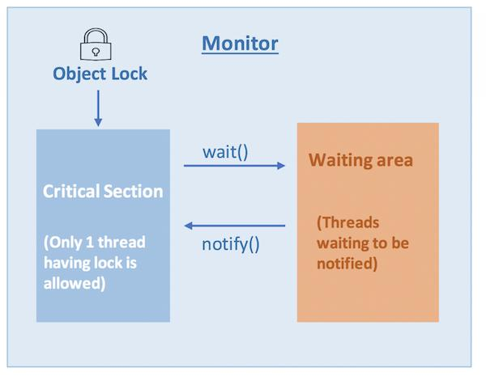
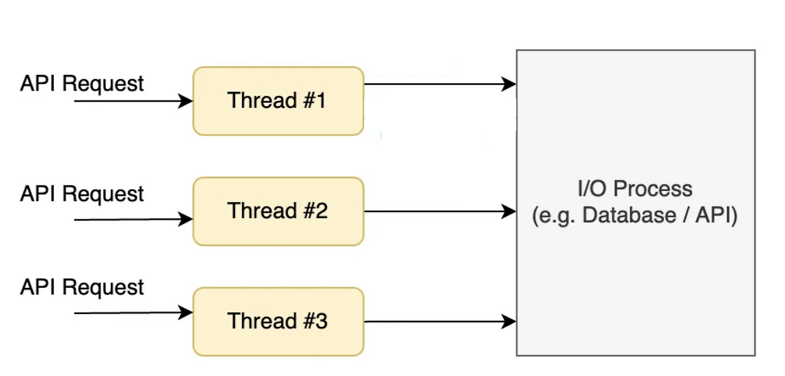
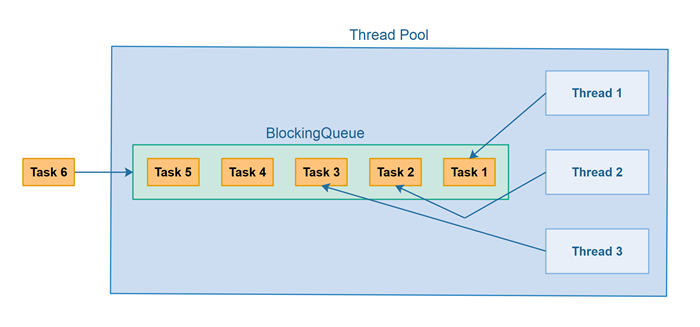
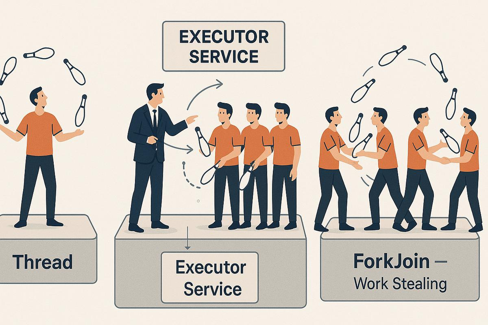

# 13-0. Thread Pool, Monitor, Fork-Join에 대해 설명해 주세요.

- **Monitor / Thread Pool / Fork-Join 모두 JVM 위에서 동작하는 고수준 도구**

- 내부적으로는 **OS의 스레드/락을 사용**

```json
[하드웨어 / OS]
  - CPU, 스케줄러, 커널 스레드
  - mutex, semaphore 같은 primitive

        ↓ (기반으로 사용)

[JVM / 언어 런타임]
  - Thread, synchronized (Monitor)
  - Lock API, ForkJoinPool

        ↓

[라이브러리 / 프레임워크]
  - Thread Pool (ExecutorService)
  - Fork-Join (java.util.concurrent)

        ↓

[애플리케이션 코드]
```

# Monitor

# Monitor (모니터) 정리

## 1. Monitor 개념

Monitor는 여러 스레드가 **공유 자원에 안전하게 접근하도록 제어하는 동기화 메커니즘**이다.

단순히 락(lock)만 제공하는 것이 아니라, **상호 배제 + 조건 기반 대기(wait/notify)**까지 포함하는 구조다.

Java에서는 모든 객체가 하나의 Monitor를 가지고 있으며, `synchronized` 키워드를 통해 이를 사용할 수 있다.

  <details>
  <summary>Mutex/Semaphore VS Monitor</summary>

✅ Mutex/Semaphore 는 데이터와 락이 분리되어 있음

→ 누가 어떤 락을 써야 하는지 헷갈림

→ 잘못된 락 사용 가능

✅ Monitor

→ 공유 데이터 + Lock (자동 관리) + Condition (wait/notify)

→ 실수 줄어듦

| 구분 | Mutex / Semaphore | Monitor |
| --- | --- | --- |
| 레벨 | 저수준 (OS) | 고수준 (언어) → 내부적으로는 결국 OS의 뮤텍스 / 세마포어를 사용해서 구현 |
| 락 관리 | 수동 | 자동 |
| 조건 동기화 | 복잡 | wait/notify 제공 |
| 안정성 | 낮음 (실수 많음) | 높음 |
| 사용 난이도 | 어려움 | 쉬움 |

```json
OS (하드웨어 가까움)
   ↓
Mutex / Semaphore (저수준 primitive)
   ↓
Monitor (언어가 감싼 고수준 구조)
   ↓
개발자 코드
```
  </details>

---

## 2. 왜 Monitor가 필요한가

멀티스레드 환경에서는 여러 스레드가 동시에 하나의 자원에 접근할 수 있다.

이때 동기화가 없으면 Race Condition과 같은 문제가 발생한다.

---

## 3. Monitor의 핵심 기능

Monitor는 크게 두 가지 역할을 수행한다.

### 1) Mutual Exclusion (상호 배제)

한 번에 하나의 스레드만 특정 코드 영역에 접근할 수 있도록 보장한다.

### 2) Condition Synchronization (조건 동기화)

특정 조건이 만족될 때까지 스레드를 대기시키고,

조건이 충족되면 다시 실행하도록 제어한다.

---

## 4. Java에서의 Monitor 사용 방식

### synchronized 키워드

```java
public synchronized void increment() {
    count++;
}
```

또는

```java
synchronized (lock) {
    count++;
}
```

---

## 5. 내부 동작 흐름



  1. 스레드가 `synchronized` 블록에 진입을 시도한다

  1. 해당 객체의 Monitor Lock을 획득해야만 진입 가능하다

  1. 이미 다른 스레드가 Lock을 가지고 있으면 대기 상태에 들어간다

  1. Lock을 획득한 스레드만 임계 영역(critical section)을 실행한다

  1. 작업이 끝나면 Lock을 반환한다

  1. 대기 중이던 다른 스레드가 Lock을 획득하고 실행한다

  <details>
  <summary>코드로 보면 이해가 더 쉬우니께룽께룽…. </summary>

```java
public class MonitorExample {

    static class Buffer {
        private int data;
        private boolean empty = true;

        // 생산자
        public synchronized void produce(int value) throws InterruptedException {

            // 이미 데이터가 있으면 소비자가 가져갈 때까지 기다림
            while (!empty) {
                System.out.println(Thread.currentThread().getName() + " → 기다림 (버퍼 꽉 참)");
                wait(); // lock 반납 + 대기
            }

            // 데이터 생성
            data = value;
            empty = false;
            System.out.println(Thread.currentThread().getName() + " → 생산: " + value);

            notify(); // 소비자 깨움
        }

        // 소비자
        public synchronized int consume() throws InterruptedException {

            // 데이터 없으면 기다림
            while (empty) {
                System.out.println(Thread.currentThread().getName() + " → 기다림 (버퍼 비어있음)");
                wait(); // lock 반납 + 대기
            }

            int value = data;
            empty = true;
            System.out.println(Thread.currentThread().getName() + " → 소비: " + value);

            notify(); // 생산자 깨움

            return value;
        }
    }

    public static void main(String[] args) {

        Buffer buffer = new Buffer();

        // 생산자 스레드
        Thread producer = new Thread(() -> {
            try {
                for (int i = 1; i <= 5; i++) {
                    buffer.produce(i);
                    Thread.sleep(500); // 일부러 텀 주기
                }
            } catch (InterruptedException e) {}
        }, "Producer");

        // 소비자 스레드
        Thread consumer = new Thread(() -> {
            try {
                for (int i = 1; i <= 5; i++) {
                    buffer.consume();
                    Thread.sleep(800);
                }
            } catch (InterruptedException e) {}
        }, "Consumer");

        producer.start();
        consumer.start();
    }
}
```
  </details>

---

## 6. wait / notify 메커니즘

Monitor는 단순히 Lock만 제공하는 것이 아니라,

조건이 충족될 때까지 스레드를 기다리게 하는 기능도 제공한다.

### 기본 구조

```java
synchronized (lock) {
    while (!condition) {
        lock.wait();
    }

    // 조건이 만족되었을 때 실행
}
```

다른 스레드에서:

```java
synchronized (lock) {
    condition = true;
    lock.notify();
}
```

---

### 동작 방식

  - `wait()` 호출 시

    - 현재 스레드는 Lock을 반환하고 대기 상태로 들어간다

  - `notify()` 호출 시

    - 대기 중인 스레드 중 하나가 깨워진다

  - 깨어난 스레드는 다시 Lock을 획득해야 실행을 이어갈 수 있다

---

## 7. Monitor의 구조적 이해

Monitor 내부는 크게 두 개의 큐로 생각할 수 있다.

  - Entry Set (락을 기다리는 스레드)

  - Wait Set (조건을 기다리는 스레드)

동작 흐름은 다음과 같다.

  1. Lock이 없으면 Entry Set에서 대기

  1. Lock 획득 후 실행

  1. 조건이 맞지 않으면 Wait Set으로 이동 (`wait`)

  1. `notify` 호출 시 Wait Set에서 깨움

  1. 다시 Entry Set으로 이동 후 Lock 경쟁

---

## 8. Monitor 사용 시 주의사항

### 1) Deadlock (교착 상태)

서로 다른 Lock을 가진 스레드들이 서로를 기다리면 무한 대기에 빠질 수 있다.

---

### 2) wait는 반드시 반복문과 함께 사용

조건이 깨진 상태에서 깨어날 수 있기 때문에 `if`가 아닌 `while`을 사용해야 한다.

---

### 3) notify vs notifyAll

  - `notify()`는 하나의 스레드만 깨움

  - `notifyAll()`은 모든 대기 스레드를 깨움

상황에 따라 적절히 선택해야 한다.

---

## 10. 정리

Monitor는 멀티스레드 환경에서 공유 자원을 안전하게 다루기 위한 핵심 메커니즘이다.

Java에서는 `synchronized`, `wait`, `notify`를 통해 Monitor를 직접 사용할 수 있다.

이 구조를 통해 상호 배제와 조건 기반 동기화를 동시에 해결할 수 있지만,

잘못 사용할 경우 Deadlock이나 성능 저하 문제가 발생할 수 있으므로

동작 원리를 정확히 이해하고 사용하는 것이 중요하다.

- 위치: **언어 레벨 (Java 키워드)**

- 예: `synchronized`, `wait`, `notify`

- 특징:

  - JVM이 직접 지원

  - 락 관리 자동

---

# Thread Pool 

## 1. Thread per Request Model

### 개념

Thread per request 모델은 클라이언트 요청 하나당 하나의 스레드를 할당하여 처리하는 방식이다.

요청이 들어오면 서버는 새로운 스레드를 생성하고, 해당 스레드가 요청 처리부터 응답 반환까지 전 과정을 담당한다.

---

### 동작 흐름



  1. 클라이언트가 API 요청을 보낸다

  1. 서버는 요청을 받으면 새로운 스레드를 생성한다

  1. 생성된 스레드가 비즈니스 로직(DB 조회, 연산 등)을 수행한다

  1. 응답을 반환한다

  1. 스레드는 작업 종료 후 제거된다

---

### 문제점

### 1) 스레드 생성 및 제거 비용

스레드는 단순한 객체가 아니라 운영체제 커널이 관리하는 자원이다.

하나의 스레드를 생성하기 위해서는 다음과 같은 작업이 필요하다.

  - 커널 레벨에서 스레드 생성

  - 스택 메모리 할당 (일반적으로 수백 KB ~ 1MB 수준)

  - 스케줄러 등록

이러한 과정은 요청마다 반복되기 때문에 요청 처리 지연의 원인이 된다.

---

### 2) 메모리 사용량 증가

요청 수만큼 스레드가 생성되므로, 동시 요청이 많아질 경우 메모리 사용량이 급격히 증가한다.

예를 들어 스레드 하나당 1MB의 스택 메모리를 사용한다고 가정하면,

  - 1000개의 동시 요청 → 약 1GB 메모리 사용

이처럼 요청 증가가 곧 메모리 증가로 이어진다.

---

### 3) 컨텍스트 스위칭 오버헤드

CPU 코어 수보다 많은 스레드가 존재하면, CPU는 여러 스레드를 번갈아 실행해야 한다.

이 과정에서 발생하는 것이 컨텍스트 스위칭이다.

  - 현재 스레드 상태 저장

  - 다른 스레드 상태 복원

이 작업은 실제 비즈니스 로직이 아닌 CPU의 부가 작업이며, 스레드 수가 많아질수록 빈번하게 발생한다.

결과적으로 CPU 자원이 낭비되고 전체 성능이 저하된다.

---

### 4) 시스템 불안정성

요청이 급격히 증가하는 상황에서는 다음과 같은 흐름이 발생한다.

  - 요청 증가 → 스레드 생성 증가

  - 메모리 사용량 증가

  - 컨텍스트 스위칭 증가

  - CPU 및 메모리 한계 도달

  - 서버 응답 불가 상태

이 구조는 트래픽 급증 상황에서 시스템 장애로 이어질 가능성이 높다.

---

## 2. Thread Pool

### 개념

Thread Pool은 스레드를 미리 일정 개수만큼 생성해두고, 이를 재사용하여 요청을 처리하는 방식이다.

새로운 요청이 들어오더라도 스레드를 새로 생성하지 않고 기존 스레드를 활용한다.

---

### 구조 및 동작 방식



Thread Pool은 크게 두 가지 구성 요소로 이루어진다.

  - 작업 큐(Queue)

  - 스레드 집합(Thread Pool)

동작 과정은 다음과 같다.

  1. 요청이 들어오면 작업(Task)으로 변환된다

  1. 작업은 즉시 실행되지 않고 큐에 저장된다

  1. 유휴 상태의 스레드가 큐에서 작업을 가져간다

  1. 작업을 수행한 후 스레드는 종료되지 않고 다시 풀로 반환된다

  <details>
  <summary>얘도 코드로 보면 이해가 쉽다니께눙!!!!!!!!!~~~~~~</summary>

```java
import java.util.concurrent.ExecutorService;
import java.util.concurrent.Executors;

public class ThreadPoolExample {

    public static void main(String[] args) {
        ExecutorService threadPool = Executors.newFixedThreadPool(3);

        for (int i = 1; i <= 10; i++) {
            int taskId = i;

            threadPool.submit(() -> {
                String threadName = Thread.currentThread().getName();

                System.out.println(threadName + " → 작업 시작: " + taskId);

                try {
                    Thread.sleep(1000); // 작업 처리 시간이라고 가정
                } catch (InterruptedException e) {
                    Thread.currentThread().interrupt();
                }

                System.out.println(threadName + " → 작업 종료: " + taskId);
            });
        }

        threadPool.shutdown();
    }
}
```

```java
pool-1-thread-1 → 작업 시작: 1
pool-1-thread-2 → 작업 시작: 2
pool-1-thread-3 → 작업 시작: 3

pool-1-thread-1 → 작업 종료: 1
pool-1-thread-1 → 작업 시작: 4
```
  </details>

---

### 장점

### 1) 스레드 생성 비용 제거

스레드를 재사용하기 때문에 요청마다 스레드를 생성하지 않아도 된다.

이로 인해 응답 지연이 줄어든다.

---

### 2) 자원 사용의 안정성

스레드 개수가 제한되어 있기 때문에 메모리 사용량이 일정 수준 이상 증가하지 않는다.

---

### 3) 예측 가능한 성능

동시에 실행되는 스레드 수가 제한되므로 CPU 사용량을 제어할 수 있다.

이로 인해 부하 상황에서도 비교적 일정한 성능을 유지할 수 있다.

---

## 3. Thread Pool 사용 시 주의사항

Thread Pool은 Thread per request 모델의 문제를 해결하지만, 잘못 사용하면 또 다른 문제를 유발할 수 있다.

---

### 큐(Queue) 사이즈 문제

Java에서 다음과 같이 Thread Pool을 생성할 수 있다.

```java
ExecutorService pool = Executors.newFixedThreadPool(10);
```

내부 구현을 보면 작업 큐는 다음과 같이 생성된다.

```java
new LinkedBlockingQueue<Runnable>();
```

이 큐는 기본적으로 `Integer.MAX_VALUE` 크기를 가지며, 사실상 무제한 큐로 동작한다.

---

### 문제 발생 흐름

  - 스레드 수는 10개로 제한됨

  - 동시에 많은 요청이 들어옴

  - 실행되지 못한 작업들이 큐에 계속 쌓임

  - 큐 크기가 제한되지 않았기 때문에 계속 증가

  - 메모리 사용량 증가

  - 결국 Out Of Memory 발생 가능

---

### 해결 방법

### 1) 큐 크기 제한

작업 큐의 크기를 명시적으로 제한해야 한다.

```java
new ThreadPoolExecutor(
    10, 10,
    0L, TimeUnit.MILLISECONDS,
    new ArrayBlockingQueue<>(1000)
);
```

이렇게 하면 큐에 최대 1000개의 작업까지만 쌓이게 된다.

---

### 2) Rejection Policy 설정

큐가 가득 찼을 때의 처리 전략을 정의해야 한다.

대표적인 정책은 다음과 같다.

  - 요청을 거부하고 예외 발생

  - 호출한 스레드에서 직접 실행

  - 가장 오래된 작업 제거 후 새 작업 추가

이 정책을 통해 과부하 상황에서도 시스템이 완전히 무너지지 않도록 제어할 수 있다.

- 위치: **라이브러리 레벨**

- 예: `ExecutorService`, `ThreadPoolExecutor`

- 특징:

  - 스레드 관리 전략

  - 큐 + 워커 스레드 구조

---

# Fork-Join

# Fork-Join Framework 정리

## 1. Fork-Join 개념

Fork-Join Framework는 **큰 작업을 여러 개의 작은 작업으로 분할하여 병렬 처리한 뒤, 결과를 다시 합치는 방식**의 병렬 처리 프레임워크이다.

Java에서는 `java.util.concurrent` 패키지에서 제공되며, `ForkJoinPool`을 기반으로 동작한다.

이 방식은 특히 **CPU를 많이 사용하는 연산(CPU-bound 작업)**에서 성능을 크게 향상시킬 수 있다.

---

## 2. 왜 Fork-Join이 필요한가

일반적인 Thread Pool은 작업을 큐에 넣고 스레드가 하나씩 가져가 처리하는 구조이다.

이 방식은 I/O 작업에는 적합하지만, 다음과 같은 경우에는 한계가 있다.

  - 하나의 작업이 매우 큰 경우

  - 작업을 나누지 않으면 CPU 병렬성을 충분히 활용하지 못하는 경우

예를 들어 큰 배열의 합을 구한다고 하면:

  - 단일 스레드 → 순차 처리 → 느림

  - Fork-Join → 여러 구간으로 나눠 병렬 처리 → 빠름

---

## 3. 핵심 개념 (Fork / Join)

Fork-Join은 이름 그대로 두 가지 단계로 이루어진다.

### Fork (분할)

하나의 큰 작업을 여러 개의 작은 작업으로 나눈다.

### Join (결합)

작은 작업들의 결과를 다시 합쳐 최종 결과를 만든다.

---

## 4. 동작 구조



Fork-Join은 단순한 큐 구조가 아니라 다음과 같은 특징을 가진다.

  - 각 스레드는 자신의 작업 큐(Deque)를 가짐

  - 작업을 처리하다가 여유가 생기면 다른 스레드의 작업을 가져옴

  - 이를 **Work Stealing**이라고 한다

---

## 5. Work Stealing 알고리즘

일반 Thread Pool과의 가장 큰 차이점이다.

### 동작 방식

  1. 각 스레드는 자신의 작업 큐를 가진다

  1. 자신의 큐에 작업이 있으면 계속 처리한다

  1. 작업이 없으면 다른 스레드의 큐에서 작업을 가져온다

이 구조를 통해:

  - 스레드 간 작업 불균형 해소

  - CPU 사용률 극대화

---

## 6. Java에서의 사용 방식

Fork-Join은 주로 두 가지 추상 클래스를 통해 사용된다.

  - `RecursiveTask<T>`: 결과를 반환하는 작업

  - `RecursiveAction`: 결과를 반환하지 않는 작업

---

---

## 7. 동작 흐름

  1. 작업이 일정 크기 이하이면 직접 계산

  1. 크면 작업을 둘로 분할 (Fork)

  1. 하나는 다른 스레드에게 맡김

  1. 나머지는 현재 스레드가 수행

  1. 결과를 기다렸다가 합침 (Join)

---

## 8. Thread Pool과의 차이

| 구분 | Thread Pool | Fork-Join |
| --- | --- | --- |
| 구조 | 중앙 큐 | 스레드별 Deque |
| 작업 방식 | 큐에서 하나씩 가져감 | 작업 분할 후 병렬 실행 |
| 균형 처리 | 제한적 | Work Stealing |
| 사용 목적 | 일반 비동기 처리 | CPU 병렬 처리 |

---

## 9. 언제 사용하는가

Fork-Join은 다음과 같은 상황에서 효과적이다.

  - 대량 데이터 처리 (배열, 리스트 연산)

  - 분할 정복 알고리즘 (Merge Sort, Quick Sort)

  - 재귀적으로 나눌 수 있는 작업

  <details>
  <summary>코드로 보면 좀 더 이해가 쉬웅께룽…</summary>

# 1. 가장 직관적인 예: 배열 합 구하기

## ❌ 일반 방식 (단일 스레드)

```java
int sum = 0;
for (int i = 0; i < arr.length; i++) {
    sum += arr[i];
}
```

👉 한 줄로 쭉 처리 → CPU 하나만 사용

---

## ✅ Fork-Join 방식

👉 배열을 쪼개서 여러 스레드가 동시에 처리

## 코드

```java
import java.util.concurrent.*;

class SumTask extends RecursiveTask<Long> {
    private int[] arr;
    private int start, end;
    private static final int THRESHOLD = 10000;

    public SumTask(int[] arr, int start, int end) {
        this.arr = arr;
        this.start = start;
        this.end = end;
    }

    @Override
    protected Long compute() {

        // 1. 충분히 작으면 직접 계산
        if (end - start <= THRESHOLD) {
            long sum = 0;
            for (int i = start; i < end; i++) {
                sum += arr[i];
            }
            return sum;
        }

        // 2. 크면 반으로 나눔 (Fork)
        int mid = (start + end) / 2;

        SumTask left = new SumTask(arr, start, mid);
        SumTask right = new SumTask(arr, mid, end);

        left.fork();              // 왼쪽은 다른 스레드에게 맡김
        long rightResult = right.compute(); // 오른쪽은 현재 스레드가 수행
        long leftResult = left.join();      // 결과 기다림

        // 3. 결과 합침 (Join)
        return leftResult + rightResult;
    }
}

public class Main {
    public static void main(String[] args) {
        int[] arr = new int[100_000];

        for (int i = 0; i < arr.length; i++) {
            arr[i] = 1;
        }

        ForkJoinPool pool = new ForkJoinPool();

        long result = pool.invoke(new SumTask(arr, 0, arr.length));

        System.out.println(result);
    }
}
```

---

# 2. 이 코드가 하는 일 (핵심 이해)

```plain text
100000개 배열

→ 50000 + 50000
→ 25000 + 25000 + 25000 + 25000
→ ...
→ 10000 이하가 되면 직접 계산
→ 결과를 다시 합침
```

👉 이게 바로

```plain text
Fork → 쪼개기
Join → 합치기
```

---

# 3. 왜 이런 상황에서만 쓰냐

## ✔️ 특징

    - 작업이 **독립적**이어야 함

    - 나눠도 결과가 변하지 않아야 함

---

## ✔️ 좋은 예

### 1) 배열 합

→ 나눠도 OK

### 2) Merge Sort

```plain text
배열 반으로 나눔 → 각각 정렬 → 합침
```

---

### 3) Quick Sort

```plain text
pivot 기준으로 분할 → 각각 정렬
```

---

👉 공통점

```plain text
Divide & Conquer (분할 정복)
```
  </details>

---

## 10. 사용 시 주의사항

### 1) 너무 작은 작업으로 나누면 오히려 느려짐

작업을 분할하는 비용이 더 커질 수 있다.

---

### 2) I/O 작업에는 적합하지 않음

Fork-Join은 CPU를 최대한 활용하는 구조이기 때문에

대기 시간이 많은 I/O 작업에는 비효율적이다.

---

### 3) 적절한 분할 기준 필요

언제 분할을 멈출지 기준(threshold)을 잘 설정해야 한다.

---

## 11. 정리

Fork-Join Framework는 큰 작업을 작은 단위로 나누어 병렬 처리하고,

각 스레드가 독립적으로 작업을 수행하면서 부족한 작업을 서로 가져오는 Work Stealing 방식으로 CPU 활용도를 극대화하는 구조이다.

일반적인 Thread Pool보다 병렬 처리 성능이 뛰어나지만,

모든 상황에 적합한 것은 아니며 CPU 중심 작업에서 가장 큰 효과를 발휘한다.

- 위치: **라이브러리 + 런타임 최적화**

- 예: `ForkJoinPool`, `RecursiveTask`

- 특징:

  - work-stealing 알고리즘

  - CPU 병렬 처리 최적화

> 😶‍🌫️ Monitor → "락을 어떻게 쓸지" (동기화 방식)
Thread Pool → "스레드를 어떻게 관리할지" (운영 전략)
Fork-Join   → "작업을 어떻게 병렬화할지" (실행 전략)

> 😶‍🌫️ [스레드 실행 전략]
→ Thread Pool OR Fork-Join

  - ThreadPoolExecutor → 일반 작업

  - ForkJoinPool → 병렬 작업 특화

[동기화 필요하면]
→ Monitor 사용
