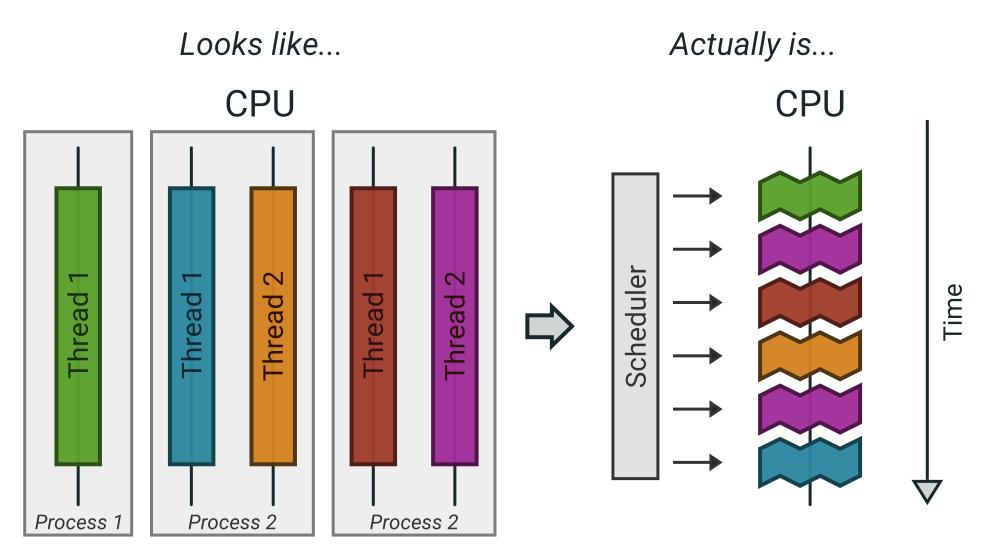
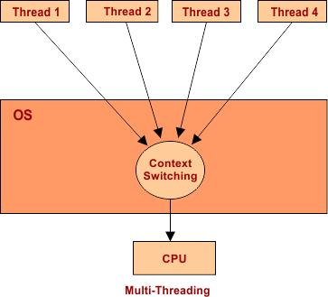
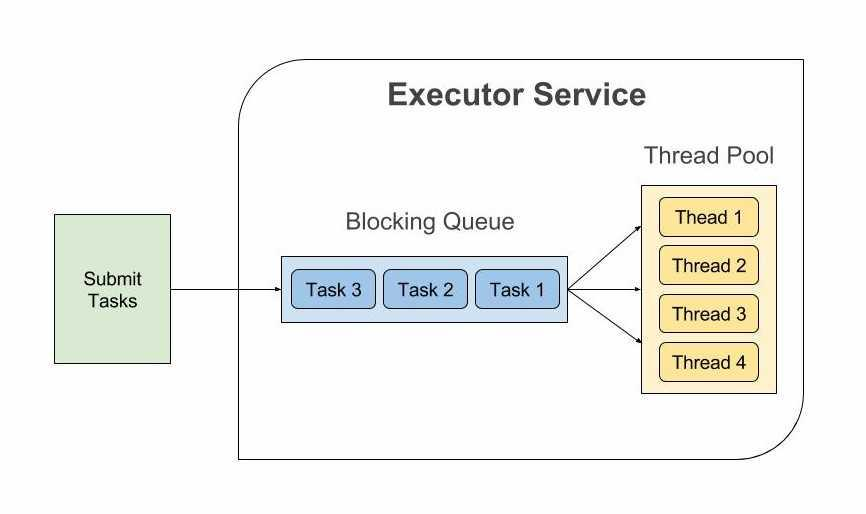

# **13-1.** Thread Pool을 사용한다고 가정하면, 어떤 기준으로 스레드의 수를 결정할 것인가요?

> Note 

## 사전 지식 - CPU 코어란?

# ✅ CPU 코어 쉽게 이해하기

## ✔ 개념

    - CPU 코어는 **실제로 연산을 수행하는 물리적인 처리 장치**

    - 하나의 코어는 **한 번에 하나의 작업을 실행**할 수 있음 (기본 개념)

---

## ✔ 비유

> CPU 코어 = 요리사

스레드 = 주문

    - 요리사(코어)가 4명이면 → 동시에 4개의 요리 가능

    - 주문(스레드)이 100개여도 → 실제로 동시에 처리되는 건 4개뿐

---

# ✅ CPU 코어 vs 스레드 차이

| 구분 | CPU 코어 | 스레드 |
| --- | --- | --- |
| 의미 | 실제 연산 장치 | 실행 단위 |
| 개수 | 물리적으로 제한됨 | 매우 많이 생성 가능 |
| 실행 | 동시에 실행 가능 | 동시에 실행 “요청”만 가능 |
| 관계 | **실행 주체** | **실행 대상** |

---

# ✅ 왜 헷갈릴까?

## ✔ 이유 1: OS가 "동시에 실행되는 것처럼" 보이게 함





    - CPU가 빠르게 작업을 번갈아 수행 (Context Switching)

    - 그래서 여러 스레드가 동시에 실행되는 것처럼 보임

👉 실제로는:

    - 한 코어는 한 순간에 하나의 작업만 실행

---

## ✔ 이유 2: 하이퍼스레딩 (논리 코어)

    - 하나의 물리 코어가 **2개의 스레드처럼 동작**

    - 이를 **논리 코어(Logical Core)**라고 부름

예:

    - 물리 코어 4개 + 하이퍼스레딩 → 논리 코어 8개

👉 이 경우:

```plain text
Runtime.getRuntime().availableProcessors()
```

→ 8이 나올 수 있음

---

## ✔ 정리

| 용어 | 의미 |
| --- | --- |
| 물리 코어 | 실제 CPU 코어 |
| 논리 코어 | OS가 인식하는 실행 단위 |
| 스레드 | 프로그램 실행 단위 |

---

# ✅ Thread Pool에서 왜 CPU 코어를 기준으로 잡을까?

## ✔ CPU-bound 작업 기준

    - CPU가 실제로 동시에 처리 가능한 작업 수 = 코어 수

    - 따라서:

```plain text
스레드 수 ≈ CPU 코어 수
```

---

# 🎯 한 줄 정리

> CPU 코어는 실제로 동시에 작업을 처리할 수 있는 “물리적 실행 단위”이고, 스레드는 그 위에서 실행되는 “작업 단위”다. 따라서 코어 수가 실제 병렬 처리 한계를 결정한다.

## ✅ 핵심 요약

> 스레드 수는 **작업의 성격****(CPU-bound vs I/O-bound)**과 **시스템 자원****(CPU 코어 수)**를 기준으로 결정한다.

> 🍌 여기서 ‘**스레드 수**’란? 

---

  - Thread Pool에서 관리하는 **Worker Thread 개수**

  - 즉, 동시에 작업을 수행할 수 있는 **최대 병렬 처리 수**

---

## 1️⃣ CPU-bound 작업 (연산 중심)

### ✔ 예시

- 이미지/영상 처리

- 암호화, 해싱

- 대량 계산

- 정렬, 압축

- 복잡한 알고리즘 처리

### ✔ 특징

- CPU 연산이 많은 작업 (예: 정렬, 계산, 암호화)

- 스레드가 실행되는 동안 계속 CPU 사용

- I/O 대기 거의 없음

### ✔ 스레드 수 결정 기준

```plain text
스레드 수 ≈ CPU 코어 수
```

### ✔ 이유

- CPU는 동시에 코어 수만큼만 작업 가능

- 스레드가 실행되는 동안 계속 CPU를 사용하기 때문에 어차피 나머지 스레드는 대기

- 스레드를 너무 많이 만들면 **Context Switching 비용 증가**

---

## 2️⃣ I/O-bound 작업 (대기 중심)

> 🍌 대부분의 시간을 요청을 보내고 **외부 응답을 기다리는 데** 사용하는 작업

### ✔ 예시

- DB 조회

- 외부 API 호출

- 파일 읽기/쓰기

- 네트워크 통신

- Redis, Kafka, S3 접근

### ✔ 특징

- 스레드가 대부분 **대기 상태**

### ✔ 스레드 수 결정 기준

```plain text
스레드 수 ≈ CPU 코어 수 × (1 + 대기시간 / 작업시간)
```

_👉 이 공식은 일반적으로 알려진 경험적 모델이지만, __**정확한 값은 상황마다 달라질 수 있음**_

### ✔ 이유

- 대기 중인 스레드 대신 다른 스레드가 CPU 사용 가능

- CPU를 놀리지 않기 위해 더 많은 스레드 필요

---

## 3️⃣ 실무 기준 (가장 중요)

### ✔ 보통 이렇게 접근함

- 초기값 설정 → **부하 테스트 → 튜닝**

- 고정값보다 **동적 조정(ThreadPoolExecutor)** 활용

---

## 4️⃣ Java 기준 예시

```java
// CPU-bound
int nThreads = Runtime.getRuntime().availableProcessors();

// I/O-bound (예시)
int nThreads = Runtime.getRuntime().availableProcessors() * 2;
```

---

## 5️⃣ 추가 고려 요소

### ✔ 메모리

- 스레드 하나당 Stack 메모리 사용

- 너무 많으면 OOM 발생 가능

### ✔ Context Switching

- 스레드 많을수록 오버헤드 증가

### ✔ 작업 큐

- Queue 크기와 정책도 함께 설계 필요

> 🍌 

### 작업 큐 설계? 무슨 뜻이야?

실제 Thread Pool의 전체 구조는

```plain text
요청 → Queue에 적재 → Worker Thread가 꺼내서 처리
```



# ✅ 왜 Queue 설계가 중요할까?

## 상황 예시

    - Thread Pool 스레드: 10개

    - 동시에 요청: 100개

👉 10개는 바로 실행

👉 나머지 90개는 어디로 갈까?

→ **Queue에 쌓인다**

---

# ✅ Queue 크기에 따른 차이

## 1️⃣ Queue가 너무 큰 경우

### ✔ 특징

    - 요청을 계속 쌓아둠 (거의 무한 대기)

### ❌ 문제

    - 응답 지연 증가 (Latency 폭발)

    - 사용자 입장에서는 “느린 서비스”

    - 장애를 늦게 감지

👉 **조용히 죽는 시스템**

---

## 2️⃣ Queue가 너무 작은 경우

### ✔ 특징

    - 금방 꽉 참

### ❌ 문제

    - 요청이 바로 거절됨 (RejectedExecutionException)

    - 트래픽이 조금만 늘어도 실패 발생

👉 **너무 예민한 시스템**

---

# ✅ 대표 Queue 종류

## 1️⃣ LinkedBlockingQueue (거의 무제한)

    - 큐가 사실상 무한

    - 스레드가 잘 안 늘어남

👉 안정적이지만 **지연 증가 위험**

---

## 2️⃣ ArrayBlockingQueue (고정 크기)

    - 큐 크기 제한 있음

    - 일정 수준 이상 요청 → 거절

👉 **Back-pressure(부하 제어)** 가능

---

## 3️⃣ SynchronousQueue (큐 없음)

    - 작업을 바로 스레드에 넘김

    - 스레드 없으면 생성 or 거절

👉 **고성능 / 대신 제어 어려움**

---

# ✅ 거절 정책 (Rejected Policy)

Queue가 꽉 차면 어떻게 할지 정해야 한다.

## 대표 정책

    - AbortPolicy → 예외 발생 (기본)

    - CallerRunsPolicy → 요청한 스레드가 직접 실행

    - DiscardPolicy → 그냥 버림

    - DiscardOldestPolicy → 오래된 작업 버림

---

## 6️⃣ 주의할 점

### ✔ 무작정 많이 만들면 안 된다.

스레드가 너무 많아지면 다음 문제가 생긴다.

- 메모리 사용량 증가

- Context Switching 증가

- DB 커넥션 부족

- 외부 API Rate Limit 초과

- 서버 전체 응답 지연

특히 DB 작업이 많다면 Thread Pool 크기만 늘려도 DB Connection Pool이 병목이 될 수 있다.

예를 들어 스레드가 100개인데 DB 커넥션 풀이 10개라면, 결국 DB에 동시에 접근할 수 있는 작업은 10개뿐이다. 나머지 스레드는 DB 커넥션을 기다리게 된다.

---

## 🎯 한 줄 정리

- CPU-bound → 코어 수만큼

- I/O-bound → 코어 수보다 많게 (대기 시간 고려)

- 최종 결정은 **부하 테스트 기반 튜닝**
