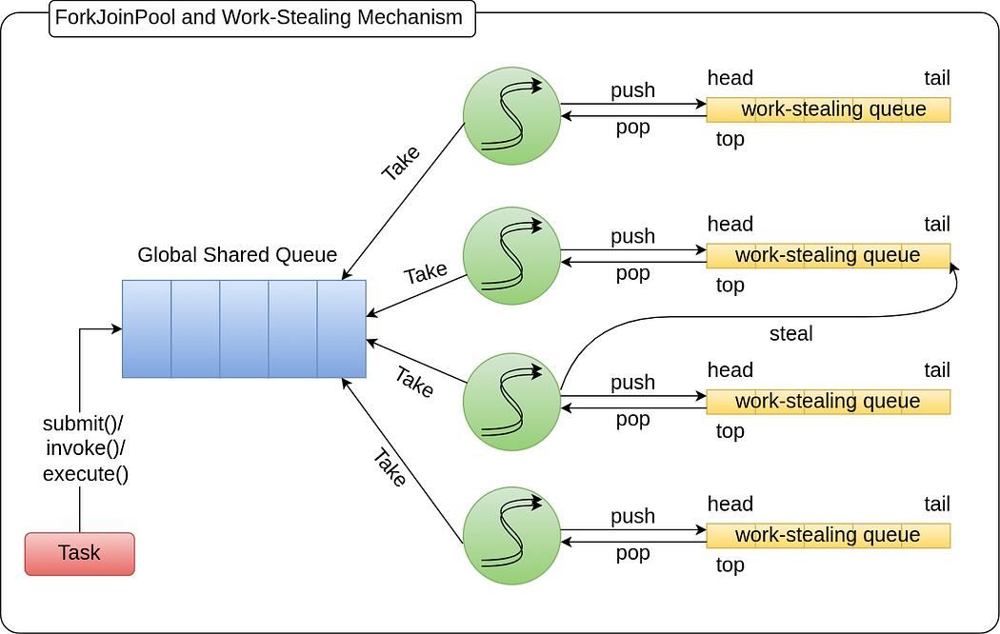
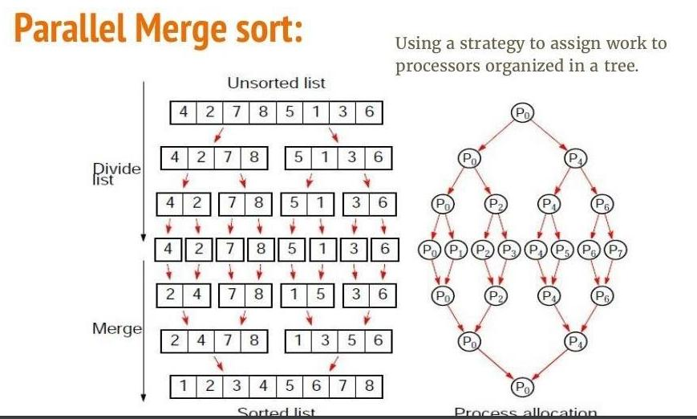

# **13-2.** 어떤 데이터를 정렬 하려고 합니다. 어떤 방식의 전략을 사용하는 것이 가장 안전하면서도 좋은 성능을 낼 수 있을까요?

## ✅ 핵심 결론

> 데이터 크기와 환경에 따라 다르지만,** 일반적으로는 Fork-Join 기반의 병렬 정렬**을 활용하고, **내부적으로는 안정적인 정렬 알고리즘(TimSort 등)을 사용**하는 것이 가장 안전하고 성능이 좋다.

---

# 🌟 1. 왜 이 질문이 나왔는가 (의도)

- Thread Pool → 스레드 관리

- Monitor → 동기화

- Fork-Join → 병렬 처리

👉 이걸 **실제 문제(정렬)에 어떻게 적용할 수 있냐**를 묻는 것

> 🍌 **“정렬이라는 실제 작업에 대해, 멀티스레드 환경에서 어떤 전략을 써야 안정적이고 빠른가?”**

---

# ✅ 2. 단일 스레드 vs 병렬 정렬

## 1️⃣ 단일 스레드 정렬

- TimSort, MergeSort 등 사용

  <details>
  <summary>_TimSort (나도몰라)_</summary>

데이터의 일부가 정렬된 상태인 경우가 많다는 점에 착안하여, 작은 데이터는 삽입 정렬으로 정렬하고, 이를 병합 정렬 방식으로 병합합니다.
  </details>

- 안정적 (Stable)

  - 스레드가 하나 → 동시 접근 문제 없음

  - Race Condition 없음

  - Lock 필요 없음

  - 실행 흐름 단순함

  - Context Switching 거의 없음

👉 “**안전**” 측면에서는 충분히 좋은 선택

---

## 2️⃣ 병렬 정렬 (핵심 포인트)

데이터가 많아지면:

> 👉 “하나의 스레드로 정렬하는 건 비효율적”

그래서:

```plain text
데이터를 나눈다 → 여러 스레드에서 정렬 → 결과를 합친다
```

👉 이게 바로 **Fork-Join 패턴**

---

# ✅ 3. Fork-Join 기반 정렬 전략

## ✔ 구조





```plain text
1. 큰 배열을 반으로 나눔 (Fork)
2. 각각을 병렬로 정렬
3. 결과를 Merge (Join)
```

---

> Note 

# ❓ Merge Sort vs Fork-Join 병렬 정렬 차이

---

## ✅ 핵심 결론

> Merge Sort는 **단일 스레드 기반 분할 정복 알고리즘**이고,

Fork-Join 정렬은 **그 구조를 그대로 유지하면서 병렬로 실행하는 방식**이다.

---

# ✅ 1. 구조는 동일하다 (매우 중요)

두 알고리즘은 **본질적으로 같은 알고리즘 구조**를 가진다.

```plain text
Divide → Conquer → Merge
```

즉,

```plain text
1. 데이터를 나눈다
2. 각각 정렬한다
3. 결과를 합친다
```

👉 이 부분은 완전히 동일

---

# ✅ 2. 가장 큰 차이: 실행 방식

## 🔹 Merge Sort (단일 스레드 🌟)

```plain text
왼쪽 정렬 → 끝나면 → 오른쪽 정렬 → 끝나면 → 병합
```

👉 **순차 실행**

---

## 🔹 Fork-Join 병렬 정렬

```plain text
왼쪽 정렬  ↘
             → 동시에 실행 → 병합
오른쪽 정렬 ↗
```

👉 **병렬 실행**

---

## 📊 비교

| 구분 | Merge Sort | Fork-Join 정렬 |
| --- | --- | --- |
| 실행 방식 | 순차 | 병렬 |
| 스레드 | 1개 | 여러 개 |
| CPU 활용 | 1코어 | 멀티코어 |
| 시간복잡도 | O(n log n) | O(n log n) |
| 실행 시간 | 상대적으로 느림 | 더 빠름 (대용량) |

---

# ✅ 3. “물리적 시간” 차이가 핵심 맞냐?

👉 **맞다. 핵심은 물리적 실행 시간이다.**

## ✔ 이유

```plain text
총 작업량: 동일 (n log n)
```

하지만:

```plain text
Merge Sort → 1명이 전부 수행
Fork-Join → 여러 명이 나눠서 수행
```

---

## ✔ 직관적 예시

```plain text
작업량: 100

단일 스레드 → 100초
4코어 병렬 → 약 25초 (이상적인 경우)
```

👉 그래서 실제 실행 시간이 줄어든다

---

## ✔ 왜 좋은가?

### 1. 병렬 처리 → 성능 향상

- 여러 CPU 코어 활용

### 2. 안정성 유지 가능

- MergeSort 기반이면 Stable

  - Stable: 같은 값을 가진 데이터의 **기존 순서를 유지**

  - “여러 스레드가 나눠서 정렬하면 순서가 깨지는 거 아닌가?”

  - Fork-Join이라도 내부가 MergeSort 기반이면, 병합 단계에서 순서를 지키기 때문에 Stable을 유지할 수 있다.

```plain text
왼쪽: [A(20), B(20)]
오른쪽: [C(20), D(20)]

→ merge 시:
왼쪽 값 먼저 사용 → 순서 유지
```

### 3. Work Stealing (작업 훔치기)

- `문제 상황` 병렬 처리에서 가장 흔한 문제: 일부 스레드만 계속 일하고 나머지는 논다!

- `해결` Work Stealing

  - 놀고 있는 스레드가 작업 가져감 → CPU 활용 극대화, 전체 실행 시간 감소

---

### 📍데이터가 작다면 일반 정렬이 더 낫다

>  병렬 정렬은 다음과 같은 추가 비용이 있기 때문

- 작업을 나누는 비용

- 스레드에 작업을 배분하는 비용

- 결과를 다시 합치는 비용

- 스레드 간 작업 관리 비용

즉, 데이터가 작으면 병렬 처리의 이점보다 오버헤드가 더 클 수 있다.

---

# ✅ 4. Thread Pool과의 연결

- **ForkJoinPool **= java에서 특화된 Thread Pool

- 일반 Thread Pool보다 **병렬 분할 작업에 최적화**

| 구분 | 일반 Thread Pool | ForkJoinPool |
| --- | --- | --- |
| 작업 형태 | 독립적인 작업 | 분할 정복 구조 |
| 큐 구조 | 하나의 공용 큐 | 스레드별 deque |
| 특징 | 단순 작업 처리 | Work Stealing |

👉 즉, **재귀적으로 쪼개지는 작업**에 최적화

👉 단순 Thread Pool로 정렬을 나누는 것보다 Fork-Join이 훨씬 효율적

---

# ✅ 5. Monitor(동기화) 관점

- `단일 스레드 정렬` 각 스레드가 **독립된 데이터 영역**을 처리

- `병렬 정렬` 각 스레드가 서로 다른 영역만 수정하도록 잘 설계

👉 그래서:

> Monitor(lock)를 거의 안 써도 된다

---

### ❗ 중요한 포인트

- 락을 많이 쓰면 → 병렬성 깨짐

- 성능 급격히 저하

👉 그래서:

> “데이터를 나눠서 lock 없이 처리”가 핵심 전략

---

# ✅ 6. 실무에서의 선택

## ✔ Java 기준

```java
Arrays.sort()          // 단일 스레드 (TimSort)
Arrays.parallelSort()  // Fork-Join 기반 병렬 정렬
```

---

## ✔ 선택 기준

| 상황 | 전략 |
| --- | --- |
| 데이터 작음 | 일반 정렬 |
| 데이터 큼 | 병렬 정렬 |
| 안정성 중요 | Merge / TimSort |
| 멀티코어 활용 | Fork-Join |

---

# 🎯 면접용 답변

> 정렬에서는 안정성과 성능을 모두 고려해야 합니다. 일반적으로는 TimSort와 같은 검증된 라이브러리 정렬을 사용하는 것이 안전합니다. 하지만 데이터가 큰 경우에는 단일 스레드로 처리하기보다 Fork-Join 기반의 병렬 정렬을 사용하는 것이 더 효율적입니다. 이 방식은 데이터를 분할하여 여러 스레드에서 동시에 정렬한 뒤 병합하는 구조로, CPU 코어를 효과적으로 활용할 수 있습니다. 또한 각 스레드가 독립된 데이터를 처리하도록 설계하면 Monitor 기반의 동기화를 최소화할 수 있어 성능 저하를 방지할 수 있습니다.

---

# 🎯 한 줄 정리

> 정렬은 기본적으로 안정적인 알고리즘을 사용하되, 대용량 데이터에서는 Fork-Join 기반 병렬 처리로 성능을 극대화하고, 동기화는 최소화하는 것이 최적 전략이다.
