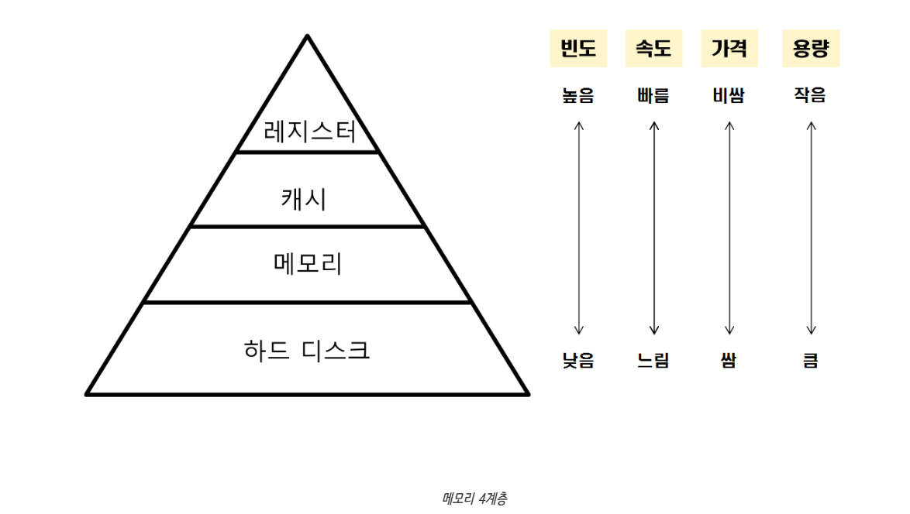
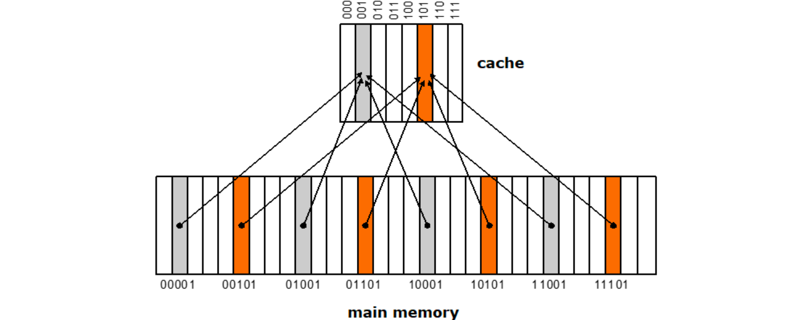

# 14-6. 캐시의 지역성에 대해 설명해주세요.

## 0. 캐시 메모리와 지역성

CPU가 매번 RAM에 접근하면 대부분의 시간을 대기

그래서 자주 사용하는 데이터를 가까운 곳(Cache)에 저장하는데, 문제는

> 어떤 데이터를 캐시에 넣어야 하는가?

여기서 등장하는 개념이 **지역성(Locality)**



속도가 빠른 장치와 느린 장치간의 속도차에 따른 병목 현상을 줄이기 위한 범용 메모리로,

주기억장치(RAM, 메모리)에서 자주 사용하는 프로그램과 데이터를 저장해두어 처리 속도를 빠르게 한다.

CPU 속도는 매우 빠르지만 메인 메모리(RAM)는 상대적으로 느림

예를 들어

```plain text
L1 Cache  : 수 ns 이하
L2 Cache  : 수 ns
L3 Cache  : 수십 ns
RAM       : 수십~수백 ns
```

---

## 1. 캐시 매핑

**Mapping의 3가지 방법**

- **직접 매핑(Direct Mapping) : 주로 캐시 메모리가 대용량인 경우에 사용**



주기억장치의 블록들이 지정된 한 개의 캐시 라인으로만 사상될 수 있는 매핑 방법

> 

메모리의 특정 블록을 특정 캐시에만 매핑하는 것

예를들어 메모리의 주소가 1~100까지 있고 캐시의 주소가 1~10까지 있다고 하면, 1~10까지의 주소는 1에, 11~20까지의 주소는 2에, ... 91~100까지의 주소는 10에 매핑하는 방식

간단하고 구현하는 비용이 적다는 장점이 있지만 캐시 적중률이 낮아질 수 있음

```plain text
→ 캐시 적중률이 낮아지는 이유 : 

  특정 동일한 캐시 블록에 매핑되는 다른 메모리 블록을 번갈아 참조할 때 블록 충돌이 발생
```

- **연관 매핑(Associate Mapping) : **

직접 매핑 방식의 단점을 보완한 방식

> 순서를 일치시키지 않고 관련있는 캐시와 메모리를 매핑하는 것으로, 메모리의 컨텐츠가 캐시의 어느 위치에도 올라갈 수 있음

모든 태그들을 병렬로 검사하기 때문에 복잡하고 비용이 높다는 단점 때문에 거의 사용하지 않음

- **집합 연관 매핑(Set Associate Mapping) : **

직접 매핑과 연관 매핑의 장점만을 취한 방식

> 

순서를 일치시키고 저장하되 일정 그룹을 두어 그 그룹 내에서 연관매핑

예를들어 1~100까지 메모리 주소가 있고 캐시가 1~10까지 있다면, 1~50의 데이터는 1~5에, 51~100은 6~10에 무작위로 저장하는 방식

블록화가 되어있기 때문에 검색은 좀 더 효율적으로 되면서, 직접매핑처럼 저장위치에 제약이 있지 않으므로 적중률이 크게 떨어지지도 않음

정해진 블록의 집합내 어디서든 매핑이 가능

⇒ 주 기억장치와 CPU 사이에 위치해, `메모리 계층 구조에서 가장 빠른 소자`로 CPU와 비슷한 속도인

캐시메모리를 사용하면, 주기억장치를 접근하는 횟수가 줄어들어 컴퓨터 처리속도가 향상된다.

> 💡 즉, 캐시메모리의 역할을 제대로 수행하기 위해서는 

**“CPU가 어떤 데이터를 원할 것인가”**를 어느 정도 예측할 수 있어야 한다.

캐시의 성능은 작은 용량의 캐시 메모리에 CPU가 이후에 참조할, 쓸모 있는 정보가 어느 정도

들어있느냐에 따라 좌우되기 때문이다.

---

## 2. 캐시의 지역성

**적중률(Hit - rate)을 극대화**시키기 위해 데이터 지역성을 사용하며, **시간적 & 공간적 접근**이 존재함

지역성의 전제조건은 아래와 같음

> 프로그램은 모든 코드나 데이터를 균등하게 Access 하지 않는다는 특성

즉, **Locality**란 기억장치 내 정보를 균일하게 엑세스 하는 것이 아닌, **어느 한 순간에 특정 부분을 집중적으로 참조**하는 특성인 것이다.

**쉽게 말하자면, “과거 접근 패턴을 보면 미래 접근도 어느정도 예측 가능하다” 는 발상에서 출발하여, 프로그램이 무작위로 메모리에 접근하지 않고 특정 패턴을 가진다는 경험적 법칙**

- **캐시 적중(Cache Hit)** : CPU가 액세스하려는 데이터가 이미 캐시에 적재되어있는 상태

- **캐시 미스(Cache Miss)** : CPU가 액세스하려는 데이터가 캐시에 없어 주기억장치로부터 인출해 와야하는 상태

- **캐시 적중률(Cache Hit rate)** : CPU가 원하는 데이터가 캐시에 있을 확률.캐시에 적중되는 횟수 / 전체 기억장치 액세스 횟수

- **미스율(Miss rate)** : CPU가 원하는 데이터가 캐시에 없을 확률1-(Cache Hit rate)

---

## 3. 캐시 지역성의 종류


### 시간적 지역성(Temporal Locality)

예시:

```java
for(inti=0;i<1000000;i++) {
	sum+=arr[0];
}
=> arr[0]을 계속 사용하므로 캐시에 저장해두면 반복적으로 메모리(RAM) 접근할 필요가 X
```

메모리 상의 같은 주소에 여러 차례 읽기 쓰기를 수행할 경우, 상대적으로 작은 크기의 캐시를 사용해도 효율성을 꾀할 수 있음

### 실제 사례

```java
while(true){
lock.acquire();
    ...
}
```

락 변수 `lock`은 반복적으로 참조되므로, CPU는 이를 캐시에 유지하려고 함

### 공간적 지역성(Spatial Locality)

공간적 지역성은 기억장치 내에 서로 인접하여 저장되어 있는 데이터들이 연속적으로 액세스 될 가능성이 높아지는 특성

예시

```java
for(inti=0;i<arr.length;i++) {
	sum+=arr[i];
}
=> arr[0] 다음에 arr[1], arr[2]를 읽을 가능성이 높기 때문에 주변 데이터까지 함께 가져옴
```

CPU 캐시나 디스크 캐시의 경우 한 메모리 주소에 접근할 때 그 주소뿐 아니라 해당 블록을 전부 캐시

이때 메모리 주소를 오름차순이나 내림차순으로 접근한다면, 캐시에 이미 저장된 같은 블록의 데이터를 접근하게 되므로 캐시의 효율성이 크게 향상
