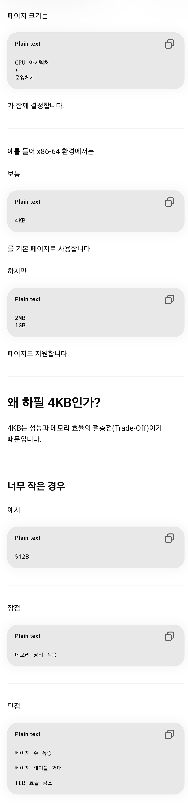

# 17-3. 페이지 크기에 대한 Trade-Off를 설명해 주세요.

<details>
<summary>Trade-off란?</summary>

어떤 선택을 했을 때 얻는 이점(Benefit)과 잃는 비용(Cost)이 동시에 존재하는 관계를 의미한다.

즉,

> "하나를 얻으면 다른 하나를 포기해야 하는 관계"

를 Trade-Off라고 한다.
</details>

<details>
<summary>페이지 크기 정의 기준</summary>

```plain text
CPU 아키텍처
+
운영체제
```

가 함께 지정


</details>

## 개요

가상 메모리(Virtual Memory)는 프로세스가 사용하는 논리 주소 공간을 일정한 크기의 **페이지(Page)** 단위로 나누어 관리한다.

이때 운영체제는 페이지 크기를 미리 정해두는데, 페이지 크기가 너무 크거나 너무 작으면 각각 장단점이 존재한다.

따라서 운영체제는 **메모리 효율성**, **페이지 테이블 크기**, **TLB 효율성**, **입출력 성능** 등을 고려하여 적절한 페이지 크기를 선택한다.

---

## 페이지 크기가 작은 경우

### 장점

### 1. 내부 단편화(Internal Fragmentation) 감소

페이지는 고정 크기이므로 실제 사용하는 메모리보다 더 큰 페이지가 할당될 수 있다.

예를 들어

- 페이지 크기 : 4KB

- 필요한 공간 : 3KB

이면 1KB가 낭비된다.

페이지 크기가 작아질수록 이러한 낭비 공간이 줄어든다.

```plain text
페이지 크기 4KB → 최대 4KB 낭비
페이지 크기 1KB → 최대 1KB 낭비
```

<details>
<summary>내부 단편화와, 외부 단편화에 대해 설명해 주세요.</summary>

내부 단편화(Internal Fragmentation)는 고정 크기의 메모리 블록을 할당할 때, 블록보다 작은 크기의 프로세스가 할당되어 **블록 내부에 빈 공간이 발생하는 현상**입니다.
외부단편화(External Fragmentation)는 **서로 크기가 다른 메모리 블록들이 불규칙하게 배치되어 메모리 공간을 낭비하는 현상**입니다. 이는 동적 메모리 할당에서 발생하며, 메모리 할당과 해제가 반복되면서 발생할 수 있습니다.
</details>

---

### 2. 메모리 활용도 향상

실제로 필요한 데이터만 적재할 수 있다.

특히 프로그램의 일부만 사용하는 경우 효율적이다.

---

### 단점

### 1. 페이지 테이블 크기 증가

같은 메모리 공간을 표현하기 위해 더 많은 페이지가 필요하다.

예시

```plain text
가상 주소 공간 : 4GB

페이지 크기 4KB
→ 약 100만 개 페이지

페이지 크기 2MB
→ 약 2천 개 페이지
```

페이지 수가 증가하면 페이지 테이블도 커진다.

<details>
<summary>페이지 테이블</summary>

정의

페이지와 프레임의 매핑 정보를 저장하는 자료구조

예시

```plain text
Page 0 → Frame 4
Page 1 → Frame 8
Page 2 → Frame 3
```

CPU가

`주소 0x1234`를 접근하면 페이지 테이블을 조회하여 `실제 RAM 주소`를 찾는다.
</details>

---

### 2. TLB Miss 증가

> 💡 **TLB Miss :** TLB 안에 원하는 정보가 없는 경우

TLB는 최근 사용한 페이지 매핑 정보를 저장하는 캐시이다.

페이지 크기가 작으면 동일한 메모리 범위를 표현하기 위해 더 많은 페이지 엔트리가 필요하다.

결과적으로

- TLB에 저장 가능한 범위 감소

- TLB Miss 증가

- 성능 저하

가 발생할 수 있다.

<details>
<summary>**TLB는 무엇인가요?**</summary>

TLB(Translation Lookaside Buffer)는 **가상 주소와 실제 물리 주소 간의 변환 정보를 저장하고 있는 캐시**입니다.
프로세스가 가상 주소를 참조할 때마다, 해당 주소가 메모리 상 어디에 위치하는지 실제 주소로 변환해야 합니다.
TLB는 이러한 변환을 빠르게 수행하여 메모리 액세스 속도를 향상시키며, 페이지 테이블과 같은 대용량의 메모리를 사용하지 않고도 변환 정보를 저장하고 검색할 수 있습니다.
TLB는 **캐시형태로 구현되며, 하드웨어에서 지원하므로 속도가 빠르고 성능상 이점이 크다는 장점**이 있습니다.

## 정의

페이지 테이블을 캐싱하는 특수한 캐시 메모리

**왜 필요한가?**

CPU가 메모리에 접근할 때마다

```plain text
1. 페이지 테이블 조회

2. 실제 데이터 조회
```

를 하면 너무 느리다.

---

그래서

최근 사용한 주소 변환 결과를

TLB에 저장한다.

---

예시

```plain text
TLB

Page 0 → Frame 4
Page 1 → Frame 8
Page 2 → Frame 3
```

---

CPU가

```plain text
Page 1
```

을 다시 요청하면

페이지 테이블을 안 보고

TLB에서 바로 찾는다.
</details>

---

### 3. 페이지 교체 오버헤드 증가

프로세스가 실행되는 동안 더 많은 페이지를 관리해야 하므로

- 페이지 교체(Page Replacement)

- 페이지 폴트(Page Fault)

관리 비용이 증가한다.

---

## 페이지 크기가 큰 경우

### 장점

### 1. 페이지 테이블 크기 감소

더 적은 수의 페이지로 동일한 주소 공간을 표현할 수 있다.

예시

```plain text
4GB 메모리

4KB 페이지
→ 약 100만 페이지

2MB 페이지
→ 약 2천 페이지
```

페이지 테이블 메모리 사용량이 크게 줄어든다.

---

### 2. TLB 효율 향상

TLB 엔트리 하나가 더 넓은 주소 공간을 커버한다.

따라서

- TLB Hit Rate 증가 (TLB Hit : TLB 안에 원하는 매핑 정보가 존재하는 경우)

- 주소 변환 비용 감소

효과를 얻을 수 있다.

---

### 3. 디스크 I/O 효율 증가

페이지 폴트 발생 시 한 번에 더 많은 데이터를 읽어온다.

순차 접근이 많은 경우

- 디스크 접근 횟수 감소

- I/O 성능 향상

효과가 있다.

---

### 단점

### 1. 내부 단편화 증가

사용하지 않는 공간이 많아질 수 있다.

(할당된 공간 내부에 사용하지 못하는 빈 공간이 생기는 현상)

예시

```plain text
페이지 크기 : 2MB
실제 사용 : 1.2MB

0.8MB 낭비
```

---

### 2. 불필요한 데이터 적재

실제로 사용하지 않는 데이터까지 함께 메모리에 적재될 수 있다.

```plain text
필요한 데이터 : 100KB

페이지 크기 : 2MB

→ 1.9MB 이상 불필요하게 적재
```

메모리 효율이 떨어질 수 있다.

---

### 3. 페이지 폴트 비용 증가

<details>
<summary>페이지 폴트</summary>

프로세스가 요청한 페이지가 현재 메모리에 없는 상태

---

예시

```plain text
크롬 실행

사용자가 설정 페이지 진입

↓

설정 관련 페이지가 RAM에 없음

↓

디스크에서 읽어옴
```

---

이 과정이 Page Fault이다.
</details>

페이지 하나가 크므로

페이지 폴트 발생 시

- 디스크 읽기 시간 증가

- 메모리 적재 시간 증가

문제가 발생할 수 있다.

---

## 비교 정리

| 항목 | 페이지 크기 작음 | 페이지 크기 큼 |
| --- | --- | --- |
| 내부 단편화 | 적음 | 많음 |
| 페이지 테이블 크기 | 큼 | 작음 |
| TLB 효율 | 낮음 | 높음 |
| 페이지 수 | 많음 | 적음 |
| 메모리 활용도 | 높음 | 낮음 |
| I/O 효율 | 낮음 | 높음 |
| 페이지 폴트 비용 | 낮음 | 높음 |

---

## 실제 운영체제는 어떻게 사용할까?

현대 운영체제는 하나의 페이지 크기만 사용하지 않는다.

대표적으로 Linux와 Windows는

- 기본 페이지 (4KB)

- Huge Page (2MB)

- Giant Page (1GB)

등을 함께 사용한다.

이를 통해

- 일반 데이터 → 작은 페이지

- 대용량 데이터베이스

- 머신러닝 모델

- 메모리 집약적 서버

등에는 Huge Page를 사용하여 성능을 최적화한다.

---

## 면접 답변 예시

> 페이지 크기는 메모리 효율성과 성능 사이의 Trade-Off가 존재합니다. 페이지 크기가 작으면 내부 단편화가 줄어들어 메모리 활용도는 높아지지만, 페이지 수가 많아져 페이지 테이블 크기가 커지고 TLB 효율이 감소합니다. 반대로 페이지 크기가 크면 페이지 테이블 크기와 TLB Miss는 줄어들지만 내부 단편화가 증가하고 불필요한 데이터가 함께 적재될 수 있습니다. 따라서 운영체제는 일반적으로 4KB 페이지를 기본으로 사용하고, 데이터베이스나 AI 모델처럼 큰 메모리 공간을 사용하는 경우에는 Huge Page를 활용하여 성능을 최적화합니다.
