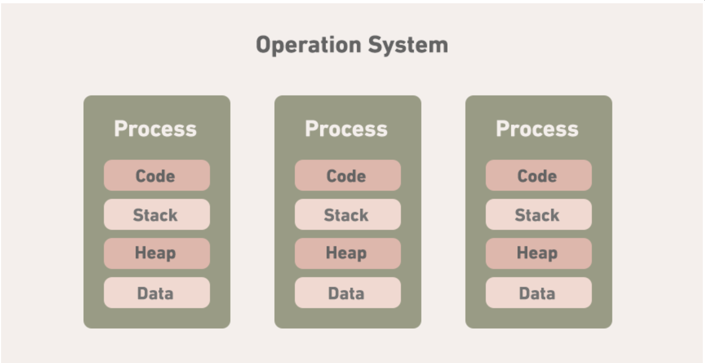
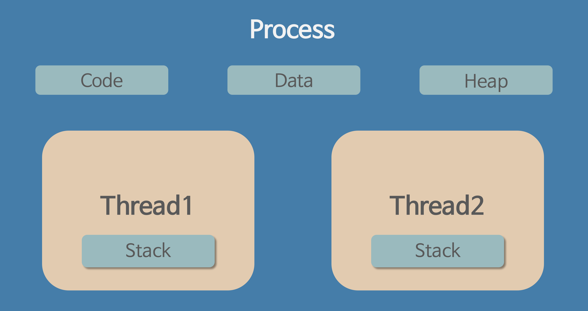

# **3-1.** 프로그램과 프로세스, 스레드의 차이에 대해 설명해 주세요.

# 📦 프로그램 vs 프로세스 vs 스레드

## 1️⃣ 프로그램 (Program)

### 📌 개념

프로그램은 **디스크에 저장된 실행 파일**이다.

즉,

👉 아직 실행되지 않은 **정적인 코드 집합**

예

- `chrome.exe`

- `java 프로그램`

- `python script`

프로그램은 단순히 **명령어와 데이터가 저장된 파일**일 뿐이며

CPU가 실행하기 전까지는 **시스템 자원을 사용하지 않는다.**

---

### 📌 특징

- **정적(static) 상태**

- 디스크에 저장됨

- 실행되기 전 상태

- 시스템 자원 사용하지 않음

---

## 2️⃣ 프로세스 (Process)

### 📌 개념

프로세스는 **실행 중인 프로그램**이다.

즉,

👉 프로그램이 **메모리에 적재되어 CPU의 할당을 받은 작업의 단위**

프로그램이 실행되면 운영체제는

- 메모리 공간 할당

- CPU 스케줄링 대상 등록

- 프로세스 관리 정보 생성

이 과정을 통해 **프로세스가 생성된다.**

---

### 📌 프로세스 구성 요소

프로세스는 다음과 같은 메모리 영역을 가진다.



```plain text
Process Memory Structure

Code (Text)   : 실행 코드
Data          : 전역 변수
Heap          : 동적 메모리
Stack         : 함수 호출 정보
```

또한 운영체제는 **PCB(Process Control Block)** 을 통해

프로세스 상태를 관리한다.

🔜 PCB

---

### 📌 특징

- **동적(dynamic) 상태**

- 메모리 공간을 가짐

- 운영체제가 관리

- CPU 스케줄링 대상

---

## 3️⃣ 스레드 (Thread)

### 📌 개념

스레드는 **프로세스 내부에서 실행되는 작업 흐름의 단위**이다.

즉,

👉 **CPU가 실제로 스케줄링하는 실행 단위**

하나의 프로세스는 **여러 개의 스레드를 가질 수 있다.**



---

### 📌 특징

스레드는 프로세스 내부 자원을 **공유**한다.

공유 자원

- 코드 영역

- 데이터 영역

- 힙

개별 자원

- 스택

- 레지스터

---

### 📌 구조 예시

```plain text
Process
 ├ Thread 1
 ├ Thread 2
 └ Thread 3
```

---

## 4️⃣ 프로그램 vs 프로세스 vs 스레드 비교

| 구분 | 프로그램 | 프로세스 | 스레드 |
| --- | --- | --- | --- |
| 의미 | 실행 파일 | 실행 중인 프로그램 | 실행 흐름 단위 |
| 상태 | 정적 | 동적 | 동적 |
| 위치 | 디스크 | 메모리 | 프로세스 내부 |
| 자원 | 없음 | 독립 자원 보유 | 자원 공유 |
| 스케줄링 | 대상 아님 | 대상 | 실제 실행 단위 |

---

## 5️⃣ 관계 정리

전체 관계는 다음과 같다.

```plain text
Program (실행 파일)
      ↓ 실행
Process (실행 중인 프로그램)
      ↓ 내부 실행 단위
Thread (작업 흐름)
```

---

## 📌 핵심 정리

- **프로그램**은 디스크에 저장된 실행 파일

- **프로세스**는 실행 중인 프로그램

- **스레드**는 프로세스 내부의 실행 흐름 단위

- 하나의 프로세스는 **여러 스레드를 가질 수 있으며 자원을 공유한다**
