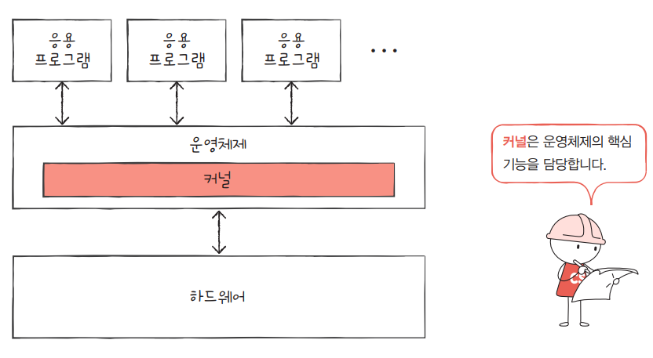
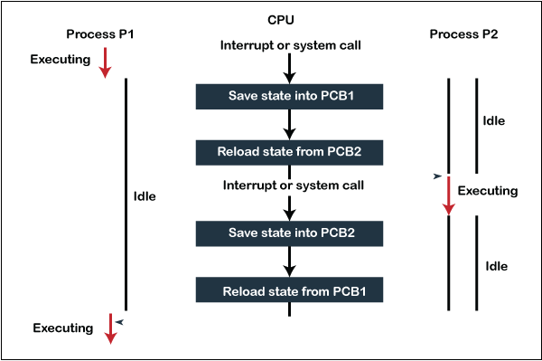

# **3-2. PCB(Process Control Block)가 무엇인가요?**

# PCB (Process Control Block)

**PCB(Process Control Block, 프로세스 제어 블록)**는

**운영체제가 프로세스를 관리하기 위해 필요한 정보를 저장하는 커널 내부의 자료구조**이다.

또한 **TCB(Task Control Block)** 또는 **작업 제어 블록**이라고도 불린다.

- 각 프로세스가 생성될 때 **운영체제는 해당 프로세스를 관리하기 위한 PCB를 생성**한다.

- 프로세스가 종료되면 **PCB도 함께 제거된다.**

- PCB는 **운영체제 커널 영역의 메모리**에 존재하며, 프로세스 상태 관리에 사용된다.

- 특히 **문맥 교환(Context Switching)** 시 현재 프로세스의 CPU 상태(레지스터, 프로그램 카운터 등)를 PCB에 저장하고, 다음 실행할 프로세스의 PCB 정보를 불러와 실행한다.

즉,

> PCB는 **운영체제가 프로세스의 상태를 관리하고 스케줄링을 수행하기 위해 사용하는 핵심 자료구조**이다.

**각 프로세스는 인터럽트가 발생하면 자신의 정보를 메모리에 백업해두고 다른 프로세스의 CPU의 자원 사용을 위해 대기큐를 거쳐 준비큐로 들어갑니다. 이처럼 프로세스를 관리하는 것은 운영체제인데, 운영체제가 프로세스의 관리를 용이하게 하기 위해 프로세스의 정보를 담은 구조체를 PCB라고 합니다. 따라서 PCB는 커널에서 관리를 하며 프로세스의 ID, 레지스터의 정보, 프로세스의 상태, CPU 스케쥴링 정보 등을 갖고 있습니다.**

# PCB에 저장되는 정보

PCB에는 운영체제가 **프로세스를 관리하고 실행 상태를 유지하기 위해 필요한 다양한 정보**가 저장된다.

### 1️⃣ 프로세스 식별 정보 (Process Identification)

- **PID(Process ID)** 와 같은 고유 식별자

- 부모 프로세스 ID (PPID)

- 사용자 ID 등

→ 운영체제가 **프로세스를 구분하기 위한 정보**

---

### 2️⃣ 프로세스 상태 (Process State)

프로세스의 현재 실행 상태

- 생성 (New)

- 준비 (Ready)

- 실행 (Running)

- 대기 (Waiting / Blocked)

- 종료 (Terminated)

→ **스케줄러가 프로세스를 관리하기 위한 상태 정보**

---

### 3️⃣ 프로그램 카운터 (Program Counter)

- **다음에 실행할 명령어의 주소**

→ 프로세스가 다시 CPU를 할당받았을 때 **어디부터 실행해야 하는지 알기 위한 정보**

---

### 4️⃣ CPU 레지스터 정보 (CPU Registers)

- 레지스터 값

- 스택 포인터

- 기타 CPU 상태 정보

→ **Context Switching 시 저장되고 복원되는 정보**

---

### 5️⃣ CPU 스케줄링 정보

- 프로세스 우선순위

- 스케줄링 큐 포인터

- 스케줄링 정책 관련 정보

→ **CPU 할당 순서를 결정하기 위한 정보**

---

### 6️⃣ 메모리 관리 정보

- 페이지 테이블

- 세그먼트 테이블

- 메모리 할당 정보

→ 프로세스가 사용하는 **주소 공간 관리 정보**

---

### 7️⃣ 계정 정보 (Accounting Information)

- CPU 사용 시간

- 실제 실행 시간

- 사용자 정보

- 계정 정보

→ **시스템 자원 사용량 관리**

---

### 8️⃣ I/O 상태 정보

- 프로세스에 할당된 I/O 장치

- 열린 파일 목록 (Open File List)

- 파일 디스크립터

→ **입출력 자원 관리**

---

| 분류 | 저장 정보 | 설명 |
| --- | --- | --- |
| **프로세스 식별 정보** | PID, PPID, 사용자 ID | 프로세스를 구분하기 위한 고유 식별 정보 |
| **프로세스 상태 정보** | 생성, 준비, 실행, 대기, 종료 상태 | 현재 프로세스의 실행 상태 |
| **CPU 상태 정보** | Program Counter, CPU Register, Stack Pointer | 프로세스 실행 상태 저장 (Context Switch 시 사용) |
| **CPU 스케줄링 정보** | 우선순위, 스케줄링 큐 포인터, 스케줄 정책 | CPU 할당을 위한 스케줄링 관련 정보 |
| **메모리 관리 정보** | 페이지 테이블, 세그먼트 테이블, 주소 공간 정보 | 프로세스가 사용하는 메모리 관리 |
| **I/O 및 파일 정보** | 열린 파일 리스트, 할당된 I/O 장치 | 입출력 장치 및 파일 관리 |
| **계정 및 자원 사용 정보** | CPU 사용 시간, 실행 시간, 사용자 정보 | 자원 사용량 및 회계 정보 |
| **프로세스 권한 정보** | 자원 접근 권한 | 시스템 자원 및 I/O 접근 권한 |

# 한 문장 정리 (면접용)

> PCB에는 프로세스 식별자, 프로세스 상태, 프로그램 카운터, CPU 레지스터, CPU 스케줄링 정보, 메모리 관리 정보, 계정 정보, I/O 상태 정보 등이 저장되어 운영체제가 프로세스를 관리하고 Context Switch 시 상태를 복원할 수 있도록 합니다.

### 핵심 포인트

프로세스가 **context switching** 될 때

CPU 상태를

- PCB에 **저장**

- 다음 프로세스 PCB에서 **복원**

합니다.

👉 그래서 **PCB는 context switch의 핵심 자료구조**입니다.

💡 참고로 CS 질문에서 **PCB 다음에 거의 100% 나오는 질문**이 있습니다.

### 1️⃣ **Context Switch 과정 설명해보세요**

**Context Switch**는

> CPU가 현재 실행 중인 프로세스의 실행 상태(Context)를 저장하고,

다른 프로세스의 실행 상태를 복원하여 CPU를 전환하는 과정입니다.

운영체제는 **멀티태스킹 환경에서 여러 프로세스를 번갈아 실행**하기 때문에 Context Switch가 필요합니다.

### Context Switch 과정

  1. 현재 실행 중인 프로세스의 **CPU 상태 저장**

    - Program Counter

    - CPU Register

    - Stack Pointer

→ **현재 프로세스의 PCB에 저장**

  1. 다음 실행할 프로세스 선택

→ **스케줄러가 Ready Queue에서 선택**

  1. 선택된 프로세스의 상태 복원

→ **PCB에 저장된 CPU 상태를 CPU로 복원**

  1. 선택된 프로세스 실행

---

### 한 문장 정리 (면접용)

> Context Switch는 CPU가 현재 프로세스의 상태를 PCB에 저장하고, 다음 프로세스의 상태를 PCB에서 복원하여 CPU 실행을 전환하는 과정입니다.

### 2️⃣ **Process Context Switch vs Thread Context Switch 차이**

핵심 차이는 **공유 자원 여부**입니다.

| 구분 | Process Context Switch | Thread Context Switch |
| --- | --- | --- |
| 주소 공간 | 변경됨 | 동일 |
| 메모리 | 완전히 다른 메모리 | Code/Data/Heap 공유 |
| PCB / TCB | PCB 교체 | TCB 교체 |
| 비용 | 높음 | 낮음 |

### 이유

프로세스는

  - 주소 공간

  - 페이지 테이블

  - 메모리

를 모두 바꿔야 합니다.

하지만 스레드는

  - 같은 프로세스 내부

  - 메모리 공유

그래서

👉 **레지스터 + 스택만 바꾸면 됩니다.
**

### 한 문장 정리

> 프로세스 Context Switch는 주소 공간과 메모리 정보를 함께 교체해야 하므로 비용이 크고, 스레드 Context Switch는 같은 프로세스의 메모리를 공유하기 때문에 레지스터와 스택만 교체하면 되어 비용이 더 낮습니다

### 3️⃣ **왜 Thread가 더 빠른가**

스레드가 빠른 이유는 **자원 공유 때문입니다.**

프로세스는

  - 메모리

  - 페이지 테이블

  - 커널 구조

까지 교체해야 합니다.

하지만 스레드는 같은 프로세스 안에서

  - Code

  - Data

  - Heap

  - File

을 **공유**합니다.

그래서 Context Switch 시

바뀌는 것은

  - Program Counter

  - Register

  - Stack

정도입니다.

즉

> 스레드는 자원을 공유하기 때문에 Context Switch 비용이 더 작습니다.

---

### 한 문장 정리

> 스레드는 같은 프로세스의 메모리를 공유하기 때문에 Context Switch 시 주소 공간을 변경할 필요가 없어 프로세스보다 전환 비용이 더 작습니다.

### Thread

  1. **스레드의 제어 블록 (TCB - Thread Control Block):** 스레드는 프로세스의 자원을 공유하면서 각자 고유한 실행 컨텍스트(스택, PC 레지스터 등)를 유지해야 합니다. 이를 위해 운영체제는 PCB 대신 **TCB(Thread Control Block)**를 사용하여 스레드의 상태, 레지스터 값, 우선순위 등을 관리합니다.

  1. **프로세스와의 차이:**

    - **프로세스(PCB):** 운영체제가 프로세스마다 독립적인 메모리 공간(코드, 데이터, 힙, 스택)과 관리 정보(PID, 상태 등)를 PCB에 저장합니다.

    - **스레드(TCB):** 프로세스의 자원(코드, 데이터, 힙)을 공유하고, 스레드마다 고유한 TCB를 사용하여 스택 영역과 레지스터 정보만 따로 관리합니다.
