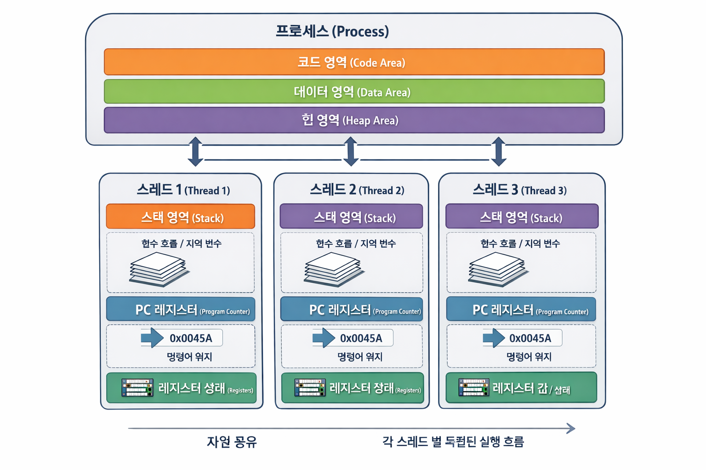

# **4-5.** 스레드의 주소공간은 어떻게 구성되어 있을까요?

> **스레드는 “주소 공간을 따로 가지지 않는다”
같은 프로세스의 주소 공간을 공유한다**

---

# ✅ 0. 프로세스 vs 스레드

## 📌 프로세스

- **독립된 주소 공간** 가짐

## 📌 스레드

- 같은 프로세스 내부 실행 단위 👉 **주소 공간을 공유**

---

# ✅ 1. 프로세스 주소 공간 구조

일반적으로 이렇게 구성됨:

```plain text
[ Code 영역 ]
[ Data 영역 ]
[ Heap 영역 ]
      ...
[ Stack 영역 ]
```

---

# ✅ 2. 스레드의 주소 공간 구성

## 🔹 공유하는 영역 (모든 스레드 공통)

- Code 영역 (함수 코드)

- Data 영역 (전역 변수, static 변수)

- Heap 영역 (동적 메모리)

> **같은 프로세스 내 스레드들은 이 영역을 “같이 사용”**

---

## 🔹 스레드마다 따로 가지는 영역

👉 **Stack 영역**

- 각 스레드는 **자기만의 Stack**을 가짐

- 함수 호출, 지역 변수 저장

---

# ✅ 3. 그림으로 정리

```plain text
[프로세스]

          [ Code ]
          [ Data ]
          [ Heap ]
         /    |    \
   [Stack] [Stack] [Stack]
    Thread1 Thread2 Thread3
```



---

# ✅ 4. 왜 이렇게 설계되었을까?

## 🔹 공유하는 이유

- 빠른 데이터 공유 가능

  - 복사 없이 바로 접근 가능하기 때문

- IPC 없이도 협업 가능

> 🔥 

### IPC (Inter-Process Communication)

---

  - 프로세스는 기본적으로 서로 메모리를 공유하지 않기 때문에 데이터를 주고받으려면 아래와 같은 방법을 사용해야 함.

    - 파이프 (Pipe)

    - 소켓 (Socket)

    - 공유 메모리 (Shared Memory)

    - 메시지 큐

---

  1. Process A → 데이터를 커널로 전달

  1. 커널 → Process B로 복사

👉 과정:

    - user → kernel → user

    - 복사 2번 발생

👉 오버헤드 큼

---

## 🔹 Stack을 따로 두는 이유

👉 함수 실행 흐름은 독립적이어야 함

예:

- Thread1 → `funcA()`

- Thread2 → `funcB()`

👉 서로 호출 흐름이 섞이면 안 됨

---

# ✅ 5. 이 구조 때문에 생기는 문제

## 📌 장점

- 빠름 (공유 메모리)

- 효율적

## 📌 단점

- 동기화 문제 발생

예:

- **Race Condition**

  - 여러 스레드가 공유 자원에 동시에 접근하면서, 실행 순서에 따라 결과가 달라지는 문제

> 🔥 

### Race Condition

## Race Condition이란?

**여러 스레드가 공유 자원에 동시에 접근하면서, 실행 순서에 따라 결과가 달라지는 문제**다.

핵심은

👉 **공유 자원**

👉 **동시 접근**

👉 **순서에 따라 결과가 달라짐**

이 세 가지다.

### 예시

은행 계좌 잔액이 100원이라고 하자.

      - Thread A: 잔액을 읽고 50원 출금

      - Thread B: 잔액을 읽고 30원 출금

원래라면 최종 잔액은 20원이 되어야 한다.

그런데 실제 실행이 이렇게 꼬일 수 있다.

      1. Thread A가 잔액 100 읽음

      1. Thread B가 잔액 100 읽음

      1. Thread A가 50원 출금 후 50 저장

      1. Thread B가 30원 출금 후 70 저장

최종 결과: **70원**

원래 기대값은 20원인데, 잘못된 결과가 나왔다.

이게 Race Condition이다.

### 왜 발생하나?

출금 연산이 겉보기엔 한 줄처럼 보여도 실제로는 보통 여러 단계다.

      1. 값 읽기

      1. 계산하기

      1. 결과 저장하기

이 세 단계 사이에 다른 스레드가 끼어들 수 있다.

즉, **하나의 작업처럼 보여도 실제론 원자적(atomic)이지 않기 때문**이다.

### 특징

      - 실행할 때마다 결과가 다를 수 있음

      - 재현이 어려운 경우가 많음

      - 테스트에서는 잘 안 보이는데 실서비스에서 터지기도 함

### 해결 방법

      - mutex, synchronized 같은 **상호 배제**

      - atomic 연산

      - semaphore

      - lock-free 자료구조

      - 공유 자원 자체를 줄이는 설계

- **Deadlock**

  - 둘 이상의 스레드(또는 프로세스)가 서로 자원을 기다리면서, 아무도 더 이상 진행하지 못하는 상태

> 🔥 

### Deadlock

## Deadlock이란?

**둘 이상의 스레드(또는 프로세스)가 서로 자원을 기다리면서, 아무도 더 이상 진행하지 못하는 상태**다.

쉽게 말하면

👉 서로 “네가 먼저 놔” 하면서 영원히 멈춰버리는 상황이다.

### 예시

자원 A와 자원 B가 있다고 하자.

      - Thread 1:

        1. Lock A 획득

        1. Lock B 기다림

      - Thread 2:

        1. Lock B 획득

        1. Lock A 기다림

이 상태가 되면:

      - Thread 1은 B를 기다림

      - Thread 2는 A를 기다림

둘 다 기다리기만 하고 절대 끝나지 않는다.

이게 Deadlock이다.

### 비유

두 사람이 좁은 복도 양쪽에서 마주 왔다고 생각하면 된다.

      - A는 B가 비켜주길 기다림

      - B는 A가 비켜주길 기다림

둘 다 멈춰 있으면 영원히 못 지나간다.

---

# 🎯 최종 한 줄 정리

👉 **스레드는 프로세스의 Code/Data/Heap 영역을 공유하고, Stack만 독립적으로 가진다.**
