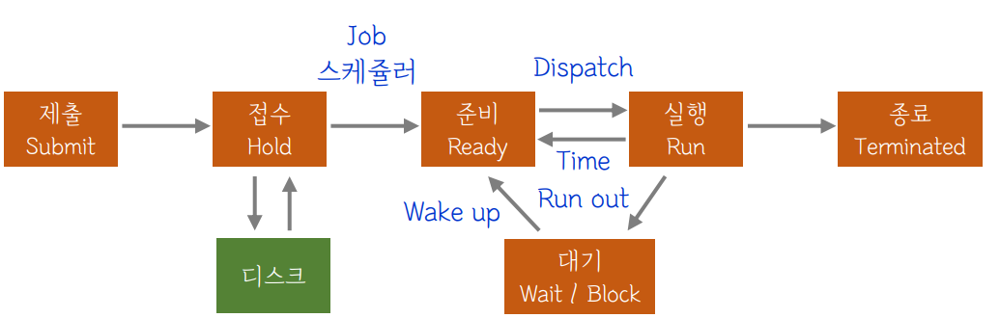

# **5-1.** 현대 OS에는 단기, 중기, 장기 스케줄러를 모두 사용하고 있나요?

# 1. 단기, 중기, 장기 스케줄러를 모두 사용하는가?

- 결론부터 말하면, **다 쓰지는 않습니다.**

- 현대의 시분할 운영체제(Windows, macOS, Linux 등)에서는 **장기 스케줄러를 거의 사용하지 않습니다.**

- 주로 **단기 스케줄러**가 핵심 역할을 하며, 메모리가 부족할 때 **중기 스케줄러**가 개입하는 구조입니다.

---

# 2. 장기 스케줄러 (Long-term Scheduler)

- **"어떤 프로그램을 메모리에 입장시킬 것인가?"**

- **별명:** 작업 스케줄러 (Job Scheduler)

- **역할:** 하드디스크에 저장된 프로그램을 가져와서 커널에 등록하고 준비 큐(Ready Queue)에 넣을지 결정합니다. 즉, '신입 프로세스'를 선발하는 문지기입니다.

- **특징:**

  - **호출 주기:** 수십 초~수 분 단위로 가끔 호출되므로 속도가 조금 느려도 괜찮습니다.

  - **메모리 제어:** 메모리에 동시에 올라와 있는 프로세스의 수(Degree of Multiprogramming)를 조절하여 시스템의 균형을 맞춥니다.

- **현대 OS의 변화:** 요즘 우리가 쓰는 Windows나 Linux 같은 시분할 시스템에서는 **장기 스케줄러를 거의 두지 않습니다.** 과거에는 메모리가 부족해 입구에서부터 조절이 필요했지만, 현대 OS는 프로그램 실행 요청이 들어오면 일단 바로 메모리에 올려 준비 큐에 넣어줍니다.

---

# 3. 중기 스케줄러 (Medium-term Scheduler)

- **"메모리가 꽉 찼네? 잠시 나가서 대기해!"**

- 현대 OS에서 장기 스케줄러의 빈자리를 채우는 가장 중요한 관리자입니다.

- **도입 배경:** 너무 많은 프로세스가 메모리에 올라오면, 각 프로세스가 가진 메모리량이 너무 적어집니다. 그러면 CPU가 일을 하려고 해도 필요한 데이터가 메모리에 없어 자꾸 디스크를 뒤적거리게 되죠(성능 저하). 이를 해결하기 위해 등장했습니다.

- **스왑 아웃(Swap Out):** 메모리에 있는 프로세스 중 일부를 통째로 빼앗아 디스크의 스왑 영역(Swap Area)으로 보냅니다.

  - **1순위 타겟:** 봉쇄 상태(Blocked)인 프로세스. (당장 CPU를 쓸 일이 없으니까)

  - **2순위 타겟:** 그래도 부족하면, 준비 큐에서 기다리던 프로세스를 내보냅니다.

---

# 4. 단기 스케줄러 (Short-term Scheduler)

- **"지금 당장 누구에게 CPU라는 롤러코스터를 태워줄 것인가?"**

- **별명:** CPU 스케줄러

- **역할:** 준비 큐에 기다리고 있는 프로세스들 중, 어떤 프로세스에게 CPU를 할당해 줄지 결정합니다.

- **특징:**

  - **호출 주기:** 밀리초(ms) 이하 단위로 매우 빈번하게 호출됩니다. 따라서 **수행 속도가 매우 빨라야 합니다.**

  - **작동 시점:** 타이머 인터럽트(시간 다 됨!)가 발생하거나 프로세스가 스스로 CPU를 반납할 때 호출됩니다.

- **핵심:** 우리가 흔히 "스케줄러"라고 부르는 것은 대부분 이 단기 스케줄러를 의미합니다.

---

# 5. 중기 스케줄러가 만든 새로운 프로세스 상태

- 중기 스케줄러 때문에 메모리를 완전히 뺏기고 디스크로 쫓겨난 상태를 **중지(Suspended)** 상태라고 합니다. 이 상태는 크게 두 가지로 나뉩니다.

| **상태 명칭** | **설명** | **변화 과정** |
| --- | --- | --- |
| **중지 준비 (Suspended Ready)** | 준비 상태였던 프로세스가 디스크로 쫓겨난 경우 | 메모리에 여유가 생기면 다시 **준비 상태**로 복귀함 |
| **중지 봉쇄 (Suspended Blocked)** | 봉쇄 상태였던 프로세스가 디스크로 쫓겨난 경우 | 입출력 등이 완료되면 **중지 준비 상태**로 바뀜 |

---

# 6. 그림

- Job 스케쥴러가 장기, Dispatch가 단기.

- 메모리가 꽉 차면 준비(Ready)나 **대기(Wait)** 상태인 프로세스를 통째로 **디스크**로 쫓아내는 역할이 중기
