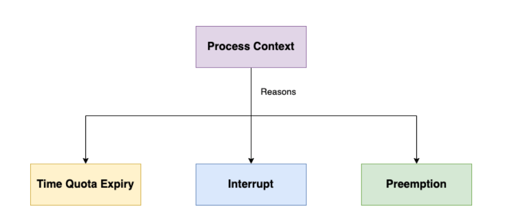

# **6-1.** 프로세스와 스레드는 컨텍스트 스위칭이 발생했을 때 어떤 차이가 있을까요?

### 컨텍스트 스위칭이란?

CPU/코어에서 실행중이던 스레드가 다른 스레드로 교체되는 것

→ 이 때, 두 스레드는 같은 프로세스에 속할수도, 다른 프로세스에 속할 수도 있음

---

### 컨텍스트 스위칭이 일어나는 이유

- Time Quato Expiry : 주어진 타임슬라이스의 시간이 다 됨. TIME OVER!

- Interrupt : 커널 함수를 통해 프로그램 실행 도중 멈춰버림. SIG KILL!

- Preemption : 더 우선순위가 높은 일을 해야할 때 선점해버려서

---

### 스레드 컨텍스트 스위칭

같은 프로세스 내부 실행 단위라 공유되는 것(주소 공간, 파일/전역 변수)이 많음

- 바뀌는 것

  - CPU register

  - 스택

- 특징

  - 메모리 공간 유지 → 캐시 유지 가능

- 결과

  - 비용이 작으며 속도가 빠름

`프로세스A`의 스레드1 → `프로세스A`의 스레드2 → 커널 모드 전환 + CPU register 상태 교체

⇒ 스레드는 빠른 대신, 동기화 문제(race condition) 발생 가능

---

### 프로세스 컨텍스트 스위칭

프로세스는 완전히 독립된 실행 단위라, 스위칭 시 바꿔야 할 것이 많음

`프로세스A`의 스레드1 → `프로세스B`의 스레드2

- 바뀌는 것

  - 주소 공간(Virtual Memory, Page Table)

  - CPU register

  - 커널 스택

  - 파일 디스크립터, PCB 정보 등

- 특징

  - 주소 공간 자체가 바뀜 → 캐시 / TLB flush 발생

- 결과

스레드와 비교 시, 비용이 크고 속도가 느림

⇒ 스레드의 컨텍스트 스위칭 과정에 추가적으로 **가상 메모리 주소 관련 처리 필요**

1. MMU(Memory Management Unit)이 새로운 주소 체계를 바라보도록 수정

1. 캐시 역할을 하는 TLB(Translation Lookaside Buffer)를 완전히 비워줘야 함

즉, 커널모드 전환 + CPU register 상태 교체 + 가상메모리 주소 처리(MMU 수정 + TLB 캐시 비우기)

⇒ 프로세스는 느린 대신, 격리(isolation) 보장

요새는?

⇒ 요즘 CPU는 무조건 flush 하지는 않음 !!

**ASID(Address Space ID)**

TLB entry에 “이게 어느 프로세스 것인지”에 대한 태그를 함께 붙임

이러면 A → B 전환해도 flush없이 필요한 것만 구분해서 사용가능!

---

### 캐시 오염이란?

CPU 내부에 캐시를 위한 공간이 존재하는데

컨텍스트 스위칭 시, 캐시 데이터가 현재 실행중인 스레드의 데이터가 아닐 수 있음

컨텍스트 스위칭 직후에는 캐시에 필요한 데이터가 없어서, 메모리에 접근해 데이터를 받아와야 함

→ 성능에 악영향!

---

### 오버헤드란?

프로그램 실행 흐름에서 나타나는 현상 중 하나

프로그램의 실행 흐름 도중 동떨어진 위치 코드를 실행시켜야 할 때, 추가적으로 **시간, 메모리, 자원이 사용되는 현상**

→ 실행에 10초가 걸리는 기능이 간접적인 원인으로 20초가 소요된다면, _**오버헤드는 10초**_가 되는 것!!
