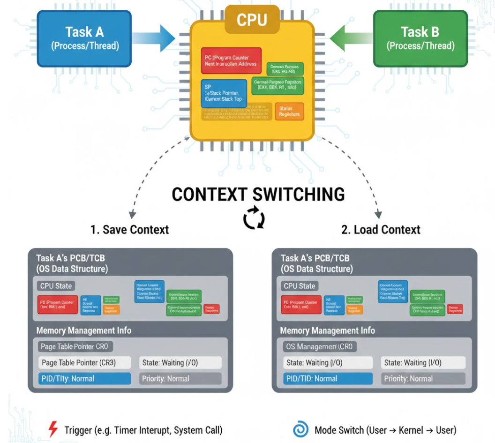

# **6-3.** 컨텍스트 스위칭은 언제 일어날까요?

### 컨텍스트 스위칭의 탄생 일화

초기 컴퓨터는 한 번에 하나의 작업(프로세스)만 처리할 수 있었는데 CPU 처리속도는 I/O속도보다 압도적으로 빨랐음

→ I/O 작업 요청 후 응답을 기다리는 동안 CPU는 ‘아무 일도 하지 않고’ 놀게 됨

→ 비효율을 해결하고, **멀티태스킹**을 구현하기 위해 **시분할 시스템 고안**

---

### 시분할 시스템이란?

CPU 시간을 잘게 쪼개어(Time Slice) 여러 작업(프로세스)에게 번갈아 가며 할당하는 방식

1. A라는 작업이 I/O를 기다리며 멈춰있을 때, CPU가 B라는 작업을 처리

1. B 작업의 할당 시간이 끝나면 C 작업을 처리

→ 이 과정이 워낙 빠르게 일어나기 때문에, 사용자는 **마치 여러 작업이 '동시에' 실행되는 것처럼** 느낌

⇒ 여기서 **A 작업을 멈추고 B 작업을 실행**하기 위해 필요한 핵심 메커니즘이 바로 **컨텍스트 스위칭**

---

### 컨텍스트 스위칭의 개념

텍스트는 **CPU가 현재 작업을 수행하기 위해 필요한 모든 정보로, **작업을 멈췄다가 나중에 다시 시작할 때 필요한 **'상태 값'**
