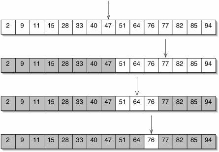
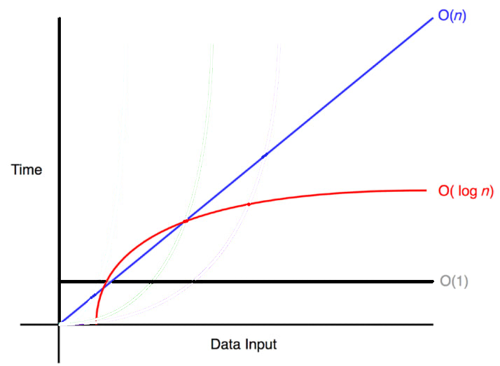

# 1-0. 이진 탐색(Binary Search)이 무엇인지 설명하고, 시간복잡도를 증명해 보세요.

# I. 이진 탐색(Binary Search) 완전 정리

## 1. 이진 탐색이란?



**정렬된 배열(오름차순 기준)** 에서, 매 단계마다 탐색 범위를 **절반으로 줄이며** target을 찾는 알고리즘.

- **전제: 배열이 정렬되어 있어야 함 ⭐️**

- 아이디어: `mid`를 기준으로 **왼쪽/오른쪽 절반을 버림**

---

## 2. 기본 동작 원리

탐색 구간을 `[lo, hi]`로 두고 반복:

1. `mid` 를 찾기 

1. `A[mid]`와 `target` 비교

1. 결과에 따라 구간 갱신

  - `A[mid] < target` → 왼쪽은 전부 버림 → `lo = mid + 1`

  - `A[mid] > target` → 오른쪽은 전부 버림 → `hi = mid - 1`

  - `A[mid] == target` → 같으면 찾음

---

## 3. 구현 방법

### 3.1 반복(Iterative) 구현

- 장점: **스택 사용 없음** → 재귀보다 안전/빠른 편

- 핵심: `lo <= hi` 동안 구간을 줄인다

```java
// target의 인덱스 반환, 없으면 -1
static int binarySearchIter(int[] a, int target) {
    int lo = 0, hi = a.length - 1;

    while (lo <= hi) {
        // 오버플로우 안전한 mid 계산
        int mid = lo + (hi - lo) / 2;

        if (a[mid] == target) return mid;
        else if (a[mid] < target) lo = mid + 1;
        else hi = mid - 1;
    }
    return -1;
}
```

---

### 3.2 재귀(Recursive) 구현

- 장점: 코드가 직관적일 수 있음

- 단점: 호출 깊이만큼 **콜 스택 사용**(매우 큰 입력/환경에선 위험할 수 있음)

```java
static int binarySearchRec(int[] a, int target, int lo, int hi) {
    if (lo > hi) return -1;

    int mid = lo + (hi - lo) / 2;

    if (a[mid] == target) return mid;
    if (a[mid] < target) return binarySearchRec(a, target, mid + 1, hi);
    return binarySearchRec(a, target, lo, mid - 1);
}
```

---

## 4. mid 계산 오버플로우 문제

### 문제

많이 쓰는 코드:

```plain text
mid = (lo + hi) / 2
```

`lo + hi`가 **정수 범위를 넘어가면(overflow)** mid가 음수/이상한 값이 될 수 있음.

### 해결(표준)

```plain text
mid = lo + (hi - lo) / 2
```

- `(hi - lo)`는 범위가 안전(구간 길이)

- Java/C/C++ 등에서 표준적으로 권장되는 방식

---

### _Lower bound, Upper bound (재봉 파트에서 더 자세히 확인하세요!) ← 응 알겠어…_

## 5. lower_bound / upper_bound 개념

이진 탐색은 “값을 찾기” 뿐 아니라, **삽입 위치/범위**를 찾는 데도 쓴다.

특히 중복 값이 있을 때 중요.

### 6.1 lower_bound (첫 번째로 ≥ target 인 위치)

  - 정의: **target 이상(≥)** 이 처음 등장하는 인덱스

  - 의미: `target`을 정렬 상태로 삽입할 때 **가장 왼쪽 삽입 위치**

### 예시

배열: `[1, 2, 2, 2, 4, 7]`

  - `lower_bound(2) = 1`

  - `lower_bound(3) = 4` (3 이상이 처음 나오는 곳은 4의 위치)

  - `lower_bound(8) = 6` (끝 = length)

### 구현(반복)

```java
// 첫 위치 i: a[i] >= target, 없으면 a.length 반환
static int lowerBound(int[] a, int target) {
    int lo = 0, hi = a.length; // [lo, hi)
    while (lo < hi) {
        int mid = lo + (hi - lo) / 2;
        if (a[mid] >= target) hi = mid;
        else lo = mid + 1;
    }
    return lo;
}
```

---

### 5.2 upper_bound (첫 번째로 > target 인 위치)

  - 정의: **target 초과(>)** 가 처음 등장하는 인덱스

  - 의미: `target`을 삽입할 때 **가장 오른쪽 다음 위치**

### 예시

배열: `[1, 2, 2, 2, 4, 7]`

  - `upper_bound(2) = 4`

  - `upper_bound(3) = 4`

  - `upper_bound(7) = 6`

### 구현(반복)

```java
// 첫 위치 i: a[i] > target, 없으면 a.length 반환
static int upperBound(int[] a, int target) {
    int lo = 0, hi = a.length; // [lo, hi)
    while (lo < hi) {
        int mid = lo + (hi - lo) / 2;
        if (a[mid] > target) hi = mid;
        else lo = mid + 1;
    }
    return lo;
}
```

---

# II. 이진 탐색 시간복잡도 쉽게 이해하기



## 1. 핵심 아이디어

이진 탐색은

👉 **매번 “절반”을 버린다.**

---

## 2. 숫자로 직접 보자

### 예: 데이터가 16개 있을 때

```plain text
// 탐색하는 요소의 개수
1단계: 16개
2단계: 8개
3단계: 4개
4단계: 2개
5단계: 1개
```

👉 총 **5번** 만에 1개로 줄어듦

16 → 8 → 4 → 2 → 1

---

## 3️⃣ 왜 log N이 되는가?

16은

```plain text
16 =2^4
```

즉,

몇 번 절반을 나눠야 1이 되는지 = **2를 몇 번 곱해야 16이 되는지**

그게 바로 **log₂16 = 4**

---

## 4️⃣ 더 큰 숫자도 보자

### N = 1,000,000

```plain text
log₂1,000,000 ≈ 20
```

👉 100만 개를 탐색하는데

**최대 20번 비교**만 하면 끝

---

## 5️⃣ 선형 탐색과 비교

| 방법 | 최악의 경우 비교 횟수 |
| --- | --- |
| 선형 탐색 | 1,000,000번 |
| 이진 탐색 | 약 20번 |

차이가 엄청 큼.

---

## 6️⃣ 왜 항상 절반이 줄어들까?

정렬되어 있기 때문.

중간 값을 보고:

- 작으면 → 왼쪽 절반 전체 버림

- 크면 → 오른쪽 절반 전체 버림

👉 절반을 한 번에 날려버림

---

## 7️⃣ 수학적으로 한 줄 정리

처음 N개에서 시작해서

k번 절반으로 줄이면

```plain text
N/2 ^ k = 1
```

→ `k = log₂N`

⭐️ 그래서 시간복잡도는:

```plain text
O(log N)
```

---

## 🎯 완전 직관 한 문장

> 이진 탐색은 매번 절반을 버리기 때문에

데이터 개수가 2배가 되어도 탐색 횟수는 1번만 늘어난다.
