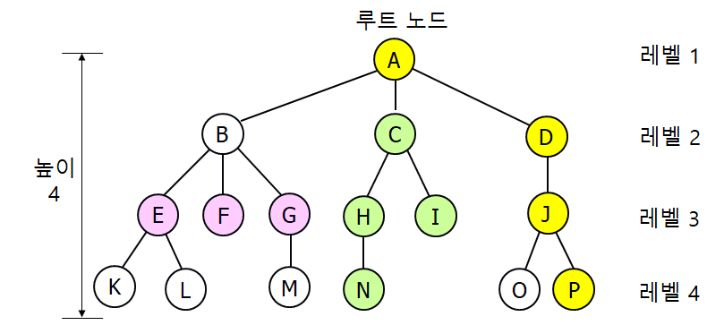
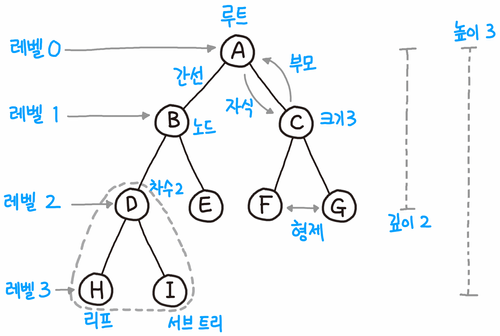
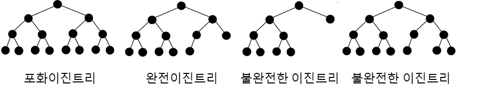
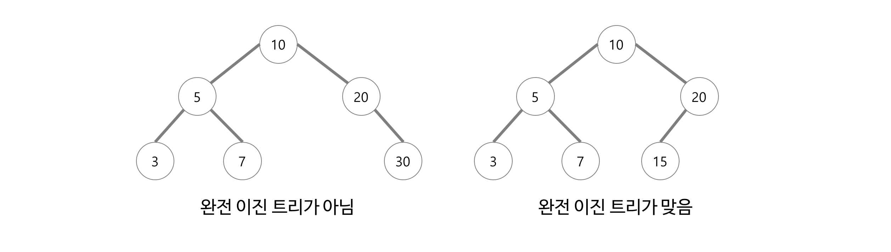
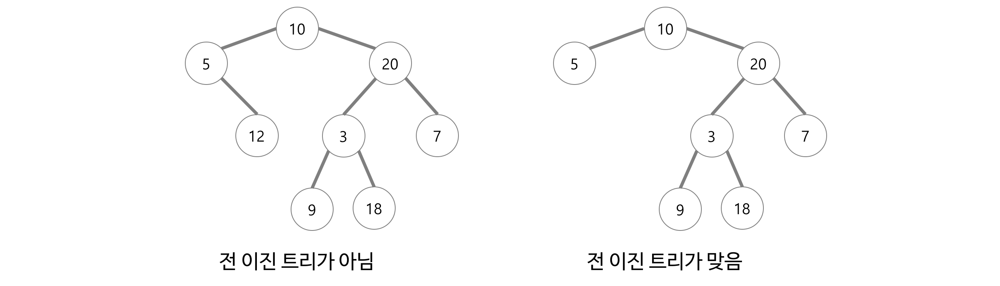
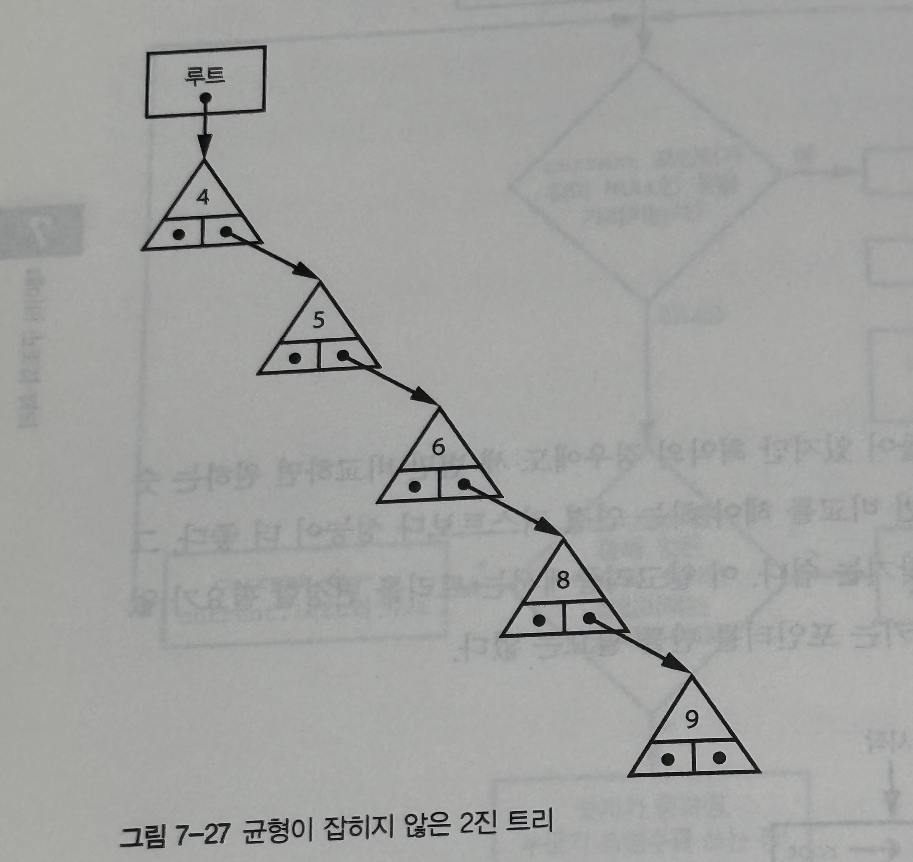
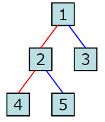
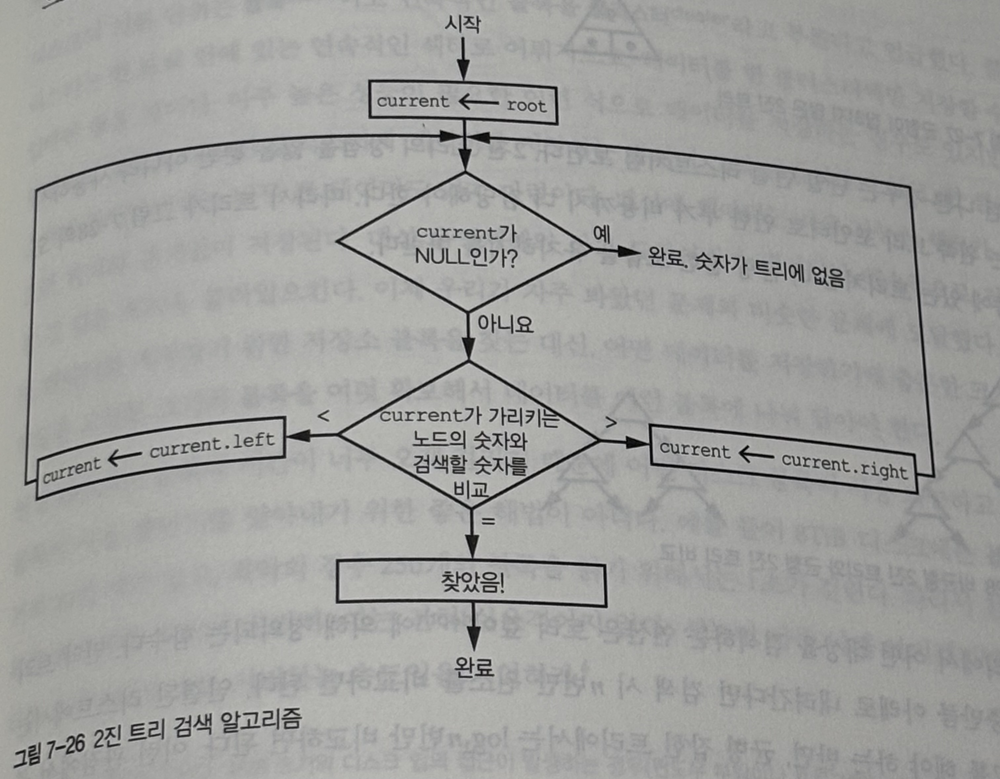

# 1-0. 트리(Tree)와 이진트리(Binary Tree), 그리고 이진탐색트리(BST)에 대해 설명해 주세요.

# 🌳 트리(Tree)와 이진트리(Binary Tree), 이진탐색트리(BST)

## 1️⃣ 트리(Tree)

## 1) 개념

### 📌 정의

- 트리는 **데이터 요소를 계층적으로 표현**하기 위한 비선형 자료구조

- **부모–자식 관계**로 노드가 연결됨

- **사이클이 존재하지 않는 그래프**

- 하나의 루트(Root)에서 시작

> 💡 트리라는 이름은 실제 나무를 거꾸로 세워놓은 형태와 유사해서 붙여졌다.

🔜 그래프 vs 트리

---

### 📂 트리 사용 예시

- 파일 시스템의 **디렉토리 구조**

- **HTML / DOM 구조**

- 조직도, 카테고리 구조

---

## 2) 트리 관련 용어 정리





| 용어 | 설명 |
| --- | --- |
| **루트(Root)** | 트리의 최상위 노드 |
| **노드(Node)** | 트리를 구성하는 데이터 단위 |
| **간선(Edge)** | 노드와 노드를 연결하는 선 |
| **부모(Parent)** | 자식 노드를 가지는 상위 노드 |
| **자식(Child)** | 부모 노드로부터 연결된 하위 노드 |
| **형제(Sibling)** | 같은 부모를 가지는 노드 |
| **리프(Leaf)** | 자식이 없는 노드(≈ 단말 노드) |
| **차수(Degree)** | 노드가 가진 자식의 수 |
| **레벨(Level)** | 루트부터 내려온 깊이 |
| **높이(Height)** | 트리의 최대 레벨 |

---

## 3) 트리(Tree)의 특징

- 사이클이 존재하지 않음

- 노드가 N개이면 간선은 항상 **N - 1개**

- 루트에서 특정 노드로 가는 경로는 **유일**

- 모든 노드는 **단 하나의 부모만 가짐**

---

## 4) 왜 트리를 사용하는가?

### 📌 배열 / 리스트의 한계

- 삽입·삭제 시 최악의 경우 **O(N)** 소요

- 계층 구조 표현이 어려움

### 📌 트리의 장점

- 균형 잡힌 트리의 경우 탐색 시간 **O(log N)**

- **계층 구조 표현에 최적**

- 삽입·삭제·탐색을 효율적으로 수행 가능

---

## 2️⃣ 이진 트리(Binary Tree)

### 📌 정의

- 각 노드가 **최대 2개의 자식**을 가질 수 있는 트리

- 왼쪽 자식(left), 오른쪽 자식(right)으로 구분

- 모든 서브트리 또한 이진 트리여야 함

> 💡 실무/면접에서 “트리”라고 하면 대부분 이진 트리를 의미

---

### 📐 이진 트리의 성질

- 레벨 i에서 가질 수 있는 최대 노드 수: **2^{i-1}**** (i ≥ 1)**

- 높이가 h인 이진 트리의 최대 노드 수: **2ʰ − 1**

---

## 1) 이진 트리의 종류



### 🌕 포화 이진 트리 (Perfect Binary Tree)

- 모든 레벨이 꽉 차 있음

- 모든 리프 노드의 레벨이 동일

### 🔲 완전 이진 트리 (Complete Binary Tree)



- 마지막 레벨을 제외한 모든 레벨이 꽉 참

- 마지막 레벨은 **왼쪽부터 채워짐**

### 🔀 전 이진 트리 (Full Binary Tree)



- 모든 노드가 **자식 0개 또는 2개**

### 📉 편향 이진 트리 (Skewed Binary Tree)



- 한쪽 방향으로만 노드가 연결됨

- 사실상 **연결 리스트**

- 시간 복잡도: **O(N)**

---

## 2) 이진 트리 순회 (Traversal)

```plain text
전위 순회 (Preorder)  : 루트 → 왼쪽 → 오른쪽
중위 순회 (Inorder)   : 왼쪽 → 루트 → 오른쪽
후위 순회 (Postorder) : 왼쪽 → 오른쪽 → 루트
```



1. 전위 순회

      1. 1-2-4-5-3

    1. 중위 순회

      1. 4-2-5-1-3

    1. 후위 순회

      1. 4-5-2-3-1

> 💡 BST에서는 중위 순회 결과가 정렬된 순서가 된다. 🔜

---

## 3️⃣ 이진 탐색 트리 (BST: Binary Search Tree)

### 📌 정의

- 이진 트리의 한 종류

- **정렬된 데이터를 저장하기 위한 트리**

- 탐색, 삽입, 삭제를 효율적으로 수행

---

### 📌 BST의 저장 규칙

- 왼쪽 서브트리의 값 < 루트 값

- 오른쪽 서브트리의 값 > 루트 값

- 모든 서브트리 또한 BST

- **중복 값 허용하지 않음** (중복이 많은 경우 검색 속도 저하. 트리에 삽입하는 것보다 노드에 count를 가지게 하여 처리하는 것이 훨씬 효율적)

---

### 📌 BST를 사용하는 이유



| 자료구조 | 탐색 | 삽입/삭제 |
| --- | --- | --- |
| 배열 | O(N) | O(N) |
| 연결 리스트 | O(N) | O(1) |
| **BST** | **O(log N)** | **O(log N)** |

> 💡 이진 탐색 + 연결 리스트의 장점을 결합한 구조

🔜 BST의 시간 복잡도, 삽입삭제 방법, 한계

---

## 📌 핵심 요약

- 트리는 **계층 구조 표현을 위한 비선형 자료구조**

- 이진 트리는 자식이 최대 2개인 트리

- BST는 정렬 + 빠른 탐색을 위한 이진 트리

- BST의 성능은 **트리 균형 여부**에 크게 의존

- 균형 유지를 위해 AVL, Red-Black Tree 사용
