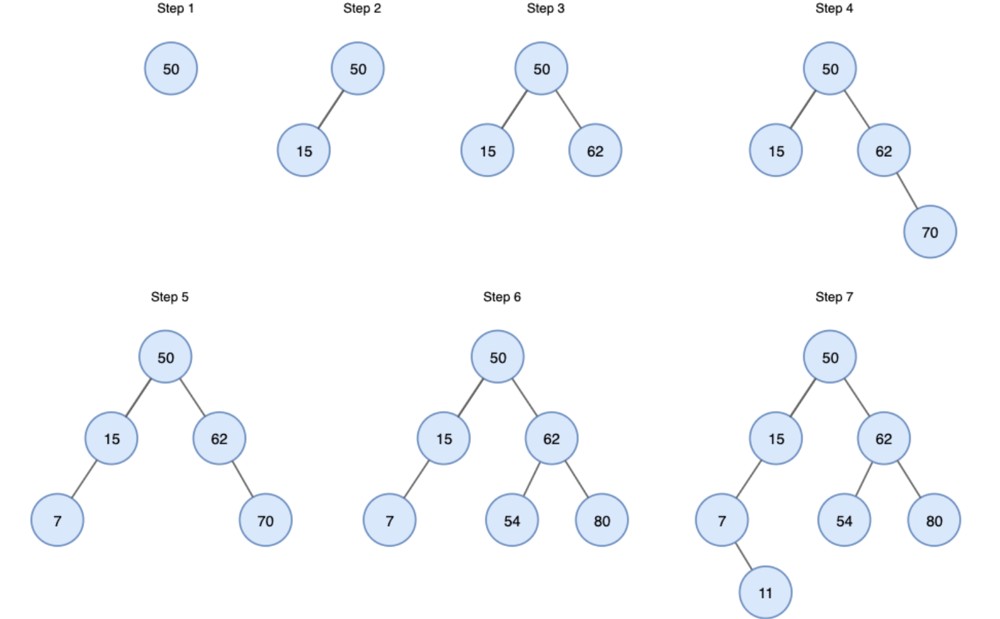
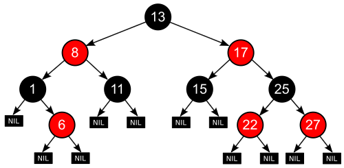

# 1-3, 4. 이진탐색트리의 시간복잡도와 한계

1. **시간 복잡도 요약**

- **평균적인 경우:** O(\log n)

- **최악의 경우:** O(n)

1. **이진탐색트리의 생성법**

- 예: 50, 15, 62, 80, 7, 54, 11를 순서대로 입력

1. **시간 복잡도 도출 이유**

- **평균적인 경우: **O(\log n)

  - 이진 탐색 트리는 모든 노드가 왼쪽 자식은 나보다 작고, 오른쪽 자식은 나보다 크다는 규칙을 유지한다.

  - **원리**: 특정 값을 찾거나 삽입할 때, 현재 노드와 값을 비교하여 **왼쪽 혹은 오른쪽 중 한 방향만 선택**해서 내려간다. **즉, 한 번 비교할 때마다 탐색해야 할 데이터의 범위가 대략 절반씩 줄어든다.**

  - **이유**: 트리가 균형 있게 잘 구성되어 있다면, 전체 노드 수가 n일 때 트리의 높이(h)는 약 \log_2 n이 됩니다. 연산은 트리의 높이 만큼만 내려가면 완료되므로 O(\log n)의 시간이 걸린다.

- **최악의 경우: **O(n)

  - 트리가 한쪽으로 길게 늘어지는 편향 트리(Skewed Tree)가 되었을 때 발생한다.

  - **원리**: 예를 들어 `1, 2, 3, 4, 5` 순서대로 데이터가 삽입되면, 모든 노드가 오른쪽 자식으로만 연결되어 마치 **'연결 리스트(Linked List)'와 같은 선형 구조**가 된다.

  - **이유**: 이 경우 트리의 높이(h)가 노드의 개수(n)와 같아집니다. 따라서 **원하는 데이터를 찾기 위해 맨 위에서부터 맨 아래까지 모든 노드를 확인**해야 하므로 O(n)의 시간이 걸리게 된다.

1. **한계점**

- 편향 트리

  - 이진 탐색 트리의 가장 큰 한계는 **트리의 균형이 깨질 수 있다는 점**이다.

  - 이 경우 위에서 설명한 바와 같이 O(n)의 시간 복잡도를 갖게 된다.

- 삽입 및 삭제 시 오버헤드

  - 데이터를 단순히 끝에 추가하는 배열이나 연결 리스트(Linked LIst)와 달리, 이진 탐색 트리는 삽입과 삭제 시 트리의 규칙을 유지하기 위한 추가 작업이 필요하다.

  - **위치 탐색**: 삽입할 때마다 적절한 위치를 찾기 위한 비교 연산이 선행되어야 한다.

  - **구조 재조정**: 원하는 노드를 삭제할 때, 해당 노드의 자식 노드가 2개인 경우 오른쪽 서브트리의 최솟값(나보다 큰 노드들 중 가장 작은 노드)이나 왼쪽 서브트리의 최댓값(나보다 작은 노드들 중 가장 큰 노드)을 찾아 올리는 등 복잡한 노드 재배치 과정이 필요하다.

- 데이터 분포에 대한 민감도

  - 이진 탐색 트리는 입력되는 데이터의 분포가 불균형할수록 효율성이 급격히 떨어진다.

  - 데이터가 무작위로 들어올 때는 비교적 균형을 유지하지만, 특정 패턴(오름차순, 내림차순 등)을 가진 데이터가 들어오면 성능을 보장할 수 없다.

  - 이를 해결하기 위해 스스로 균형을 잡는(Rebalancing) 알고리즘이 추가된 트리 모델이 필요하다.

- 해결책: 자가 균형 이진 탐색 트리 (Self-Balancing BST)

  - 위의 한계점을 극복하기 위해 실무에서는 일반적인 BST보다는 노드 삽입/삭제 시 스스로 높이를 조절하여 균형을 유지하는 트리들을 주로 사용한다.

  - **AVL 트리**: 연산 수행 시 최악의 경우에도 시간 복잡도를 O(\log n)으로 유지하기 위해 고안된 트리로, 왼쪽과 오른쪽 서브트리의 높이 차이를 1 이하로 엄격하게 제한하여 빠른 탐색 보장한다.

출처 : [https://en.wikipedia.org/wiki/AVL_tree](https://en.wikipedia.org/wiki/AVL_tree)

  - **Red-Black 트리**: 노드에 색상을 부여하여 균형을 유지하며 AVL보다 엄격함은 덜하여 회전이 적게 일어난다. 삽입/삭제 효율이 좋아 실제 DB나 라이브러리에서 가장 많이 쓰인다. 이 또한 O(\log n)를 항상 유지한다.

출처 : [https://ko.wikipedia.org/wiki/레드-블랙_트리](https://ko.wikipedia.org/wiki/%EB%A0%88%EB%93%9C-%EB%B8%94%EB%9E%99_%ED%8A%B8%EB%A6%AC)

    1. 노드는 레드 혹은 블랙 중의 하나이다.

    1. 루트 노드는 블랙이다.

    1. 모든 리프 노드들(NIL)은 블랙이다.

    1. 레드 노드의 자식노드 양쪽은 언제나 모두 블랙이다. (즉, 레드 노드는 연달아 나타날 수 없으며, 블랙 노드만이 레드 노드의 부모 노드가 될 수 있다)

    1. 어떤 노드로부터 시작되어 그에 속한 하위 리프 노드에 도달하는 모든 경로에는 리프 노드를 제외하면 모두 같은 개수의 블랙 노드가 있다.
