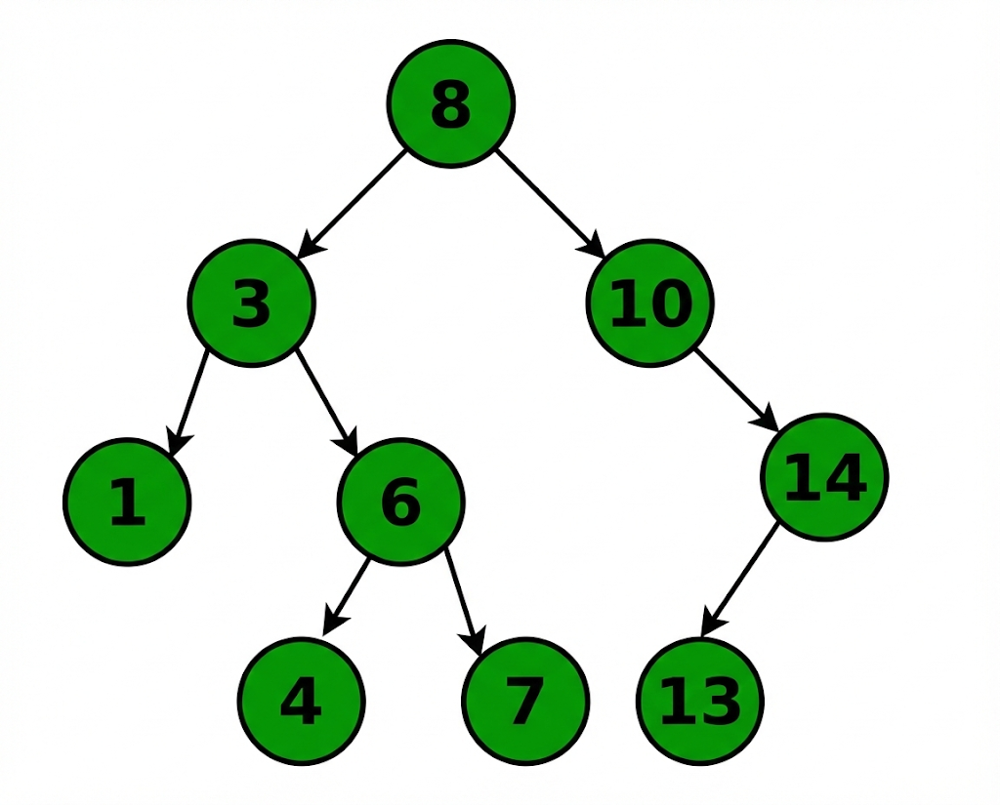

# 1-5. 이진탐색트리의 값 삽입, 삭제 방법에 대해 설명하고, 어떤 식으로 값을 삽입하면 편향이 발생할까요?

트리의 개념은 지영이가 잘 설명해줬을 것이라 믿고 간단한 정리만!

# 🌲 트리(Tree)와 이진 탐색 트리(BST) 정리

## 1. 트리(Tree) 기초

- **모양:** 나무를 뒤집어 놓은 모양

- **뿌리(Root):** 맨 꼭대기 데이터

- **가지(Edge):** 노드와 노드를 연결하는 선

- **잎(Leaf Node):** 더 이상 가지가 없는 맨 끝 데이터

- **노드(Node):** 뿌리, 잎, 그리고 그 중간에 있는 모든 데이터 덩어리

## 2. 이진 트리 (Binary Tree)

- **의미:** 이진은 ‘두 갈래’라는 뜻!

- **규칙:** 모든 노드가 **최대 2개의 자식**만 가질 수 있음.

## 3. 이진 탐색 트리 (BST)

> 이진 트리에 엄격한 규칙을 더한 것!

- **규칙:**

  - 내 **왼쪽** 자식은 나보다 **작은 것**만 와!

  - 내 **오른쪽** 자식은 나보다 **큰 것**만 와!

- **목적:** 이진 탐색(빠른 탐색) + 연결 리스트(빠른 삽입/삭제)의 장점을 합치자!

---

## 4. 삽입 (Insertion) - _쉬움_

> 알고리즘: 항상 Leaf Node에서 이루어져! 루트부터 쭉 내려오다가 자리가 비어있으면(null) 거기에 쏙!

1. **Search(검색):** 삽입하려는 값(V)과 현재 노드의 키(Key)를 비교!

1. **Traverse(이동):**

  - 삽입 값(V)이 더 **작으면 왼쪽!**

  - 삽입 값(V)이 더 **크면 오른쪽!**

1. **Insert(삽입):** 이동하다가 이제 없어서 null이면 V(삽입 값) 넣은 노드 생성해서 연결.

- **시간 복잡도:** 트리의 높이(h)만큼 걸림. (ex: 트리의 높이가 3이면 O(3))

---

## 5. 삭제 (Deletion) - _어려움. 그러나 설명 보면 쉬울거임!_

> 삭제하려는 노드의 `자식 수(Degree)` 에 따라 3가지 케이스로 나뉜다!

### ① 자식이 없는 경우 (쉬움)

- 방법: 삭제할 노드와 그의 부모가 연결된 링크를 null로 바꿈. 해당 노드 메모리 해제.

- 복잡도: O(1) (탐색 시간 제외)

### ② 자식이 1명인 경우

- 방법: 우선 삭제하고, 남은 자식을 내 부모와 이어준다. (연결 리스트의 삭제를 생각하면 쉬움)그럼 포인터는 어느걸 살려…?

- 복잡도: O(1) (탐색 시간 제외)

### ③ 자식이 2명인 경우 (가장 빡침 🔥)

- 방법: 삭제할 노드를 대체할 **후계자**를 선별해야 함.**(한 번만 해도 됨!!)**

  - **In-order Predecessor (중위 선행자):** 왼쪽 서브트리에서 가장 큰 값

  - **In-order Successor (중위 후속자):** 오른쪽 서브트리에서 가장 작은 값

### [알고리즘 예시: 중위 후속자(Successor) 기준]

1. 삭제할 노드(N)의 **오른쪽** 서브트리에서 **최솟값** 노드(S, Successor) 찾기.

1. 삭제할 노드(N) 자리에 최솟값 노드(S)의 값을 덮어쓰기.

1. 원래 있던 S 노드를 삭제.

  - _Tip:_ 이때 S는 왼쪽 자식이 무조건 없음! 그래서 **Case 1(자식0)**이나 **Case 2(자식1)** 로직으로 쉽게 삭제 가능!

### Q. 언제 Predecessor를 쓰고, 언제 Successor를 쓸까?( 안봐도 돼~!! )

사실 둘 중 아무거나 써도 트리의 규칙(왼쪽<나<오른쪽)은 완벽하게 유지됩니다. 개발자 마음대로 정해도 되지만, 보통 다음과 같은 기준을 씁니다.

1. **일반적인 구현:** 대부분 그냥 **Successor(오른쪽 최솟값)** 방식을 고정해서 씁니다. 코드가 통일되니까요.

1. **트리의 균형을 고려할 때 (고급):**

  - 왼쪽 서브트리의 높이가 오른쪽보다 훨씬 높다면? -> **Predecessor**를 사용해서 왼쪽 노드를 하나 줄여주는 게 균형 맞추기에 약간 더 유리할 수 있습니다.

  - 반대라면 **Successor**를 씁니다.

1. **랜덤 (Randomized BST):** 편향을 막기 위해 동전 던지기 하듯 둘 중 하나를 랜덤으로 선택하기도 합니다.

---

## 6. 편향 (Skewness)

### 발생 원인

- **발생 조건:** 데이터가 정렬된 상태로 순서대로 삽입될 때 (예: 1, 2, 3, 4, 5...)

- **현상:** 루트 노드로부터 한쪽 방향으로만 가지가 쭉 뻗어나가는 형태 (마치 젓가락처럼).

- **결과:**

  - 트리의 높이가 노드의 수와 같아진다! (h = N).

  - 탐색의 시간 복잡도는 최악의 경우인 **O(N)**으로 퇴화. (== 그냥 연결 리스트랑 똑같아짐)

### 해결책

- 이를 방지하기 위해 삽입/삭제 시 트리의 균형을 자동으로 맞추는 **자가 균형 이진 탐색 트리(Self-Balancing BST)**를 사용.

- **종류:** AVL Tree, Red-Black Tree 등 (서형, 혜민이 발표 예정)
