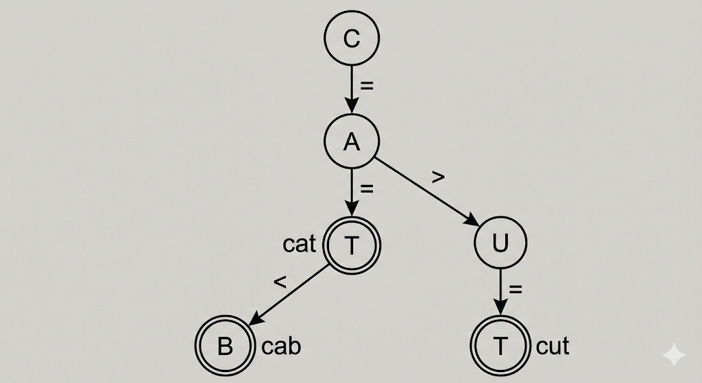

# 1-6. 이진탐색트리와 동일한 로직을 사용하면, 삼진탐색트리도 정의할 수 있을까요? 안 된다면 그 이유에 대해 설명해 주세요.

# 🌳 삼진 탐색 트리 (Ternary Search Tree) 가능성 

## 1. 결론: "안. 된. 다!!!" 🙅‍♂️

이진 탐색 트리랑 **완전히 똑같은 로직**으로는 삼진 트리를 만들 수 없어. 이건 사실 굉장히 쉬운 문제야.

### ■ 왜 불가능할까? (논리적 한계)

이진 트리는 숫자가 작거나 큰 경우, 딱 **[ 두 가지 ] **기준이라 가능했어. 그런데 삼진 트리는 무슨 기준으로 3개를 나눌 거야?

아마 똑똑한 여러분이라면 "같다(Equal)"를 생각했겠지? 하지만 트리는 검색을 위한 자료구조야. 값 찾으면 거기서 탐색 종료잖아? 중복을 허용해서 계속 내려가는 게 아니라면, 길을 만들 수가 없어. 그리고 중복을 허용한다고 해도 그 값을 큰 값이나, 작은 값이라고 쳐야 해.

> ■ 핵심: 하나의 키(Key)만 사용하는 대소 비교 로직으로는** [ 공간을 3개로 나눌 수 없다 ]**

- **■ 수학적 이유 (삼일률):**

  - x < K : 왼쪽 공간

  - x > K : 오른쪽 공간

  - x = K : 탐색 종료 (즉, 하위 공간으로 이동하지 않음)

  - **[ 결과 ]** 갈 수 있는 길은 결국 왼쪽, 오른쪽 [ 두 갈래 ]뿐이야.

---

## 2. 삼진 트리를 가능하게 하려면? (조건 변경)

그래도 꼭 3갈래로 나누고 싶다면 규칙이나 도구를 바꿔야 해.

### A. 기준 키(Key)를 늘린다 (B-Tree 계열)

노드 하나에 [ 키를 2개 (K1, K2) ] 저장하면 범위를 3개로 나눌 수 있어. (단, K1 < K2)

1. x < K1 : 왼쪽 자식

1. K1 < x < K2 : 중간 자식

1. x > K2 : 오른쪽 자식

👉 이게 바로 [ 2-3 Tree ] (차수가 3인 B-Tree)의 원리야.

---

여기부터는 내가 설명은 해주겠지만 가볍게 봐!

### B. 비교 대상을 바꾼다 (문자열 전용 TST) ✨

숫자 범위가 아니라 [ 문자열(String) ]을 저장할 때 쓰는 [ Ternary Search Tree (TST) ]라는 게 실제로 있어!
이건 숫자의 크기가 아니라, [ 글자 하나하나(Character) ]를 비교해서 길을 나눠.

1. Char < Node.Char : 작은 문자가 있는 [ 왼쪽 ]

1. Char = Node.Char : 다음 글자를 확인하는 [ 가운데 ] (Equal Kid)

1. Char > Node.Char : 큰 문자가 있는 [ 오른쪽 ]

👉 이건 수의 대소 관계가 아니라, [ 문자열의 접두사(Prefix) ] 일치 여부를 포함해서 3갈래로 나눈 거야.

---

## 3. 예시: 단어 3개 넣기 (cat, cab, cut)

이 세 단어를 순서대로 넣으면서 트리가 어떻게 변하는지 보여줄게.

### ① 1단계: cat 삽입 (맨 처음)

아무것도 없으니 그냥 쭉쭉 연결해서 만들어. (모두 가운데 자식으로 연결)

- c -(가운데)→ a -(가운데)→ t (단어 끝!)

### ② 2단계: cab 삽입

1. **■ 1번 글자 'c':** 루트 c랑 같네? → [ 가운데(Equal) ]로 이동, 다음 글자 'a' 준비.

1. **■ 2번 글자 'a':** 다음 노드 a랑 같네? → [ 가운데(Equal) ]로 이동, 다음 글자 'b' 준비.

1. **■ 3번 글자 'b':** 다음 노드 t랑 비교.

  - b는 t보다 작지? (사전 순서)

  - → t의 [ 왼쪽(Left) ]에 b를 매달아. (단어 끝!)

### ③ 3단계: cut 삽입

1. **■ 1번 글자 'c':** 루트 c랑 같네? → [ 가운데 ]로 이동, 다음 글자 'u' 준비.

1. **■ 2번 글자 'u':** 다음 노드 a(cat의 a)랑 비교.

  - u는 a보다 크지?

  - → a의 [ 오른쪽(Right) ]에 u를 매달아.

  - 그 밑으로 t를 연결하면 끝!

