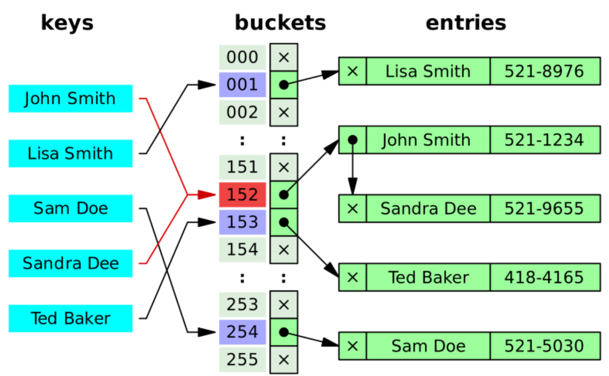
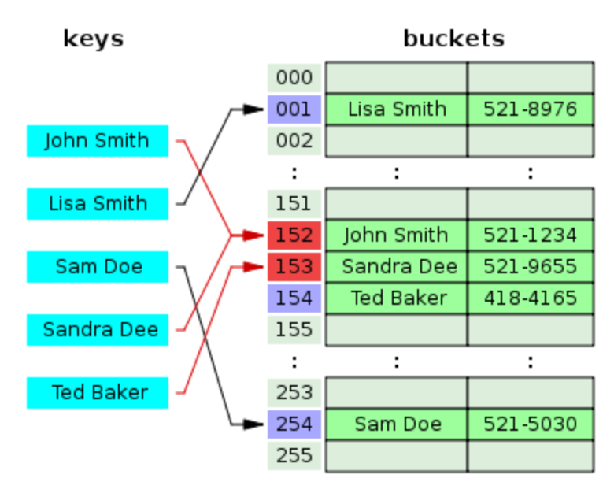

# 2-0. 해시(Hash) 자료구조에 대해 설명해 주세요.

# **1. 해시(Hash)**

### **1) 해시란?**

- 해시는 임의의 길이를 가진 데이터를 고정된 길이의 고유한 데이터(해시값)로 변환하는 알고리즘 및 기술.

- 예) 많은 물건이 섞여 있는 창고에서 내가 원하는 물건을 바로 찾아내는 시스템.

- Key와 Value를 매핑하여 데이터를 저장.

- 해시 함수를 사용하여 키를 특정 인덱스로 변환하며, 이를 통해 데이터의 추가, 삭제, 검색을 매우 빠르게 수행할 수 있다.

- **주요 목적**: 방대한 데이터 속에서 원하는 데이터를 효율적으로 찾기 위함.

### 2) 그냥 저장하면 안될까?

- Key값을 그대로 저장소의 Index로 사용할 경우, Key의 길이 만큼의 정보를 저장할 공간도 따로 마련해야 한다.

- Key의 길이가 제각각 일수 있기 때문에, 고정된 길이의 Hash로 변경한다.

- 즉, 관리하기 쉬운 형태로 변환하는 과정이다.

# **2. 주요 용어**

### 1) **해시 함수 (Hash Function)**

- 임의의 길이를 가진 데이터(Key)를 고정된 길이의 데이터(Value)로 변환하는 함수.

### 2) 키**(Key)**

- Hash function의 Input이 되는 값으로

### 3) **해시값(Hash Value/Code)**

- 해시 함수를 통해 나온 결과물로 배열의 인덱스로 활용.

### 4) **해시 테이블(Hash Table)**

- 해시 함수를 통해 계산된 Index 위치에 실제 데이터(Value)가 저장되는 자료구조.

### 5) **버킷(Bucket) 또는 슬롯(Slot)**

- 데이터가 저장되는 각각의 공간.

# **3. 작동 원리**

### **1) Key 입력**

- 사용자가 저장하거나 검색하려는 'Key'를 해시 함수에 넣는다.

### **2) 해시값 생성**

- 해시 함수는 고유한 인덱스 번호를 계산하여 반환한다.

### **3) 데이터 접근**

- 계산된 인덱스를 사용하여 해시 테이블의 특정 버킷에 직접 접근(Direct Access)한다.

# 4. 장단점

### 1) 장점

- **속도: **데이터가 아무리 많아도 Key-Value가 1:1로 매핑되어 있기 때문에, 시간복잡도가 O(1)로 데이터 저장, 삭제, 검색 속도가 매우 빠르다. 

- **효율성:** Key와 Value의 연관성이 뚜렷하여 코드가 직관적이다.

### 2) 단점

- **공간 효율성:** 충돌을 방지하기 위해 보통 실제 데이터보다 큰 메모리 공간을 미리 할당해야 하므로 공간 낭비가 발생할 수 있다. 공간을 만들었지만 공간에 채워지지 않는 경우가 발생하기 때문이다.

- **순서 없음:** 데이터가 인덱스 순서대로 저장되지 않으므로, 정렬된 순서로 접근해야 하는 경우에는 적합하지 않다.

- **해시 함수 의존도:** 성능이 해시 함수의 효율성에 크게 좌우된다.

# 5. Direct-address table

## 1) 정의

- 키의 전체 개수와 동일한 크기의 버킷을 가진 해시 테이블.

## 2) 장점

- 키의 개수와 테이블의 크기가 같기 때문에 해시 충돌 문제가 발생하지 않는다.

## 3) 단점

- 실제 사용하는 키가 몇 개 되지 않을 경우에는 전체 키의 갯수 만큼의 테이블 크기를 유지하는 것은 메모리 낭비가 될 수 있다.

- 예) 존재하는 키의 종류는 1만 가지이지만, 실제 사용하는 개수는 10개일 경우, 메모리가 낭비된다.

- 따라서 실제 키 개수보다 적은 해시 테이블을 운용한다.

# 6. 해시 충돌

## 1) 해시 충돌이란?

- 서로 다른 Key가 Hashing 후 같은 hash값이 나오는 경우가 있다. 이를 **해시 충돌**이라고 부른다.

## 2) 왜 해시 충돌이 날까?

- 앞서 말한 Direct-address table을 사용하면 해시 충돌을 막을 수 있으나, 현실의 데이터를 담기에는 메모리가 부족하다. 따라서 실제 키 개수보다 적은 해시 테이블을 운용한다.

- 해시 함수로 해시를 만드는 과정에서 서로 다른 Key가 같은 해시로 변경되면 같은 공간에 2개의 Value가 저장되므로 Key-Value가 1:1로 매핑되어야 하는 해시 테이블의 특성에 위배된다.

- 하지만 Direct-address table를 사용하지 않는 이상, 어떤 경우에서도 해시 충돌은 필연적으로 나타날 수 밖에 없다.

# 7. Chaining

## 1) Chaining

- 저장소(Bucket)에서 충돌이 일어나면 기존 값과 새로운 값을 연결리스트로 연결하는 방법이다.

- 실제 저장 장소에는 Key와 Value의 쌍으로 저장된다.

## 2) **장점**

- 미리 충돌을 대비해서 공간을 많이 잡아 놓을 필요가 없다. 따라서 충돌이 나면 그때 공간을 만들어서 연결만 해주면 된다.

## 3) **단점**

- 같은 Hash에 자료들이 많이 연결되면 검색 시 효율이 낮아진다.

# 8. 개방 주소법(Open Addressing)

## 1) 개방 주소법이란?

- 충돌이 일어나면 비어있는 hash에 데이터를 저장하는 방법이다.

- 개방 주소법의 해시 테이블은 hash와 value가 1:1관계를 유지한다.

- 예) 위의 그림에서 John과 Sandra의 hash가 동일해 충돌이 일어난다. 이때 Sandra는 바로 그 다음 비어있던 153 hash에 값을 저장한다. 그 다음 Ted가 테이블에 저장을 하려 했으나 본인의 hash에 이미 Sandra로 채워져 있어 Ted도 Sandra처럼 바로 다음 비어있던 154 hash에 값을 저장한다.

## 2) 비어있는 Hash를 찾는 방법

- 선형탐색

  - 해시값에서 고정폭으로 건너 뛰면서 비어있는 해시가 나오면 저장한다.

  - 특정 해시값 주변 버킷이 모두 채워져 있는 primary clustring 문제에 취약하다.

- 제곱탐색

  - 고정폭이 아닌 1칸 -> 4칸 -> 9칸 -> 16칸 씩 건너 뛰면서 빈 칸은 찾는다.

  - 해시값이 같은 해시들이 들어오면 공간을 많이 확보해야 한다.

# 9. 해시 함수의 종류

- **Division Method**

  - 가장 직관적이고 널리 쓰이는 방법.

  - **원리**: 키(k)를 테이블의 크기(m)로 나눈 나머지를 주소로 사용한다.

h(k) = k \mod m

  - **장점**: 연산이 매우 빠르고 단순하다.

  - **주의점**: 테이블 크기 m을 소수(Prime Number)로 정하는 것이 권장된다. 만약 m이 2의 거듭제곱(2^n)이라면 키의 하위 비트에만 의존하게 되어 충돌이 잦아질 수 있는데, 소수를 쓰면 데이터가 더 골고루 퍼지기 때문이다.

  - **메모리** **관련**: m을 소수로 맞추다 보면 실제 필요한 데이터 양보다 테이블이 조금 더 커질 수 있어 약간의 빈 공간이 생길 수 있다.

- **Multiplication Method**

  - 메모리 크기를 유연하게 결정할 수 있는 방법.

  - **원리:** 0과 1 사이의 실수 A를 키(k)에 곱한 뒤, 소수점 아랫부분만 추출하여 테이블 크기 m과 곱한다. 이후 소수점을 버리고 정수만 취한다.

h(k) = \lfloor m(kA \mod 1) \rfloor

  - **장점:** Division method와 달리 **m****(테이블 크기)이 소수일 필요가 없다.** 보통 컴퓨터 연산에 최적화된 2의 거듭제곱(2^n)으로 m을 설정한다.

  - **특징:** 실수 A의 값에 따라 성능이 좌우되는데, 황금비(\frac{\sqrt{5}-1}{2} \approx 0.618)를 A값으로 쓸 때 성능이 좋다고 알려져 있다.

- **Universal Hasing**

  - 보안과 최악의 성능 저하를 방지하기 위한 전략.

  - **원리:** 미리 정의된 여러 개의 해시 함수 집합(H)에서 **하나를 무작위로 선택**하여 해시값을 만든다.

  - **목적:** 특정 키 값들이 계속해서 충돌을 일으키도록 유도하는 '해시 공격'을 방지한다.

  - **장점:** 같은 키 세트라도 프로그램을 실행할 때마다 선택되는 함수가 달라지므로, 특정 데이터셋에 대해 성능이 극단적으로 나빠지는 것을 수학적으로 방지할 수 있다. 즉, 어떤 데이터가 들어와도 평균적인 성능을 보장한다.

# 10. Java에서 사용하는 Hash 방법

| **종류** | **Hashtable** | **HashMap** |
| --- | --- | --- |
| **동기화 (Synchronization)** | **지원함 (Thread-Safe)** | **지원하지 않음** |
| **성능** | 상대적으로 느림 | 상대적으로 빠름 |
| **Null 허용 여부** | Key, Value 모두 **Null 불가** | Key(1개), Value(여러 개) **Null 허용** |
| **등장 시기** | JDK 1.0 (Legacy 클래스) | JDK 1.2 |
| **반복자 (Iterator)** | Enumeration 사용 | Iterator 사용 (Fail-fast 지원) |

## 1) HashMap을 더 많이 사용하는 이유?

- 동기화 성능(Thread-safe)

  - **Hashtable:** 메서드 전체에 synchronized 키워드가 붙어 있다. 멀티스레드 환경에서는 안전하지만, 단일 스레드 환경에서도 매번 락(Lock)을 걸기 때문에 **성능 오버헤드**가 발생한다.

  - **HashMap:** 동기화 처리가 되어 있지 않아 속도가 빠르다. 만약 멀티스레드 환경에서 동기화가 필요하다면 ConcurrentHashMap이라는 더 세련된 대안이 있기 때문에 Hashtable은 사실상 잘 쓰이지 않는다.

- Null 허용의 유연성

  - **HashMap**은 키나 값에 null을 넣을 수 있어 프로그래밍할 때 더 유연하다. 반면 Hashtable에 null을 넣으면 바로 NullPointerException이 발생한다.

## 2) **Chaining 방식 사용**

- Java의 HashMap은 기본적으로 Separate Chaining(충돌 나면 기차 칸처럼 연결하는 방식)을 사용한다.

- **Tree 구조로 변환 (Java 8+):** 한 버킷에 데이터가 너무 많이 쌓이면(충돌이 8개 이상 발생하면), 연결 리스트(Linked List)를 **Red-Black Tree**로 변환한다.

  

  
**변환하기 위해 충족 되어야하는 두 가지 조건**

**① 첫 번째 조건: 한 버킷에 노드가 8개 이상 (TREEIFY_THRESHOLD)**

    - 특정 해시 버킷 하나에 데이터가 8개 쌓이면 변환 후보가 된다.

    - **왜 하필 8인가?**

수학적으로(푸아송 분포 사용) 해시 함수가 데이터를 골고루 뿌려준다면, 한 버킷에 8개가 쌓일 확률은 **0.00000006%** 정도로 극히 낮습니다. 즉, 8개가 쌓였다는 건 해시 함수가 제 역할을 못 하거나 데이터가 아주 편중된 비정상적인 상황으로 간주하는 것이다.

**
② 두 번째 조건: 전체 테이블 크기가 64 이상 (MIN_TREEIFY_CAPACITY)**

    - 한 버킷에 8개가 쌓였더라도, **전체 테이블 크기(배열의 길이)가 64보다 작으면 트리를 만들지 않는다.**

    - **이유:** 테이블 크기가 너무 작을 때는 트리를 만드는 것보다, **테이블 크기를 2배로 늘리고 재배치(Resize 또는 Rehash)**하는** **것이 충돌을 해결하는 데 더 효과적이고 메모리도 아낄 수 있기 때문이다.
  

- **이유:** 리스트는 탐색 성능이 O(n)이지만, 트리는 O(\log n)이므로 최악의 성능 저하를 막기 위함이다.

## 3) 요약

- **일반적인 경우:** 무조건 HashMap을 사용.

- **멀티스레드 환경이 필요한 경우:** Hashtable 대신 ConcurrentHashMap을 사용. Hashtable보다 훨씬 성능이 좋으면서도 안전하기 때문이다.

- **데이터의 순서가 중요한 경우:** LinkedHashMap이나 TreeMap을 고려.
