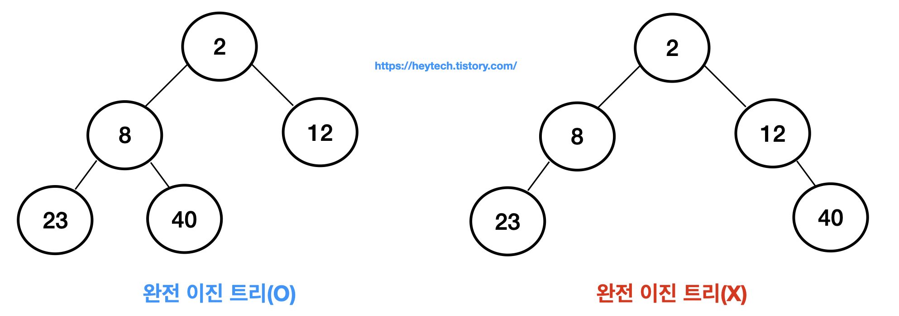
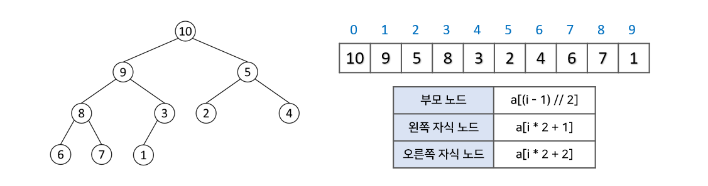
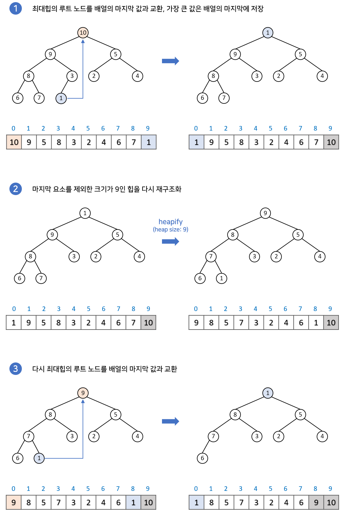

# 2-1. 힙을 배열로 구현한다고 가정하면, 어떻게 값을 저장할 수 있을까요?

**힙은 완전 이진 트리이므로 별도의 포인터 없이 배열의 인덱스와 노드 위치를 1대1로 대응시켜 빈틈없이 저장할 수 있다. 보통 계산 편의를 위해 1번 인덱스를 루트로 설정하며, 부모 인덱스는 ****`자식/2`****, 자식 인덱스는 ****`부모*2(왼쪽)`****와 ****`부모*2+1(오른쪽)`**** 공식을 통해 접근한다.**

---

## 🏗️ 힙을 왜 배열로 구현하는가? (구현 원리와 효율성)

### 1. 힙의 전제 조건: 완전 이진 트리 (Complete Binary Tree)

힙은 기본적으로 **완전 이진 트리** 구조를 가진다. 완전 이진 트리의 핵심 조건은 다음과 같다.

- **형태 조건:** 마지막 레벨을 제외한 모든 노드가 완전히 채워져 있어야 한다.

- **순서 조건:** 마지막 레벨은 **왼쪽에서 오른쪽 방향으로** 빈칸 없이 채워져야 한다.

이처럼 노드가 '왼쪽부터 빈칸 없이' 채워지는 특징 덕분에 중간에 비는 공간이 발생하지 않는다. 따라서 트리 구조임에도 불구하고 메모리 낭비 없이 **배열(Array)**에 순서대로 데이터를 담는 것이 가능하다.

---

### 2. 배열 인덱스 산출 공식

배열로 구현할 때의 핵심은 인덱스 계산만으로 부모와 자식 노드의 위치를 찾아내는 것이다.

### 1번 인덱스 시작 기준 (가장 직관적임)

- **부모 인덱스:** `자식 인덱스 / 2` (나머지 버림)

- **왼쪽 자식 인덱스:** `부모 인덱스 * 2`

- **오른쪽 자식 인덱스:** `부모 인덱스 * 2 + 1`

### 0번 인덱스 시작 기준 (Java 등 실제 언어 구현 시)

- **부모 인덱스:** `(자식 인덱스 - 1) / 2`

- **왼쪽 자식 인덱스:** `부모 인덱스 * 2 + 1`

- **오른쪽 자식 인덱스:** `부모 인덱스 * 2 + 2`

(띵쌤이 1번 인덱스 기준으로 하면 편하다고 하셨었죠..?)

---

### 3. 힙의 상태 유지: 힙 정렬 (Heapify)

힙은 삽입과 삭제가 일어날 때마다 루트 노드에 최댓값 혹은 최솟값이 위치하도록 구조를 재정렬해야 한다.

- **삽입 (Sift-up):** 가장 마지막 인덱스에 값을 추가한 뒤, 부모 노드와 비교하며 힙의 조건을 만족할 때까지 위로 올린다.

- **삭제 (Sift-down):** 루트 노드를 제거하고 그 자리에 가장 마지막 노드를 옮긴다. 이후 자식 노드들과 비교하며 아래로 내려보내 제자리를 찾게 한다.
즉 힙의 삭제는 힙의 종류에 따라 최대 값 or 최소 값만 가능하다

---

### 4. 복잡도 및 공간 분석

| **작업** | **시간 복잡도** | **이유** |
| --- | --- | --- |
| **삽입 (Insert)** | O(\log N) | 트리의 높이(\log N)만큼 비교를 수행함. |
| **삭제 (Delete)** | O(\log N) | 루트를 채운 마지막 노드가 바닥까지 내려갈 수 있음. |
| **최대/최소 조회** | O(1) | 루트 노드(배열의 첫 번째 요소)만 확인하면 됨. |
| **힙 구성 (Build)** | O(N) | 모든 노드에 대해 수행 시 수학적으로 N에 수렴함. |

- **공간 복잡도:** O(N). N개의 데이터를 담을 연속된 배열 공간이 필요하다.

- **배열의 크기:** 1번 인덱스부터 사용할 경우, 힙에 담길 최대 데이터 개수보다 1 큰 **N+1** 크기의 배열이 필수적이다.

---

### 5. 왜 연결 리스트(Linked List)보다 배열인가?

힙을 배열로 구현하는 것에는 명확한 성능적 이점이 존재한다.

1. **메모리 효율:** 연결 리스트는 자식 노드를 가리키는 포인터(참조값)를 위한 추가 메모리가 필요하다. 반면 배열은 인덱스 연산만으로 위치를 알 수 있어 **포인터 오버헤드**가 없다. (저번에 했었죠..? 참조값은 8byte)

1. **캐시 지역성 (Cache Locality):** 배열은 데이터가 메모리상에 연속적으로 배치되어 있다. 이는 CPU가 데이터를 읽어올 때 캐시 히트율(Cache Hit Rate)을 높여주어, 포인터를 따라 여기저기 이동해야 하는 연결 리스트보다 실제 실행 속도가 훨씬 빠르다.

---

### 💡 스터디 마무리 요약

힙은 완전 이진 트리라는 구조적 규칙성 덕분에 배열이라는 선형 자료구조를 사용하여 트리의 계층 구조를 완벽하게 표현할 수 있다. 이를 통해 부모-자식 관계를 $O(1)$의 수식으로 찾아내고, 데이터의 삽입과 삭제를 O(\log N)의 효율로 처리하는 강력한 우선순위 큐를 구현할 수 있게 된다.

---

+

이진트리, 완전이진트리

이진 탐색 트리

이진트리 vs 완전이진트리(왼쪽부터 채워짐)

이진탐색트리는, 이진트리를 이용하여 탐색에 이점을 갖는 자료구조를 만든 것.

⇒ 탐색에 이점을 가지려면 편향이 되어 있으면 안좋음
