# 3-0. BBST (Balanced Binary Search Tree)와 그 종류에 대해 설명해 주세요.

# 3. BBST (Balanced Binary Search Tree)와 그 종류에 대해 설명해 주세요.

킹피디의 지금 내용 요약본  

# 3. BBST (Balanced Binary Search Tree)

## 1. BBST란?

  - *BBST(균형 이진 탐색 트리)**는

이진 탐색 트리(BST)의 성질을 유지하면서,

트리의 높이가 한쪽으로 치우치지 않도록 **자동으로 균형을 조정하는 트리**이다.

  - 노드 삽입·삭제 시 트리를 재조정하여 불균형을 방지

  - 최악의 경우에도 **탐색 / 삽입 / 삭제 = O(log n)** 보장

### 왜 필요한가?

  - 일반 BST → 한쪽으로 치우치면 **O(n)** 까지 성능 저하

  - BBST → 항상 **높이 O(log n)** 유지

---

## 2. BBST의 핵심 특징 (압축본)

  - **BST 규칙 유지**: 왼쪽 < 루트 < 오른쪽

  - **삽입·삭제 후에도 자동으로 균형 유지**

  - *회전(Rotation)**을 통해 트리 높이 차이를 제한

---

## 3. BBST의 주요 종류 (종합)

| 자료구조 | 핵심 특징 | 시간 복잡도 | 장점 | 단점 |
| --- | --- | --- | --- | --- |
| **AVL 트리** | 서브트리 높이 차이를 **1 이하**로 유지 | O(log n) | 탐색 속도 가장 빠름 | 회전이 잦아 삽입/삭제 비용 큼 |
| **Red-Black 트리** | 노드 색(Red/Black) 규칙으로 균형 유지 | O(log n) | 삽입·삭제 효율적, 실무 활용도 높음 | AVL보다 탐색 약간 느림 |
| **B-트리** | 한 노드에 **여러 키 저장** (다차 트리) | O(log n) | 디스크 I/O 최적화 | 메모리 구조 복잡 |
| **B+ 트리** | 데이터는 리프 노드에만 저장 | O(log n) | 범위 검색 매우 효율적 | 항상 리프까지 탐색 필요 |
| **Treap** | BST + Heap, 랜덤 우선순위 | 기대 O(log n) | 구현 비교적 단순 | 확률적 균형 |

---

## 4. AVL 트리 (요약)

  - 왼쪽·오른쪽 서브트리 높이 차이 ≤ 1

  - `Balance Factor = 왼쪽 높이 - 오른쪽 높이`

  - 불균형 발생 시 **회전(Rotation)** 수행

  - 4가지 경우 존재: **LL, RR, LR, RL**

📌 **탐색 위주 시스템에 적합**

---

## 5. Red-Black 트리 (요약)

### 핵심 규칙

  - 노드는 Red 또는 Black

  - 루트와 리프는 Black

  - Red 노드는 연속 불가

  - 모든 경로의 Black 노드 수 동일

### 균형 유지 방법

  - **Recoloring**

  - **Restructuring(Rotation)**

📌 **삽입·삭제가 빈번한 경우 적합**

📌 Java `TreeMap`, C++ `map` 내부 구현

---

## 6. AVL vs Red-Black 한 방 비교

| 항목 | AVL | Red-Black |
| --- | --- | --- |
| 균형 엄격도 | 높음 | 낮음 |
| 탐색 성능 | 빠름 | 보통 |
| 삽입/삭제 | 비용 큼 | 효율적 |
| 사용처 | 탐색 중심 | 실무 전반 |

---

## 7. B-트리 & B+ 트리 (정리)

### B-트리

  - 다수의 키를 한 노드에 저장

  - 모든 리프 노드 깊이 동일

  - DB, 파일 시스템에서 사용

### B+ 트리

  - **데이터는 리프 노드에만 저장**

  - 리프 노드가 **연결 리스트**

  - **범위 검색·순차 탐색 최강**

📌 대부분의 **DB 인덱스 표준**

---

## 8. Treap (참고)

  - BST + Heap 구조

  - 우선순위를 랜덤으로 부여

  - 확률적으로 균형 유지

📌 코딩 테스트, 이론 문제에 가끔 등장

---

## 🔑 최종 한 줄 요약

> BBST는 이진 탐색 트리의 성질을 유지하면서 회전과 규칙을 통해 트리 높이를 균형 있게 관리하여 모든 연산을 O(log n)에 수행하도록 보장하는 자료구조이다.

## 1. BBST란? (Balanced Binary Search Tree)

> Note 

  - BBST(균형 이진 탐색 트리)는

👉 **이진 탐색 트리(BST)의 성질**을 유지하면서

👉 **트리의 높이를 균형 있게 유지**하도록 설계된 자료구조

👉**불균형한 상태를 피하기 위해 노드 삽입 또는 삭제 시에 트리를 재조정해 균형을 유지하도록 함**

특정 노드에 대해 최악의 경우에도 탐색, 삽입, 삭제 연산이 `O(log n)`의 시간 복잡도를 가지도록 설계된 **이진 탐색 트리**

### 🔹 왜 필요한가?

일반 BST는 최악의 경우 한쪽으로 쏠려서 **연결 리스트처럼** 될 수 있음

→ 이 경우 탐색/삽입/삭제가 **O(N)** 까지 떨어짐

BBST는 이 문제를 해결해서

✔️ **트리 높이를 O(log N)** 으로 유지

✔️ 탐색 / 삽입 / 삭제 모두 **O(log N)** 보장

---

## 2. BBST의 핵심 특징 

- **이진 탐색 트리의 기본 규칙**(왼쪽 < 루트 < 오른쪽)을 따른다.

- **삽입과 삭제 이후에도 트리의 균형을 자동으로 유지한다.**

- **회전(Rotation) 연산을 통해 트리 높이의 편차를 제한한다.**

## 3. BBST의 종류

| 자료구조 | 설명 | 검색 시간 복잡도 | 삽입 시간 복잡도 | 삭제 시간 복잡도 | 장점 | 단점 |
| --- | --- | --- | --- | --- | --- | --- |
| **AVL 트리** | 노드의 왼쪽 서브트리와 오른쪽 서브트리의 **높이 차이가 1을 넘지 않도록 유지**하는 균형 이진 탐색 트리 | O(log n) | O(log n) | O(log n) | ✅ 탐색이 매우 빠름
📌**탐색이 많은 경우**에 적합 | ❌ 삽입/삭제 시 회전이 자주 발생 → 비용 증가  |
| **레드-블랙 트리** | 노드가 **Red 또는 Black 색상**을 가지며, 색깔 규칙을 통해 균형을 유지하는 이진 탐색 트리 | O(log n) | O(log n) | O(log n) | ✅ 삽입/삭제가 AVL보다 적은 회전
✅ 실제 구현에서 효율적
📌 **삽입/삭제가 빈번한 경우**에 적합
📌 Java `TreeMap`, C++ `map` 내부 구현 | ❌ AVL보다 탐색은 약간 느림 |
| **B-트리** | 하나의 노드에 **여러 개의 정렬된 키**를 저장하여 효율적인 삽입·삭제·검색을 수행하는 자기 균형 탐색 트리 | O(log n) | O(log n) | O(log n) | 📌 **메모리보다 디스크 I/O가 중요한 환경** |   |

💡 **말로 설명할 때 한 줄 포인트**

- AVL: _“가장 엄격하게 균형을 맞춘다”_

- 레드-블랙: _“조금 느슨하지만 실무에서 많이 쓴다”_

- B-트리: _“DB와 파일 시스템에서 쓰인다”_

---

### **💡AVL 트리(Adelson-Velsky and Landis 트리)**

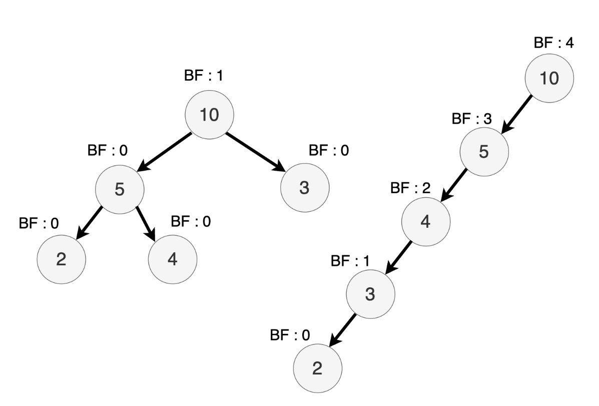

- AVL 트리는 각 노드의 왼쪽 서브트리와 오른쪽 서브트리의 높이 차이가 최대 1이 되도록 유지하는 이진 탐색 트리

- AVL 트리는 삽입 또는 삭제 연산 후에 자동으로 균형을 유지하기 위해 회전 연산을 사용

- `Balance Factor`가 항상 [-1,0,1] 이어야 한다

- AVL 트리의 장점은 탐색, 삽입, 삭제 연산의 시간 복잡도가 O(log n)으로 매우 효율적이지만 AVL 트리는 균형을 유지하기 위해 회전 연산이 필요하므로 일반적인 이진 탐색 트리보다는 조금 더 복잡한 구현이 필요함

- AVL 트리는 자주 변경되는 데이터 셋에 적합하며, 데이터의 삽입과 삭제가 빈번한 경우에도 균형을 유지하여 항상 빠른 탐색 속도를 제공할 수 있습니다.

> Note BF(K) = K의 왼쪽 서브트리 높이 - K의 오른쪽 서브트리 높이

**단일 회전: 왼쪽 회전(Left Rotation)**

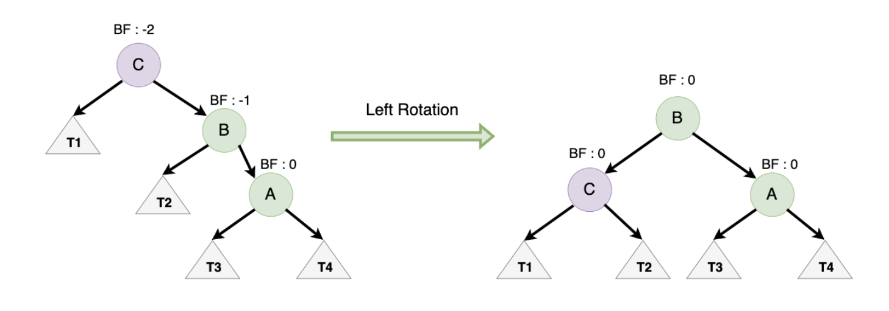

**AVL 트리의 경우 균형을 유지하기 위해 왼쪽으로 기울어져 있을 때는 오른쪽으로 회전을 수행**

- 오른쪽 자식 노드를 루트로 승격시키고, 불균형 노드를 오른쪽 자식의 왼쪽 서브트리로 이동

**단일 회전 : 오른쪽 회전(Right Rotation)**

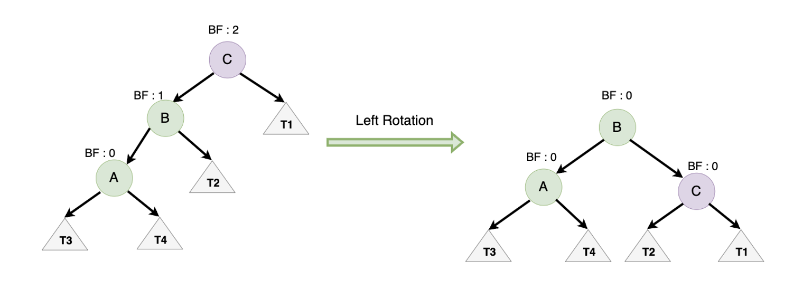

- 왼쪽 자식 노드를 루트로 승격시키고, 불균형 노드를 왼쪽 자식의 오른쪽 서브트리로 이동

**`AVL트리`****는 ****`LL`****, ****`LR`****, ****`RL`****, ****`RR`**** 4가지 균형이 무너진 경우가 존재**

### LL(Left-Left)

회전 1회, 오른쪽 방향으로 회전

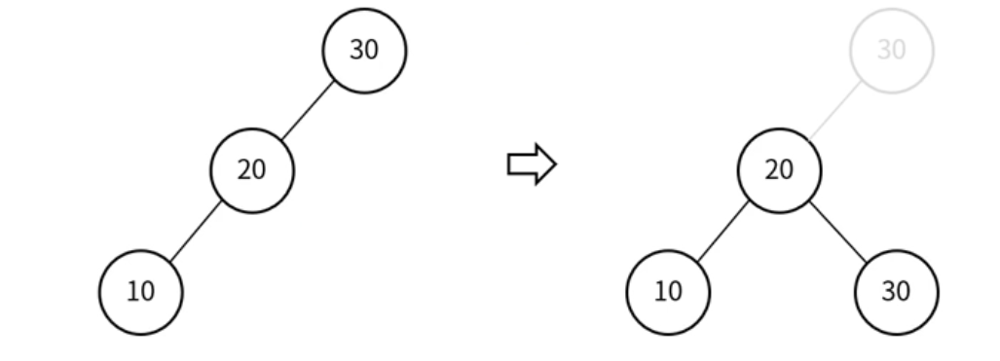

### RR(Right-Right)

회전 1회, 왼쪽 방향으로 회전

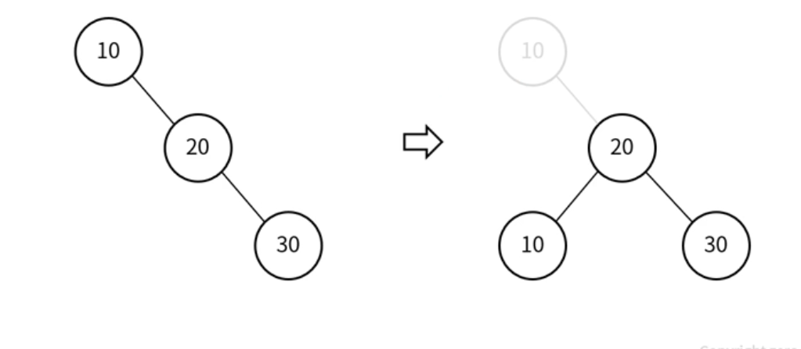

### LR(Left-Right)

회전 2회, RR 회전 후 LL 회전

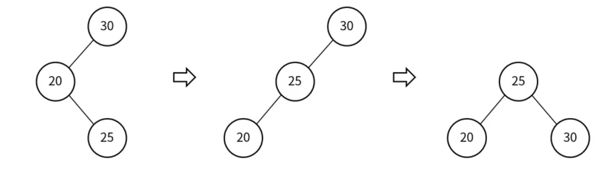

### RL(Right-Left)

회전 2회, LL 회전 후 RR 회전

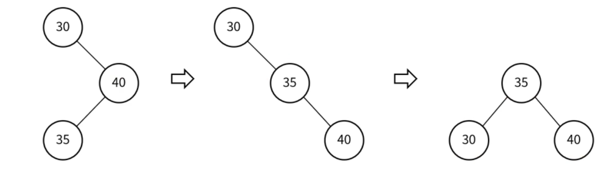

[https://velog.io/@dnrwhddk1/균형-이진-트리에-대해-자세히-알아보기-비선형-자료구조](https://velog.io/@dnrwhddk1/%EA%B7%A0%ED%98%95-%EC%9D%B4%EC%A7%84-%ED%8A%B8%EB%A6%AC%EC%97%90-%EB%8C%80%ED%95%B4-%EC%9E%90%EC%84%B8%ED%9E%88-%EC%95%8C%EC%95%84%EB%B3%B4%EA%B8%B0-%EB%B9%84%EC%84%A0%ED%98%95-%EC%9E%90%EB%A3%8C%EA%B5%AC%EC%A1%B0)

---

### **💡 레드-블랙 트리(Red-black tree)**

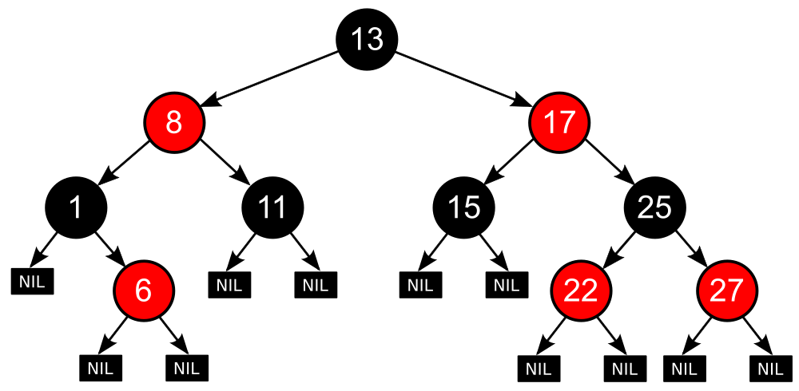

### 균형 이진 탐색의 하나의 종류로 각 노드가 레드 또는 블랙인 색깔을 가지며, 특정한 규칙을 따르는 균형 이진 탐색트리를 의미

**💡 레드-블랙 트리(Red-black Tree) 특징**

- 균형을 유지하면서도 효율적인 검색 연산을 수행할 수 있다. 이 트리는 데이터베이스 시스템, 운영체제에서의 스케줄링 알고리즘 등 다양한 분야에서 활용됨

- 레드-블랙 트리는 균형을 유지하므로, 삽입, 삭제, 탐색 연산의 시간 복잡도가 `O(log n)`

- 루트 노드와 리프 노드의 색은 black

- red 색 노드의 자식은 black(double red 불가)

- 어떤 노드로부터 리프 노드까지의 모든 경로에는 동일한 수의 블랙(Black) 노드가 있다.

- `레드-블랙 트리`에서 새로운 노드를 삽입할 때 새로운 노드는 항상 `빨간색`으로 삽입

- 삽입(insertion)과 삭제(deletion) 연산을 수행할 때, 트리의 균형을 유지하기 위해 회전(rotations)과 색깔 변경(color flips)을 사용

### 레드 블랙 트리는 이러한 문제를 해결하기 위해 2가지 전략을 사용한다

**Restructuring, Recoloring**

새로 삽입할 노드를 N(New), 부모 노드를 P(Parent), 조상 노드를 G(Grand Parent), 삼촌 노드를 U(Uncle) 라고 할 때

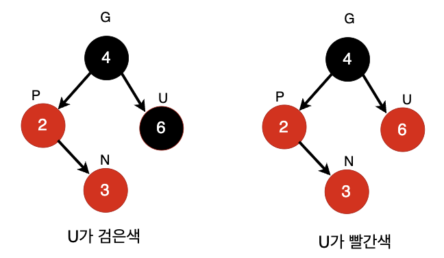

- 삼촌 노드가 `검은색`이라면 -> Restructuring을 수행하면 됨

- 삼촌 노드가 `빨간색`이라면 -> Recoloring을 수행하면 됨

1. 새로운 노드, 부모 노드, 조상 노드를 오름차순으로 정렬

1. 셋 중 중간값을 부모로 만들고 나머지 둘을 자식으로 만듦

1. 새로운 부모가 된 노드를 검은색으로 만들고 나머지 자식들을 빨간색으로 만듦

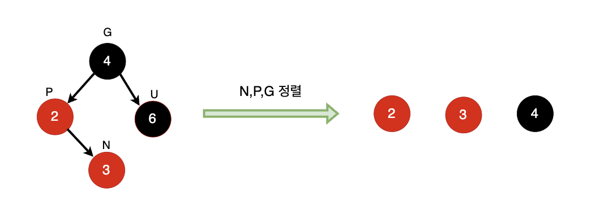

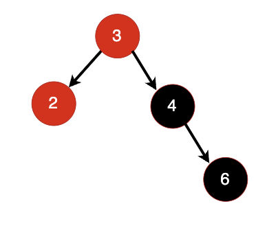

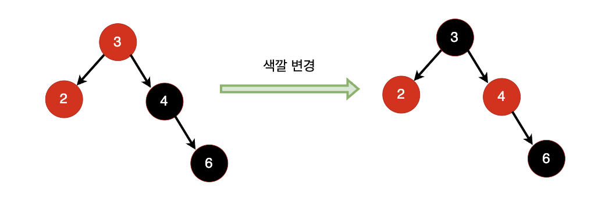

### Recoloring

1. 새로운 노드의 부모와 삼촌을 검은색으로 바꾸고 조상을 빨간색으로 바꿈1-1. 조상이 루트 노드라면 검은색으로 바꿈1-2. 조상을 빨간색으로 바꿨을 때 또 다시 `Double Red Problem`이 발생한다면 `Restructuring` 혹은 `Recoloring`을 진행해서 `Double Red Problem` 문제가 발생하지 않을 때까지 반복

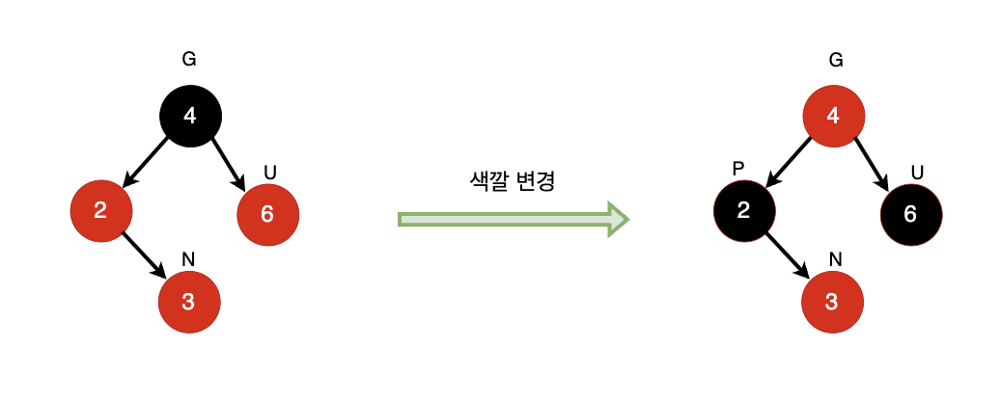

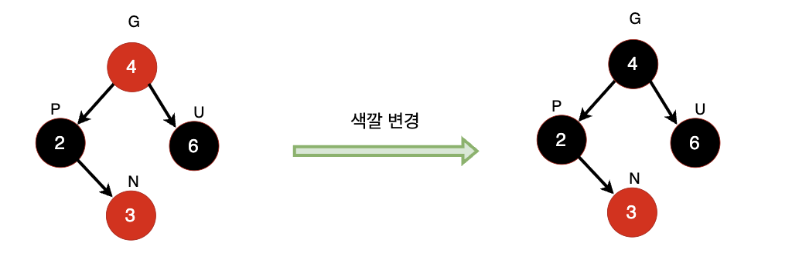

`검은`색 노드는 2번 나와도 **문제 없음**

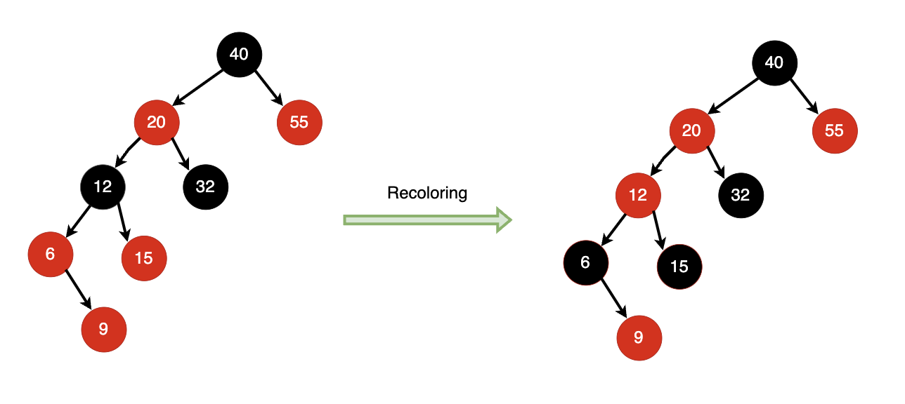

• **Recoloring**을 수행하더라도`Double Red Problem`이 발생

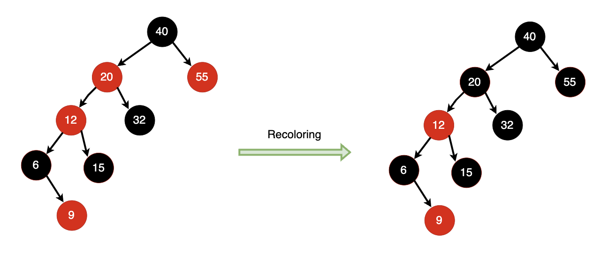

### 레드-블랙 트리 삭제 과정

1. 삭제할 노드를 찾음

1. 삭제할 노드의 자식이2-1. **둘인 경우**, 없앨 노드의 오른쪽 서브트리의 가장 왼쪽 노드(또는 왼쪽 서브트리의 가장 오른쪽 노드)로 바꾸고, 그 리프 노드를 제거2-2. **하나인 경우**, 삭제되는 노드의 부모노드와 자식노드를 연결시킴2-3. **없는 경우**, 노드를 없애면 됨

1. 삭제되는 노드의 색깔이 **빨간색**인 경우, 여전히 레드블랙트리의 규칙을 만족하므로 삭제 완료3-1. 삭제되는 노드가 **검은색**인 경우, 그 자리를 대체하는 노드를 **검은색**으로 칠함

> 대체하는 노드 역시 검은색인 경우, 이중 흑색노드가 발생

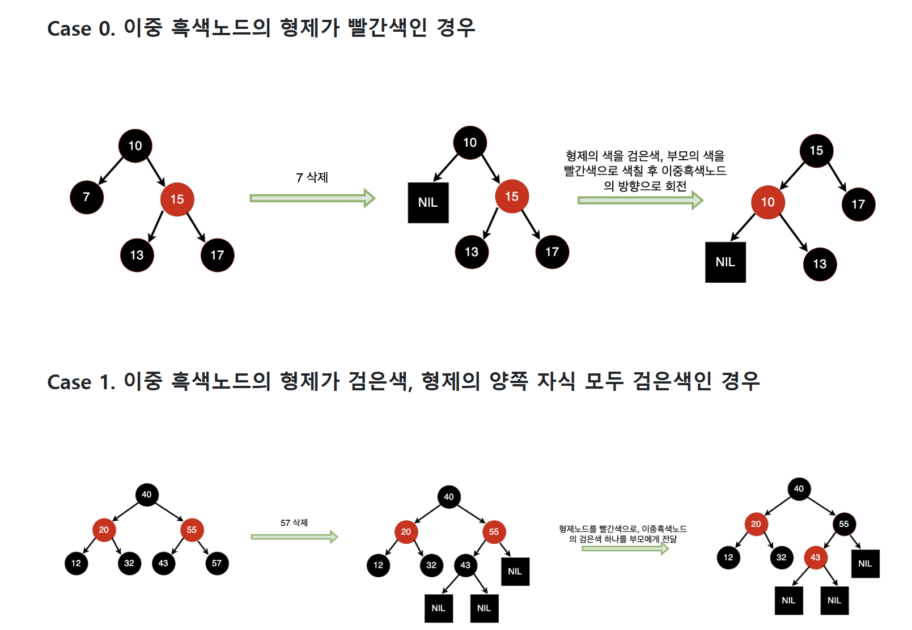

### Red-Black 트리 vs AVL 트리

알고리즘 시간 복잡도 -> 둘다 O(logN)

균형 수준 -> AVL 트리가 Red-Black 트리보다 좀 더 엄격하게 균형 잡음

Red-Black 트리는 색으로 구분하는 경우로 인해 회전 수가 감소

실사용시

- > Tree 체계가 잡힌 후, 탐색이 많은 경우에는 AVL 트리가 유리

- > 삽입,삭제가 빈번한 경우에는 Red-Black 트리가 유리

---

### B-트리

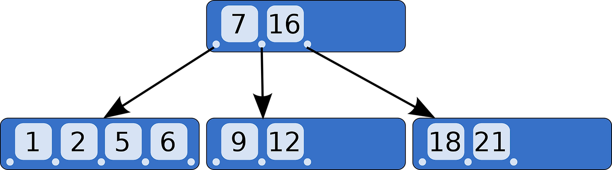

**💡 B-트리 기본구조**

**1. 하나의 노드에는 ‘여러 개의 키’와 자식 노드를 가리키는 ‘자식 포인터’로 구성이 되어 있습니다.**

**2. B-트리의 루트 노드, 내부 노드 및 리프노드로 구성이 되어 있습니다.**

- 루트 노드는 트리의 가장 위에 있는 노드이며 자식 노드를 가리키는 포인터를 포함하고 있다

- 리프 노드는 실제 데이터나 데이터를 가리키는 포인터를 저장

- 데이터베이스와 파일 시스템에서 널리 사용되는 다방향 트리로, 많은 데이터를 효율적으로 저장하고 검색할 수 있음

**💡 B-트리의 주요 특징**

**1. 균형 구조**

- B-트리는 균형을 유지하며, 모든 리프 노드가 동일한 레벨에 위치합니다. 이는 트리가 검색 작업에 대해 효율적인 상태를 유지하도록 합니다.

**2. 다중 키**

- B-트리의 각 노드는 여러 개의 키와 해당 값들을 포함할 수 있습니다. 이는 대량의 데이터를 효율적으로 저장하고 검색할 수 있게 해 줍니다.

**3. 분할과 병합**

- B-트리의 노드가 가득 차면, 노드는 두 개의 노드로 분할되고, 한 개의 키는 상위 노드로 이동됩니다. 반대로, 노드가 너무 비어 있으면 인접한 노드와 병합될 수 있습니다. 이는 트리가 균형을 유지하도록 합니다.

**4. 자식 포인터**

- B-트리의 각 노드는 자식 노드를 가리키는 포인터를 포함합니다. 이 포인터들은 검색 작업 중에 트리를 효율적으로 탐색하는 데 도움을 줍니다.

### **[3. B-트리 검색과정](https://adjh54.tistory.com/324#3.%20B-%ED%8A%B8%EB%A6%AC%20%EA%B2%80%EC%83%89%EA%B3%BC%EC%A0%95-1-16)**

**B-트리 검색 과정은 대소관계의 비교를 통해 ‘가능성을 제한’함으로써 검색이 감소하게 하는 방법입니다. **

찾으려는 값이 19일 때

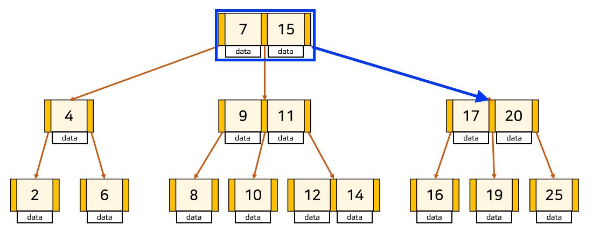

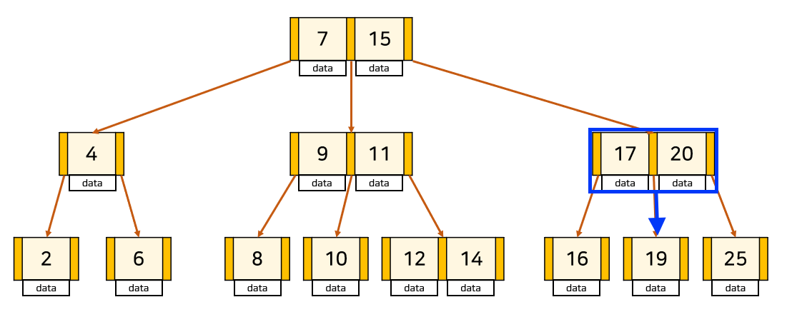

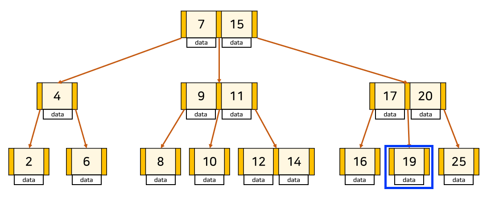

**💡 최종적으로 대소 관계를 통하여서 ‘가능성을 제한’하여 검색을 감소하여 최적화된 검색 방법임**

→ 제목에 링크 달았음

### 2-3-4 트리

- `2-3-4 트리`는 `B-트리`의 특별한 경우로, 각 노드가 2개, 3개 또는 4개의 자식을 가질 수 잇는 균형 잡힌 트리

- 검색, 삽입, 삭제 연산의 시간 복잡도를 `O(log n)`으로 보장

---

## B+ Tree

### B+ Tree

**B-Tree의 변형 (DB 표준)**

### 🔹 특징

  - 실제 데이터는 **리프 노드에만 저장**

  - 리프 노드가 **연결 리스트** 형태

  - 범위 검색(Range Query)에 매우 유리

📌 대부분의 **RDBMS 인덱스**에서 사용

  - 바이너리 트리와 개념적으로 비슷

    - key 값으로 정렬되어 있다.

    - childern 노드가 여러개이다.

  - 각 노드가 메모리가 아닌 디스크에 저장한다.

  - 데이터는 leaf 노드에만 있다.

  - 각 노드에 sibling(형제)으로 가는 포인터가 있다.

### [더 자세한 특징 설명]

> 리프 노드에만 데이터 저장: B+ 트리의 리프 노드에는 실제 데이터만 저장되고, 키 값은 인덱스 역할을 수행합니다. 이는 데이터베이스의 범위 검색과 정렬된 결과 반환에 유리합니다.키 값의 중복을 허용하지 않음: B+ 트리는 키 값의 중복을 허용하지 않습니다. 각 키 값은 유일해야 합니다.리프 노드 간의 연결: B+ 트리의 리프 노드는 연결 리스트 형태로 연결되어 있어 범위 검색과 순차 접근에 효율적입니다.

### Q) INDEX 구현시 B-tree가 아닌 B+tree 알고리즘을 사용하는가?

**`결론`**: B-Tree의 단점 때문이다.

B-Tree는 탐색을 위해서 노드를 찾아서 이동해야 한다는 단점이 있습니다.

즉, 모든 데이터를 순회하는 경우, 모든 노드를 방문해야해서 비효율적입니다.

> 이러한 단점을 해소하고자 B+Tree는 같은 레벨의 모든 키값들이 정렬되어 있고, 같은 레벨의 Sibiling(동기) node는 연결 리스트 형태로 이어져 있습니다.

## B+tree 장단점

---

### 장점

> 효율적인 탐색 : B+ 트리는 균형 잡힌 트리로서, 모든 리프 노드까지 도달하기 위한 경로의 길이가 동일합니다.(데이터 탐색 시간복잡도 O(log N))범위탐색 유리: leaf 노드끼리 연결 리스트로 연결되어 있어서 범위 탐색에 매우 유리함순차 액세스 성능: B+ 트리의 리프 노드는 연결 리스트로 구성되어 있으며, 순차 액세스(Sequential Access)를 지원합니다.

### 단점

> B-tree의 경우 최상 케이스에서는 루트에서 끝날 수 있지만, B+tree는 무조건 leaf 노드까지 내려가봐야 함메모리 요구량: B+ 트리는 대부분의 중간 노드를 메모리에 유지해야 하므로, 메모리 요구량이 크다는 단점이 있습니다. 트리의 크기가 커질수록 메모리 사용량도 증가하므로, 메모리 제약이 있는 환경에서는 문제가 될 수 있습니다.공간 사용 비효율성: B+ 트리는 각 노드마다 포인터와 키 값을 저장해야 합니다. 이로 인해 트리의 크기가 실제 데이터 크기보다 커지며, 디스크 공간의 낭비를 초래할 수 있습니다.

## Treap

###  Treap (참고용)

## 트립(Treap)이란?

이진 검색 트리는 최악의 경우 시간 복잡도가 _O_(_N_)이 될수도 있다. 그렇기 때문에 균형 잡힌 이진 검색 트리를 구현해야 한다. 하지만 AVL 트리나 레드-블랙 트리 등 **대부분의 균형 잡힌 이진 검색 트리는 구현이 매우 까다롭다.**

**트립(treap)**은 일종의 **랜덤화된 이진 검색 트리**이다. **이진 검색 트리의 성질**을 가지고 있지만 트리의 형태가 원소들의 추가 순서에 따라 결정되지 않고 **난수에 의해 임의로 결정**된다. 그렇기에 원소들이 특정 순서대로 추가, 삭제 되더라도 **트리 높이의 기대치는 항상 일정**하다.

트립은 새 노드가 추가될 때마다 해당 노드의 **우선 순위를 부여**한다. 항상 부모의 우선 순위가 자식의 우선 순위보다 높다.

  - BST + Heap의 성질 결합

  - 우선순위를 랜덤으로 부여

  - 확률적으로 균형 유지

📌 이론/코딩 테스트에서 가끔 등장

---

## 종류별 한 줄 요약

| 트리 | 특징 요약 |
| --- | --- |
| AVL Tree | 엄격한 균형, 탐색 최적 |
| Red-Black Tree | 느슨한 균형, 삽입/삭제 효율 |
| B-Tree | 디스크 친화적 다차 트리 |
| B+ Tree | 범위 검색 최강자 |
| Treap | 확률적 균형 트리 |

---

## 한 문장 정리

> BBST는 이진 탐색 트리의 성질을 유지하면서 트리 높이를 균형 있게 관리해, 탐색·삽입·삭제 연산을 모두 O(log N)에 수행할 수 있도록 보장하는 자료구조이다.
