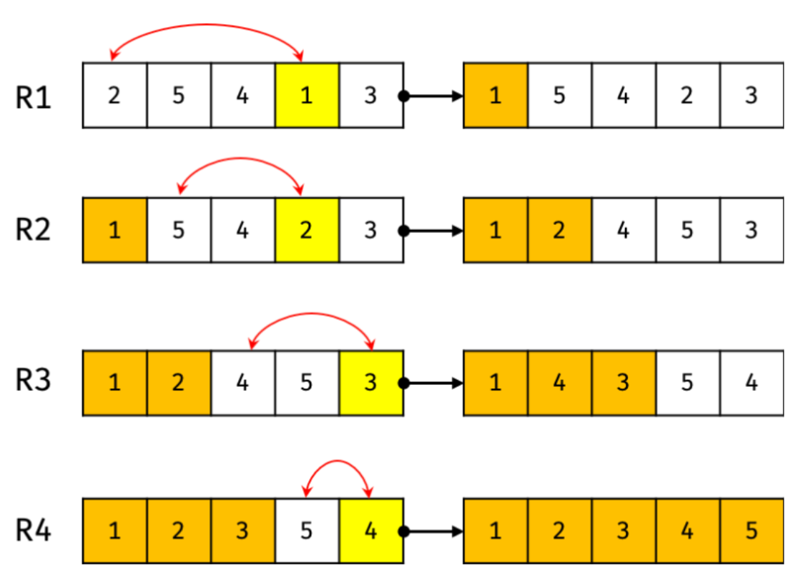
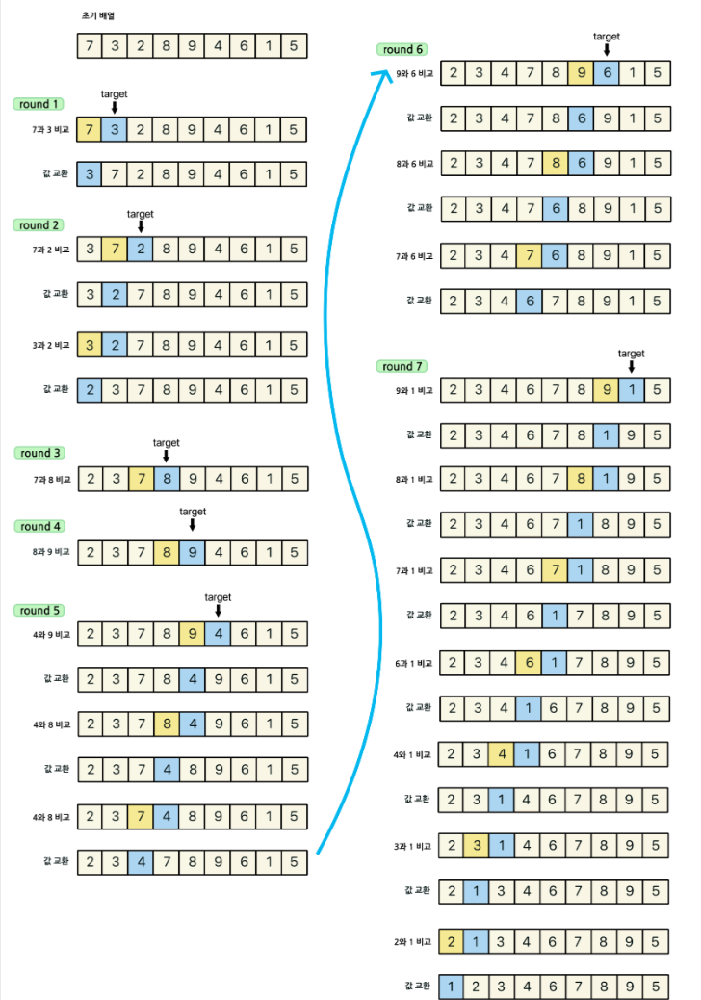
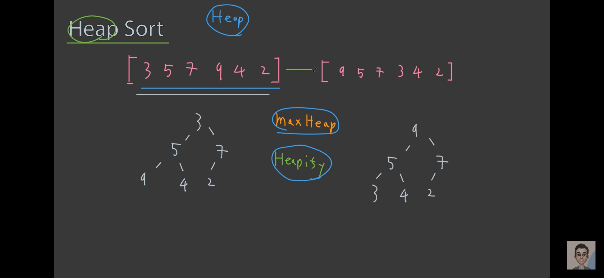
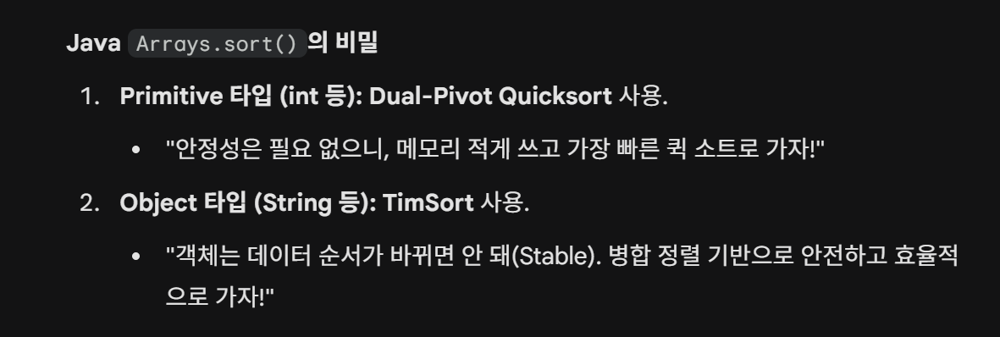
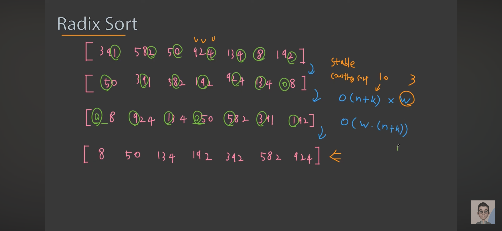
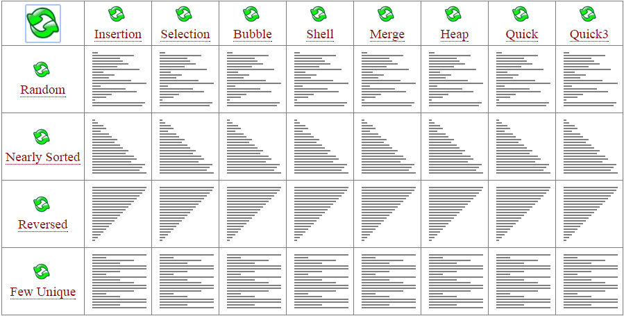

# 3-0. 정렬(Sorting) 알고리즘에 대해 설명해 주세요.

# 정렬 (Sorting)

## 1. 들어가기 전: 핵심 평가 기준 3가지

  - **시간 복잡도 (Time Complexity):** 입력 크기(N)에 따라 연산 횟수가 얼마나 증가하는가?

  <details>
  <summary>**공간 복잡도 (Space Complexity / In-place):**</summary>

- **제자리 정렬 (In-place):** 추가 메모리가 거의 필요 없는 경우 O(1).

    - **Out-of-place:** 별도의 메모리(배열 등)가 필요한 경우.
  </details>

  <details>
  <summary>**안정성 (Stability):**</summary>

- **안정 (Stable):** 중복된 값(Key)의 순서가 정렬 후에도 유지됨.

    - **불안정 (Unstable):** 중복된 값의 순서가 뒤바뀔 수 있음.
  </details>

---

## 2. 기본적인 정렬 알고리즘 (Basic Sorts)

  - **특징:** 구현이 쉽지만 느림. 학습용으로 주로 사용.

  - **평균 시간 복잡도:** O(N^2)

### ① 버블 정렬 (Bubble Sort) | 중요도 ⭐⭐

  - **개념:** 인접한 두 원소를 비교하여, 순서가 잘못되어 있으면 교환(Swap). 한 번 돌 때마다 가장 큰 값이 맨 뒤로 '거품처럼' 밀려남.

  <details>
  <summary>**복잡도**</summary>

- 시간: O(N^2)

    - 공간: O(1)
  </details>

  - **연관 자료구조:** 배열(Array)

  - **목적:** 정렬의 가장 기초적인 메커니즘을 이해하거나, 데이터가 거의 정렬되었는지 한 번의 순회로 확인하고자 할 때 사용함.

  - **특징:** 구현이 가장 단순함. 교환 연산이 많아 실제로 매우 느림.

  - **안정성:** Stable

  <details>
  <summary>코드 구현</summary>

```java
public void bubbleSort(int[] arr) {
    int n = arr.length;
    for (int i = 0; i < n - 1; i++) {
        for (int j = 0; j < n - 1 - i; j++) {
            if (arr[j] > arr[j + 1]) {
                // Swap
                int temp = arr[j];
                arr[j] = arr[j + 1];
                arr[j + 1] = temp;
            }
        }
    }
}
```
  </details>

### ② 선택 정렬 (Selection Sort) | 중요도 ⭐⭐

  - **개념:** 전체 리스트에서 '최솟값'을 찾아 맨 앞의 원소와 자리를 바꾼다.

  <details>
  <summary>**복잡도**</summary>

- 시간**: **O(N^2)

    - 공간: O(1)
  </details>

  - **연관 자료구조:** 배열(Array)

  - **목적:** 데이터의 크기가 커서 **교환(Swap) 비용이 매우 비싼 상황**에서 교환 횟수를 **최소화**하기 위해 사용함.

  - **특징:** 비교 횟수는 많지만, 교환 횟수가 적음.

  - **안정성:** Unstable

    - 예 : [ 5(A), 5(B), 2 ] → 맨앞과 최솟값의 자리가 뒤바뀌며 Unstable해짐

    <details>
    <summary>예시 그림</summary>


    </details>

  <details>
  <summary>코드 구현</summary>

```java
public void selectionSort(int[] arr) {
    int n = arr.length;
    for (int i = 0; i < n - 1; i++) {
        int minIdx = i;
        for (int j = i + 1; j < n; j++) {
            if (arr[j] < arr[minIdx]) {
                minIdx = j;
            }
        }
        // Swap
        int temp = arr[minIdx];
        arr[minIdx] = arr[i];
        arr[i] = temp;
    }
}
```
  </details>

### ③ 삽입 정렬 (Insertion Sort) | 중요도 ⭐⭐⭐⭐

  - **개념:** 2번째 원소부터 시작해, 앞의 정렬된 배열 부분과 비교하여 자신의 위치를 찾아 삽입. 자신 직전 노드와 비교하며, 직전 노드가 정렬 기준에 맞을 때까지 교환.

  <details>
  <summary>**복잡도**</summary>

- 시간: 최악 O(N^2), 최선 O(N)

    - 공간: O(1)
  </details>

  - **연관 자료구조:** 배열(Array), 연결 리스트(Linked List)

  - **목적:** **이미 거의 정렬된 데이터**에 소량의 신규 데이터를 추가하거나, 실시간으로 들어오는 데이터를 즉시 정렬할 때 사용함.

  - **특징:** 데이터가 이미 거의 정렬된 상태라면 매우 빠름. 작은 데이터셋에서 효율적.

  - **안정성:** Stable

  <details>
  <summary>예시 그림</summary>


  </details>

  <details>
  <summary>코드 구현</summary>

```java
public void insertionSort(int[] arr) {
    int n = arr.length;
    for (int i = 1; i < n; i++) {
        int target = arr[i];
        int j = i - 1;
        // 타겟보다 큰 값들을 오른쪽으로 한 칸씩 밀어냄
        while (j >= 0 && arr[j] > target) {
            arr[j + 1] = arr[j];
            j--;
        }
        arr[j + 1] = target;
    }
}
```
  </details>

---

## 3. 효율적인 정렬 알고리즘 (Efficient Sorts)

  - **특징:** 분할 정복(Divid Conquer) 등을 활용해 빠름. 실무/면접 필수.

  - **평균 시간 복잡도:** O(N log N)

### ① 퀵 정렬 (Quick Sort) | 중요도 ⭐⭐⭐⭐⭐

  - **개념:** 피벗(Pivot)을 하나 정해서, 피벗보다 작은 값은 왼쪽, 큰 값은 오른쪽으로 나눈(Partitioning) 뒤 재귀 수행. → 링크 그림으로 설명!

  <details>
  <summary>**복잡도**</summary>

- 시간: 평균 O(N log N), 최악 O(N^2)

      - **최악일 경우는, [1, 2, 3, 4, 5] 와 같은 경우**

    - 공간: O(log N)
  </details>

  - **연관 자료구조:** 배열(Array)

  <details>
  <summary>**목적:** 일반적인 상황에서 가장 빠른 속도를 내야 할 때 사용. 하드웨어의 **캐시 효율(Locality)**을 극대화하는 방식.</summary>

# ■ 하드웨어 친화적 설계: 캐시 효율(Cache Locality)

하드웨어의 **캐시 효율(Cache Locality)**을 높인다는 것은, CPU가 데이터를 처리할 때 '메모리(RAM)까지 멀리 가지 않고, 가까운 캐시 메모리에서 데이터를 바로 찾을 수 있게 만든다'는 뜻. 정렬 알고리즘, 특히 퀵 정렬이 왜 빠른지 설명할 때 아주 중요한 개념.

---

## 1. 캐시(Cache)와 메모리의 속도 차이

    - **캐시 메모리**: CPU 내부에 있어 엄청나게 빠르지만 용량이 작다.

    - **메인 메모리(RAM)**: CPU 밖에 있어 데이터를 가져오는 데 시간이 오래 걸림.

    - **데이터 로드 방식**: CPU는 데이터를 가져올 때 주변 데이터까지 뭉텅이(Cache Line)로 가져와 캐시에 저장.

    - **성능 지표**:

      - **Cache Hit**: 캐시에 있는 데이터를 바로 사용하는 경우.

      - **Cache Miss**: 캐시에 데이터가 없어 RAM까지 가지러 가는 경우.

---

## 2. 퀵 정렬이 캐시 효율이 좋은 이유

    - **참조 지역성(Locality of Reference)**: 퀵 정렬은 피벗을 기준으로 인접한 데이터들을 순차적으로 비교하고 스왑(Swap).

    - **연속된 접근**: 한 번 RAM에서 데이터를 뭉텅이로 캐시에 올려두면, 바로 옆에 있는 데이터를 계속 쓰기 때문에 Cache Hit 확률이 매우 높다.

    - **타 알고리즘 비교**: 반면, **힙 정렬(Heap Sort)**은 트리 구조를 따라 이리저리 인덱스를 건너뛰며(부모-자식 노드 방문) 데이터를 찾기 때문에 캐시 효율이 떨어져서 실제 속도가 퀵 정렬보다 느린 경우가 많다.

---

## 📝 추가 내용

> **💡 퀵 정렬이 평균적으로 가장 빠른 이유?**

단순히 비교 횟수가 적어서가 아니라, 하드웨어 친화적이기 때문. 인접한 데이터를 연속적으로 참조하는 특성 덕분에 *캐시 적중률(Cache Hit Rate)*이 높아 CPU의 연산 처리 속도를 극대화.
  </details>

  - **특징:** 평균적으로 가장 빠름. 이미 정렬된 데이터에서 피벗을 잘못 잡으면 O(N^2) 발생.

  - **안정성:** Unstable

  - 예시 : [https://jeonyeohun.tistory.com/102](https://jeonyeohun.tistory.com/102), [https://www.hackerearth.com/practice/algorithms/sorting/quick-sort/visualize/](https://www.hackerearth.com/practice/algorithms/sorting/quick-sort/visualize/)

    - 피봇의 위치에 따라 탐색후 바뀌는 위치가 달라지는 이유.

      - low는 반드시 피봇보다 큰값에서 멈추게 되고, high는 반드시 피봇보다 작은 값에서 멈추게 된다. 그렇기에 피봇이 왼쪽에 있으면 작은값을 가리키는 high와, 오른쪽에 있으면 큰 값을 가리키는 low와 바꿔야 한다.

### 피벗은 어떻게 정해야할까?

# 🚀 퀵 정렬의 최악(O(N²))을 피하는 전략

## 1. O(N²) 발생 이유

**원인**: 피벗 선택 시, 데이터가 한쪽으로 치우쳐서 분할되는 경우.

    - **대표 사례**: 이미 정렬된 배열에서 맨 앞이나 맨 뒤를 피벗으로 잡을 때 발생.

    - **예시**: `[1, 2, 3, 4, 5]`에서 `1`을 피벗으로 잡으면, 나머지 `[2, 3, 4, 5]`가 모두 오른쪽으로 가버려 분할의 이점이 사라지고 N번의 재귀가 발생.

---

## 2. 가운데 피벗이 유리한 이유 (Solution) → arr[mid]

    - **균등 분할 유도**: 물리적으로 중앙에 있는 값을 선택하면 데이터가 좌우로 비슷하게 나뉠 확률이 비약적으로 높아짐.

    - **트리의 높이 감소**: 데이터가 1:1에 가깝게 나뉠수록 재귀 트리의 깊이(Height)가 최소화(log N)되어, 전체 수행 시간이 O(N log N)에 수렴.

---

## 3. 더 진화된 피벗 선택법 (Advanced)

더 확실한 '보너스 지식'→ 필수는 아님

    - **Median-of-Three (세 값의 중앙값 선택)**:

      <details>
      <summary>예시</summary>

`[8, 2, 4, 1, 9]` 일 때

        - 맨 앞: 8 / 중간: 4 / 맨 뒤: 9

        - 이 셋 중 중간값인 **8**을 피벗으로 선택.
      </details>

      - 맨 앞, 맨 뒤, 중간 값 중 중앙값(Median)을 피벗으로 선택하는 방식.

      - 최악의 경우를 피할 수 있는 가장 대중적이고 효율적인 방법.

    - **Random Pivot (무작위 피벗)**:

      - 피벗을 무작위로 선택.

      - 어떤 정렬 상태의 데이터가 들어와도 O(N²)이 나올 확률을 제로에 가깝게 함.

### 퀵 정렬 구현 코드

```java
public class QuickSort {

    public static void main(String[] args) {
        int[] arr = {3, 2, 1, 5, 7, 9, 6};

        // 정렬 시작: 배열, 시작 인덱스(0), 끝 인덱스(length-1)
        quickSort(arr, 0, arr.length - 1);

        // 결과 출력
        for (int num : arr) {
            System.out.print(num + " ");
        }
    }

    public static void quickSort(int[] arr, int left, int right) {
        if (left < right) {
            // 파티션을 통해 피벗의 최종 위치를 받음
            int pivotIdx = partition(arr, left, right);

            // 피벗을 제외한 왼쪽과 오른쪽 구간을 재귀적으로 정렬
            quickSort(arr, left, pivotIdx - 1);
            quickSort(arr, pivotIdx + 1, right);
        }
    }

    public static int partition(int[] arr, int p, int r) {
        int pivot = arr[p]; // p는 구간의 시작이자 피벗 위치
        int low = p + 1;    // 피벗 바로 다음부터 시작
        int high = r;       // 구간의 끝

        while (low <= high) {
            // 1. 피벗보다 큰 값을 찾을 때까지 low 이동
            while (low <= r && arr[low] < pivot) {
                low++;
            }
            // 2. 피벗보다 작은 값을 찾을 때까지 high 이동
            while (high >= p + 1 && arr[high] > pivot) {
                high--;
            }

            // 3. 엇갈리지 않았다면 low와 high의 값 교환
            if (low <= high) {
                swap(arr, low, high);
            }
        }

        // 4. 피벗(p)과 high 위치를 교환하여 피벗의 자리 확정
        swap(arr, p, high);

        return high; // 확정된 피벗의 인덱스 반환
    }

    // 값 교환을 위한 보조 메서드
    private static void swap(int[] arr, int i, int j) {
        int temp = arr[i];
        arr[i] = arr[j];
        arr[j] = temp;
    }
}
```

### ② 병합 정렬 (Merge Sort) | 중요도 ⭐⭐⭐⭐⭐

  - **개념:** 리스트를 절반으로 계속 쪼갠 뒤(Divide), 다시 합치면서(Merge) 정렬한다.

  <details>
  <summary>**복잡도**</summary>

시간: 항상 O(N log N)

공간: O(N)
  </details>

  - **연관 자료구조:** 연결 리스트(Linked List), 대용량 외부 파일

  - ** 목적:** 데이터의 안정성(Stable)이 필수적이거나, 메모리에 다 담을 수 없는 대용량 데이터(외부 정렬)를 처리할 때 사용함.

  - **특징:** 데이터 상태와 무관하게 일정한 성능 보장. 추가 메모리 공간 필요.

  - **안정성:** Stable

---

## **퀵 정렬 vs 병합 정렬 한눈에 비교**

| **특징** | **퀵 정렬 (Quick Sort)** | **병합 정렬 (Merge Sort)** |
| --- | --- | --- |
| **핵심 전략** | **우선 분할, 나중에 정렬** (피벗 기준) | **우선 쪼개기, 합칠 때 정렬** |
| **평균 속도** | _O_(_N_log_N_) (일반적으로 가장 빠름) | _O_(_N_log_N_) (일정함) |
| **최악 속도** | _**O**_**(**_**N^**_**2)** (피벗이 치우칠 때) | _**O**_**(**_**N**_**log**_**N**_**)** (보장됨) |
| **추가 메모리** | _O_(log_N_) (제자리 정렬 가깝게 수행) | _**O**_**(**_**N**_**)** (임시 배열 필수) |
| **안정성** | **Unstable** (순서 바뀔 수 있음) | **Stable** (순서 유지됨) |
| **하드웨어** | 캐시 효율이 매우 높음 | 캐시 효율이 상대적으로 낮음 |

---

### **1. 분할의 방식 (Pivot vs Half)**

  - **퀵 정렬:** 피벗이라는 기준점으로 **불균등하게** 나눔. 운이 나쁘면 1개와 _N_−1개로 나뉠 수 있어 성능이 요동침.

  - **병합 정렬:** 무조건 정확히 절반(_N_/2)으로 나눔. 그래서 데이터가 어떻게 생겼든 성능이 일정함.

### **2. 정렬의 시점**

  - **퀵 정렬:** 데이터를 나누는 과정(Partitioning)에서 이미 정렬이 일어남. 다 나누고 나면 합칠 게 없음.

  - **병합 정렬:** 나누는 단계에서는 정렬 X. 다 쪼개진 데이터들을 **다시 합치는(Merge) 과정**에서 정렬.

### **3. 메모리 사용량 (핵심 면접 질문)**

  - **퀵 정렬:** 데이터가 들어있는 그 배열 안에서 자리를 바꾸므로(In-place) 메모리를 거의 안 씀.

  - **병합 정렬:** 두 그룹을 합쳐서 정렬된 결과를 담을 **'새로운 임시 배열'**이 반드시 필요. 데이터가 1억 개면 1억 개만큼의 추가 공간이 필요해서 메모리 낭비가 심할 수 있음.

---

## **📝 Q&A**

> **Q: 왜 실무에서는 퀵 정렬을 더 많이 쓰나요?**

평균적인 속도가 퀵 정렬이 더 빠르기 때문. 병합 정렬은 항상 O(N log N)이지만, 데이터를 복사하는 시간이 많이 들고 캐시 효율이 떨어짐. 반면 퀵 정렬은 **참조 지역성(Locality)**이 좋아 하드웨어적으로 훨씬 빠르게 동작함.

  <details>
  <summary>참조 지역성</summary>

### 1. 참조 지역성의 진짜 의미: "캐시 적중률(Cache Hit)"

CPU는 RAM보다 수백 배 빠름. 그래서 RAM에서 데이터를 가져오는 동안 CPU는 아무것도 못 하고 놀게 됨(Wait State). 이를 방지하기 위해 CPU 내부에 아주 빠르고 작은 공간인 **캐시(Cache)**를 둠.

    - **지역성이 좋다:** CPU가 한 번 가져온 데이터 근처를 계속 쓴다는 뜻. (예: 배열의 0번을 읽었더니 바로 1, 2, 3번을 읽는 경우)

    - **결과:** 처음에만 RAM에서 데이터를 뭉텅이로 가져오면, 그다음부터는 **RAM에 갈 필요 없이 캐시 안에서 모든 게 해결**.

### 2. 왜 퀵 정렬(Quick Sort)은 지역성이 좋을까?

    - **연속된 접근:** 퀵 정렬은 포인터(`low`, `high`)가 한 칸씩 옆으로 이동하며 비교. 즉, 방금 쓴 데이터 바로 옆 데이터를 사용.

    - **캐시 활용:** 하드웨어는 데이터를 한 바이트씩 가져오지 않고 '캐시 라인' 단위로 뭉텅이로 가져옴. 퀵 정렬은 이 뭉텅이를 알뜰하게 다 쓰고 다음으로 넘어감.
  </details>

  <details>
  <summary>병합 정렬 캐시 효율 떨어지는 이유 </summary>

### 병합 정렬이 캐시 효율이 상대적으로 낮은 이유

병합 정렬도 데이터를 **'순차적으로'** 읽기 때문에 캐시 라인(Cache Line)을 어느 정도 활용하긴 함. 하지만 퀵 정렬에 비해 효율이 떨어지는 결정적인 이유는 **"데이터 복사와 점프"** 때문.

    - **데이터 복사 (Temporary Array):** 병합 정렬은 원본 배열에서 데이터를 읽어와 **별도의 임시 배열**에 정렬하며 사용. 즉, CPU 입장에서 **두 개의 서로 다른 메모리 구역(원본 - 임시)**을 계속 왔다 갔다 해야함.

    - **캐시 오염 (Cache Pollution):** 4G RAM에서 데이터를 뭉텅이로 가져올 때, 퀵 정렬은 한 구역만 집중적으로 공략하지만, 병합 정렬은 원본 구역도 가져와야 하고 임시 구역도 가져와야 하므로 **캐시 공간이 금방 꽉 차버림.**

    - **결론:** 퀵 정렬은 "제자리(In-place)"에서 해결하기 때문에 캐시 적중률이 극대화되지만, 병합 정렬은 "복사본"을 만드느라 캐시 효율이 분산됨.

---
  </details>

> **Q: 그럼 병합 정렬은 언제 쓰나요?**

데이터가 너무 커서 메모리에 다 안 올라갈 때(**외부 정렬**), 데이터의 순서가 절대로 바뀌면 안 될 때(**Stable**), 연결 리스트(Linked List)를 정렬할 때.

### ③ 힙 정렬 (Heap Sort) | 중요도 ⭐⭐⭐⭐

  - **개념:** 데이터를 힙(Heap) 자료구조(완전 이진 트리)로 만든 뒤, 최댓값(루트)을 하나씩 꺼내 배열 뒤로 보냄.

  - **복잡도:** 항상 O(N \log N) / O(1)

  - **연관 자료구조:** 우선순위 큐(Priority Queue), 완전 이진 트리

  - ** 목적:** 전체를 다 정렬하지 않고 **상위 K개의 값만 필요할 때**나, 최악의 경우에도 추가 메모리 없이 성능을 보장해야 할 때 사용함.

  - **특징:** 추가 메모리가 필요 없음(In-place). 퀵 정렬보다는 실제 속도가 느림.

  - **안정성:** Unstable

  <details>
  <summary>코드 구현</summary>

```java
public void heapSort(int[] arr) {
    int n = arr.length;

    // 1. Build Heap (Bottom-up으로 최대 힙 생성)
    for (int i = n / 2 - 1; i >= 0; i--) heapify(arr, n, i);

    // 2. Extract & Swap
    for (int i = n - 1; i > 0; i--) {
        int temp = arr[0];
        arr[0] = arr[i];
        arr[i] = temp;
        heapify(arr, i, 0); // 다시 루트부터 힙피파이
    }
}

void heapify(int[] arr, int n, int i) {
    int largest = i;
    int left = 2 * i + 1;
    int right = 2 * i + 2;

    if (left < n && arr[left] > arr[largest]) largest = left;
    if (right < n && arr[right] > arr[largest]) largest = right;

    if (largest != i) {
        int swap = arr[i];
        arr[i] = arr[largest];
        arr[largest] = swap;
        heapify(arr, n, largest);
    }
}
```
  </details>



---

## 4. 하이브리드 정렬 (Hybrid Sorts) - 실무용

### ① 팀 정렬 (Tim Sort) | 중요도 ⭐⭐⭐⭐⭐

  - **개념:** 삽입 정렬(Insertion) + 병합 정렬(Merge).

  - **복잡도:** 평균 O(N \ log N), 최선 O(N) / O(N)

  - **연관 자료구조:** 배열(Array)

  - **목적:** 실세계의 데이터가 대부분 일부분 정렬되어 있다는 점을 이용해, 작은 구역은 삽입 정렬로, 합칠 때는 병합 정렬로 처리하여 **현대 언어 라이브러리의 표준**으로 쓰임.

  - **사용처:** Python, Java (객체 정렬), Android, Chrome V8 등

  - **안정성:** Stable

  - [https://st-lab.tistory.com/276](https://st-lab.tistory.com/276)



---

## 5. 비교하지 않는 정렬 (Non-Comparison Sorts)

  - **평균 시간 복잡도:** O(N)에 근접

### ① 계수 정렬 (Counting Sort) | 중요도 ⭐⭐⭐

  - **개념:** 각 숫자가 몇 번 등장했는지 세어서(Counting) 정렬.

  - **복잡도:** O(N + K) (K는 데이터의 최댓값)

  - **연관 자료구조:** 배열(Counting Array), 해시 테이블

  - ** 목적:** **데이터 범위가 작고 정수일 때** (예: 시험 점수) 비교 연산 없이 인덱스 빈도수만으로 압도적인 속도를 낼 때 사용함.

  - **안정성:** Stable

  <details>
  <summary>코드 구현</summary>

```java
public void countingSort(int[] arr, int max) {
    int[] count = new int[max + 1];
    int[] result = new int[arr.length];

    // 1. 빈도수 세기
    for (int num : arr) count[num]++;

    // 2. 누적합 계산 (위치 지정용)
    for (int i = 1; i <= max; i++) count[i] += count[i - 1];

    // 3. 뒤에서부터 결과 배열에 배치 (안정성 유지)
    for (int i = arr.length - 1; i >= 0; i--) {
        result[count[arr[i]] - 1] = arr[i];
        count[arr[i]]--;
    }
    System.arraycopy(result, 0, arr, 0, arr.length);
}
```
  </details>

### ② 기수 정렬 (Radix Sort) | 중요도 ⭐⭐⭐

  - **개념:** 1의 자리, 10의 자리... 순서대로 자릿수별로 버킷에 담았다 꺼내며 정렬.

  - **복잡도:** O(d \times N) (d는 자릿수)

  - **연관 자료구조:** 큐(Queue)의 배열 (Bucket)

  - ** 목적:** **전화번호, 사번, IP 주소**처럼 길이가 고정되고 자릿수 개념이 명확한 데이터를 정렬할 때 사용함.

  - **안정성:** Stable

  <details>
  <summary>코드 구현</summary>

```java
public void radixSort(int[] arr) {
    int max = getMaxSize(arr); // 배열 중 최대값의 자릿수 확인

    // 자릿수(1, 10, 100...)별로 Counting Sort 수행
    for (int exp = 1; max / exp > 0; exp *= 10) {
        countingSortByDigit(arr, exp);
    }
}

private void countingSortByDigit(int[] arr, int exp) {
    int n = arr.length;
    int[] output = new int[n];
    int[] count = new int[10];

    for (int i = 0; i < n; i++) count[(arr[i] / exp) % 10]++;
    for (int i = 1; i < 10; i++) count[i] += count[i - 1];
    for (int i = n - 1; i >= 0; i--) {
        output[count[(arr[i] / exp) % 10] - 1] = arr[i];
        count[(arr[i] / exp) % 10]--;
    }
    System.arraycopy(output, 0, arr, 0, n);
}
```
  </details>



---

## 6. 📝 한눈에 보는 요약표 (Cheat Sheet)

| **알고리즘** | **평균 시간** | **최악 시간** | **공간 복잡도** | **안정성** | **연관 자료구조** |
| --- | --- | --- | --- | --- | --- |
| **Bubble** | O(N^2) | O(N^2) | O(1) | ✅ | 배열 |
| **Selection** | O(N^2) | O(N^2) | O(1) | ❌ | 배열 |
| **Insertion** | O(N^2) | O(N^2) | O(1) | ✅ | 배열, 연결 리스트 |
| **Quick** | O(N \log N) | O(N^2) | O(\log N) | ❌ | 배열 |
| **Merge** | O(N \log N) | O(N \log N) | O(N) | ✅ | 연결 리스트, 외부 파일 |
| **Heap** | O(N \log N) | O(N \log N) | O(1) | ❌ | 우선순위 큐, 트리 |
| **Tim** | O(N \log N) | O(N \log N) | O(N) | ✅ | 배열 |
| **Counting** | O(N+K) | O(N+K) | O(K) | ✅ |   |


