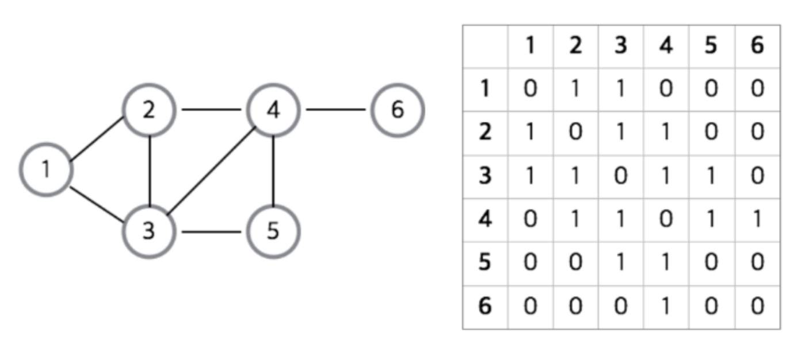
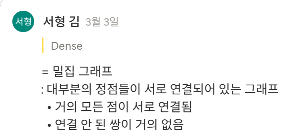
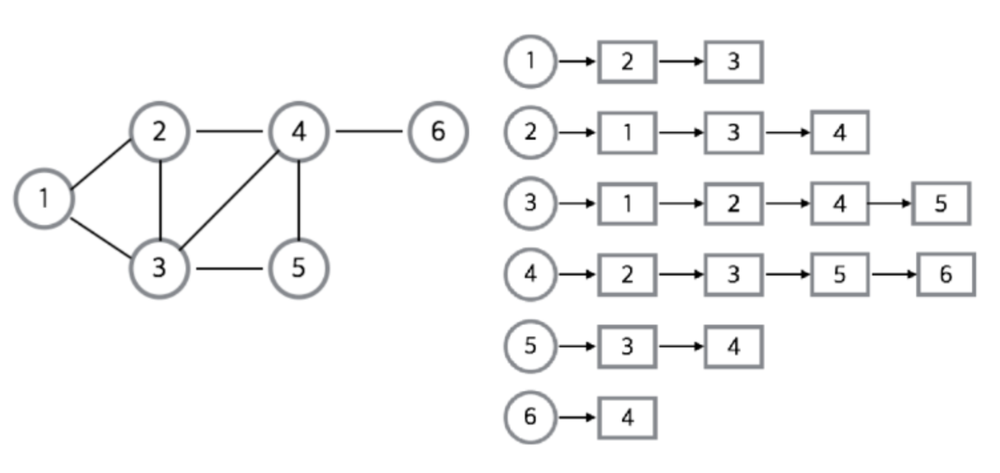
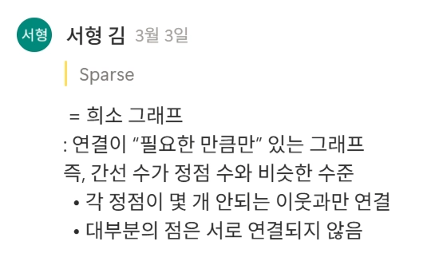

# 9-0. 그래프 자료구조에 대해 설명하고, 이를 구현할 수 있는 두 방법에 대해 설명해 주세요.

# 📊 그래프 자료구조(Graph)

## 1️⃣ 그래프란 무엇인가

### 📌 정의

그래프(Graph)는 **정점(Vertex)과 간선(Edge)**으로 구성된 자료구조로,

객체 간의 **관계(Relationship)**를 표현하기 위해 사용된다.

- **정점(Vertex)** : 데이터를 저장하는 노드

- **간선(Edge)** : 정점과 정점 사이의 연결 관계

그래프는 네트워크 구조를 표현하는 데 매우 적합하다.

### 📌 예시

- SNS 친구 관계

- 지도 경로 탐색

- 컴퓨터 네트워크

- 추천 시스템

- 웹 페이지 링크 구조

---

## 2️⃣ 그래프의 특징

그래프는 트리와 달리 더 일반적인 구조이다.

### 특징

- 노드 간 **임의의 연결 가능**

- **사이클(Cycle)** 존재 가능

- **방향성 존재 가능**

- **연결되지 않은 그래프 가능**

즉, 현실 세계의 복잡한 관계를 표현하는 데 적합하다.

---

## 3️⃣ 그래프의 종류

### 1️⃣ 방향 그래프 (Directed Graph)

간선에 **방향이 존재**

예

```plain text
A → B
```

- A에서 B로만 이동 가능

---

### 2️⃣ 무방향 그래프 (Undirected Graph)

간선에 방향이 없음

```plain text
A — B
```

- A ↔ B 양방향 이동 가능

---

### 3️⃣ 가중치 그래프 (Weighted Graph)

간선에 **비용 또는 거리 값 존재**

예

```plain text
A --(5)--> B
```

- 최단 경로 알고리즘 등에 사용

---

### 4️⃣ 사이클 그래프

그래프 내에 **순환 경로 존재**

예

```plain text
A → B → C → A
```

---

## 4️⃣ 그래프의 활용

그래프는 다양한 알고리즘 문제의 기반이 된다.

대표적인 활용

- **최단 경로 알고리즘**

  - Dijkstra

  - Bellman-Ford

- **그래프 탐색**

  - DFS (Depth First Search)

  - BFS (Breadth First Search)

- **네트워크 분석**

  - PageRank

  - Social Network Analysis

---

# 🧩 그래프 구현 방법

그래프를 구현하는 대표적인 방법은 두 가지가 있다.

1️⃣ **인접 행렬 (Adjacency Matrix)**

2️⃣ **인접 리스트 (Adjacency List)**

---

# 5️⃣ 인접 행렬 (Adjacency Matrix)

### 📌 개념

정점 개수를 **V라고 할 때**

👉 V × V 크기의 2차원 배열로 간선 관계 표현

```plain text
    A B C
A [ 0 1 1 ]
B [ 1 0 0 ]
C [ 1 0 0 ]
```

값 의미

- 1 : 연결됨

- 0 : 연결 없음



---

### Java 구현 예시

```java
import java.io.*;
import java.util.*;

public class Main {
    static int[][] map = new int[11][11];
    static int N, M;

    public static void main(String[] args) throws Exception {
        BufferedReader br = new BufferedReader(new InputStreamReader(System.in));
        StringTokenizer st;

        st = new StringTokenizer(br.readLine());
        N = Integer.parseInt(st.nextToken());
        M = Integer.parseInt(st.nextToken());

        for (int i = 0; i < M; i++) {
            st = new StringTokenizer(br.readLine());
            int x = Integer.parseInt(st.nextToken());
            int y = Integer.parseInt(st.nextToken());

            map[x][y] = 1;
            map[y][x] = 1; // 무방향 그래프
        }

        for (int i = 1; i <= N; i++) {
            for (int j = 1; j <= N; j++) {
                System.out.print(map[i][j] + " ");
            }
            System.out.println();
        }
    }
}
```

---

### 장점

- 간선 존재 여부 확인 **O(1)**

- 구현 단순

- 밀집 그래프(Dense Graph)에 유리



---

### 단점

- 메모리 사용량 **O(V²)**: 모든 정점에 대해 간선 정보를 대입해야 함

- 간선이 적어도 공간 낭비 발생

---

# 6️⃣ 인접 리스트 (Adjacency List)

### 📌 개념

각 정점에 대해 **연결된 정점 리스트 저장**

예

```plain text
A → B, C
B → A
C → A
```



---

### Java 구현 예시

```java
import java.io.*;
import java.util.*;

public class Main {
    static int N, M;
    static ArrayList<Integer>[] graph = new ArrayList[11];

    public static void main(String[] args) throws Exception {
        BufferedReader br = new BufferedReader(new InputStreamReader(System.in));
        StringTokenizer st;

        // 그래프 리스트 초기화
        for (int i = 1; i <= 10; i++) {
            graph[i] = new ArrayList<>();
        }

        st = new StringTokenizer(br.readLine());
        N = Integer.parseInt(st.nextToken());
        M = Integer.parseInt(st.nextToken());

        for (int i = 0; i < M; i++) {
            st = new StringTokenizer(br.readLine());
            int x = Integer.parseInt(st.nextToken());
            int y = Integer.parseInt(st.nextToken());

            graph[x].add(y);
            graph[y].add(x); // 무방향 그래프
        }

        for (int i = 1; i <= N; i++) {
            System.out.print(i + " : ");
            for (int j = 0; j < graph[i].size(); j++) {
                System.out.print(graph[i].get(j) + " ");
            }
            System.out.println();
        }
    }
}
```

---

### 장점

- 메모리 사용량 **O(V + E)**

- 희소 그래프(Sparse Graph)에 효율적

- 실제 연결된 간선만 저장



---

### 단점

- 간선 존재 여부 확인 **O(V)** 또는 **O(degree)**

- 구현이 인접 행렬보다 약간 복잡

---

# 7️⃣ 두 구현 방식 비교

| 항목 | 인접 행렬 | 인접 리스트 |
| --- | --- | --- |
| 메모리 | O(V²) | O(V + E) |
| 간선 조회 | O(1) | O(degree) |
| 구현 난이도 | 쉬움 | 보통 |
| 적합 그래프 | Dense Graph | Sparse Graph |

---

# 8️⃣ 언제 어떤 방식을 사용할까

### 인접 행렬이 유리한 경우

- 간선이 많은 **Dense Graph**

- 간선 존재 여부 확인이 빈번

예)

네트워크 연결 체크

---

### 인접 리스트가 유리한 경우

- 간선이 적은 **Sparse Graph**

- 그래프 탐색 중심 알고리즘

예)

DFS, BFS, 최단 경로 문제

---

# 📌 핵심 정리

- 그래프는 **정점과 간선으로 구성된 관계 표현 자료구조**

- 방향, 가중치, 사이클 등 다양한 형태 존재

- 그래프 구현 방식은 크게 두 가지

1️⃣ 인접 행렬

2️⃣ 인접 리스트

- 인접 행렬 → Dense Graph에 유리

- 인접 리스트 → Sparse Graph에 유리
