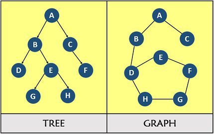
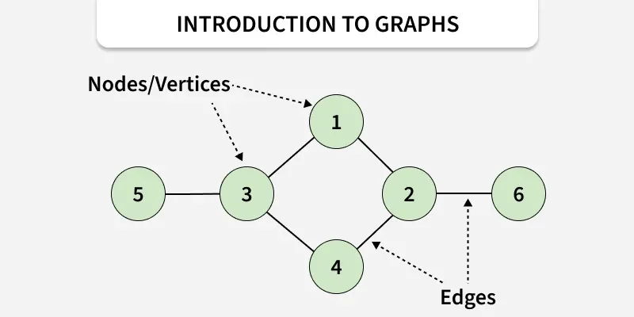
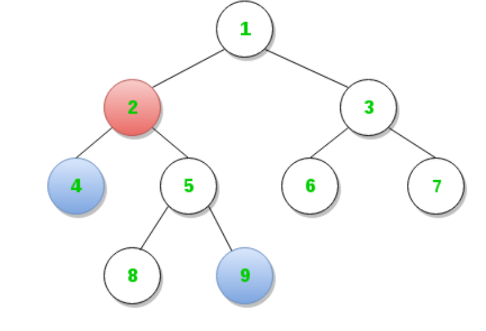

# **1-1.** 그래프와 트리의 차이가 무엇인가요?

# 그래프(Graph)와 트리(Tree)의 차이





## 1. 정의

### 그래프 (Graph)

- **정점(Vertex)** 과 **간선(Edge)** 의 집합

- 정점 간의 **일반적인 관계**를 표현

- 방향/무방향, 가중치 유무 등 다양한 형태 존재

### 트리 (Tree)

- **사이클이 없는 연결 그래프**

- 계층적 구조 표현에 특화

- 그래프의 **특수한 형태**

---

## 2. 핵심 차이 비교

| 구분 | 그래프 (Graph) | 트리 (Tree) |
| --- | --- | --- |
| 사이클 | 있을 수 있음 | **없음** |
| 루트 노드 | 없음 | **항상 존재** |
| 부모-자식 관계 | 없음 | **명확히 존재** |
| 정점 간 경로 | 여러 개 가능 | **항상 하나만 존재** |
| 연결성 | 연결/비연결 가능 | **항상 연결됨** |
| 간선 수 | 제한 없음 | **N-1개 (정점 N개일 때)** |

> 💡 

  <details>
  <summary>**연결성?**</summary>

---

👉 **그래프(또는 트리)에서 임의의 두 정점 사이에 경로(path)가 존재하는지 여부**를 의미한다.

    - 연결 그래프

```java
        A
       / \
      B   C
     / \
    D   E
```

      - 비연결 그래프

```java
    A       D
   / \     /
  B   C   E
```
  </details>

---

## 3. 사이클(Cycle) 여부

```plain text
그래프: A → B → C → A (가능)
트리  : 사이클 발생 시 트리가 아님
```

- 트리는 **사이클이 하나라도 생기면 즉시 그래프가 됨**

- 이 성질 때문에 탐색과 구조 관리가 단순해짐

---

## 4. 경로(Path)의 차이

### 그래프

- 두 정점 사이에 **여러 경로**가 존재 가능

### 트리

- 두 노드 사이의 경로는 **항상 하나**

- 이 성질로 인해 **LCA, DFS, BFS** 등이 단순해짐

> 💡 

  <details>
  <summary>**LCA란?**</summary>

> 🤔 

      - **Lowest Common Ancestor**

      - **두 노드의 공통 조상 중 가장 깊이(가장 가까운)에 있는 노드**



## 기본 아이디어

> 두 노드의 깊이를 같게 만든 뒤,
같이 부모로 올라가며 처음 만나는 노드가 LCA

---

## 알고리즘

### Step 1. 깊이 맞추기

    - 두 노드 `u`, `v` 중

    - 더 깊은 노드를 **부모 방향으로 이동**

    - `depth(u) == depth(v)` 가 될 때까지 반복

### Step 2. 동시에 올라가기

    - `u == v` 가 될 때까지

    - `u = parent[u]`

    - `v = parent[v]`

### Step 3. 결과

    - 처음으로 `u == v` 가 되는 노드 → **LCA**
  </details>

---

## 5. 간선 개수의 차이 (중요)

정점이 `N`개일 때:

```plain text
트리: 간선 = N - 1 (항상 성립)
그래프: 간선 수 제한 없음
```

→ 이 조건은 **트리 판별 문제의 핵심 기준**으로 자주 사용됨

---

## 6. 사용 목적 차이

| 구조 | 주 사용 예 |
| --- | --- |
| 그래프 | 지도, SNS 관계, 네트워크, 경로 탐색 |
| 트리 | 파일 시스템, 조직도, DOM, 이진 탐색 트리 |

---

## 7. 포함 관계 정리

```plain text
트리 ⊂ 그래프
(모든 트리는 그래프이지만, 모든 그래프가 트리는 아니다)
```

---

## 📍한 줄 결론

> 트리는 사이클이 없고 항상 연결된 그래프의 특수한 형태로,루트와 부모-자식 관계가 명확하며 경로가 하나뿐이다.
