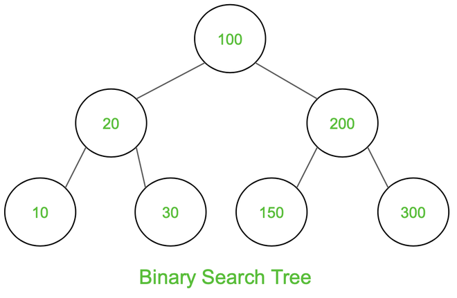

# **1-2.** 이진탐색트리에서 중위 탐색을 하게 되면, 그 결과는 어떤 의미를 가지나요?

# 이진 탐색 트리(BST)에서 중위 탐색(Inorder Traversal)의 의미



## 1. 중위 탐색(Inorder Traversal)이란?

- 탐색 순서: **왼쪽 서브트리 → 현재 노드 → 오른쪽 서브트리**

- 표기: **L → Root → R**

---

## 2. 이진 탐색 트리(BST)의 핵심 성질

```plain text
모든 노드에 대해:
왼쪽 서브트리의 값 < 현재 노드의 값 < 오른쪽 서브트리의 값
```

이 성질은 **BST에서 항상 성립**한다.

---

## 3. 중위 탐색 결과의 의미 (핵심 결론)

> **이진 탐색 트리를 중위 탐색하면 노드의 값이 오름차순(정렬된 순서)으로 출력된다.**

---

## 4. 간단한 예시

### BST 구조

```plain text
        5
       / \
      3   7
     / \   \
    2   4   8
```

### 중위 탐색 순서

```plain text
2 → 3 → 4 → 5 → 7 → 8
```

✅ **오름차순 정렬 결과와 동일**

---

## 5. 왜 정렬된 결과가 되는가?

1. 왼쪽 서브트리는 항상 현재 노드보다 작은 값

1. 오른쪽 서브트리는 항상 현재 노드보다 큰 값

1. 중위 탐색은 이 순서를 그대로 방문

```plain text
작은 값 → 중간 값 → 큰 값
```

→ 자연스럽게 **정렬된 순서**가 된다

---

## 6. 활용 의미

- BST를 **정렬된 데이터 구조**처럼 사용할 수 있음

- 별도의 정렬 알고리즘 없이 정렬 결과 획득 가능

- BST 기반 자료구조(Set, Map 등)의 이론적 근거

⚠️ 주의

- 트리가 **편향(skewed)** 되면 성능은 O(n)

> 🤔 

### 1️⃣ 균형 잡힌 BST

    - 트리 높이 ≈ **log N**

    - 한 번 내려갈 때마다 **탐색 범위가 절반 수준으로 줄어듦**

    - 구조적으로 **이분 탐색과 같은 효과**

```plain text
→ 탐색 / 삽입 / 삭제 = O(log N)
```

---

### 2️⃣ 편향된 BST

    - 트리 높이 ≈ **N**

    - 한쪽으로만 내려가야 해서

    - **절반씩 줄어들지 않음**

    - 사실상 **순차 탐색(연결 리스트)** 과 동일

```plain text
→ 탐색 / 삽입 / 삭제 = O(N)
```

- 균형 BST(AVL, Red-Black Tree)에서는 탐색/삽입/삭제가 O(log n)

> 🤔 **AVL?**

---

**균형 이진 탐색 트리(Self-balancing Binary Search Tree)**의 일종으로, **트리의 높이를 항상 일정하게 유지**하여 **탐색, 삽입, 삭제** 연산에서 **O(log n)**의 성능을 보장하는 자료구조

---

## 한 줄 결론

> 이진 탐색 트리에서 중위 탐색 결과는 노드 값의 오름차순 정렬 결과를 의미한다.
