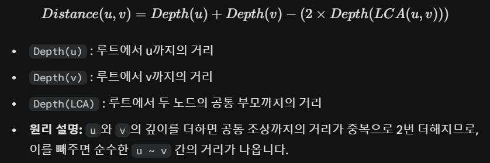

# **10-1.** 트리에서는 어떤 방식으로 최단거리를 구할 수 있을까요? (위 방법을 사용하지 않고)

# 트리에서의 최단 거리 구하기: LCA와 DFS

트리는 사이클이 없는 연결 그래프이므로, 어떤 두 노드를 연결하는 경로는 항상 유일하며 그 경로가 **무조건 최단 경로**.

이러한 특성을 활용하여 다음 **두 가지 방식**으로 최단 거리를 쉽게 구하기 가능.

---

## 1. LCA (Lowest Common Ancestor, 최소 공통 조상)

- **개념**: 두 노드 `u`와 `v`가 처음으로 만나는 가장 가까운 공통 조상 노드를 찾아 거리를 계산하는 방식.

- **활용**: 트리에서 여러 번의 최단 거리 질의(Query)가 주어질 때 매우 효율적.

- **핵심 원리**: 루트 노드에서 각 노드까지의 깊이(Depth)를 미리 구해둔 뒤 아래 공식을 사용.

- **원리 설명**: `u`와 `v`의 깊이를 더하면 공통 조상까지의 거리가 2번 중복 계산되므로, 이를 빼주어 순수한 `u`와 `v` 사이의 거리를 산출.

- **시간 복잡도**:

  - 전처리: O(V) 또는 O(V log V)

  - 거리 계산(쿼리당): O(log V) (희소 배열 활용 시)

---

## 2. DFS (Depth First Search, 깊이 우선 탐색)

- **개념**: 스택이나 재귀를 사용하여 트리의 바닥까지 깊게 탐색하는 방법.

- **핵심 원리**: 일반 그래프와 달리 **트리는 경로가 유일**하므로, DFS로 목표 노드를 찾았다면 **그 경로가 곧 유일한 최단 경로**.

- **시간 복잡도**: O(V) (정점의 개수만큼 탐색)

---

## 💡 요약: 상황별 알고리즘 선택

| 상황 | 추천 방법 | 이유 |
| --- | --- | --- |
| **단 한 번** 거리를 구할 때 | **DFS** | 구현이 단순하고 한 번의 탐색 O(V)으로 충분함 |
| **여러 번** 거리를 질문할 때 | **LCA** | 초기 세팅 후 매 질문마다 O(\log V)로 초고속 답변 가능 |
