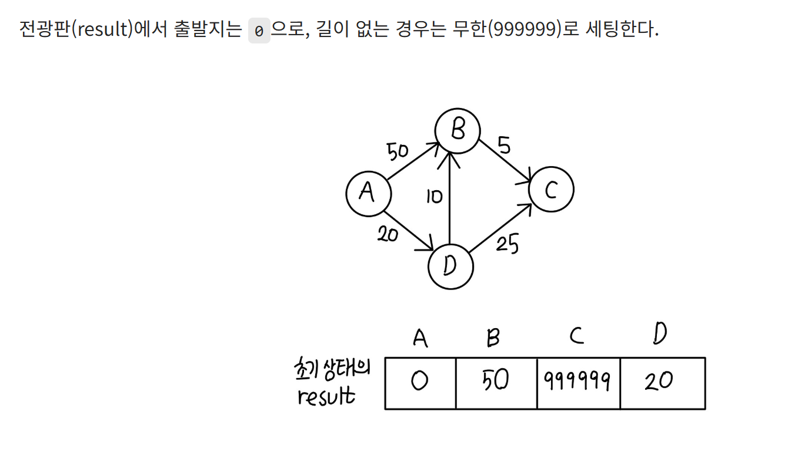
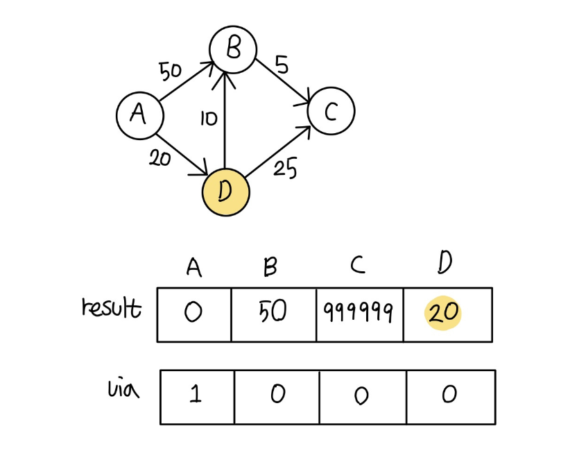
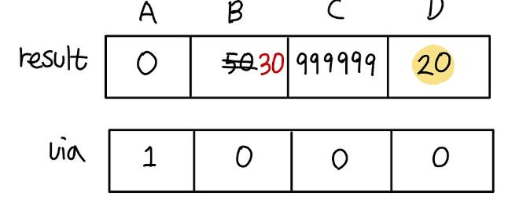
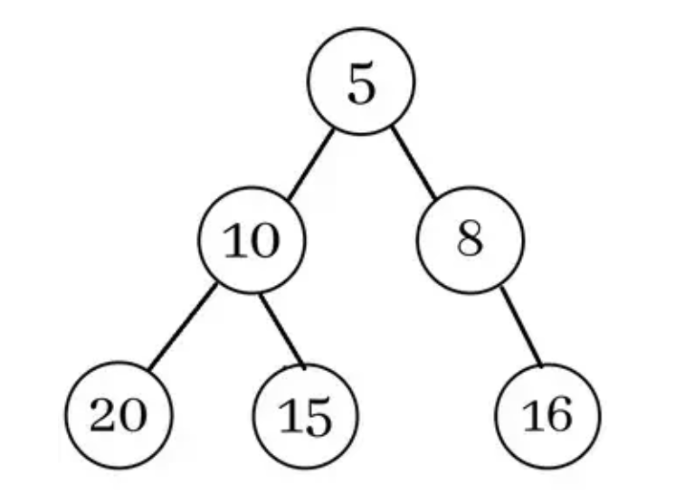

# 10-2. 다익스트라 알고리즘에서, 힙을 사용하지 않고 구현한다면 시간복잡도가 어떻게 변화할까요?

## 1. 다익스트라란?

“현재까지 가장 짧은 거리의 정점을 확정한다.” 라는 Greedy적 선택을 사용한다.

특정한 하나의 정점에서 다른 모드 정점으로 가는 최단 경로를 계산하는 알고리즘으로, GREEDY로 분류하는 이유는

하나의 시작 정점에서 모든 정점까지의 최단 경로를 구하기 때문이다. 이전 단계에서 계산된 최단 거리 정보를 활용한다는 점에서 DP적 성질도 일부 가진다.

단, 음의 간선(가중치)이 있는 경우에는 사용할 수 없다.

---

## 2. 다익스트라의 원리

- 가장 저렴하게 갈 수 있는 곳을 경유지로 선택한다.

- 선택된 경유지를 거쳐 다른 곳으로 이동할 때, 더 저렴한지 확인한다.

- 더 저렴하다면, 최소비용 배열 `result` 를 갱신한다.

자세한 원리 → 이 원리대로 단순 다익스트라 구현시, 시간복잡도가 O(V^2)로 형성된다.

→ 초기 상태에서 출발지는 0으로, 도달할 수 없는 길은 무한으로 설정한다.

→ 최단 거리가 확정된 정점은 `visited`처리한다. A는 출발지이므로, 바로 `visited` 처리한다. 이후, 방문하지 않은 장소 중 `가장 저렴한 곳`을 선택한다(D)

다익스트라의 핵심 :

**`한 번 선택된 정점의 거리는 더 이상 줄어들지 않는다`****
**

→ 이때, A에서 D를 경유해 다른 지역으로 가는 비용과, result배열에 써있는 다른 지역으로 가는 비용을 비교한다.

[예시]

`A → D → B 비용 : 20 + 10 = 30` vs `A → B 비용 : 50` 이므로, B 값을 30으로 수정한다.

다음으로, `A → D → C 비용 : 20+25 = 45` VS `A → C : 무한`  ⇒ C값을 45로 변경

→ 이제 **경유지로서 D의 역할은 끝남!** D는 visited 처리하기

이제 경유지를 B, C로 두어 반복하기

(결과: A = 0, B = 30, C = 35, D = 20)

⇒ 이때, 다익스트라에 Min Heap을 사용하면 시간복잡도가 O(E log V) 으로 형성된다.

**왜 음수 간선에서 다익스트라가 깨질까?**

다익스트라는 한 번 선택된 정점의 거리가 최종 최단거리라고 가정하는 Greedy 알고리즘이다.

하지만 음수 간선이 존재하면 이미 확정된 정점의 거리가 나중에 더 작아질 수 있기 때문에 알고리즘이 깨진다.

---

## 3. Min Heap이란?

MinHeap은 부모노드 키 값이 자식노드 키 값보다 작거나 같은, 즉 항상 **가장 작은 값이 루트에 존재하는 이진트리**

기존의 단순한 다익스트라는, 다음 경유지(가장 작은 비용의 노드)를 찾을 때 `for` 문을 통해 선형 탐색한다.

이 경우, 정점의 개수가 많은데 간선은 적을 때 치명적일 정도로 비효율적으로 동작하게 된다.

---

## 4. 다익스트라에서 힙(우선순위 큐)를 쓰지 않는다면?

시간복잡도는 무려  O(V^2) (V: 정점 / E: 간선)

- 다익스트라는 `아직 방문하지 않은 정점` 중에서 `최단 거리가 가장 작은 정점` 1개를 선택한 후

- 그 정점을 기준으로 `인접한 간선들을 relax(거리 갱신)` 한다.

이때, 힙을 쓰지 않으면 1번의 작업 당 모든 정점을 매번 직접 훑어서 최소 거리를 찾아야 한다.

즉

- 최소 정점 선택 : O(V)

- 이런 선택을 정점 수만큼 반복: v번 으로 인해 ⇒ O(V*V) 가 된다.

- 여기서, 간선 완화는 전체적으로 보면 보통 O(E) 정도 추가되므로, 엄밀히 말하면 O(V^2+E) 가 된다.

단순 그래프에서는 `E` ≤ `V^2` 이므로 보통 그냥 O(V^2)라고 정리한다.

---

## 5. 힙을 썼을 때와 비교

1. 힙을 사용하지 않았을 때

  1. 최소 거리 정점 찾기 : 매번 전체 탐색(V) * V번 반복 

⇒ O(V^2)

1. 힙을 사용할 때

  1. 최소 거리 정점 꺼내기 : 정점 추출(V log V) * 간선 relax 시 갱신(E log V)

⇒ O((V+E)log V) 보통 그래프에서는 `E ≥ V` 이므로  O(E log V) 라고 줄여 말한다.

[직관적으로 이해하기]

정점이 10,000개라고 가정 시

- 힙이 없을 경우 : 최소값 찾으려고 매번 10,000개 뒤짐

- 힙을 쓸 경우 : 가장 작은 값만 꺼냄

⇒ 정점 수가 많고, 그래프가 희소할수록 힙 사용의 이점이 커진다!

반대로 말하면,

⇒ 정점 수가 적고, 그래프가 조밀그래프일 때(`E` 가 `V^2` 에 가까운 경우)는 힙을 써도 큰 차이가 없거나 힙을 쓴 구현이 더 복잡해질 수 있다!

예를 들어:

- 힙 없이: `O(V²)`

- 힙 사용: `O(E log V)`

조밀 그래프에서는 `E ≈ V²` 이라서 `O(V² log V) `처럼 보여 오히려 이론상 더 커질 수도 있습니다.

---

## 6. 결론

- **희소 그래프** → 힙 사용 유리

- **조밀 그래프** → 배열 기반 `O(V²)` 구현도 충분히 실용적

**힙을 사용하지 않는 다익스트라는 최단 거리 정점을 매번 선형 탐색해야 해서 시간복잡도가 보통 ****`O(V²)`****가 됩니다.**

반면 힙을 쓰면 보통 O(E log V)까지 줄일 수 있어서, 특히 **희소 그래프에서 훨씬 효율적**입니다.
