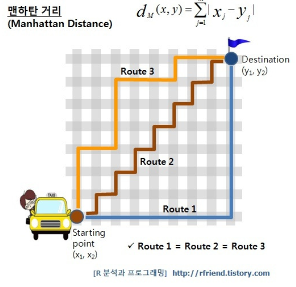
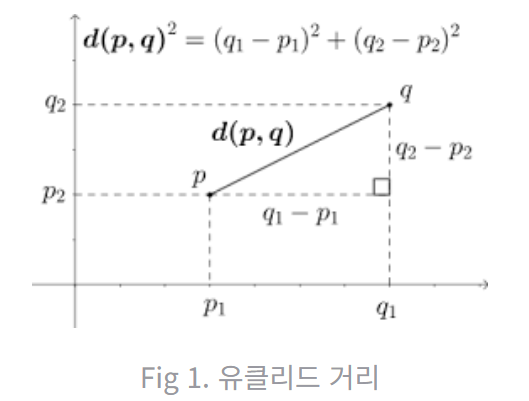
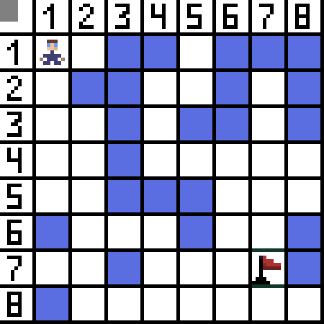
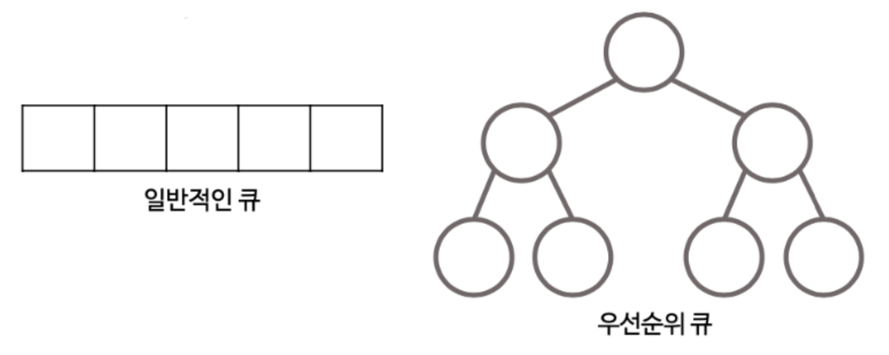
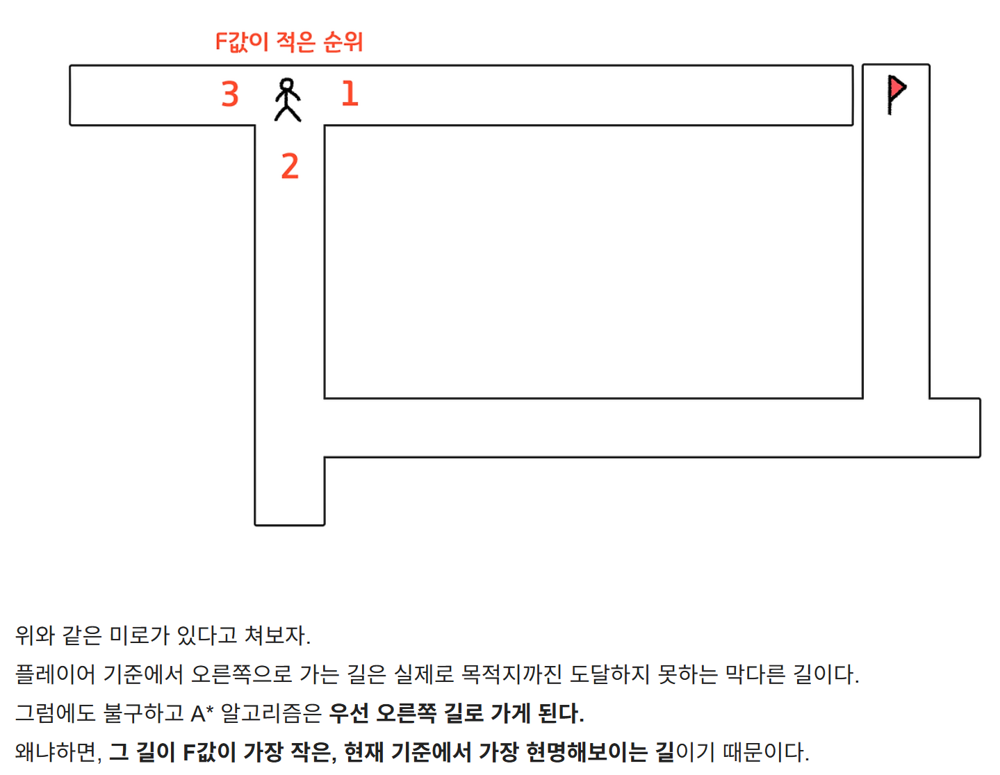
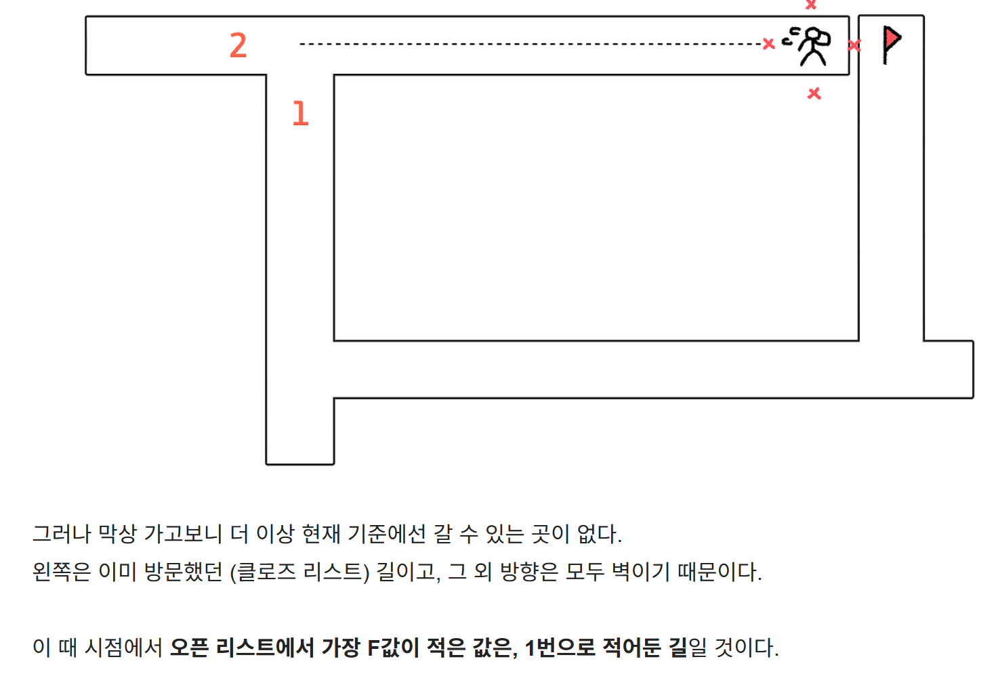
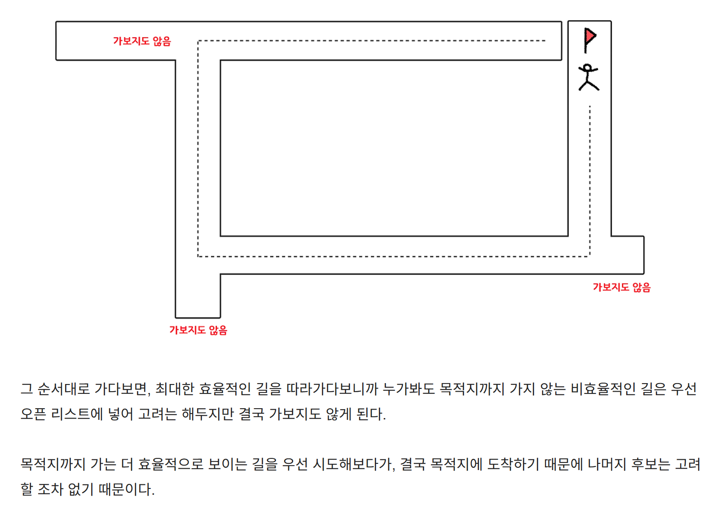

# 10-4.  A* 알고리즘에 대해 설명해 주세요. 이 알고리즘은 다익스트라와 비교해서 어떤 성능을 낼까요?

## 1. A-star 알고리즘이란?

그래프에서 최단 경로를 찾는 휴리스틱 기반 탐색 알고리즘으로,

단순한 최단 경로 탐색이 아니라 **효율성과 정확성을 동시에 추구**하는 스마트한 탐색법을 목표로 만들어졌다.

기본적으로는 **다익스트라 알고리즘 아이디어를 기반**으로 휴리스틱이라는 개념을 더해 성능을 비약적으로 높인 방식

기본적인 흐름 : **지금까지 온 거리(G)**와 **앞으로 남은 거리(H)**를 합산해** 총 예상 비용(F = G+H)이 가장 낮은 후보**부터 탐색

⇒ 지금까지 온 거리뿐 아니라 앞으로 얼마나 더 가야하는지도 같이 고려하는 방

---

## 2. F = G + H

- G : 시작점에서 현재 위치까지 실제로 이동한 누적 거리로, 최단 경로를 찾는 것이 목표이므로 적을수록 좋다.

→ ex. 한 칸 이동 비용이 1이라면, 시작점에서 5칸 이동한 위치의 G값은 5가 된다.

- H : 현재 위치에서 목적지까지의 예상 거리로, 맨해튼 거리 or 유클리드 거리를 많이 쓴다.





→ 맨해튼 거리 : 목적지까지 남은 가로 거리 + 세로 거리

→ 유클리드 거리 : 목적지까지의 대각선을 포함한 최소 직선 거리

| 환경 | 휴리스틱 |
| --- | --- |
| 격자 | 맨해튼 |
| 2D 지도 | 유클리디안 |

- F : 최종 비용으로, G + H로 산출되는데, A-star 알고리즘은 이 F값이 가장 낮은 후보를 우선적으로 탐색하는 알고리즘



### A-star 알고리즘의 동작 순서를 이해하기 위한 개념

1. 오픈 리스트

출발한 주인공 기준, 인지하게 된 길 후보들. 갈 수 있다고 판단되는 모든 길들을 오픈 리스트에 담아둠

1. 클로즈 리스트

탐색 완료한, 방문한 길들로 이미 한번 방문한 길은 재방문하면 안되므로 꼭 필요한 리스트

### A-star 알고리즘의 순서

1. 시작 지점을 오픈 리스트에 추가한다.

1. 오픈 리스트에서 F(현재 ~ 목적지까지의 예상 거리)값이 가장 작은 노드를 꺼낸다.

1. 2번 노드를 클로즈 리스트에 넣는다.

1. 꺼낸 노드의 인접한 노드들을 확인한다.

  1. 벽이거나 이미 닫힌 리스트에 있는 경우는 제외

  1. 아직 발견하지 않았거나 더 좋은 경로가 있다면 오픈 리스트에 넣는다

1. 목적지에 도달할 때까지 위 과정을 반복한다.

⇒ 굉장히 쉬워 보이지만, 이 과정 반복만으로도 **반드시 최적해를 보장**하며 목적지에 도달한다.

### A-star 알고리즘에서 고려해야 할 비용

수많은 오픈 리스트들의 노드들 중 F값이 가장 작은 노드를 꺼내는 데에 O(n)의 시간복잡도가 소요됨

max나 min값을 찾는 비용을 줄이기 위해, 리스트에 특정 값을 넣을 때 항상 **정렬을 유지하며 이진 탐색 **해야함

그렇다고 리스트에 값을 넣을 때마다 계속 정렬을 실행했다간 오히려 더 비용이 비싸질 우려가 있기에, 주로 **우선순위 큐**를 활용한다.



→ 일반 FIFO 구조의 큐와는 다르게 우선순위 큐는 항상 **포화 이진 트리**의 모양을 유지

---







⇒ 만약 BFS나 **다익스트라였다면, 저 가보지도 않았던 길들 역시 출발점으로부터 얼만큼의 최소 비용이 들었는지 모두 계산했을 것**이다. 그러나 **A* 알고리즘은 이를 고려하지 않았고**, 그만큼 시간적으로 이점을 보게 된다.

---

## 3. A-star 알고리즘의 특징

- 다익스트라와 같이 최단 경로를 보장

- 목표지점까지의 예상비용(휴리스틱)을 함께 사용해 탐색 범위를 줄임

→ 다익스트라보다 훨씬 빠르게 동작

[예시]

지도 네비게이션, 게임 AI 경로 탐색, 로봇 경로 계획

---

## 4. A-star 알고리즘의 핵심 아이디어

f(n)=g(n)+h(n)

| 값 | 의미 |
| --- | --- |
| g(n) | 시작 노드 → 현재 노드까지 실제 비용 |
| h(n) | 현재 노드 → 목표 노드까지의 **예상 비용(휴리스틱)** |
| f(n) | 총 예상 비용 |

⇒ 즉,  **현재까지 온 비용 + 앞으로 갈 것으로 예상되는 비용**이 가장 작은 노드를 우선적으로 탐색

---

## 5. 알고리즘 동작 과정 재정리

1️⃣ 시작 노드를 open list(PriorityQueue)에 삽입

2️⃣ 다음을 반복

- f(n)이 가장 작은 노드 선택

- 목표 노드라면 종료

- 인접 노드 탐색

- g(n), h(n), f(n) 계산

- open list에 추가

3️⃣ 목표 노드에 도달하면 최단 경로 반환

---

## 6. 다익스트라와의 차이

- 다익스트라 : 지금까지 온 거리만 고려(`g(n)`)하므로, 목표 방향과 상관없이 전 방향을 탐색한다.

```sql
S → 모든 방향 확장
○ ○ ○ ○
○ ○ ○ ○
○ ○ ○ ○
```

→ 목표와 상관없이 동심원 형태로 탐색

- A-star : 목표 방향으로 탐색을 유도(`g(n) + h(n)`)해 불필요한 노드 탐색을 줄인다.

```sql
S → 목표 방향 위주 탐색
→ → → 
   → → 
      G
```

→ 목표 방향 중심으로 탐색

### 시간복잡도

O(E log V)로, 최악의 시간복잡도는 동일하지만 실제 성능은 다르다.

| 상황 | 성능 |
| --- | --- |
| 휴리스틱 없음 | A* = 다익스트라 |
| 좋은 휴리스틱 | A* ≫ 다익스트라 |
| 완벽한 휴리스틱 | 거의 직선 탐색 |

→ 즉 좋은 휴리스틱이 있을수록 탐색 노드 수가 크게 감소한다.

---

## 7. 휴리스틱 조건

A-star가 최단 경로를 보장하려면, `admissible heuristic`

h(n) <= 실제비용

즉, 절대 실제 거리보다 크면 안 된다.

---

## 8. 한 줄 정리

> A* 알고리즘은 **다익스트라에 휴리스틱을 추가한 최단 경로 탐색 알고리즘**으로, `f(n)=g(n)+h(n)` 값을 기준으로 탐색한다. 이론적인 시간복잡도는 다익스트라와 동일하지만, **목표 방향으로 탐색을 유도**하기 때문에 실제로는 훨씬 적은 노드를 탐색하여 더 빠른 성능을 보인다.
