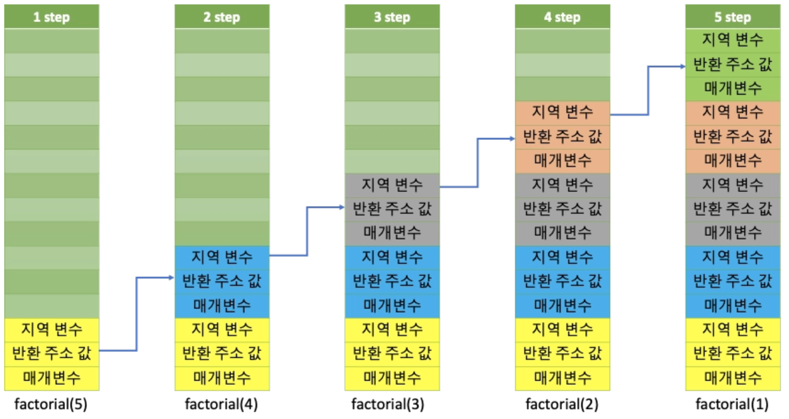
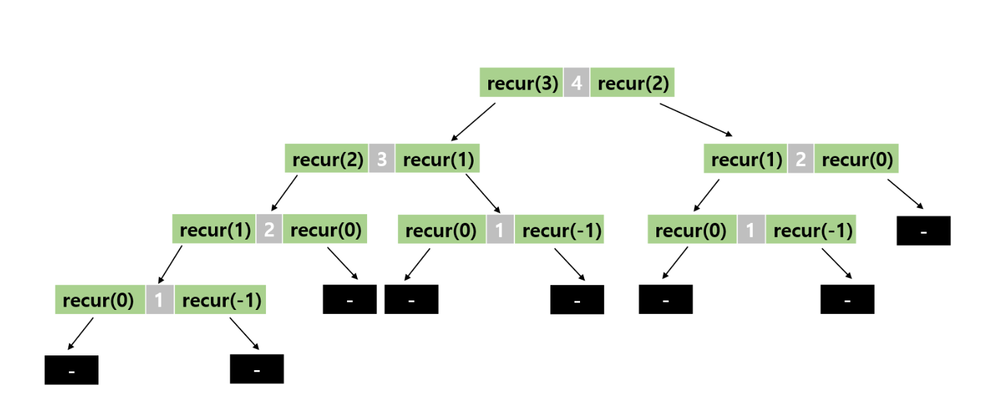

# 11-0. 재귀함수에 대해 설명해 주세요.

## 1. 재귀란?

재귀(Recursion)은 _**어떤 것을 정의할 때 자기 자신을 다시 참조하는 방식**_으로, 컴퓨터 과학에서는 _**함수가 자기 자신을 호출하는 방식**_

---

## 2. 재귀 함수란?

재귀 함수(Recursive Function)은 함수 내부에서 자기 자신을 다시 호출하는 함수

```java
// 국밥 예시 : 팩토리얼

int factorial(int n) {
    if (n == 1) {
        return 1;
    }
    return n * factorial(n - 1);
}
```

- **문제를 더 작은 문제로 나누어** 해결

- 반복문(for, while) 대체

→ 반복문 vs 재귀(메모리 레벨 차이)

### 반복문

  - 동일 스택 프레임 내에서 변수 값만 변경

### 재귀

  - 호출마다 새로운 스택 프레임 생성

  - 지역 변수 복사

  - 반환 주소 저장

→ 반복문이 더 메모리 효율적

  <details>
  <summary>💬 Q&A</summary>

**Q1. 재귀가 반복문보다 느린 이유는 무엇인가요?**

A. 함수 호출/복귀 과정에서 컨텍스트 저장 및 복원 비용이 발생하기 때문입니다. 또한 스택 프레임이 계속 생성됩니다.

**Q2. 모든 반복문은 재귀로 바꿀 수 있나요?**

A. 이론적으로는 가능합니다. 하지만 메모리 효율성과 가독성 측면에서 항상 적절한 것은 아닙니다.
  </details>

- 분할 정복 알고리즘에서 자주 사용

---

## 3. 동작 원리 - call stack



→ 함수 호출 시 `매개변수`, `지역변수`, `반환주소값`이 스택에 저장되며, `이전 프레임이 참조`됨

→ 재귀 호출이 깊어질수록 스택 프레임이 계층적으로 쌓이는 구조

<details>
<summary>**💬 Q&A**</summary>

**Q3. StackOverflowError는 언제 발생하나요?**

A. 스택 프레임이 스택 메모리 한계를 초과할 때 발생합니다.

**Q4. StackOverflowError와 OutOfMemoryError의 차이는?**

A. StackOverflowError는 스택 메모리 초과, OutOfMemoryError는 힙 메모리 부족입니다.

**Q5. JVM에서 스택 크기를 조절할 수 있나요?**

A. 네. `-Xss` 옵션으로 조절할 수 있습니다. 하지만 근본 해결책은 아닙니다.
</details>

---

## 4. 스택 메모리의 특징

- 스택 크기 **고정**

- JVM 기본 약 1~2 MB

- GC 대상 X

- 자동 확장 X

> 재귀 호출 깊이 = 메모리 사용량 증가

---

## 5. 재귀의 시간 복잡도 / 공간 복잡도 구조

### 시간 복잡도

재귀는 단순 호출이 아닌 **재귀트리 구조**를 가진다.

```java
fib(5)
 ├─ fib(4)
 │   ├─ fib(3)
 │   └─ fib(2)
 └─ fib(3)
```

→ 재귀를 볼 땐, `호출 깊이` 와 `분기 수` 를 함께 고려해야 함

### 공간 복잡도

재귀의 공간 복잡도는 O(**최대 호출 깊이**)

| 알고리즘 | 공간복잡도 |
| --- | --- |
| 단일 선형 재귀 | O(n) |
| 이진 트리 DFS | O(h) |
| 퀵소트(평균) | O(log n) |
| 퀵소트(최악) | O(n) |

→ 재귀는 항상 `호출 깊이` 기준으로 공간 복잡도를 계산함

<details>
<summary>💬 Q&A</summary>

**Q6. 재귀의 공간 복잡도는 왜 호출 깊이 기준인가요?**

A. 동시에 스택에 존재하는 함수 호출 수가 최대 깊이이기 때문입니다.

**Q7. 피보나치 재귀의 시간복잡도는 왜 O(2ⁿ)인가요?**

A. 각 호출이 두 번씩 분기하기 때문입니다. 재귀 트리의 노드 수가 지수적으로 증가합니다.
</details>

---

## 6. 재귀 함수의 장단점

### 장점

- 간결한 코드로, 복잡한 반복문보다 논리구조가 명확함

- 상태 전달이 자연스러움

→ 매개변수로 상태를 넘기므로 전역변수의 필요성이 감소됨

- 분할정복 알고리즘에 적합함

  - Merge Sort

  - Quick Sort

  - DFS

  - 백트래킹

### 단점

- 스택 오버플로우(StackOverflowError) : 종료 조건이 없거나 호출이 깊어지면 발생

“스택 메모리의 한계를 초과했을 때 발생하는 런타임 에러”로, 더 이상 새로운 함수 호출을 위한 **스택 프레임을 쌓을 공간이 없을 때** 발생(=JVM 스택 크기 초과 시 발생)

  - 스택이란? 프로그램이 실행될 때, 메모리는 크게 `Heap` / `Method Area` / `Stack` 으로 나뉜다.

    - Heap : 객체 저장

    - Method Area : 클래스 정보

    - Stack : 함수 호출 정보 저장

→ 함수가 호출될 때마다 스택 프레임이 생성됨

- 메모리 사용 증가

  - 반복문 : 변수 몇 개만 사용

  - 재귀 : 호출 횟수만큼 스택 프레임 생성

→ 메모리 비효율

- 함수 호출 비용 : 호출 → 복귀 → 컨텍스트 저장/복원

→ 반복문보다 느릴 수 있음

  <details>
  <summary>왜 재귀에서 컨텍스트 비용이 문제가 되는가?</summary>

### 1️⃣ 호출 깊이가 깊으면

→ 스택 프레임 수 증가

### 2️⃣ 함수가 매우 작은 경우

→ 호출 비용이 로직보다 커질 수 있음

### 3️⃣ 분기 수가 많은 재귀

→ 호출 폭발적 증가

예: 피보나치 → 호출 수가 지수적으로 증가 & 호출 비용도 지수적으로 증가

⇒ OS 컨텍스트 스위칭보다는 비용이 비교안될만큼 현저히 적지만, 호출이 많아지면 누적 비용 증가하며

각 스레드는 독집적인 스택을 가지므로, 멀티스레드 환경에서 `스레드 수 * 스택 크기` 만큼 메모리 사용 증폭
  </details>

- 중복 계산 문제(예시 : 피보나치)

```java
int fib(int n) {
    if (n <= 1) return n;
    return fib(n - 1) + fib(n - 2);
}
```

→ 같은 계산을 여러 번 수행, 시간복잡도 O(2^n)

---

## 7. 재귀 함수의 단점 해결 방법 

### 꼬리 재귀(TCO)

- 재귀 호출이 함수의 마지막 동작인 형태

```java
// 일반 재귀
return n * factorial(n - 1);

// 꼬리 재귀
return factorial(n - 1, n * total);
```

  - 반환 후 추가 연산 없음

  - 컴파일러가 반복문으로 최적화 가능

(적용 가능 : `Kotlin` → tailrec 지원, `Scala` / 적용 불가 :  `Java` , `python` , `JavaScript` → 엔진마다 다름)

→ 따라서, Java에서는 꼬리 재귀라도 StackOverflow 가능

  - 스택 프레임 재사용

### 메모이제이션

- 이전 계산 결과를 저장해 재사용

```java
Map<Integer, Integer> cache = new HashMap<>();

int fib(int n) {
    if (n <= 1) return n;
    if (cache.containsKey(n)) return cache.get(n);

    int result = fib(n - 1) + fib(n - 2);
    cache.put(n, result);
    return result;
}
```

  - 중복 계산 제거

  - 시간복잡도 O(N), 공간복잡도는 증가

### 트램펄린(Trampoline)

- 상호 재귀

```java
// 짝수 & 홀수 판별
even → odd → even → odd ...
```

트램펄린은 재귀호출을 즉시 실행하지 않고, 함수 객체로 변환 후 반복적으로 실행하는 방식

즉, 재귀를 반복문 위에 올리는 기법을 통해 스택 증가 방지

---

## 8. 함수형 프로그래밍과 재귀

함수형 프로그래밍에서는

- 반복문 대신 재귀 사용

- 상태 변경 최소화

- 순수 함수 유지

하지만, 일반 재귀는 스택 문제가 발생 가능하므로

- 꼬리 재귀(Tail Recursion)

- 메모이제이션(Memoization)

- 트램펄린(Trampoline) 기법들을 활용

<details>
<summary>**💬 Q&A**</summary>

**Q8. 트램펄린은 언제 사용하나요?**

A. 상호 재귀 구조에서 스택 증가를 방지하기 위해 사용합니다.

**Q9. 함수형 프로그래밍에서 재귀를 선호하는 이유는?**

A. 상태 변경을 줄이고, 순수 함수 기반 구조를 유지하기 위해서입니다.

**Q10. 실무에서 재귀를 피해야 하는 이유는?**

A. 입력 깊이를 예측하기 어려운 경우 StackOverflow가 발생할 수 있기 때문입니다.
</details>

---

## 9. 재귀 사용

추천 : 트리 탐색, 그래프 DFS, 백트래킹, 분할정복, 상태공간 탐색

비추 : 단순 반복 계산, 매우 깊은 호출 구조, 성능이 중요한 로직

---

## 10. Memoization vs DP

재귀 최적화의 핵심은** 중복 계산 제거**이다.

### Memoization (Top-down)

- 재귀 유지

- 캐시 활용

- 호출 필요할 때 계산

### Dynamic Programming (Bottom-up)

- 반복문 사용

- 테이블 기반 계산

→ 실무에서는 DP가 더 안정적

<details>
<summary>**💬 Q&A**</summary>

**Q11. 메모이제이션과 DP의 차이는 무엇인가요?**

A. 메모이제이션은 `Top-down` 방식(재귀 기반), DP는 `Bottom-up` 방식(반복문 기반)입니다.

**Q12. DFS는 왜 재귀가 자연스러운가요?**

A. 트리 자체가 재귀 구조이기 때문입니다.


</details>

---

## 11. 재귀의 실무 리스크

### 1️⃣ JVM 환경

- 깊은 재귀는 위험

- 서버 환경에서 StackOverflow는 치명적

### 2️⃣ 예측 불가능한 입력

- 사용자 입력이 재귀 깊이를 결정할 경우 위험

### 3️⃣ 디버깅 어려움

- 스택 추적이 복잡

- 로그 가독성 저하

---

## 12. 최종 정리

재귀는 단순한 반복문 대체가 아니다. 메모리 구조 위에서 동작하는, 함수 호출의 계층적 구조를 나타낸다.

재귀를 쓸 때는 반드시 호출깊이 / 분기수 / 시간복잡도 / 공간복잡도 / 언어의 TCO 지원 여부를 고려해야한다.

→ 즉 재귀는 문제를 구조적으로 표현하는 강력한 도구이지만, 메모리와 시간복잡도에 대한 이해 없이 사용하면 위험하다.
