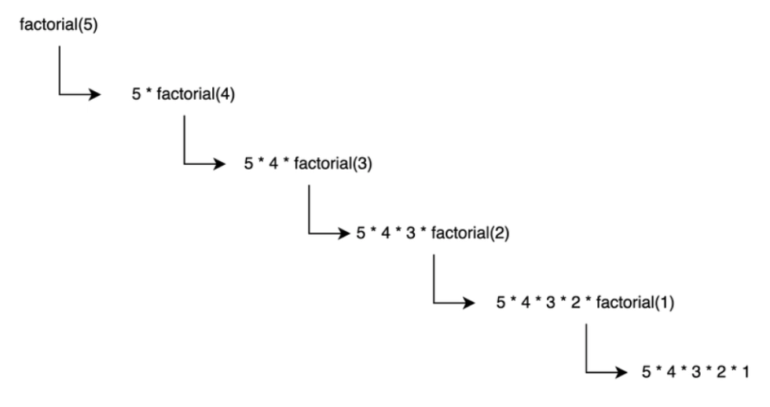
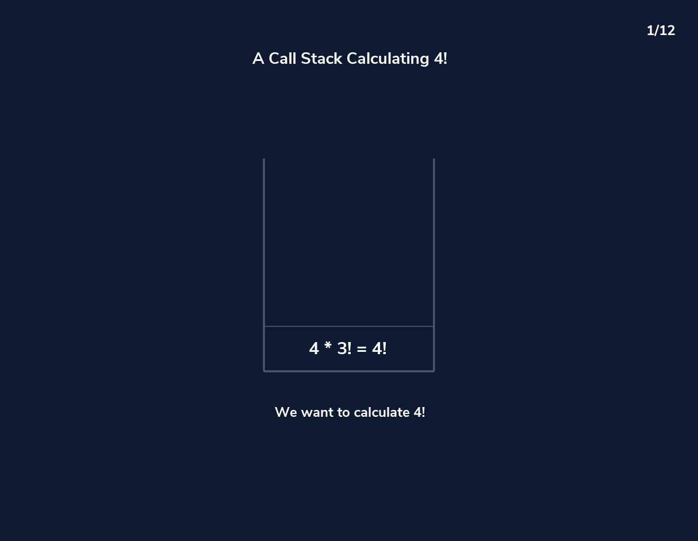

# **11-1.** 재귀 함수의 동작 과정을 Call Stack을 활용해서 설명해 주세요.

# 🔁 재귀 함수와 Call Stack 동작 과정

## 1️⃣ 재귀 함수(Recursion)란

### 📌 정의

- 함수가 **자기 자신을 다시 호출하는 프로그래밍 기법**

- 큰 문제를 **작은 동일한 문제로 분할**하여 해결

### 📌 재귀 함수의 필수 요소

1️⃣ **Base Case (기저 조건)**

→ 재귀 호출을 멈추는 조건

2️⃣ **Recursive Case (재귀 호출)**

→ 문제를 더 작은 형태로 호출

👉 기저 조건이 없으면 **무한 호출 → Stack Overflow 발생**

---

## 2️⃣ Call Stack이란

### 📌 정의

- 함수 호출 정보를 저장하는 **스택 자료구조**

- 프로그램 실행 흐름을 관리하는 핵심 메커니즘

### 📌 특징

- **LIFO 구조 (Last In First Out)**

- 함수 호출 시 → Push

- 함수 종료 시 → Pop

---

## 3️⃣ Stack Frame (스택 프레임)

함수가 호출될 때 스택에 저장되는 정보

### 포함 내용

- 매개변수 값

- 지역 변수

- 반환 주소

- 실행 상태

👉 재귀 함수는 호출마다 새로운 스택 프레임 생성

---

## 4️⃣ 재귀 함수 동작 흐름

재귀 실행 과정은 크게 두 단계

### 1. 호출 단계 (Stack Push)

- 함수가 자기 자신 호출

- 스택 프레임 계속 증가

### 2. 반환 단계 (Stack Pop)

- Base Case 도달

- 가장 마지막 호출부터 반환

👉 역순으로 계산 진행

---

## 5️⃣ 예시 : Factorial 재귀

```java
public static int factorial(int n) {
    if (n == 1) return 1;
    return n * factorial(n - 1);
}
```

---

## 6️⃣ Call Stack 실행 과정



### 호출 단계

```plain text
factorial(5)
 → factorial(4)
   → factorial(3)
     → factorial(2)
       → factorial(1)
```

### 반환 단계

```plain text
factorial(1) = 1
factorial(2) = 2 × 1 = 2
factorial(3) = 3 × 2 = 6
factorial(4) = 4 × 6 = 24
factorial(5) = 5 × 24 = 120
```

👉 마지막 호출이 먼저 반환되는 LIFO 구조



---

## 7️⃣ 재귀와 반복문 비교

| 구분 | 재귀 | 반복문 |
| --- | --- | --- |
| 구현 방식 | 함수 호출 | 루프 |
| 메모리 사용 | Call Stack 사용 | 적음 |
| 가독성 | 높음 (문제 구조 표현) | 상대적으로 낮음 |
| 성능 | 스택 오버헤드 존재 | 일반적으로 더 빠름 |

---

## 8️⃣ 재귀 사용이 적합한 경우

✔️ 트리 탐색 (DFS)

✔️ 분할 정복 알고리즘

✔️ 백트래킹

✔️ 수학적 정의가 재귀적인 문제

---

## 📌 핵심 정리

- 재귀 함수는 자기 자신을 호출하며 문제를 해결

- 함수 호출 정보는 Call Stack에 저장됨

- Base Case 도달 시 스택이 역순으로 반환

- 재귀의 실행 흐름 = **Stack Push → Stack Pop**

- 기저 조건이 없으면 Stack Overflow 발생
