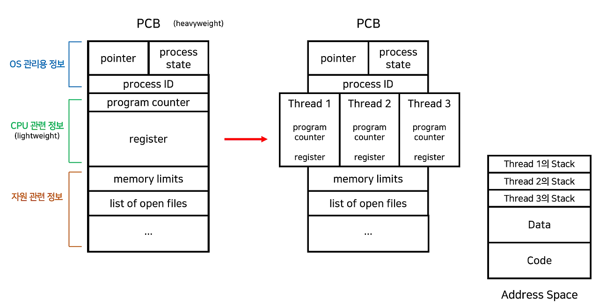
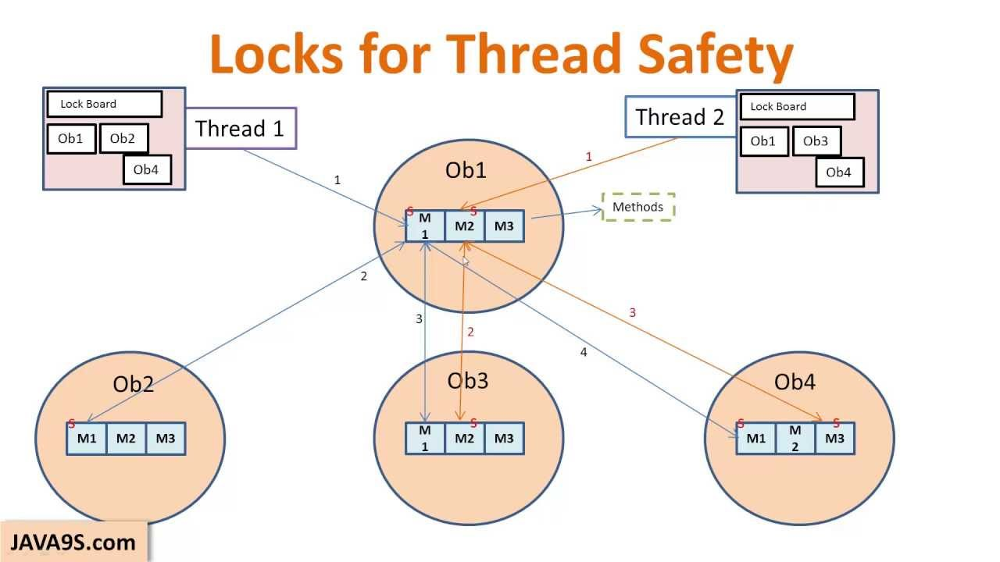
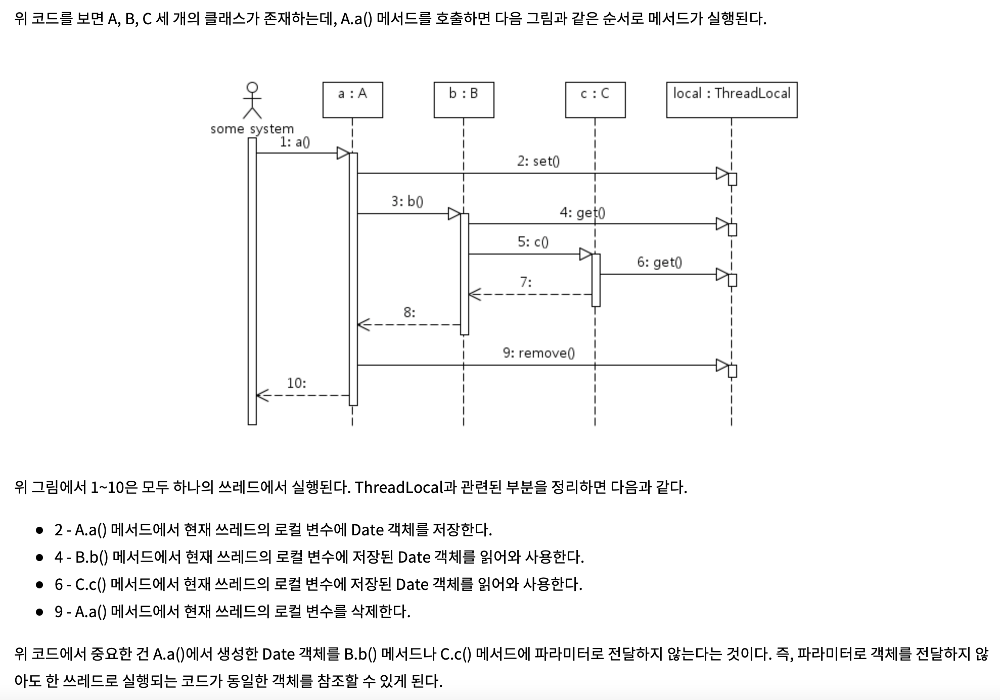

# 13-0. Thread Safe 한 자료구조가 있을까요? 없다면, 어떻게 Thread Safe 하게 구성할 수 있을까요?

### Thread

```plain text
Thread는 Process의 하위 개념으로써 프로세스에 할당된 자원을 공유한다. Program을 스레드로 분리하면 자연스럽게 병렬성을 이용할 수 있기 때문에 복잡한 애플리케이션의 성능을 향상시킬 수 있다. 하지만, Thread 구조를 정확하게 이해하지 못하고 사용한다면 병렬성 효율성의 문제 및 데이터 공유성 문제 등 다양한 문제가 발생할 수 있다.
```

### ⭐ 초핵심 요약

  - **Thread** : 프로세스 내부 실행 단위

  - **Multithreading** : 하나의 프로세스에서 여러 스레드 실행

  - **Thread 장점** : 가벼움, 메모리 공유, 응답성 향상

  - **Process vs Thread** : 프로세스는 메모리 독립, 스레드는 메모리 공유

### 1️⃣ Thread (스레드)



**프로세스 내부에서 실행되는 CPU 실행 흐름(실행 단위)**

구성

  - Thread ID

  - Program Counter

  - Register

  - Stack

특징

  - 같은 프로세스의 **Code / Data / Heap / 파일** 공유

  - **Stack과 Register는 각 스레드가 따로 가짐**

```plain text

스레드(Thread)는 CPU 수행의 기본 단위 또는 프로세스 안의 제어권의 흐름이다. 스레드가 수행되는 환경을 Task라고 부르는데, 전통적인 프로세스는 하나의 스레드가 있는 Task와 일치한다.

스레드는 Thread ID, Program counter, Register set, Stack space로 구성된다. 각각의 스레드는 주로 최소한 자신의 레지스터 상태와 스택을 갖는다.
반면 Code, Data 섹션이나 운영체제 자원들은 스레드끼리 공유한다.
```

---

### 2️⃣ Process vs Thread (핵심 비교)

| 구분 | Process | Thread |
| --- | --- | --- |
| 정의 | 실행 중인 프로그램 | 프로세스 내부 실행 단위 |
| 메모리 | 독립된 메모리 공간 | 같은 프로세스 메모리 공유 |
| 생성 비용 | 큼 | 작음 |
| Context Switch | 무거움 | 가벼움 |
| 통신 | IPC 필요 (pipe, socket 등) | 메모리 공유로 쉬움 |
| 안정성 | 한 프로세스 오류 → 다른 프로세스 영향 없음 | 한 스레드 오류 → 프로세스 전체 영향 |

### **스레드를 사용하는 이유는~~ ?**

```plain text
1. 프로세스를 생성하거나 Context switching 하는 작업은 너무 무겁고 잦으면 성능 저하가 발생하는데, 스레드를 생성하거나 switching 하는 것은 그에 비해 가볍다.
2. 두 프로세스가 하나의 데이터를 공유하려면 메시지 패싱이나 공유 메모리 또는 파이프를 사용해야 하는데, 이는 효율도 떨어지고 개발자가 구현, 관리하기도 번거롭다.
```

---

### 3️⃣ Multithreading

**하나의 프로세스에서 여러 스레드를 동시에 실행하는 것**

장점

  - **Responsiveness** : 사용자 응답성 증가

  - **Resource Sharing** : 메모리 공유 가능

  - **Economy** : 생성/전환 비용 감소

  - **Scalability** : 멀티코어 CPU 활용 가능

---

### 4️⃣ Concurrency vs Parallelism

**Concurrency (동시성)**

→ 하나의 CPU에서 **번갈아 실행**

**Parallelism (병렬성)**

→ 여러 CPU에서 **실제로 동시에 실행**

# **Thread Safe란?**

```plain text
Thread Safe 한 자료구조란 여러 개의 스레드가 동시에 자료구조에 접근하더라도 예상한 대로 동작하도록 보장하는 자료구조를 말합니다.
```

여러 스레드가 동시에 실행되어도

- 데이터 경쟁(race condition) 이 발생하지 않고

- 일관된 결과를 유지하는 코드 또는 자료구조

---

# 왜 Thread-Safe가 필요할까?

멀티스레드 환경에서는 **여러 스레드가 동시에 같은 데이터를 수정**할 수 있음

<details>
<summary>예</summary>

```plain text
count++;
```

이 연산은 실제로는 다음 과정으로 실됨

  1. count 읽기

  1. +1 연산

  1. count 저장

두 스레드가 동시에 실행하면

```plain text
Thread1: count 읽기 (0)
Thread2: count 읽기 (0)
Thread1: 저장 (1)
Thread2: 저장 (1)
```

➡ 결과

```plain text
count = 1 (정상 결과는 2)
```

이 현상을 **Race Condition**이라고 한다

따라서 **동시에 접근해도 올바른 결과가 나오도록 설계하는 것**이 Thread-Safe
</details>

---

# Thread-Safe한 자료구조가 있을까요? 없다면 어떻게 구현할까요?

## 1. Thread-Safe 자료구조

Java에는 멀티스레드 환경에서 안전하게 사용할 수 있는 **Thread-Safe 컬렉션**이 존재합니다.

### ① synchronized 기반 (구형)

- `Vector`

- `Hashtable`

- `Collections.synchronizedList / Map / Set`

### 동작 방식

- **전체 컬렉션에 하나의 lock 사용**

어떤 스레드가 `put()` 이나 `get()` 을 수행 중이면

다른 스레드는 기다려야 한다.

### 장점

구현이 단순하고 이해하기 쉽다.

### 단점

- lock contention 발생

- 성능 저하

모든 작업이 거의 **줄 서서 실행**되기 때문에 성능이 떨어진다.

### 비유

화장실이 하나뿐인 집이라고 생각하면 된다. 누가 들어가 있으면 다른 사람은 무조건 기다려야 한다.

그래서 요즘 실무에서는 이 방식보다 더 세밀한 concurrent 컬렉션을 많이 쓴다.

---

### ② concurrent 패키지 (실무 표준)

이 컬렉션들은 `synchronized`처럼 **전체를 한 번에 잠그지 않고**,

필요한 부분만 잠그거나, 아예 락 없이 CAS 같은 원자 연산을 이용한다.

그래서 **동시성 + 성능**을 둘 다 챙기기 좋다

`java.util.concurrent`

대표 예

- `ConcurrentHashMap`

- `CopyOnWriteArrayList`

- `BlockingQueue`

- `ConcurrentLinkedQueue`

- `ConcurrentSkipListMap / Set`

특징

- **CAS**

- **fine-grained lock**

- **lock-free 알고리즘**

등을 사용해 **동시성을 안전하게 처리**

예

- **ConcurrentHashMap** → Thread-safe Map

- **CopyOnWriteArrayList** → 읽기 많을 때 유리

- **BlockingQueue** → Producer-Consumer 패턴

---

# 2. 없다면 Thread-Safe하게 구현하는 방법

| 방법 | 설명 |
| --- | --- |
| synchronized | 단일 스레드 접근 보장 |
| ConcurrentHashMap | 세밀한 Lock으로 성능 향상 |
| ThreadLocal | Thread 단위 데이터 관리 |
| Immutable 객체 | 변경 불가능 객체로 안전성 확보 |

## ① Synchronization (Lock 사용)



공유 자원 접근 구간을 **임계 영역(Critical Section)**으로 만들어

한 번에 하나의 스레드만 접근하도록 제한합니다.

대표 기술

- `synchronized`

- `Mutex`

- `Lock`

- `ReentrantLock`

예

```plain text
synchronizedvoidincrement() {
count++;
}


@ThreadSafe
public class Sequence {
    @GuardedBy("this") private int nextValue;

    public synchronized int getNext() {
        return nextValue++;
    }
}
// => Sequence 인스턴스의 getNext() 메서드의 동시성을 보장함. getNext()에 접근할 수 있는 스레드를 단 한개만 보장
수많은 스레드들이 동시에 getNext()에 접근한다고 하더라도 정확한 nextValue 값을 보장받을 수 있다.
'synchronized' 키워드는 꼭 메서드에만 사용할 수 있는 것이 아니라, 특정 코드 블록에서 사용하는 방법도 있다 
```

---

## ② Concurrent 컬렉션의 원자 연산 사용

Concurrent 컬렉션은 **원자 메서드**를 제공합니다..

예

- `compute()`

- `computeIfAbsent()`

- `putIfAbsent()`

- `merge()`

예를 들어

```plain text
if(map.containsKey(k))
map.put(k,v);
```

<details>
<summary>코드</summary>

```java
 public V get(Object key) {
        Node<K,V>[] tab; Node<K,V> e, p; int n, eh; K ek;
        int h = spread(key.hashCode());
        if ((tab = table) != null && (n = tab.length) > 0 &&
            (e = tabAt(tab, (n - 1) & h)) != null) {
            if ((eh = e.hash) == h) {
                if ((ek = e.key) == key || (ek != null && key.equals(ek)))
                    return e.val;
            }
            else if (eh < 0)
                return (p = e.find(h, key)) != null ? p.val : null;
            while ((e = e.next) != null) {
                if (e.hash == h &&
                    ((ek = e.key) == key || (ek != null && key.equals(ek))))
                    return e.val;
            }
        }
        return null;
    }
    
    ...
    
        
    public V put(K key, V value) {
        return putVal(key, value, false);
    }

    /** Implementation for put and putIfAbsent */
    final V putVal(K key, V value, boolean onlyIfAbsent) {
        if (key == null || value == null) throw new NullPointerException();
        int hash = spread(key.hashCode());
        int binCount = 0;
        for (Node<K,V>[] tab = table;;) {
            Node<K,V> f; int n, i, fh;
            if (tab == null || (n = tab.length) == 0)
                tab = initTable();
            else if ((f = tabAt(tab, i = (n - 1) & hash)) == null) {
                if (casTabAt(tab, i, null,
                             new Node<K,V>(hash, key, value, null)))
                    break;                   // no lock when adding to empty bin
            }
            else if ((fh = f.hash) == MOVED)
                tab = helpTransfer(tab, f);
            else {
                V oldVal = null;
                synchronized (f) {
                    if (tabAt(tab, i) == f) {
                        if (fh >= 0) {
                            binCount = 1;
                            for (Node<K,V> e = f;; ++binCount) {
                                K ek;
                                if (e.hash == hash &&
                                    ((ek = e.key) == key ||
                                     (ek != null && key.equals(ek)))) {
                                    oldVal = e.val;
                                    if (!onlyIfAbsent)
                                        e.val = value;
                                    break;
                                }
                                Node<K,V> pred = e;
                                if ((e = e.next) == null) {
                                    pred.next = new Node<K,V>(hash, key,
                                                              value, null);
                                    break;
                                }
                            }
                        }
                        else if (f instanceof TreeBin) {
                            Node<K,V> p;
                            binCount = 2;
                            if ((p = ((TreeBin<K,V>)f).putTreeVal(hash, key,
                                                           value)) != null) {
                                oldVal = p.val;
                                if (!onlyIfAbsent)
                                    p.val = value;
                            }
                        }
                    }
                }
                if (binCount != 0) {
                    if (binCount >= TREEIFY_THRESHOLD)
                        treeifyBin(tab, i);
                    if (oldVal != null)
                        return oldVal;
                    break;
                }
            }
        }
        addCount(1L, binCount);
        return null;
    }
```
</details>

같은 **check-then-act 패턴은 Race Condition이 발생할 수 있으므로**

→ **원자 메서드 사용**

lock level이 높을 수록, 일관성 무결성에는 더 확실하지만 동시성 측면에서는 좋지 못하다.

---

## ③ Immutable 객체 사용

객체를 **불변 객체**로 설계하여 동시 수정 문제를 제거합니다.

예

- `String`

- `Integer`

- `LocalDate`

특징

- 상태 변경 없음

- 자연스럽게 Thread-safe

---

## ④ ThreadLocal 사용

**ThreadLocal 이란 ?**

각 스레드가 **자신만의 데이터를 가지도록** 하여 공유 자원을 줄이는 방식입니다.

Java 에서 사용하는 Thread Local 이란 간단히 설명해서 쓰레드 지역 변수임

Thread Local 로 정의된 객체는 같은 Thread 라는 Scope 내에서 공유되어 사용될 수 있는 값으로 다른 쓰레드에서 공유변수를 접근할 시 발생할 수 있는 동시성 문제의 예방을 위해 만들어졌다.

한 쓰레드 내에서만 사용되는 변수라더라도 전역변수처럼 State 값을 부여해서 사용하게 되므로 가능한 가공이 없는 참조용 객체의 경우가 사용되며, 지나친 사용은 재사용성을 떨어트리고 부작용을 발생시킬 수 있다.

예

```plain text
ThreadLocal<Integer>value=newThreadLocal<>();

대표적인 사용 예로 SpringSecurity에서 제공하는 SecurityContextHolder가 바로 ThreadLocal 적절한 예가 

SecurityContextHolder에 저장된 Authentication 객체는 Filter영역에서 처리가 되어지지만 Controller 영역에서도 파라미터 없이 전달이 가능하다.
```



사용 예

- 사용자 세션

- 트랜잭션 컨텍스트

---

## ⑤ Atomic 연산 사용

락 없이 원자적 연산(CAS)을 사용하여 Thread-Safe를 보장합니다.

예

```plain text
AtomicIntegercount=newAtomicInteger(0);
count.incrementAndGet();
```

대표 클래스

- `AtomicInteger`

- `AtomicLong`

- `AtomicReference`

- `LongAdder`

---

## ⑥ ReadWriteLock 사용

읽기 작업이 훨씬 많은 경우

- `ReentrantReadWriteLock`

을 사용하여 **읽기와 쓰기 락을 분리**합니다.

💡 참고로 **면접에서 진짜 많이 이어지는 질문은 이것입니다**

<details>
<summary>1️⃣ `ConcurrentHashMap은 어떻게 Thread-safe인가`</summary>

# 1️⃣ ConcurrentHashMap은 어떻게 Thread-Safe인가

과거 `HashMap`을 thread-safe하게 쓰려면

```plain text
Collections.synchronizedMap(newHashMap<>())
```

처럼 **전체 Map에 하나의 락**을 걸었습니다.

문제

  - 모든 스레드가 **같은 락을 기다림**

  - 성능 저하

---

## ConcurrentHashMap 방식

`ConcurrentHashMap`은 **fine-grained locking**을 사용합니다.

즉

> 전체 Map이 아니라 **일부 영역(bucket/node)만 잠금**

### 특징

1️⃣ **읽기(Read)**

→ 대부분 **lock 없이 가능**

2️⃣ **쓰기(Write)**

→ 해당 **bucket만 lock**

3️⃣ 내부적으로

  - CAS

  - Node-level locking

사용

---

### 예

```plain text
ConcurrentHashMap<String,Integer>map=newConcurrentHashMap<>();

map.put("A",1);
map.put("B",2);
```

여러 스레드가 동시에 접근해도 안전합니다.

---

## 중요한 포인트

자료구조는 안전하지만 **로직은 안전하지 않을 수 있음**

❌ 위험한 코드

```plain text
if(!map.containsKey(k))
map.put(k,v);
```

→ 두 스레드 동시에 실행 가능

✔ 해결

```plain text
map.putIfAbsent(k,v);
```

또는

```plain text
map.computeIfAbsent(k,key ->create());
```
</details>

<details>
<summary>2️⃣ `CopyOnWriteArrayList는 왜 읽기 많을 때 좋나`</summary>

# 2️⃣ CopyOnWriteArrayList는 왜 읽기 많을 때 좋은가

이 자료구조는 **쓰기 시 배열을 복사**합니다.

이름 그대로

> Copy On Write

---

## 동작 방식

### 읽기

```plain text
list.get(0)
```

→ **락 없음**

---

### 쓰기

```plain text
list.add(x)
```

동작

1️⃣ 기존 배열 복사

2️⃣ 새 배열에 값 추가

3️⃣ 참조 교체

---

## 장점

읽기 작업은

  - **락 없음**

  - **빠름**

그래서

> 읽기 >> 쓰기 환경에서 매우 좋음

---

## 단점

쓰기

  - 배열 전체 복사

  - 메모리 사용 증가

그래서

❌ 쓰기 많은 경우 부적합

---

## 사용 예

  - 설정 데이터

  - 캐시

  - 이벤트 리스너 목록
</details>

<details>
<summary>3️⃣ `Atomic과 synchronized 차이` </summary>

# 3️⃣ Atomic vs synchronized 차이

둘 다 **Thread-Safe를 보장**하지만 방식이 다릅니다.

---

## synchronized

**Lock 기반**

```plain text
synchronizedvoidincrement(){
count++;
}
```

특징

  - 하나의 스레드만 실행

  - lock 획득 필요

  - context switch 발생 가능

---

## Atomic

**CAS 기반 Lock-Free**

```plain text
AtomicIntegercount=newAtomicInteger(0);
count.incrementAndGet();
```

내부

```plain text
CAS (Compare-And-Swap)
```

동작

1️⃣ 값 읽음

2️⃣ 예상값 비교

3️⃣ 같으면 업데이트

실패하면 **재시도**

---

## 비교

| 구분 | synchronized | Atomic |
| --- | --- | --- |
| 방식 | Lock | CAS |
| 성능 | 상대적으로 느림 | 빠름 |
| 블로킹 | 있음 | 없음 |
| 사용 | 복잡한 로직 | 단순 연산 |

---

## 언제 Atomic 쓰나

예

  - 카운터

  - 통계

  - 상태값

예

```plain text
LongAdder
AtomicInteger
```
</details>

한줄정리

**ConcurrentHashMap**

→ bucket 단위 locking + CAS

**CopyOnWriteArrayList**

→ 쓰기 시 배열 복사

→ 읽기 매우 빠름

**Atomic**

→ CAS 기반 Lock-Free 연산

# 3-1. Synchronization: Lock으로 보호하기

가장 기본적인 방법이다.

공유 자원에 접근하는 코드를 **임계 영역(Critical Section)** 으로 만들고,

한 번에 하나의 스레드만 들어오게 한다.

대표 도구:

- `synchronized`

- `Lock`

- `ReentrantLock`

예시:

```plain text
publicclassCounter {
privateintcount=0;

publicsynchronizedvoidincrement() {
count++;
    }

publicsynchronizedintgetCount() {
returncount;
    }
}
```

### 왜 안전한가?

`increment()` 에 동시에 여러 스레드가 들어오지 못하게 막기 때문이다.

즉

- 스레드 A가 실행 중이면

- 스레드 B는 기다림

그래서 `count++` 중간에 값이 꼬이지 않는다.

### 단점

락을 걸면 안전하긴 한데, 동시에 많은 스레드가 들어오면 성능이 떨어진다.

### 발표 포인트

> 가장 직관적이고 쉬운 방법이지만,

락 경쟁이 심해지면 성능 저하가 발생한다.

---

# 3-2. Concurrent 컬렉션의 원자 메서드 사용

여기서 많이 헷갈리는 게 이거다.

`ConcurrentHashMap` 을 쓴다고 해서

**아무 코드나 자동으로 안전해지는 건 아니다.**

예를 들어:

```plain text
if (!map.containsKey(key)) {
map.put(key,value);
}
```

이 코드는 `ConcurrentHashMap` 이어도 위험할 수 있다.

왜냐하면

1. 스레드 A가 `containsKey` 확인

1. 그 사이 스레드 B도 `containsKey` 확인

1. 둘 다 `put` 수행

이런 식으로 **check-then-act** 패턴이 깨질 수 있다.

그래서 concurrent 컬렉션에서는 이런 **원자 메서드**를 제공한다.

- `putIfAbsent()`

- `computeIfAbsent()`

- `compute()`

- `merge()`

예:

```plain text
map.putIfAbsent(key,value);
```

또는

```plain text
map.computeIfAbsent(key,k ->newArrayList<>());
```

### 왜 중요한가?

“확인하고 넣기”를 한 번에 처리해야 진짜 안전하기 때문이다.

### 발표 포인트

> Thread-Safe 컬렉션을 쓰더라도

여러 단계를 나눈 로직은 안전하지 않을 수 있다.

그래서 원자 메서드를 사용해야 한다.

---

# 3-3. Immutable 객체 사용

불변 객체는 **만든 뒤 상태가 바뀌지 않는 객체**다.

대표 예:

- `String`

- `Integer`

- `LocalDate`

예를 들어 `String` 은 한 번 생성되면 내부 값이 바뀌지 않는다.

그러니 여러 스레드가 동시에 읽어도 문제가 없다.

### 왜 Thread-Safe한가?

변경 자체가 없기 때문이다.

동시성 문제가 생기는 이유는 보통

- 누군가는 읽고

- 누군가는 수정하기 때문인데,

불변 객체는 수정이 없으니 충돌도 없다.

### 발표 포인트

> 가장 안전한 방법은 아예 “변경 불가능하게” 만드는 것이다.

수정이 없으면 동기화도 필요 없다.

---

# 3-4. ThreadLocal 사용

이건 “공유하지 말자” 전략이다.

각 스레드가 **자기 전용 데이터**를 가지게 하면

애초에 충돌이 안 난다.

예:

```plain text
publicclassUserContext {
privatestaticfinalThreadLocal<String>currentUser=newThreadLocal<>();

publicstaticvoidset(Stringuser) {
currentUser.set(user);
    }

publicstaticStringget() {
returncurrentUser.get();
    }

publicstaticvoidclear() {
currentUser.remove();
    }
}
```

### 어떻게 동작하나?

같은 `currentUser` 를 쓰는 것처럼 보여도

실제로는 스레드마다 따로 저장된다.

즉

- 스레드 A의 `currentUser` 값

- 스레드 B의 `currentUser` 값

이 서로 다르다.

### 어디에 쓰나?

- 사용자 인증 정보

- 트랜잭션 컨텍스트

- 요청별 로그 추적 ID

Spring Security의 `SecurityContextHolder` 가 대표 예다.

### 주의점

ThreadLocal은 편하지만, 쓰레드 풀 환경에서는 값을 지우지 않으면 문제가 생길 수 있다.

그래서 사용 후 `remove()` 가 중요하다.

### 발표 포인트

> 공유 자원을 안전하게 만드는 방법뿐 아니라,

아예 공유 자체를 피하는 방법도 있다.

그 대표가 ThreadLocal이다.

---

# 3-5. Atomic 연산 사용

간단한 숫자 증가나 참조 교체 같은 작업은

락 없이도 안전하게 처리할 수 있다.

대표 클래스:

- `AtomicInteger`

- `AtomicLong`

- `AtomicReference`

- `LongAdder`

예:

```plain text
AtomicIntegercount=newAtomicInteger(0);
count.incrementAndGet();
```

### 왜 안전한가?

내부적으로 **CAS(Compare-And-Set)** 를 사용하기 때문이다.

CAS는 쉽게 말해

> “내가 아까 봤던 값이 아직 그대로면 바꿔라.

아니면 다시 시도해라.”

라는 방식이다.

즉 락 없이도 원자적 갱신이 가능하다.

### `AtomicInteger` vs `LongAdder`

- `AtomicInteger`: 단순하고 직관적

- `LongAdder`: 경쟁이 심한 환경에서 더 유리

`LongAdder` 는 여러 칸으로 나눠서 더한 뒤 합쳐서 보기 때문에

많은 스레드가 동시에 증가시킬 때 성능이 좋다.

### 발표 포인트

> 단순 카운터 같은 경우는 락보다 Atomic 계열이 더 효율적일 수 있다.

---

# 3-6. ReadWriteLock 사용

이제 이걸 자세히 설명하면 된다.

네가 특히 헷갈린 부분이 이거 같음.

## 핵심 아이디어

읽기 작업은 서로 충돌하지 않는다.

문제는 쓰기 작업이다.

예를 들어 어떤 데이터베이스 설정값을 읽는 작업은

여러 명이 동시에 해도 괜찮다.

하지만 누군가 수정하는 순간엔 혼자 해야 안전하다.

그래서 락을 둘로 나눈다.

- **Read Lock**: 여러 스레드가 동시에 읽을 수 있음

- **Write Lock**: 한 스레드만 쓰기 가능, 읽기도 막음

대표 구현체:

- `ReentrantReadWriteLock`

예시:

```plain text
importjava.util.concurrent.locks.ReentrantReadWriteLock;

publicclassSharedData {
privateintvalue=0;
privatefinalReentrantReadWriteLocklock=newReentrantReadWriteLock();

publicintread() {
lock.readLock().lock();
try {
returnvalue;
        }finally {
lock.readLock().unlock();
        }
    }

publicvoidwrite(intnewValue) {
lock.writeLock().lock();
try {
value=newValue;
        }finally {
lock.writeLock().unlock();
        }
    }
}
```

### 동작 방식

### 1) 읽기-읽기

동시에 가능

- 스레드 A 읽기

- 스레드 B 읽기

- 스레드 C 읽기

전부 같이 가능

### 2) 읽기-쓰기

동시에 불가능

- 누가 읽고 있으면 쓰기는 기다림

- 누가 쓰고 있으면 읽기도 기다림

### 3) 쓰기-쓰기

동시에 불가능

- 한 번에 하나만 가능

### 왜 필요한가?

`synchronized` 는 읽기든 쓰기든 다 막아버린다.

하지만 실제 시스템은 **읽기가 훨씬 많고 쓰기가 적은 경우**가 많다.

예:

- 설정 조회

- 캐시 조회

- 상품 정보 조회

- 환율 조회

이런 경우 읽기끼리 동시에 허용하면 성능이 훨씬 좋아진다.

### 언제 쓰면 좋나?

- 읽기 비율이 매우 높고

- 쓰기는 가끔만 일어나는 경우

### 언제 비효율적일 수 있나?

- 쓰기 작업이 자주 발생하면

- 락 관리 비용이 커져서 오히려 이득이 적을 수 있다

### 발표용 비유

도서관 열람실이라고 생각하면 된다.

- 책 읽는 사람들은 여러 명 동시에 가능

- 하지만 책 내용을 수정하는 사람은 혼자만 가능

- 수정 중에는 다른 사람도 접근 제한

### 발표 포인트 한 줄

> 읽기 작업이 압도적으로 많은 환경에서

읽기와 쓰기 락을 분리해 성능을 높이는 방식이다.

---

# 4. 그래서 어떤 상황에 뭘 써야 하나?

이 표로 정리하면 발표 마무리 깔끔하다.

| 방법 | 언제 사용 | 장점 | 단점 |
| --- | --- | --- | --- |
| `synchronized` | 간단한 공유 자원 보호 | 구현 쉬움 | 성능 저하 가능 |
| Concurrent 컬렉션 | 멀티스레드 컬렉션 사용 | 실무적, 안전 | 복합 로직은 원자 메서드 필요 |
| Immutable 객체 | 변경 없는 데이터 | 가장 안전 | 상태 변경이 필요한 경우 부적합 |
| `ThreadLocal` | 스레드별 독립 데이터 | 공유 문제 제거 | 관리 실수 시 누수 가능 |
| Atomic 클래스 | 카운터, 상태값 | 락 없이 빠름 | 복잡한 로직엔 한계 |
| `ReadWriteLock` | 읽기 많고 쓰기 적음 | 읽기 성능 좋음 | 구조가 더 복잡 |

---

# 5. 발표에서 이렇게 말하면 됨

정리 멘트:

> Java에는 이미 Thread-Safe한 컬렉션이 존재합니다.

구형 방식으로는 `Vector`, `Hashtable` 같은 synchronized 기반 컬렉션이 있고,

실무에서는 `ConcurrentHashMap`, `BlockingQueue` 같은 concurrent 컬렉션을 더 많이 사용합니다.

만약 기본 자료구조가 Thread-Safe하지 않다면

`synchronized` 나 `Lock` 으로 임계 영역을 보호하거나,

Atomic 클래스, ThreadLocal, Immutable 객체 같은 방법으로 안전성을 확보할 수 있습니다.

특히 읽기 작업이 많은 경우에는 `ReadWriteLock` 을 사용해

읽기는 동시에 허용하고, 쓰기만 배타적으로 처리하여 성능을 높일 수 있습니다.

---

# 6. 네 발표 자료용으로 더 쉽게 압축하면

## 한 줄 요약

**Thread-Safe란 여러 스레드가 동시에 접근해도 데이터가 깨지지 않는 상태다.**

## 핵심 방법 3개만 기억

1. **락으로 막기** → `synchronized`, `Lock`

1. **공유를 줄이기** → `ThreadLocal`, Immutable

1. **동시성 전용 도구 쓰기** → `ConcurrentHashMap`, Atomic, `ReadWriteLock`
