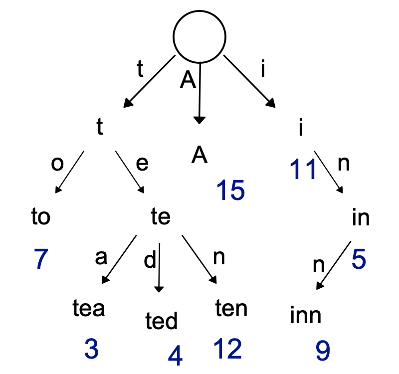
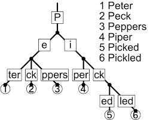
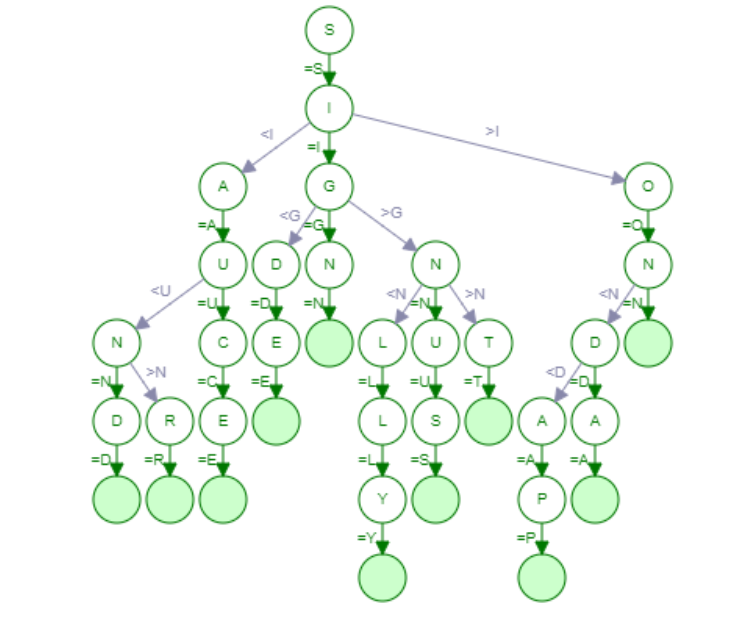

# 14-0. 문자열을 저장하고, 처리하는 주요 자료구조 및 알고리즘 (Trie, KMP, Rabin Karp 등) 에 대해 설명해 주세요.

# 문자열 저장 및 처리 자료구조 / 알고리즘

문자열을 처리하는 대표적인 방법은 크게 두 가지로 나뉜다.

```plain text
1. 문자열 저장 자료구조
2. 문자열 검색 알고리즘
```

| 구분 | 대표 알고리즘 |
| --- | --- |
| 문자열 저장 | Trie |
| 문자열 검색 | KMP, Rabin-Karp |

---

# 1. Trie (트라이)

## 1.1 개념

Trie는 **문자열을 효율적으로 저장하고 검색하기 위한 트리 자료구조**이다.

각 노드는 **문자 하나**를 나타내며

루트에서 노드까지의 경로가 하나의 문자열을 의미한다.

---

## 1.2 구조 예시

단어: `cat`, `car`, `dog`

```plain text
        root
       /    \
      c      d
      |      |
      a      o
     / \     |
    t   r    g
```

---

## 1.3 특징

- 문자열 검색: **O(L)**

- L = 문자열 길이

데이터 개수가 아니라 **문자열 길이에만 영향을 받는다.**

---

## 1.4 Java 구현 코드

### Trie Node

```java
class TrieNode {
    TrieNode[] children = new TrieNode[26];
    boolean isEndOfWord;
}
```

---

### Trie 구현

```java
class Trie {

    TrieNode root = new TrieNode();

    // 문자열 삽입
    public void insert(String word) {
        TrieNode node = root;

        for (char c : word.toCharArray()) {
            int index = c - 'a';

            if (node.children[index] == null) {
                node.children[index] = new TrieNode();
            }

            node = node.children[index];
        }

        node.isEndOfWord = true;
    }

    // 문자열 검색
    public boolean search(String word) {
        TrieNode node = root;

        for (char c : word.toCharArray()) {
            int index = c - 'a';

            if (node.children[index] == null) {
                return false;
            }

            node = node.children[index];
        }

        return node.isEndOfWord;
    }
}
```

---

## 1.5 시간복잡도

| 연산 | 시간복잡도 |
| --- | --- |
| 삽입 | O(L) |
| 검색 | O(L) |
| 삭제 | O(L) |

L = 문자열 길이

---

## 1.6 장단점

### 장점

- 빠른 문자열 검색

- 자동완성 기능 구현 가능

- 접두사(prefix) 검색 가능

예

- 검색 엔진 자동완성

- 사전(dictionary)

### 단점 

- 메모리 사용량이 큼

- 문자 집합이 클수록 공간 낭비 발생

---

## 1.7 활용 예

- 자동완성 기능

- 사전(Dictionary)

- IP 라우팅

- 검색 엔진

# 개념

  - 문자열을 효율적으로 저장하고 탐색하기 위한 트리 기반 자료구조



  - **Prefix Tree** (접두사 트리)라고도 부름

  - 우리가 검색할 때 볼 수 있는 **자동완성 기능, 사전 검색 등 문자열을 탐색하는데 특화되어있는 자료구조**

> 💡 

    - 각 노드는 하나의 문자 character를 나타냄

    - 루트 노드: 빈 문자열

    - 경로 path: 하나의 단어를 구성

    - 공통 접두사는 같은 경로를 공유

# 왜 사용하는가?

문자열의 길이를 L, 데이터(단어)의 개수가 N이라고 했을 때

| **자료구조** | **문자열 검색 시간** |
| --- | --- |
| 배열/리스트 | O(N) |
| 정렬 + 이진탐색 | O(log N) |
| **Trie** | **O(L)** |

  - 데이터의 개수 N과 무관

  - 접두사 검색에 매우 강력함

# 주요 연산

### 삽입 Insert

  - 문자 하나씩 내려가면서 노드 생성

```java
class TrieNode {
    TrieNode[] children = new TrieNode[26];
    boolean isEnd;
}

class Trie {
    TrieNode root = new TrieNode();

    public void insert(String word) {
        TrieNode node = root;
        for (char c : word.toCharArray()) {
            int idx = c - 'a';
            if (node.children[idx] == null) {
                node.children[idx] = new TrieNode();
            }
            node = node.children[idx];
        }
        node.isEnd = true;
    }
}
```

  - 시간복잡도 O(L)

### 검색 Search

```java
public boolean search(String word) {
    TrieNode node = root;
    for (char c : word.toCharArray()) {
        int idx = c - 'a';
        if (node.children[idx] == null) {
            return false;
        }
        node = node.children[idx];
    }
    return node.isEnd;
}
```

  - 시간복잡도 O(L)

### 접두사 검색 startsWith

  - 해당 접두사로 시작하는 단어가 하나라도 존재하는지 확인하는 연산

```java
public boolean startsWith(String prefix) {
    TrieNode node = root;
    for (char c : prefix.toCharArray()) {
        int idx = c - 'a';
        if (node.children[idx] == null) {
            return false;
        }
        node = node.children[idx];
    }
    return true;
}
```

  - 시간복잡도 O(L)

# 트라이의 특징

### 장점

  - 접두사 검색이 매우 빠름

  - 자동완성 기능 구현에 적합

  - 사전 dictionary 구현에 적합

  - 문자열 개수에 영향을 덜 받음

### 단점

  - 메모리 사용량이 큼

  - 자식 노드 배열 (26개 등)이 비효율적일 수 있음

→ 이를 개선한 구조: **Map 기반 Trie**, **압축 트라이 (Radix Tree)**, **Ternary Search Tree**

# 언제 사용하면 좋은가?

  - 문자열 자동 완성

  - 사전 검색

  - 단어 개수 세기

  - 문자열 집합 문제

  - 접두사 기반 필터링

  - 전화번호 목록 문제

---

# Map 기반 Trie

## 개념

> 💡 **각 TrieNode가 Map<Character, TrieNode> 자식들을 가진다**

노드 → 맵 → (다음 노드) → 또 맵 → …

  - 기존

```java
TrieNode[] children = new TrieNode[26];
```

  - 개선

```java
Map<Character, TrieNode> childern = new HashMap<>();
```

### 차이점

  - 자식이 있는 문자만 저장

  - 필요할 때만 노드 생성

### Map Trie 노드 구조 예시

```java
import java.util.HashMap;
import java.util.Map;

class TrieNode {
    Map<Character, TrieNode> children = new HashMap<>();
    boolean isEnd;
}

class Trie {
    private final TrieNode root = new TrieNode();

    public void insert(String word) {
        TrieNode node = root;
        for (int i = 0; i < word.length(); i++) {
            char ch = word.charAt(i);
            node = node.children.computeIfAbsent(ch, k -> new TrieNode());
        }
        node.isEnd = true;
    }

    public boolean startsWith(String prefix) {
        TrieNode node = root;
        for (int i = 0; i < prefix.length(); i++) {
            node = node.children.get(prefix.charAt(i));
            if (node == null) return false;
        }
        return true;
    }

    public boolean search(String word) {
        TrieNode node = root;
        for (int i = 0; i < word.length(); i++) {
            node = node.children.get(word.charAt(i));
            if (node == null) return false;
        }
        return node.isEnd;
    }
}
```

### 장점

  - 메모리 절약 (희소 트리에서 매우 효과적)

  - 문자 범위 제한 없음 (Unicode 가능)

### 단점

  - 배열보다 접근 속도 느림

  - HashMap 오버헤드 존재

## 언제 쓰면 좋을까?

  - 알파벳 범위가 넓을 때

  - 데이터가 적고 sparse할 때

  - 실무에서 일반적으로 가장 많이 사용되는 방식

# 압축 트라이 Radix Tree/Compressed Trie

## 개념

  - 기존 Trie는 한글자씩 노드를 가짐

  - 압축 Trie는 연속된 단일 경로를 하나의 노드로 합침

## 핵심 아이디어

> 💡 **자식이 하나뿐인 노드들은 합쳐버리자**



### 장점

  - 노드 수 대폭 감소

  - 메모리 사용량 감소

  - 트리 높이 감소 → 탐색 빠름

### 단점

  - 구현 복잡

  - 삽입/삭제 시 문자열 분할 필요

### 사용 예

  - 라우팅 테이블 (IP prefix matching)

  - 대규모 문자열 사전

### 압축 트라이 삽입 코드

```java
import java.util.HashMap;
import java.util.Map;

class RadixNode {
    boolean isEnd;
    // key: edge label (여러 글자), value: child node
    Map<String, RadixNode> children = new HashMap<>();
}

public class RadixTree {
    private final RadixNode root = new RadixNode();

    public void insert(String word) {
        insert(root, word);
    }

    private void insert(RadixNode node, String word) {
        if (word.isEmpty()) {
            node.isEnd = true;
            return;
        }

        // 1) 현재 노드의 모든 edge label 중에서 word와 공통 prefix가 있는 edge를 찾는다
        for (Map.Entry<String, RadixNode> entry : node.children.entrySet()) {
            String edge = entry.getKey();
            RadixNode child = entry.getValue();

            int common = commonPrefixLength(edge, word);
            if (common == 0) continue;

            // Case A: edge가 word의 prefix인 경우 (edge 전체를 타고 내려감)
            // edge="app", word="apple" => child로 내려가서 "le" 삽입
            if (common == edge.length()) {
                insert(child, word.substring(common));
                return;
            }

            // Case B: word가 edge의 prefix인 경우 (word가 중간에서 끝남)
            // edge="apple", word="app" => edge를 "app" + "le"로 split
            if (common == word.length()) {
                // split: 기존 child를 아래로 내리고 중간노드를 만든다
                String edgeRemainder = edge.substring(common); // "le"
                RadixNode mid = new RadixNode();
                mid.isEnd = true; // word="app"가 끝

                // 기존 child를 mid 아래로 재연결
                mid.children.put(edgeRemainder, child);

                // 기존 edge 제거 후, "app" -> mid 로 교체
                node.children.remove(edge);
                node.children.put(word, mid);
                return;
            }

            // Case C: 일부만 공통이고 둘 다 더 남는 경우 (분기 발생)
            // edge="car", word="cat" => common="ca"
            String commonPrefix = edge.substring(0, common);    // "ca"
            String edgeRemainder = edge.substring(common);      // "r"
            String wordRemainder = word.substring(common);      // "t"

            RadixNode mid = new RadixNode(); // 공통 prefix 노드(중간 노드)

            // 기존 child는 edgeRemainder로 내려가게
            mid.children.put(edgeRemainder, child);

            // 새로 들어온 wordRemainder도 추가
            RadixNode newChild = new RadixNode();
            newChild.isEnd = true; // word가 여기서 끝난다고 가정? -> 아래 insert 방식으로 처리해도 됨
            // wordRemainder가 더 길 수 있으니 insert로 처리
            insert(newChild, ""); // isEnd 세팅
            mid.children.put(wordRemainder, newChild);

            node.children.remove(edge);
            node.children.put(commonPrefix, mid);
            return;
        }

        // 2) 공통 prefix를 공유하는 edge가 하나도 없다면 새 edge 추가
        RadixNode newNode = new RadixNode();
        newNode.isEnd = true;
        node.children.put(word, newNode);
    }

    private int commonPrefixLength(String a, String b) {
        int n = Math.min(a.length(), b.length());
        int i = 0;
        while (i < n && a.charAt(i) == b.charAt(i)) i++;
        return i;
    }
}
```

# Ternary Search Tree (TST)



## 개념

  - Trie + BST의 혼합 구조

  - 각 노드는

```java
char c;
left (작은 문자)
middle (같은 문자 -> 다음 글자)
right (큰 문자)
```

  - 구조

```java
        m
       / \
      a   z
       \
        p
         \
          p
```

### 동작 원리

문자를 비교:

  - 작으면 left

  - 크면 right

  - (찾는 문자와) 같으면 middle (그리고 다음 문자 찾기)

### TST 구현 (삽입/검색/prefix)

```java
class TstNode {
    char c;
    boolean isEnd;
    TstNode left, eq, right;

    TstNode(char c) { this.c = c; }
}

public class TST {
    private TstNode root;

    public void insert(String word) {
        if (word == null || word.isEmpty()) return;
        root = insert(root, word, 0);
    }

    private TstNode insert(TstNode node, String word, int i) {
        char ch = word.charAt(i);

        if (node == null) node = new TstNode(ch);

        if (ch < node.c) {
            node.left = insert(node.left, word, i);
        } else if (ch > node.c) {
            node.right = insert(node.right, word, i);
        } else {
            // 같은 문자면 다음 글자(=eq)로
            if (i == word.length() - 1) {
                node.isEnd = true;
            } else {
                node.eq = insert(node.eq, word, i + 1);
            }
        }
        return node;
    }

    public boolean search(String word) {
        TstNode node = getNode(word);
        return node != null && node.isEnd;
    }

    public boolean startsWith(String prefix) {
        return getNode(prefix) != null;
    }

    // prefix/word의 "마지막 글자에 해당하는 노드"를 찾아 반환
    private TstNode getNode(String s) {
        if (s == null || s.isEmpty()) return null;
        TstNode node = root;
        int i = 0;

        while (node != null) {
            char ch = s.charAt(i);

            if (ch < node.c) node = node.left;
            else if (ch > node.c) node = node.right;
            else {
                if (i == s.length() - 1) return node;
                i++;
                node = node.eq;
            }
        }
        return null;
    }
}
```

### 시간복잡도

  - 평균 O(L)

  - 최악 O(L log \sigma) σ=문자 집합 크기

### 장점

  - 배열보다 메모리 효율적

  - Map보다 빠를 수 있음

  - 균형 잡히면 효율적

### 단점

  - 균형 깨지면 성능 저하

  - 구현 난이도 높음

---

# 전체 비교

| **구조** | **메모리** | **속도** | **구현 난이도** |
| --- | --- | --- | --- |
| 기본 Trie | ❌ 큼 | ⭐ 빠름 | 쉬움 |
| Map Trie | ⭕ 절약 | ⭐ 보통 | 쉬움 |
| 압축 Trie | ⭐ 매우 절약 | ⭐⭐ 빠름 | 어려움 |
| TST | ⭕ 절약 | ⭐⭐ 빠름 | 어려움 |

---

# 2. KMP (Knuth-Morris-Pratt)

## 2.1 KMP가 왜 필요한가?

문자열 검색 문제는 보통 이렇게 주어진다.

- **텍스트(Text)**: 긴 문자열

- **패턴(Pattern)**: 찾고 싶은 문자열

예를 들어,

```plain text
Text    = "ABABABAC"
Pattern = "ABABAC"
```

여기서 `"ABABAC"`가 `"ABABABAC"` 안에 어디서 등장하는지 찾고 싶다.

---

## 2.2 가장 단순한 방법의 문제점

가장 먼저 떠올릴 수 있는 방법은 **앞에서부터 하나씩 다 비교하는 것**이다.

예를 들어:

```plain text
Text    = ABABABAC
Pattern = ABABAC
```

앞에서부터 비교하면

```plain text
A B A B A B A C
A B A B A C
```

앞의 5글자는 잘 맞다가 마지막에서 틀릴 수 있다.

이때 단순한 방법은

**"그럼 패턴을 한 칸 옮기고 다시 처음부터 비교"** 한다.

즉,

- 이미 앞에서 `A B A B A`까지 맞았다는 정보를 활용하지 못하고

- 다시 처음부터 비교한다

이게 비효율적이다.

---

## 2.3 KMP의 핵심 아이디어

> **이미 맞춰 본 부분을 버리지 말고 활용하자**

즉, 문자열이 중간까지 맞았는데 틀렸다면

**"어디까지는 다시 볼 필요 없는지"** 를 계산해서

패턴을 한 번에 점프시키는 것이다.

이때 사용하는 것이 바로 **LPS 배열**이다.

---

# 2.4 LPS란?

## 정의

**LPS(Longest Prefix Suffix)** 는

> **어떤 위치까지의 문자열에서,접두사(prefix)와 접미사(suffix)가 같을 때 그 길이의 최댓값**

을 의미한다.

---

## prefix / suffix?

문자열: `"ABABA"`

### prefix(접두사)

문자열의 **앞에서부터 시작하는 부분 문자열**

```plain text
A
AB
ABA
ABAB
ABABA
```

### suffix(접미사)

문자열의 **뒤에서 끝나는 부분 문자열**

```plain text
A
BA
ABA
BABA
ABABA
```

## 중요한 점

LPS에서 말하는 prefix와 suffix는 보통 **문자열 전체 그 자체는 제외**하고 생각한다.

즉 `"ABABA"`의 prefix와 suffix가 같다고 할 때 문자열 전체 `"ABABA"`를 그대로 쓰는 게 아니라,

**진짜 부분 문자열 중에서 같은 것**을 찾는다.

---

## 예시 1: `"ABABA"`의 LPS

### prefix

```plain text
A
AB
ABA
ABAB
```

### suffix

```plain text
A
BA
ABA
BABA
```

### 겹치는 것

```plain text
A
ABA
```

이 중 가장 긴 것은 `"ABA"`

따라서

```plain text
LPS("ABABA") = 3
```

## 예시 2: `"ABCDE"`의 LPS

prefix와 suffix 중 같은 것이 없다.

따라서

```plain text
LPS("ABCDE") = 0
```

# 2.5 KMP에서 LPS 배열은 무엇인가?

---

KMP에서는 패턴 전체에 대해 **각 위치마다 LPS 값을 미리 계산해 둔다.**

즉,

```plain text
pattern[0..i]
```

까지의 부분 문자열에 대해

LPS 값을 구해서 배열에 저장한다.

---

## 예시: Pattern = `"ABABAC"`

각 인덱스까지의 부분 문자열을 보자.

### 인덱스 0

부분 문자열: `"A"`

- prefix와 suffix가 없음

- LPS = 0

### 인덱스 1

부분 문자열: `"AB"`

- prefix: `A`

- suffix: `B`

- 같지 않음

- LPS = 0

### 인덱스 2

부분 문자열: `"ABA"`

- prefix: `A`, `AB`

- suffix: `A`, `BA`

- 공통: `A`

- LPS = 1

### 인덱스 3

부분 문자열: `"ABAB"`

- prefix: `A`, `AB`, `ABA`

- suffix: `B`, `AB`, `BAB`

- 공통: `AB`

- LPS = 2

### 인덱스 4

부분 문자열: `"ABABA"`

- 공통 prefix/suffix: `"ABA"`

- LPS = 3

### 인덱스 5

부분 문자열: `"ABABAC"`

- 공통 prefix/suffix 없음

- LPS = 0

---

## 최종 LPS 배열

```plain text
Pattern = A B A B A C
Index   = 0 1 2 3 4 5
LPS     = 0 0 1 2 3 0
```

---

# 2.6 LPS가 왜 필요한가?

이제 KMP의 핵심을 보자.

패턴을 비교하다가 중간에 실패했다고 하자.

예를 들어 패턴 `"ABABAC"`를 비교하는 중에 앞의 `"ABABA"`까지는 맞았는데 그 다음 글자에서 실패했다고 하자.

그럼 단순한 방법은

패턴을 한 칸 옮기고 처음부터 다시 비교한다.

하지만 KMP는 이렇게 생각한다.

> `"ABABA"`까지 맞았다는 건

그 안에 이미 다시 활용할 수 있는 구조가 있다는 뜻 아닌가?"

실제로 `"ABABA"`의 LPS는 3이다.

즉, 앞부분 `"ABA"`와 뒷부분 `"ABA"`가 같다.

그러면 이미 맞춘 문자열 안에

다시 시작할 수 있는 위치가 있다는 뜻이다.

그래서 굳이 처음부터 다시 보지 않고

**LPS 값만큼 패턴 위치를 유지한 채 이동**한다.

---

# 2.7 KMP 검색 과정을 예시로 이해하기

## 예시

```plain text
Text    = A B A B A B A C
Pattern = A B A B A C
LPS     = 0 0 1 2 3 0
```

텍스트 인덱스 `i`, 패턴 인덱스 `j`를 사용한다.

- `i`: 텍스트를 가리킴

- `j`: 패턴을 가리킴

---

## Step 1

```plain text
Text    = A B A B A B A C
Pattern = A B A B A C
          ^
```

앞에서부터 비교

- A = A

- B = B

- A = A

- B = B

- A = A

여기까지 성공

이제 비교:

- Text의 다음 문자 = `B`

- Pattern의 다음 문자 = `C`

불일치 발생

---

## Step 2: 여기서 단순 비교와 KMP 차이

### 단순 비교

- 패턴을 한 칸 옮김

- 다시 처음부터 비교

### KMP

현재 `j = 5`였고,

실패했으므로 `j = lps[j - 1]` 로 바꾼다.

즉,

```plain text
j = lps[4] = 3
```

이 뜻은

앞의 5글자 중에서 길이 3짜리 prefix/suffix가 같으므로

패턴의 앞 3글자는 이미 맞는 것으로 보고 계속 진행할 수 있다는 뜻이다.

즉, 텍스트 인덱스 `i`는 뒤로 가지 않고 패턴 인덱스만 조정한다.

---

## Step 3

다시 비교를 이어간다.

- 현재 텍스트 위치는 그대로

- 패턴 위치만 `j = 3`으로 이동

그러면 이미 비교한 정보를 활용해서

불필요한 재비교를 줄일 수 있다.

이게 바로 KMP가 빠른 이유다.

---

# 2.8 KMP 알고리즘 흐름 정리

## 1단계: 패턴의 LPS 배열을 만든다

- 패턴 내부의 반복 구조를 분석

## 2단계: 텍스트와 패턴을 비교한다

- 문자가 같으면 둘 다 한 칸 이동

- 문자가 다르면:

  - `j == 0`이면 텍스트만 한 칸 이동

  - `j > 0`이면 `j = lps[j - 1]`

## 3단계: 패턴 끝까지 도달하면 찾기 성공

- `j == pattern.length()` 이면 매칭 성공

- 이후에도 계속 찾으려면 `j = lps[j - 1]`

[🌟 KMP 참고 영상 with 시각화](https://www.youtube.com/watch?v=ynv7bbcSLKE)

---

# 2.9 KMP 구현 코드 (Java)

## LPS 배열 생성

```java
static int[] computeLPS(String pattern) {
    int m = pattern.length();
    int[] lps = new int[m];

    int len = 0;   // 현재까지 일치한 prefix-suffix 길이
    int i = 1;     // lps[0]은 항상 0이므로 1부터 시작

    while (i < m) {
        if (pattern.charAt(i) == pattern.charAt(len)) {
            len++;
            lps[i] = len;
            i++;
        } else {
            if (len != 0) {
                len = lps[len - 1];
            } else {
                lps[i] = 0;
                i++;
            }
        }
    }

    return lps;
}
```

---

## 코드 설명

### `len`

  - 현재까지 찾은 **가장 긴 prefix = suffix 길이**

### `pattern.charAt(i) == pattern.charAt(len)`

  - 현재 문자도 이어서 prefix/suffix를 늘릴 수 있는지 확인

### 다르면?

  - 이미 맞춰본 prefix 정보가 있으므로

  - `len = lps[len - 1]`로 줄여서 다시 시도

즉, 처음부터 다시 보는 게 아니라

**이전까지 계산한 LPS를 재활용**한다.

---

## KMP 검색 코드

```java
static void kmpSearch(String text, String pattern) {
    int n = text.length();
    int m = pattern.length();

    int[] lps = computeLPS(pattern);

    int i = 0; // text index
    int j = 0; // pattern index

    while (i < n) {
        if (text.charAt(i) == pattern.charAt(j)) {
            i++;
            j++;
        }

        if (j == m) {
            System.out.println("패턴 발견 위치: " + (i - j));
            j = lps[j - 1];
        } else if (i < n && text.charAt(i) != pattern.charAt(j)) {
            if (j != 0) {
                j = lps[j - 1];
            } else {
                i++;
            }
        }
    }
}
```

---

# 2.10 KMP 검색 코드 흐름 설명

## 문자가 같을 때

```java
if (text.charAt(i) == pattern.charAt(j)) {
    i++;
    j++;
}
```

  - 텍스트와 패턴 둘 다 다음으로 이동

## 패턴 전체를 찾았을 때

```java
if (j == m) {
    System.out.println("패턴 발견 위치: " + (i - j));
    j = lps[j - 1];
}
```

  - 패턴 하나를 찾음

  - 시작 위치는 `i - j`

  - 다음 매칭도 찾기 위해 `j`를 LPS 값으로 이동

---

## 문자가 다를 때

```java
else if (i < n && text.charAt(i) != pattern.charAt(j)) {
    if (j != 0) {
        j = lps[j - 1];
    } else {
        i++;
    }
}
```

### `j != 0`

  - 일부는 이미 맞췄다는 뜻

  - LPS를 이용해서 패턴 위치만 이동

### `j == 0`

  - 맞춘 게 전혀 없음

  - 텍스트만 한 칸 이동

---

---

# 2.11 시간복잡도

## LPS 배열 계산

- 패턴 길이를 `M`이라 하면

- **O(M)**

## 검색 과정

- 텍스트 길이를 `N`이라 하면

- **O(N)**

## 전체

```plain text
O(N + M)
```

---

## 왜 O(N + M)인가?

KMP는 텍스트 인덱스 `i`가 뒤로 가지 않는다.

패턴 인덱스 `j`는 LPS를 통해 움직이지만,

전체적으로 각 문자를 과도하게 여러 번 보지 않는다.

즉,

- LPS 계산: 패턴 한 번 훑음

- 검색: 텍스트 한 번 훑음

그래서 전체가 **O(N + M)** 이다.

---

# 2.12 KMP의 장점

## 장점

- 문자열 검색이 빠름

- 이미 비교한 정보를 활용함

- 텍스트를 다시 뒤로 돌아가지 않음

## 단점

- 처음 배울 때 LPS 개념이 어렵다

- 구현이 단순 완전탐색보다 복잡하다

---

# 2.13 언제 사용하는가?

- 긴 문자열에서 특정 패턴을 빠르게 찾아야 할 때

- 단일 패턴 검색이 반복될 때

- 문자열 검색 성능이 중요한 문제

예:

- 문서 검색

- 문자열 패턴 매칭 문제

- 백준 문자열 탐색 문제

---

# 2.14 KMP 핵심 한 줄 정리

> **KMP는 패턴 내부의 반복 구조(LPS)를 이용해서,불일치가 발생했을 때 처음부터 다시 비교하지 않고건너뛰며 검색하는 문자열 알고리즘이다.**

---

# 2.15 진짜 핵심만 다시 요약

```plain text
1. KMP는 문자열 검색 알고리즘이다.
2. 핵심은 "이미 맞은 부분을 다시 버리지 않는 것"이다.
3. 이를 위해 LPS 배열을 미리 만든다.
4. 불일치가 나면 패턴을 한 칸씩 옮기지 않고, LPS만큼 점프한다.
5. 그래서 시간복잡도는 O(N + M)이다.
```

---

# 3. Rabin–Karp 알고리즘

## 3.1 Rabin–Karp가 무엇인가?

Rabin–Karp는 **문자열 검색 알고리즘**이다.

특징은 다음과 같다.

> 문자열을 **직접 비교하지 않고 해시(Hash) 값을 비교해서 찾는다.**

즉,

```plain text
문자열 → 숫자(해시값)
```

으로 바꿔서 비교한다.

---

# 3.2 왜 해시를 사용하는가?

문자열 비교는 보통 이렇게 이루어진다.

예

```plain text
Text    = ABCDEFG
Pattern = CDE
```

단순 비교는

```plain text
ABC
BCD
CDE
DEF
...
```

처럼 **매번 문자들을 하나씩 비교**한다.

문자열 길이가 길어지면 이 비교 비용이 커진다.

그래서 Rabin–Karp는 이렇게 생각한다.

```plain text
문자열을 숫자로 바꿔서 비교하면 더 빠르지 않을까?
```

---

# 3.3 문자열을 숫자로 바꾸는 방법 (해시)

예를 들어 문자열 `"abc"`를 숫자로 바꿔보자.

가장 단순한 방식:

```plain text
a = 1
b = 2
c = 3
```

그러면

```plain text
abc = 1*100 + 2*10 + 3
```

처럼 숫자로 표현할 수 있다.

하지만 실제 Rabin–Karp는 **다항식 해시(polynomial hash)** 를 사용한다.

공식:

```plain text
hash(s) =
s[0]*d^(m-1) +
s[1]*d^(m-2) +
...
s[m-1]
```

여기서

- `d` = 문자 집합 크기 (예: 256)

- `m` = 패턴 길이

---

# 3.4 문제: 모든 substring을 다시 계산하면 느리다

예를 들어

```plain text
abc
bcd
cde
```

각 substring의 해시를 매번 처음부터 계산하면

```plain text
O(m)
```

이 걸린다.

그래서 Rabin–Karp는 **Rolling Hash**를 사용한다.

---

# 3.5 Rolling Hash (핵심)

Rolling Hash는

> 이전 해시 값을 이용해서 다음 해시를 **O(1)** 에 계산하는 방법이다.

예를 들어

```plain text
abc → bcd
```

일 때

1️⃣ `a`를 제거

2️⃣ `d`를 추가

하면 된다.

공식:

```plain text
nextHash =
d * (prevHash - firstChar * h)
+ nextChar
```

여기서

```plain text
h = d^(m-1)
```

---

# 3.6 예시로 이해하기

## Text

```plain text
ABCDE
```

## Pattern

```plain text
BCD
```

---

## Step 1: 패턴 해시 계산

```plain text
hash("BCD")
```

---

## Step 2: 첫 substring 해시

```plain text
hash("ABC")
```

---

## Step 3: Rolling hash

```plain text
hash("ABC") → hash("BCD")
```

이때

- `A` 제거

- `D` 추가

---

## Step 4: 해시 비교

```plain text
hash("BCD") == hash("BCD")
```

같다면

→ 실제 문자열 비교

---

# 3.7 중요한 개념: 해시 충돌

문제는

```plain text
hash("abc") == hash("xyz")
```

같이 **다른 문자열인데 해시가 같을 수 있다.**

이를 **해시 충돌 Hash Collision**이라고 한다.

그래서 Rabin–Karp는

한다.

```plain text
해시가 같으면 실제 문자열을 다시 확인
```

---

# 3.8 Rabin–Karp 전체 알고리즘

## Step 1

패턴 해시 계산

## Step 2

텍스트 첫 substring 해시 계산

## Step 3

반복

1️⃣ 해시 비교

2️⃣ 같으면 문자열 비교

3️⃣ Rolling hash 계산

---

# 3.9 Java 구현 코드

```java
static void rabinKarp(String text, String pattern) {

    int d = 256;      // 문자 집합 크기
    int q = 101;      // 소수 (mod)

    int n = text.length();
    int m = pattern.length();

    int p = 0; // pattern hash
    int t = 0; // text hash

    int h = 1;

    // h = d^(m-1)
    for (int i = 0; i < m - 1; i++)
        h = (h * d) % q;

    // 초기 해시 계산
    for (int i = 0; i < m; i++) {
        p = (d * p + pattern.charAt(i)) % q;
        t = (d * t + text.charAt(i)) % q;
    }

    // 슬라이딩 윈도우
    for (int i = 0; i <= n - m; i++) {

        // 해시 비교
        if (p == t) {

            int j;
            for (j = 0; j < m; j++)
                if (text.charAt(i + j) != pattern.charAt(j))
                    break;

            if (j == m)
                System.out.println("Pattern found at " + i);
        }

        // Rolling hash
        if (i < n - m) {
            t = (d * (t - text.charAt(i) * h)
                    + text.charAt(i + m)) % q;

            if (t < 0)
                t += q;
        }
    }
}
```

---

# 3.10 코드 핵심 설명

## d

```plain text
문자 집합 크기
```

예

```plain text
ASCII = 256
```

---

## q

```plain text
mod 연산용 소수
```

해시 충돌을 줄이기 위해 사용

---

## h

```plain text
d^(m-1)
```

Rolling hash 계산에 필요

---

# 3.11 시간복잡도

## 평균

```plain text
O(N + M)
```

- 해시 계산: O(1)

- 문자열 비교 거의 없음

---

## 최악

```plain text
O(NM)
```

해시 충돌이 계속 발생하면

매번 문자열 비교 발생

---

# 3.12 KMP vs Rabin–Karp 차이

| 알고리즘 | 핵심 아이디어 |
| --- | --- |
| KMP | 패턴 내부 반복 구조 활용 |
| Rabin–Karp | 문자열을 해시로 변환 |

---

| 항목 | KMP | Rabin–Karp |
| --- | --- | --- |
| 비교 방식 | 문자 비교 | 해시 비교 |
| 시간복잡도 | O(N + M) | 평균 O(N + M) |
| 해시 충돌 | 없음 | 있음 |
| 다중 패턴 검색 | 불리 | 유리 |

---

# 3.13 언제 사용하는가?

## KMP

- 단일 패턴 검색

- 정확한 문자열 매칭

## Rabin–Karp

- **여러 패턴 검색**

- plagiarism 검사

- 문자열 비교 최적화

---

# 3.14 Rabin–Karp 핵심 정리

```plain text
1. 문자열을 해시값으로 변환한다
2. substring 해시를 rolling hash로 계산한다
3. 해시가 같으면 실제 문자열 비교한다
```

---

# 3.15 진짜 핵심 한 문장

> **Rabin–Karp는 문자열을 숫자(해시값)로 변환하여 비교하고,Rolling Hash를 이용해 substring 해시를 빠르게 계산하는 문자열 검색 알고리즘이다.**

---

# 4. 세 알고리즘 비교

| 알고리즘 | 목적 | 시간복잡도 | 특징 |
| --- | --- | --- | --- |
| Trie | 문자열 저장 | O(L) | 접두사 검색 |
| KMP | 패턴 검색 | O(N + M) | LPS 활용 |
| Rabin-Karp | 패턴 검색 | 평균 O(N + M) | 해시 기반 |

---

# 5. 언제 무엇을 사용하는가

| 상황 | 알고리즘 |
| --- | --- |
| 자동완성 | Trie |
| 단일 패턴 검색 | KMP |
| 여러 패턴 검색 | Rabin-Karp |
| 사전 저장 | Trie |

---

# 한 줄 정리

> Trie는 문자열을 효율적으로 저장하고 검색하기 위한 자료구조이며,

KMP와 Rabin-Karp는 문자열 패턴을 효율적으로 찾기 위한 알고리즘이다.
