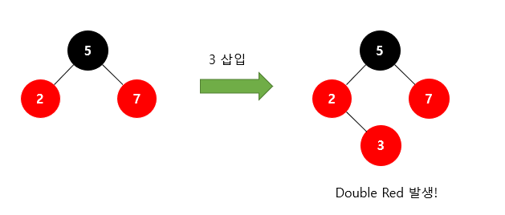
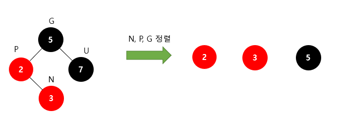
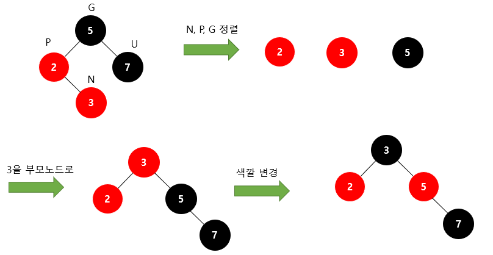
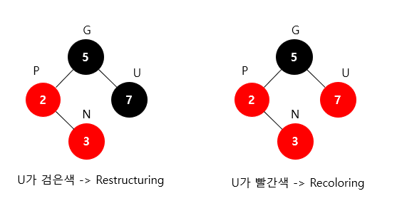
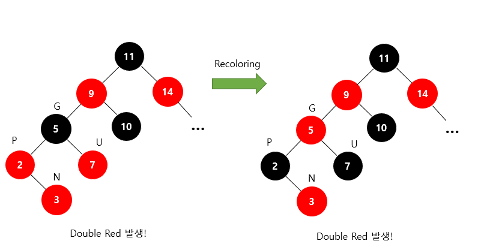
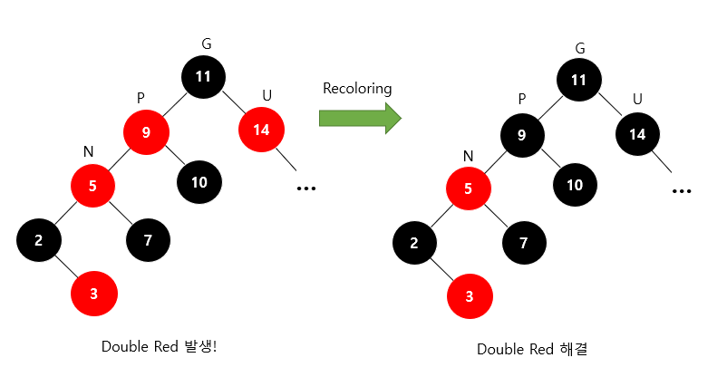

# **3-1.** Red Black Tree는 어떻게 균형을 유지할 수 있을까요?

### 💡 스터디 요약 멘트 (두괄식 정답)

"레드 블랙 트리는 **5가지 색상 규칙**을 강제하여 트리의 균형을 유지한다. 특히 삽입이나 삭제로 인해 규칙이 깨질 경우, **삼촌 노드의 색상**을 확인하여 **재색칠(Recoloring)** 또는 **회전(Restructuring)** 연산을 수행함으로써 O(\log N)의 탐색 성능을 항상 보장한다."

---

## 3-1. 레드 블랙 트리(Red-Black Tree)의 균형 유지 원리

### 1. 5가지 기본 속성 (Property)

RBT는 다음의 5가지 엄격한 규칙을 강제함으로써 트리가 한쪽으로 치우치지 않도록 보장한다. 이 규칙들이 유지된다면 루트로부터 리프까지의 가장 긴 경로는 가장 짧은 경로의 **2배**를 넘지 않는다.

1. 모든 노드는 **레드(Red)** 혹은 **블랙(Black)**이다.

1. **루트 노드**는 항상 **블랙**이다.

1. 모든 **리프 노드(NIL)**는 **블랙**이다. (여기서 NIL은 데이터가 없는 더미 노드를 의미함)

1. **레드 노드의 자식은 항상 블랙**이다. 즉, 레드 노드가 연속으로 나올 수 없다. (**No Double Red**)

1. 임의의 노드에서 그 자손인 리프 노드까지 가는 모든 경로에는 **동일한 개수의 블랙 노드**가 있다. (**Black-Height**)

---

### 2. 균형이 깨지는 순간: Double Red

새로운 노드를 삽입할 때 RBT는 항상 **레드 노드**를 삽입한다. 이때 부모 노드가 이미 레드라면 **Double Red** 상황이 발생하여 4번 규칙(레드 노드 연속 금지)을 위반하게 된다. RBT는 이 문제를 해결하기 위해 삼촌** 노드(부모의 형제)**의 색상에 따라 두 가지 전략을 취한다.

---

## 1. Restructuring (삼촌 노드가 Black일 때)

삼촌 노드가 **Black**이거나 **NIL(더미 노드)**일 때 수행한다. 이 과정은 다른 서브트리에 영향을 주지 않으므로 한 번의 연산으로 해당 위치의 균형이 완벽히 잡힌다.

- **수행 과정:**

  1. 나($N$), 부모($P$), 조부모($G$) 세 노드를 오름차순으로 정렬한다.

  1. 정렬된 세 노드 중 **가운데 값**을 부모로 만들고 **Black**으로 칠한다.

  1. 나머지 두 노드를 자식으로 만들고 **Red**로 칠한다.

- **특징:**

  - 이 과정에서 **회전(Rotation)** 연산이 발생한다.

  - 정렬과 회전을 마친 후 해당 서브트리의 루트가 Black이 되므로, 위쪽 트리로 Double Red 문제가 전파되지 않는다.

  - 시간 복잡도는 O(1)이다.

---

## 2. Recoloring (삼촌 노드가 Red일 때)

삼촌 노드가 **Red**일 때 수행한다. 회전 없이 색상 변경만으로 해결을 시도하지만, 최악의 경우 루트 노드까지 연산이 전파될 수 있다.

- **수행 과정:**

  1. 부모(P)와 삼촌(U) 노드를 **Black**으로 변경한다.

  1. 조부모(G) 노드를 **Red**로 변경한다.

  1. 조부모가 루트가 아니라면, 다시 조부모 노드를 기준으로 Double Red가 발생하는지 확인하고 위 과정을 반복한다.

- **특징:**

  - 단순히 색상만 바꾸는 것이기에 회전 연산이 필요 없다.

  - 조부모가 레드로 변하면서 다시 위쪽 부모와 Double Red를 일으킬 수 있다.

  - 최악의 경우 루트까지 올라가며 색상을 바꿔야 하므로 $O(\log N)$의 시간이 걸릴 수 있다.

---

## 📊 Restructuring vs Recoloring 비교

| **구분** | **Restructuring** | **Recoloring** |
| --- | --- | --- |
| **판단 기준** | 삼촌 노드가 **Black** (또는 NIL) | 삼촌 노드가 **Red** |
| **핵심 기법** | 회전(Rotation) | 색상 변경(Coloring) |
| **전파 여부** | 단 한 번으로 종료 | **루트까지 전파 가능** |
| **시간 복잡도** | O(1) | O(\log N) |
| **주요 목적** | 트리의 물리적 구조(높이) 조정 | 블랙 노드 개수(속성) 유지 |

---

### ① Restructuring / Rotation (삼촌이 블랙일 때)

- 부모, 나, 조부모 노드를 크기 순으로 정렬한 뒤 중간값을 부모(블랙)로 삼고 나머지를 자식(레드)으로 배치한다.

- 이 과정에서 **회전(Rotation)** 연산이 발생한다. Restructuring은 Recoloring과 달리 다른 서브트리에 영향을 주지 않으므로 한 번의 연산으로 상황이 종료된다.

### ② Recoloring (삼촌이 레드일 때)

- 부모와 삼촌 노드를 **블랙**으로 바꾸고, 조부모 노드를 **레드**로 바꾼다.

- 조부모가 레드가 됨으로써 다시 Double Red가 발생할 수 있으며, 이 경우 조부모 노드를 기준으로 다시 균형을 맞추는 과정을 재귀적으로 반복한다.

---

### 3. 왜 RBT가 효율적인가? (정성적 분석)

- **성능 보장:** 5가지 규칙을 통해 트리의 높이를 항상 O(\log N)으로 유지한다. 최악의 경우에도 탐색 시간은 2 \log (N+1)을 넘지 않는다.

- **실전 효율성:** AVL 트리와 비교했을 때 RBT는 균형을 다소 느슨하게 유지한다. (AVL은 높이 차를 1 이하로 엄격히 제한함). 이 '느슨함' 덕분에 노드의 삽입과 삭제 시 발생하는 **회전(Rotation) 횟수가 줄어들어** 실전에서는 삽입/삭제 성능이 더 우수하다.

---

### [https://code-lab1.tistory.com/62](https://code-lab1.tistory.com/62)
