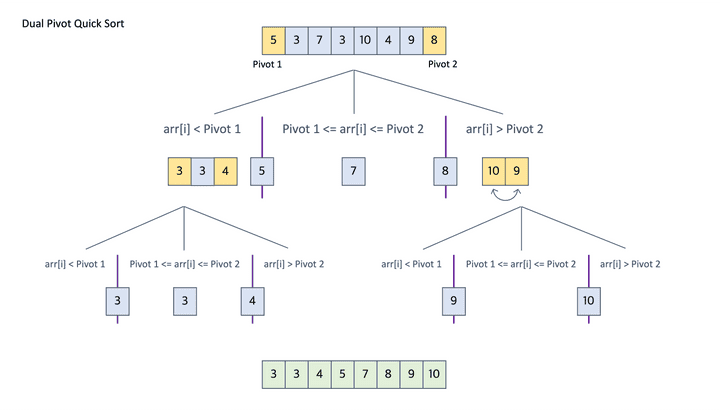
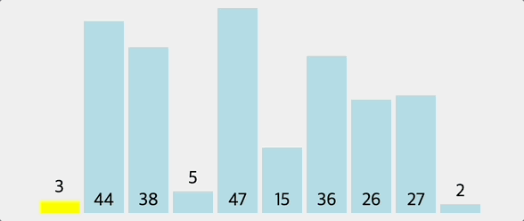

# **3-8.** 본인이 사용하는 언어는 어떤 정렬 알고리즘을 사용하여 정렬 함수를 제공하나요?

# Java의 정렬 알고리즘: 데이터 타입에 따른 이원화 전략

Java는 정렬 대상이 **기본형(Primitive)** 인지 **객체(Object)** 인지에 따라 서로 다른 정렬 알고리즘을 사용한다.

이는 `Arrays.sort()`와 `Collections.sort()` 내부에서 구현되어 있으며, **성능(속도)** 과 **안정성(Stable)** 을 상황에 맞게 최적화한 설계 전략이다.

---

## 왜 Primitive와 Object를 구분하는가?

핵심 이유는 **안정성(Stability)** 이다.

- **Stable 정렬**: 동일한 정렬 기준을 가진 요소들의 기존 순서가 유지됨

- **Unstable 정렬**: 동일 값의 기존 순서가 보장되지 않음

기본형은 값 자체만 비교하므로 안정성이 크게 중요하지 않지만,

객체 정렬에서는 동일한 키 값을 가진 요소들의 기존 순서 유지가 중요하다.

---

# 1️⃣ `Arrays.sort()` – 기본형 배열

### 대상

`int[]`, `double[]`, `char[]` 등

### 사용 알고리즘

**Dual-Pivot QuickSort**

(Java 7부터 기본형 정렬의 기본 알고리즘)

---

### 작동 원리

기존 퀵 정렬은 하나의 피벗을 기준으로 두 구간으로 분할한다.

Dual-Pivot QuickSort는 **두 개의 피벗(P₁, P₂)** 을 사용하여 배열을 세 구간으로 분할한다.

- P₁보다 작은 값

- P₁과 P₂ 사이의 값

- P₂보다 큰 값

이 방식은 분할 효율을 높이고 재귀 깊이를 줄여 성능을 향상시킨다.

---

### 장점

- 평균 시간 복잡도: **O(n log n)**

- In-place 정렬

- 추가 메모리 사용이 거의 없음

- 실제 실행 속도가 매우 빠름

---

### 특징

- 최악 시간 복잡도: **O(n²)**

- **Unstable 정렬**

- 기본형은 동일 값 간 순서 구분이 의미 없으므로 불안정해도 문제 없음

---

# 2️⃣ `Arrays.sort()` – 객체 배열

### 대상

`Integer[]`, `String[]`, 사용자 정의 객체 배열 등

### 사용 알고리즘

**TimSort**

(Merge Sort + Insertion Sort의 하이브리드 정렬)

---

### 작동 원리

1. 배열을 순차적으로 탐색하여 이미 정렬된 구간(**Run**)을 찾는다.

1. 작은 Run은 삽입 정렬로 확장한다.

1. Run들을 병합 정렬 방식으로 결합한다.

---

### 핵심 기술

- **Binary Insertion Sort**

- **Run Stack 관리**

- **Galloping Mode** (한쪽 Run이 연속 선택될 경우 비교를 건너뛰는 최적화 기법)

---

### 장점

- 평균 시간 복잡도: **O(n log n)**

- 최악 시간 복잡도: **O(n log n)**

- 최선 시간 복잡도: **O(n)** (이미 정렬된 경우)

- 부분 정렬 데이터에서 매우 빠름

---

### 특징

- **Stable 정렬**

- 추가 메모리 O(n) 사용

- 객체 정렬에서 순서 보존 요구를 충족

예: 결제 금액으로 정렬할 때 금액이 같다면 기존 결제 시간 순서를 유지함.

---

# 3️⃣ `Collections.sort()`

- 내부적으로 `List.sort()`를 호출

- 객체 배열 정렬과 동일하게 **TimSort 기반 정렬 사용**

즉,

- 기본형 배열 → Dual-Pivot QuickSort

- 객체 배열 → TimSort

- 컬렉션(List) → TimSort

---

# 최종 정리 표

| 분류 | 대상 | 사용 알고리즘 | 최악 시간 복잡도 | Stable |
| --- | --- | --- | --- | --- |
| 기본형 | `int[]`, `double[]` 등 | Dual-Pivot QuickSort | O(n²) | ❌ |
| 객체형 | `String[]`, `Integer[]` 등 | TimSort | O(n log n) | ✅ |
| 컬렉션 | `ArrayList`, `LinkedList` | TimSort | O(n log n) | ✅ |

---

# 최종 결론

Java는 기본형 배열에는 **속도와 메모리 효율을 중시한 Dual-Pivot QuickSort**를 사용하고,

객체 배열 및 컬렉션에는 **안정성을 보장하는 TimSort**를 사용한다.

이는 데이터 특성과 사용 목적에 따라 알고리즘을 차별적으로 적용한 효율적인 설계 전략이다.
