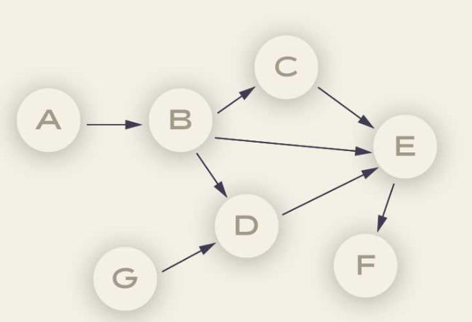
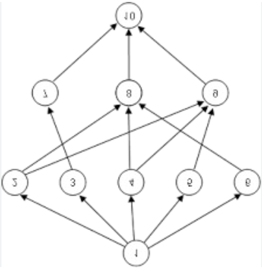

# **9-3.** 사이클이 없는 그래프는 모두 트리인가요? 그렇지 않다면, 예시를 들어주세요.

## 🧐 결론: 역시나 "아니오".

**트리의 필수 조건**

1. 사이클이 없다

1. **모든 정점에 연결되어 있다.(Connected)**

---

## 1. 사이클 없지만 트리가 아닌 예시: 포레스트(Forest)

사이클은 없지만, 그래프 내의 정점들이 서로 끊어져 있는(단절된) 경우 트리가 아님.

이를 자료구조에서는 **포레스트(Forest)**라 부름.

- **예시**: 정점 `A, B, C, D`가 있을 때, 간선이 `A - B` 하나, `C - D` 하나만 존재한다고 가정.

- **설명**: 이 그래프에는 닫힌 루프(사이클)가 전혀 없음. 하지만 `A-B` 그룹과 `C-D` 그룹이 서로 끊어져 있으므로(Disconnected), 이를 하나의 '트리'라고 부를 수 없음.

  - 트리가 모인 '숲(Forest)' 형태의 그래프.

---

## 2. 💡 방향 비순환 그래프 (DAG)

DAG 이미지

간선에 방향이 있는 그래프(Directed Graph) 중에서도 사이클이 없는 그래프를 DAG (Directed Acyclic Graph)라고 부름.

- **특징**: DAG 역시 사이클이 없지만, 한 노드가 여러 부모를 가질 수 있기 때문에 일반적인 트리의 정의(부모는 오직 하나)와는 다름.

**DAG의 핵심**은 "작업의 순서(의존성)가 정해져 있고, 절대 무한 반복(사이클)이 발생하면 안 되는 상황"을 모델링한다는 점.

---

# 🚀 DAG 실제 사용 예시

### 1. 빅데이터 분산 처리 파이프라인 (Apache Spark, Airflow)

가장 대표적이고 현업에서 자주 쓰이는 예시. 대용량 데이터를 처리할 때는 여러 작업(Task)이 순차적으로 병렬 실행되어야 합니다.

- **Apache Spark:** 데이터를 변환하고 연산하는 과정(map, filter, reduce 등)을 바로 실행하지 않고, **DAG 형태의 논리적 실행 계획**을 먼저 그림. 이를 통해 어떤 작업을 병렬로 처리할지 최적화한 후 분산 환경에서 실행.

- **Apache Airflow:** 데이터 파이프라인의 작업 흐름을 코드로 작성하는 도구. 데이터 추출 -> 가공 -> 적재(ETL) 과정을 DAG로 정의하여, 선행 작업이 끝나야만 다음 작업이 실행되도록 스케줄링.

### 2. 패키지 의존성 관리 (Maven, Gradle, npm)

자바 개발 시 사용하는 빌드 툴이나 프레임워크에서도 DAG 사용.

- 라이브러리 A를 설치하려면 B와 C가 필요하고, B를 설치하려면 D가 필요한 상황을 가정.

- 만약 A가 B를 필요로 하고, B가 다시 A를 필요로 한다면(사이클 발생) 무한 루프에 빠져 설치가 끝나지 않을 것.

- 패키지 매니저들은 설치할 라이브러리들의 의존성을 DAG로 구성한 뒤, 위상 정렬(Topological Sort)을 수행하여 설치 순서를 결정.

### 3. 버전 관리 시스템 (Git)

우리가 매일 사용하는 Git의 커밋(Commit) 히스토리도 거대한 DAG.

- 각 커밋은 이전 커밋(부모)을 가리키는 방향성이 존재.

- 브랜치를 따서(Branch) 작업하다가 다시 합치는(Merge) 과정에서 여러 갈래로 나뉘었다가 모일 수는 있지만, 과거의 커밋이 미래의 커밋을 가리킬 수는 없으므로 사이클이 절대 발생하지 않음.

### 4. 금융권 및 트랜잭션 처리 (블록체인 대안 기술 등)

결제망이나 금융 트랜잭션 시스템에서도 의존성 모델링에 사용.

- **복잡한 금융 거래:** A 거래가 완전히 정산(Settlement)된 이후에만 B 거래와 C 거래가 이루어져야 하는 복잡한 트랜잭션 파이프라인을 구축할 때 사이클 검증이 필수.

- **분산 원장 기술:** 기존의 선형적인 블록체인의 속도 한계 극복을 위해, IOTA(Tangle) 같은 일부 암호화폐 모델은 거래 내역을 DAG 형태로 엮어서 여러 거래를 동시에 승인하는 방식을 채택하기도 함.

---

### 💡 DAG에서 작업 순서 구현 알고리즘: "위상 정렬(Topological Sort)"

진입 차수(Indegree)가 0인 노드부터 큐(Queue)에 넣어 순차적으로 처리.
